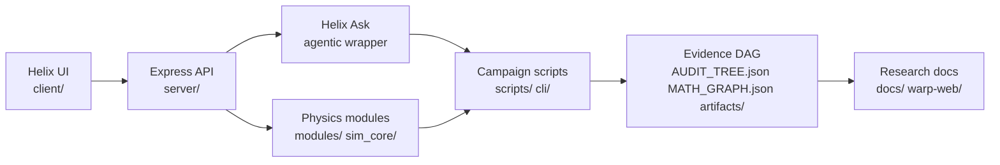

# CasimirBot

CasimirBot is a Helix Core research cockpit for warp-field simulation, agentic physics workflows, and evidence-gated verification. It combines a React/TypeScript operations console, an Express backend, numerical physics modules, audit DAGs, and reproducible campaign scripts for Needle Hull / NHM2 research.

This repository is research and simulation software. It is not a claim of a working propulsion device; the project emphasizes falsifiable runs, citations, artifacts, and verification gates over unchecked narrative claims.

## What To Look At First

| Area | Why it matters | Entry points |
| --- | --- | --- |
| Helix Ask agentic wrapper | Natural-language research/operator loop with audited tool calls, routing, regression packs, and prompt-quality probes. | `server/helix-core.ts`, `docs/helix-ask-agentic-loop-current-overview.md`, `npm run helix:ask:regression:light` |
| NHM2 full-solve lane | Selected-family warp solve campaigns, shift-lapse sweeps, transport packages, source closure, observer audits, and publication bundles. | `scripts/warp-full-solve-campaign-cli.ts`, `scripts/research/run-nhm2-lapse-alpha-sweep.ts`, `docs/nhm2-closed-loop.md`, `artifacts/research/full-solve/` |
| Evidence tree + DAG | Root-to-leaf proof structure for math, citations, manifests, and auditability. | `AUDIT_TREE.json`, `MATH_GRAPH.json`, `docs/warp-tree-dag-inventory.md`, `scripts/warp-tree-dag-walk.ts` |
| Physics simulation codes | Runnable checks for GR loops, physics QA, Casimir verification, shadow injections, and sector controls. | `npm run gr:loop`, `npm run physics:validate`, `npm run casimir:verify`, `npm run warp:shadow:inject` |
| Helix renderer + telemetry | WebGL hull renderer, curvature overlays, sector scheduler state, and live diagnostics for visual inspection. | `client/src/components/Hull3DRenderer.ts`, `client/src/components/AlcubierrePanel.tsx`, `server/energy-pipeline.ts` |
| Stellar / solar research lanes | Experimental star and solar-adjacent workflows that sit beside the warp verification stack. | `npm run solar:pipeline`, `npm run solar:manifest`, `docs/architecture/compact-star-limit-observables-phase-1-plan.md` |

## Quick Start

Prerequisites:

- Node.js 20.x
- npm 10.x
- Optional: Python 3.11 for some physics and document tooling

```bash
npm install
npm run dev:agi:5050
```

The development server runs Express with Vite middleware. Open:

- Desktop cockpit: http://localhost:5050/desktop
- Mobile panels: http://localhost:5050/mobile

Do not start a separate Vite server for normal development; the dev scripts already wire the API and UI together. Use `npm run dev` for the default port or `npm run dev:agi:5050` for the AGI-enabled 5050 workflow.

## High-Signal Runs

These commands are the best first pass for understanding what the repo can do:

```bash
npm run helix:ask:regression:light
npm run physics:validate
npm run casimir:verify
npm run warp:full-solve:readiness
npm run warp:full-solve:nhm2-shift-lapse:alpha-sweep
npm run warp:full-solve:g4-autoloop:status
```

For local product work:

```bash
npm run build
npm test
npm run hooks:install
```

`npm run hooks:install` configures the repo hooks to run local verification before commits. Use `SKIP_VERIFY=1` only for emergency bypasses.

## Architecture



## Core Systems

### Helix Core Cockpit

Helix Core is the operator surface for live panels, renderer diagnostics, and command routing. New UI should be registered as a Helix panel in `client/src/pages/helix-core.panels.ts` so it appears in both `/desktop` and `/mobile` where appropriate.

Useful docs:

- `docs/needle-hull-mainframe.md`
- `docs/helix-desktop-panels.md`
- `docs/helix-panel-template.md`

### Helix Ask Agentic Wrapper

Helix Ask is the agentic layer around the cockpit. It supports routed prompts, audited reasoning packets, regression sweeps, math routing evidence, prompt-quality probes, and decision bundles.

Representative scripts:

```bash
npm run helix:ask:regression:light
npm run helix:ask:sweep
npm run helix:ask:math-router:evidence
npm run helix:ask:agent-eval
npm run helix:decision:run
```

Useful docs:

- `docs/helix-ask-agentic-loop-current-overview.md`
- `docs/helix-ask-flow.md`
- `docs/architecture/helix-ask-proof-packet-rfc.md`
- `docs/architecture/helix-ask-math-router-contract.md`

### NHM2 Full-Solve Campaigns

The NHM2 lane is organized around selected-family shift-lapse profiles, York-control proof packs, campaign runners, geometry conformance, strict signal readiness, source closure, observer audits, and full-loop audits.

Representative scripts:

```bash
npm run warp:full-solve:readiness
npm run warp:full-solve:canonical
npm run warp:full-solve:reference:refresh
npm run warp:full-solve:nhm2-shift-lapse:alpha-sweep
npm run warp:full-solve:nhm2-shift-lapse:publish-source-closure
npm run warp:full-solve:nhm2-shift-lapse:publish-observer-audit
npm run warp:full-solve:nhm2-shift-lapse:publish-full-loop-audit
```

Useful docs and artifacts:

- `docs/nhm2-closed-loop.md`
- `docs/nhm2-audit-checklist.md`
- `docs/audits/research/selected-family/nhm2-shift-lapse/`
- `artifacts/research/full-solve/`

### Tree, DAG, And Verification Layer

The verification layer keeps research claims tied to source files, scripts, generated artifacts, certificates, traces, and policy gates. This is the part of the repository that should make every claim inspectable.

Key files:

- `AUDIT_TREE.json`
- `MATH_GRAPH.json`
- `MATH_STATUS.md`
- `math.evidence.json`
- `training-trace.jsonl`

Representative scripts:

```bash
npm run math:validate
npm run math:report
npm run math:trace
npm run validate:physics:root-leaf
npm run warp:coverage-audit
```

Useful docs:

- `docs/warp-tree-dag-inventory.md`
- `docs/warp-tree-dag-schema.md`
- `docs/warp-tree-dag-congruence-policy.md`
- `docs/proof-pack.md`
- `docs/CONSTRAINT-PACKS.md`

### Physics And Simulation Runs

The repo includes runnable physics workflows for GR loops, Casimir collection/verification, shadow injection scenarios, sector-control reproduction, solar spectra manifests, and static simulation outputs.

Representative scripts:

```bash
npm run gr:loop
npm run physics:ask
npm run physics:validate
npm run casimir:collect
npm run casimir:verify
npm run sector-control:repro
npm run warp:shadow:inject
npm run solar:pipeline
```

Simulation and calibration locations:

- `modules/`
- `sim_core/`
- `simulations/`
- `configs/`
- `artifacts/`

### Renderer And Live Telemetry

The visual cockpit uses a WebGL hull renderer with curvature, sector, tilt, Ford-Roman, and direction-pad overlays. Runtime telemetry comes through the energy pipeline and shared client hooks.

Important files:

- `client/src/components/Hull3DRenderer.ts`
- `client/src/components/AlcubierrePanel.tsx`
- `client/src/pages/helix-core.panels.ts`
- `server/energy-pipeline.ts`
- `server/curvature-brick.ts`

Useful docs:

- `docs/alcubierre-alignment.md`
- `docs/casimir-tile-mechanism.md`
- `docs/mass-semantics.md`
- `docs/gr-solver-progress.md`

## Repository Tour

| Path | Purpose |
| --- | --- |
| `client/` | React/Vite TypeScript app, Helix panels, hooks, and shared UI state. |
| `server/` | Express API, Helix command endpoint, energy pipeline, curvature bricks, instruments, and telemetry. |
| `modules/` | Shared physics and numerical modules. |
| `cli/` | Command-line research and validation entry points. |
| `scripts/` | Campaign runners, audits, bundles, reports, probes, and reproducibility tools. |
| `docs/` | Research notes, architecture specs, proof-pack docs, runbooks, and audit reports. |
| `artifacts/` | Generated evidence, traces, rendered frames, bundles, and campaign outputs. |
| `simulations/` | Static simulation cases and outputs. |
| `warp-web/` | Stand-alone research microsites and HTML experiments. |
| `shared/` | Cross-stack schemas and shared contracts. |
| `configs/` | Scenario, shadow-injection, model, and verification configuration. |

## Environment

Common controls:

| Variable | Use |
| --- | --- |
| `ENABLE_AGI` | Enables AGI routes for agentic workflows. |
| `ENABLE_ESSENCE` | Enables Essence-linked AGI runtime behavior. |
| `ENABLE_REPO_TOOLS` | Exposes repo-safe helpers for read-only diffing and patch dry-runs. |
| `PUMP_DRIVER` | Selects the pump driver; defaults to the mock driver. |
| `PUMP_LOG` | Logs pump duty updates when set to `1`. |
| `HELIX_PHASE_CALIB_JSON` | Overrides phase calibration JSON path. |
| `PHASE_CAL_DIR` | Overrides phase calibration log directory. |

For a fuller environment guide, see `docs/ENVIRONMENT.md` and `.env.example`.

## Testing And CI-Style Checks

```bash
npm test
npm run typecheck
npm run build
npm run verify:local
npm run reports:ci
```

Targeted checks:

```bash
npm run casimir:verify:ci
npm run warp:promotion:readiness:check
npm run warp:integrity:check
npm run warp:render:congruence:check
npm run claims:disclaimer:check
```

## Observability

When the server is running:

- Prometheus metrics: `GET /metrics`
- AGI tool logs: `GET /api/agi/tools/logs?limit=50`
- AGI tool log stream: `GET /api/agi/tools/logs/stream`

Local Prometheus/Grafana:

```bash
docker compose -f docker-compose.observability.yml up
```

Prometheus runs on port `9090`; Grafana runs on port `3001` with the default local credentials described in the compose setup.

## Static Research Sites

`warp-web/` contains static HTML research microsites such as the km-scale warp ledger. They can be opened directly or served through the development server.

## Contributing

1. Create a feature branch from `main`.
2. Keep generated logs and large binaries out of Git unless they are intentional evidence artifacts.
3. Run `npm run build` and `npm test` before pushing.
4. For Helix UI work, register new surfaces through `client/src/pages/helix-core.panels.ts`.
5. For research claims, include the script, artifact, doc, or citation path that makes the claim inspectable.
