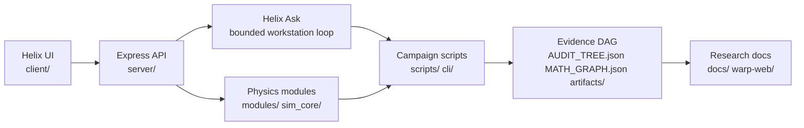

# CasimirBot

CasimirBot is a Helix Core research cockpit for warp-field simulation, agentic physics workflows, and evidence-gated verification. It combines a React/TypeScript operations console, an Express backend, numerical physics modules, audit DAGs, and reproducible campaign scripts for Needle Hull / NHM2 research.

This repository is research and simulation software. It is not a claim of a working propulsion device; the project emphasizes falsifiable runs, citations, artifacts, and verification gates over unchecked narrative claims.

## What To Look At First

| Area | Why it matters | Entry points |
| --- | --- | --- |
| Helix Ask bounded workstation loop | Natural-language research/operator loop with model-driven reasoning, deterministic tool receipts, terminal authority, routing, regression packs, and prompt-quality probes. | `server/helix-core.ts`, `docs/helix-ask-agentic-loop-current-overview.md`, `npm run helix:ask:regression:light` |
| NHM2 full-solve lane | Selected-family warp solve campaigns, shift-lapse sweeps, transport packages, source closure, observer audits, and publication bundles. | `scripts/warp-full-solve-campaign-cli.ts`, `scripts/research/run-nhm2-lapse-alpha-sweep.ts`, `docs/nhm2-closed-loop.md`, `artifacts/research/full-solve/` |
| Evidence tree + DAG | Root-to-leaf proof structure for math, citations, manifests, and auditability. | `AUDIT_TREE.json`, `MATH_GRAPH.json`, `docs/warp-tree-dag-inventory.md`, `scripts/warp-tree-dag-walk.ts` |
| Physics simulation codes | Runnable checks for GR loops, physics QA, Casimir verification, shadow injections, and sector controls. | `npm run gr:loop`, `npm run physics:validate`, `npm run casimir:verify`, `npm run warp:shadow:inject` |
| Helix renderer + telemetry | WebGL hull renderer, curvature overlays, sector scheduler state, and live diagnostics for visual inspection. | `client/src/components/Hull3DRenderer.ts`, `client/src/components/AlcubierrePanel.tsx`, `server/energy-pipeline.ts` |
| Stellar / solar research lanes | Experimental star and solar-adjacent workflows that sit beside the warp verification stack. | `npm run solar:pipeline`, `npm run solar:manifest`, `docs/architecture/compact-star-limit-observables-phase-1-plan.md` |

## Quick Start

Prerequisites:

- Node.js 20.x
- npm 10.x
- Optional: Python 3.11 for some physics and document tooling

```bash
npm install
npm run dev:agi:5050
```

The development server runs Express with Vite middleware. Open:

- Desktop cockpit: http://localhost:5050/desktop
- Mobile panels: http://localhost:5050/mobile

Do not start a separate Vite server for normal development; the dev scripts already wire the API and UI together. Use `npm run dev` for the default port or `npm run dev:agi:5050` for the AGI-enabled 5050 workflow.

### Local Runtime Environment

For Windows PowerShell local development, set runtime secrets and service endpoints in the same terminal session before starting the server. Leave values blank until you have your own local keys or URLs. Do not commit real secrets.

```powershell
$env:GOOGLE_CLIENT_ID=""
$env:VITE_GOOGLE_CLIENT_ID=""
$env:SESSION_SECRET=""

$env:DISCORD_BOT_TOKEN=""
$env:DISCORD_APPLICATION_ID=""
$env:PORT="5050"
$env:NODE_ENV="development"
$env:ENABLE_AGI="1"
$env:LLM_POLICY="http"
$env:LLM_RUNTIME="http"
$env:HULL_MODE="1"
$env:HULL_ALLOW_HOSTS=""
$env:LLM_HTTP_BASE=""
$env:OPENAI_API_KEY=""
$env:ELEVENLABS_API_KEY=""

npm run dev
```

`GOOGLE_CLIENT_ID` and `VITE_GOOGLE_CLIENT_ID` should use the same Google OAuth Web application client ID. `VITE_GOOGLE_CLIENT_ID` is intentionally exposed to the browser; the other key and token values should remain private.

## High-Signal Runs

These commands are the best first pass for understanding what the repo can do:

```bash
npm run helix:ask:regression:light
npm run physics:validate
npm run casimir:verify
npm run warp:full-solve:readiness
npm run warp:full-solve:nhm2-shift-lapse:alpha-sweep
npm run warp:full-solve:g4-autoloop:status
```

For local product work:

```bash
npm run build
npm test
npm run hooks:install
```

`npm run hooks:install` configures the repo hooks to run local verification before commits. Use `SKIP_VERIFY=1` only for emergency bypasses.

## Architecture



## Core Systems

### Helix Core Cockpit

Helix Core is the operator surface for live panels, renderer diagnostics, and command routing. New UI should be registered as a Helix panel in `client/src/pages/helix-core.panels.ts` so it appears in both `/desktop` and `/mobile` where appropriate.

Useful docs:

- `docs/needle-hull-mainframe.md`
- `docs/helix-desktop-panels.md`
- `docs/helix-panel-template.md`

### Helix Ask Bounded Agentic Workstation Loop

Helix Ask is the bounded agentic workstation loop around the cockpit. It is a
model-driven reasoning layer equipped with deterministic, callable tools:
calculator lanes, document and repo evidence, notes, live-source mail, Situation
Room observations, voice callouts, and other workstation capabilities. Those
tools produce receipts, proofs, observations, debug traces, and side effects.
The model consumes those results, explains the work at public boundaries, and
decides the next step.

The core boundary is that tool output is evidence, not answer authority. A tool
may prove that a calculation ran, a document opened, a note was updated, a voice
callout was handed to playback, or a live-source observation arrived. The final
answer still comes only after the solver loop re-enters that evidence and passes
goal satisfaction, route authority, poison audit, and terminal authority.

This makes Helix Ask a workstation loop rather than a deterministic answer
shortcut:

```text
model interprets the prompt
-> admitted tool produces deterministic evidence
-> evidence re-enters the model-facing turn
-> model commentary and synthesis explain what the evidence means
-> terminal authority selects one eligible answer, request, or typed failure
```

Voice follows the same rule. The voice lane is a medium tool inside the loop,
not a competing answer route. It can speak provisional callouts,
acknowledgements, status updates, or read-aloud snippets while reasoning
continues, but those utterances remain non-terminal tool receipts until the
agent synthesizes the final response.

#### Solver Shape Rule Of Thumb

Helix Ask should preserve the Codex-style turn shape without becoming a private
Codex runtime. The loop is bounded: it keeps the user's prompt and context
alive, admits tools only when the route contract justifies them, feeds tool
results back as observations, and publishes only a terminal artifact that passed
solver authority.

The rule of thumb for every Ask route and every workstation panel is:

```text
Routes are proposed procedures.
Classifiers are hypotheses.
Receipts are observations.
Only the completed solver path can answer.
```

Controller path corollary: the runtime may build a model-visible capability
surface, carry classifier/source/workspace hints, and record typed receipts, but
those packets are not answer authority. Terminal output is allowed only when the
solver controller sees the required lifecycle: admitted route, selected
capability or direct-answer path, structured observation, post-observation model
decision, goal satisfaction, route/product compatibility, and terminal
authority. Missing lifecycle evidence must continue, retry, request user input,
typed-fail, or fail closed rather than promote a receipt into an answer.

Best-practice policy for agent and panel work:

- Authority ladder: routes propose, classifiers hint, tools observe, the model
  synthesizes, and the controller authorizes.
- Receipt exception rule: a receipt can be terminal only when the route-product
  contract explicitly names that receipt kind as the terminal product.
- No shortcut answers: panels, process graphs, live cards, voice callouts, and
  tool receipts must not write answer text just because they look complete.
- Debug minimum: terminal decisions should expose the admitted goal, selected
  capability or direct-answer path, re-entered observation, post-observation
  model decision, and terminal allow/block reason.
- Fail-closed standard: missing capability lifecycle, agent step decision,
  selected capability observation, or post-observation model decision blocks the
  terminal answer.
- Compound coverage standard: for compound prompts, correct route/tool admission
  and a correct itinerary are necessary but not sufficient. Required observation
  coverage must be attached before terminal authority and public/debug export
  projection. If coverage is missing or fail-closed, terminal state should be a
  typed failure and every public/debug mirror should copy that authority rather
  than an older final-answer draft.
- Projection standard: response envelopes, debug exports, cache entries, live
  cards, and resolved summaries are projections of terminal authority. They can
  enrich or slim the trace, but they must not preserve stale terminal kind,
  final-answer source, or error-code values after authority has selected a
  typed failure.
- Isolation tests: when repairing Ask routes, test the layers separately:
  prompt/source/tool admission, observation or coverage satisfaction, terminal
  authority, public response projection, and debug-export/cache projection. A
  passing admission/itinerary test does not prove terminal success.
- Shortcut tests: shortcut-like route rules need adversarial coverage for
  contextual, negated, future or conditional, historical, quoted or
  screen-visible, and mixed-intent prompts.

In practical terms, the intended shape is:

```text
prompt + conversation context
-> prompt interpretation and intent arbitration
-> source/tool admission
-> capability or panel action, when admitted
-> typed receipt or observation
-> evidence re-entry into the model-facing turn
-> model-authored final_answer_draft / model_synthesized_answer
-> goal satisfaction, route authority, poison audit, and terminal authority
-> one visible final answer, request_user_input, or typed_failure
```

This mirrors the part of Codex we want to preserve: the model sees context and
available tools, requests a capability when needed, receives tool results back
into the next model step, and completes the turn with an assistant message. In
Helix, panels such as Scientific Calculator, Docs Viewer, Notes, repo evidence,
voice, and Situation Room are evidence producers. Their receipts may prove work
happened, but they should not bypass synthesis or write the visible answer
directly unless the route product contract explicitly allows a receipt terminal.

This principle is a guardrail for panel development. A panel-specific shortcut
may feel useful for one use case, but if it writes answer text before evidence
re-entry and terminal authority, it can poison the agentic loop by hiding the
prompt, context, tool observations, or final model synthesis. Prefer small,
typed observations plus a shared final-draft path over route-specific answer
shortcuts.

#### Compound Reasoning And Tool Commentary

Helix Ask compound reasoning is a typed, receipt-backed agent loop. The model-facing path decomposes a prompt, admits the correct route and source target, selects an allowed workstation capability, executes the tool, converts the result into observations and receipts, checks goal satisfaction, synthesizes from accepted evidence, and then lets terminal authority choose the visible answer.

The intended loop shape is:

```text
interpret prompt -> admit route/source target -> choose capability -> call tool -> observe receipt -> validate coverage -> synthesize answer -> terminal authority
```

This keeps the agent loop explicit without turning Helix into a private Codex runtime. Codex-style concerns such as generic model sampling, sandboxing, approvals, retries, session lifecycle, and terminal completion stay outside Helix policy. Helix keeps ownership of prompt interpretation, source-target admission, tool admission, evidence identity, provenance, proof gates, route/product contracts, debug traces, and terminal eligibility.

#### Tool Calls And Terminal Authority

The current Helix Ask tool-call model treats tools as evidence producers, not answer writers. A tool can open a panel, read a document, search repo evidence, solve a calculator expression, update a note, propose voice delivery, or create a Situation Room setup artifact. The result of that action is recorded as a typed observation or receipt, then the solver decides whether the goal is satisfied, needs user input, or failed.

The target lifecycle is:

```text
user goal
-> route/source classification
-> model-visible capability surface
-> model selects a capability or answers directly
-> runtime validates the selected tool call
-> tool executes
-> tool result becomes a structured observation or receipt
-> observation re-enters the model/solver
-> model/solver produces a final_answer_draft, request_user_input, or typed_failure
-> terminal authority selects one eligible terminal artifact
-> visible UI mirrors that selected artifact
```

The key rule is:

```text
Receipts are observations, not final answers.
```

#### Shared Tool Loop Boundary

Every new tool family should prove the same loop fields before it can affect
the visible answer. A tool-specific evaluator or synthesizer may add useful
domain judgment, but it is only a candidate until the shared solver path accepts
it.

Required evidence for source-backed, capability-backed, or multi-step tool
turns:

- `source_target_intent`: the requested source, target kind, strength, and
  whether direct/no-tool answering is allowed.
- `tool_call_admission_decision`: admitted tool families, forbidden routes, and
  forbidden terminal artifact kinds.
- `agent_step_decision`: the next step chosen from model-visible state.
- `runtime_tool_call`: the validated capability call, arguments, risk policy,
  and confirmation requirements.
- `agent_step_observation_packet`: the non-terminal receipt or observation,
  status, artifact refs, missing requirements, and suggested next steps.
- `goal_satisfaction_evaluation`: whether the observation satisfies the user
  goal, needs another tool, needs the user, or must fail closed.
- `final_answer_draft`, `request_user_input`, or `typed_failure`: the terminal
  candidate produced after evidence re-entry.
- `route_product_contract`, `product_authority_guard`, and
  `terminal_answer_authority`: proof that the terminal candidate is allowed for
  the route and source-target intent.
- `terminal_authority_single_writer` and `terminal_presentation`: the selected
  visible artifact and the client-safe presentation of that artifact.

The shared boundary for multi-step tools is:

```text
tool result
-> observation packet
-> goal / coverage evaluation
-> next-step decision
-> answer, ask_user, repair, or fail_closed candidate
-> route authority and terminal authority
-> one visible answer, request_user_input, or typed_failure
```

If a tool action succeeds but the shared fields are incomplete, the correct
terminal product is not the receipt text. The turn should either continue with a
post-tool model step, ask the user for missing input, run an admitted repair, or
fail closed with a typed reason. Receipt terminals are allowed only for admitted
control/status/procedure commands whose route product contract explicitly
permits that receipt kind.

For example, `docs-viewer.open`, `docs-viewer.locate_in_doc`, `workstation-notes.append_to_note`, `scientific-calculator.solve_expression`, `repo-code.search_concept`, and `voice_delivery.propose_from_trace` can prove that work happened. They should not independently write the user-visible terminal answer. Instead, their output feeds a later synthesis, pending-input decision, or precise typed failure.

The main failure class this design addresses is internal success / visible failure drift:

```text
tool call succeeded
observation packet exists
post-tool answer draft exists
but stale fallback, receipt text, or typed failure becomes visible
```

Terminal authority is the boundary that prevents that drift. It should select exactly one route-eligible terminal artifact, write every visible answer field from that artifact, and record why lower-priority candidates were rejected. Old route branches may still create candidates, receipts, projections, and diagnostics, but they should not directly write `payload.text`, `payload.answer`, `payload.assistant_answer`, `payload.selected_final_answer`, or `terminal_presentation.concise_text`.

Representative successful shapes:

```text
Open the docs viewer.
-> docs-viewer.open
-> agent_step_observation_packet: succeeded, terminal_eligible=false
-> post-tool model answer
-> final_answer_draft
-> model_synthesized_answer
-> visible answer: The docs viewer has been successfully opened.
```

```text
What is Auntie Dottie in this app?
-> repo-code.search_concept
-> repo_code_evidence_observation
-> compact repo/docs synthesis packet
-> model.synthesize_from_repo_evidence
-> final_answer_draft
-> repo_code_evidence_answer
-> visible answer grounded in repo evidence
```

```text
put that centerline alpha location into the note
-> docs-viewer.locate_in_doc
-> doc_location_matches
-> workstation-notes.append_to_note
-> note_update_receipt
-> final_answer_draft / model_synthesized_answer
-> visible answer confirms the note update and cites the document location
```

Helix Ask also records a causal turn timeline for debugging. The timeline is an operational flight recorder, not hidden chain-of-thought. It should make the turn inspectable in chronological order:

```text
prompt received
goal classified
tool surface built
model step decided
runtime tool call validated
tool dispatched
observation created
answer draft created
coverage and quality gates evaluated
solver controller decided
terminal artifact selected
visible response written
```

This makes it possible to distinguish routing bugs, tool-call bugs, evidence synthesis failures, terminal-authority failures, and UI projection mismatches without guessing from the final prose alone.

For compound tool turns, useful artifacts include:

- `agent_step_decision`
- `workspace_action_receipt`
- `calculator_receipt`
- `calculator_subgoal_receipt`
- `calculator_result_trace`
- `workstation_tool_evaluation`
- `agent_step_observation_packet`
- `goal_satisfaction_evaluation`
- `final_answer_draft`
- `terminal_authority_single_writer`

The current calculator compound path can route prompts such as photon-energy unit conversions through `calculator_solve / calculator_compound_chain`, build a calculator plan, execute `scientific-calculator.solve_expression`, validate units, and synthesize a final answer from the resulting receipts. The next maturity step is live public commentary at shared loop boundaries so the user can see the work as it happens.

Public commentary should be emitted from common loop phases, not hand-wired into every tool:

- route selected
- compound plan created
- before tool/action execution
- after receipt or observation
- after validation or coverage check
- before final synthesis
- final ready after terminal authority

The commentary must stay short, natural, and public-safe. It should describe observable progress, never expose hidden chain-of-thought, and never treat a receipt or debug artifact as the final answer. Debug fields such as `turn_purpose`, `why_this_capability`, `expected_artifacts`, and `observation_summary` remain audit-only.

Workstation commentary should use the affordance family rather than one-off tool code. Important families include `calculation`, `documents`, `live_source`, `live_answer_environment`, `situation_room`, `history`, `notes`, `clipboard`, and `ideology`.

Example target trace for a compound calculator turn:

```text
I'm treating this as a calculator-backed physics problem with an explanation and numeric conversion.
I'm evaluating photon energy from wavelength using E = hc/lambda.
The calculator returned the joule value; I'm validating the unit before converting to eV.
The numeric receipts are complete, so I'm synthesizing the equation setup, result, and physical meaning.
```

Representative scripts:

```bash
npm run helix:ask:regression:light
npm run helix:ask:sweep
npm run helix:ask:math-router:evidence
npm run helix:ask:agent-eval
npm run helix:decision:run
```

Useful docs:

- `docs/helix-ask-agentic-loop-current-overview.md`
- `docs/helix-ask-flow.md`
- `docs/architecture/helix-ask-proof-packet-rfc.md`
- `docs/architecture/helix-ask-math-router-contract.md`

#### Retrieval Tool: Repo And Docs Evidence Lane

Helix Ask retrieval is shaped as a model-driven tool loop, not a deterministic
answer shortcut. The retrieval tool's job is to find evidence, package it as an
observation, and hand it back to the solver. The model still owns the final
synthesis step, and terminal authority still decides whether the synthesized
answer is eligible to become visible.

The repo/docs retrieval loop is:

```text
user asks an internal concept or source-backed question
-> detector/admission decides whether repo/docs evidence is required
-> model-visible capability menu includes the retrieval tool
-> model selects repo-code.search_concept or a docs-viewer capability
-> retrieval runs as read-only evidence collection
-> tool result becomes a non-terminal observation packet
-> observation re-enters the solver/model context
-> model.synthesize_from_repo_evidence writes the answer draft
-> quality, relevance, support, and terminal gates validate the draft
-> terminal authority publishes repo_code_evidence_answer or fails closed
```

The important distinction is between the retrieval tool and the answer step:

```text
repo-code.search_concept
-> repo_code_evidence_observation
-> model.synthesize_from_repo_evidence
-> repo_code_evidence_answer
```

`model.direct_answer` remains valid for general knowledge questions such as
`What is an electron?`, but it is not valid after a repo-grounded concept has
required evidence. Project-internal questions such as `What is the Situation
Room?`, `What is Auntie Dottie in this app?`, `What is Route Evidence?`, or
`How does terminal authority work in Helix Ask?` should use repo evidence first
and only then synthesize.

Retrieval outputs use the same non-terminal evidence posture as other tool
receipts:

```text
assistant_answer: false
terminal_eligible: false
raw_content_included: false
```

The model-facing packet is compact on purpose. Raw spans, large debug payloads,
and full receipt bodies stay in debug. The model receives a curated evidence
packet with:

- what was found
- why it matters
- compact file or document refs
- selected excerpts
- evidence roles such as UI surface, state model, capability registry, runtime
  behavior, terminal authority, test contract, or supporting context
- missing evidence or uncertainty when applicable

The retrieval lane also includes deterministic guardrails before model
synthesis:

- Concept alias detection maps natural names such as `reasoning theater`,
  `star simulations`, `Auntie Dottie`, and `Situation Room` to canonical repo
  concepts.
- Exact path, symbol, and alias matches are preferred before fuzzy neighboring
  files.
- The relevance gate blocks weak fuzzy-only packets when exact concept files
  exist.
- Broad concepts require multi-role evidence, not one file or one store shape
  repeated several times.
- Compact packet selection prefers path diversity before repeated spans from the
  same file.

After the model writes from the retrieved evidence, the answer quality gate
checks that the answer is not a raw grep dump, file inventory, canned fallback,
unsupported refusal, stale direct answer, or renderer-hostile excerpt. Broad
internal concepts also carry an answer-depth contract. Those answers should
cover identity, responsibilities, workflow or UI/runtime surfaces, and authority
or uncertainty boundaries before they can pass terminal authority.

Current successful traces should look like:

```text
What is the Situation Room?
-> repo-code.search_concept
-> repo_code_evidence_observation
-> model.synthesize_from_repo_evidence
-> repo_docs_synthesis_packet
-> repo_answer_text_quality_gate: ok
-> repo_code_evidence_answer
```

The failure mode should be a typed failure or repair observation, not a generic
answer. This is the Codex-style discipline being preserved: tools produce
observations, observations re-enter the model turn, the model composes from
them, and terminal authority is the single writer of the visible final answer.

#### Agent Context, Commentary, And Current-Thread Memory

Helix Ask follows a Codex-aligned agent boundary without trying to recreate the
generic Codex runtime. Codex owns model sampling, generic tool execution,
tool-result re-entry, retries, approvals, sandboxing, compaction, session
lifecycle, subagent orchestration, and terminal completion. Helix Ask owns the
policy layer around the cockpit: prompt interpretation, intent arbitration,
source-target admission, tool admission, evidence identity, provenance,
route/product contracts, terminal authority, and debug traces.

The current agent loop is:

```text
user prompt
-> prompt interpretation
-> source/tool admission
-> tool or retrieval execution, when admitted
-> compact non-terminal observations
-> model synthesis from curated evidence
-> route/product and terminal authority
-> one final visible answer
-> compact current-thread memory for follow-up turns
```

Context handling is intentionally a context-economy problem, not just a bigger
context-window problem. The local runtime still has bounded context, and larger
provider windows only help after model-facing prompt lanes are clean. Helix Ask
therefore keeps raw spans, receipts, route/debug ledgers, and bulky control
contracts out of final synthesis by default. Tool and retrieval outputs are
converted into compact observation packets that say what was found, why it
matters, what it proves, supporting refs, and what remains missing or uncertain.

Tool observations and memory packets are evidence, not answers:

```text
terminal_eligible: false
assistant_answer: false
raw_content_included: false
```

Public commentary is also kept separate from reasoning context. Commentary may
describe what the agent is doing, but it should not carry raw evidence, debug
payloads, or tool output. Evidence belongs in compact observation packets;
developer detail belongs in debug exports; commentary stays small so it does not
compete with synthesis context.

Current-thread memory now gives Helix Ask continuity for follow-ups such as
`continue`, `explain that more simply`, `what was the last answer?`, and
`use the previous repo result`. The memory selector reads the active thread,
builds a compact non-terminal memory packet, applies an admission gate, and only
then exposes continuity context to the model. Prior assistant answers can support
conversation continuity, but they are not factual authority unless admitted
evidence refs are available.

Live `/ask/turn` and desktop chat verification confirmed this behavior:

```text
User: Open the docs viewer.
Assistant: The docs viewer has been successfully opened.

User: What was the last answer?
Assistant: The last answer was: The docs viewer has been successfully opened.
```

This is current-thread continuity only. It does not add cross-chat memory,
multi-chat selection, provider-side conversation state, long-session compaction,
or a private Codex-like runtime loop.

### NHM2 Full-Solve Campaigns

The NHM2 lane is organized around selected-family shift-lapse profiles, York-control proof packs, campaign runners, geometry conformance, strict signal readiness, source closure, observer audits, and full-loop audits.

Representative scripts:

```bash
npm run warp:full-solve:readiness
npm run warp:full-solve:canonical
npm run warp:full-solve:reference:refresh
npm run warp:full-solve:nhm2-shift-lapse:alpha-sweep
npm run warp:full-solve:nhm2-shift-lapse:publish-source-closure
npm run warp:full-solve:nhm2-shift-lapse:publish-observer-audit
npm run warp:full-solve:nhm2-shift-lapse:publish-full-loop-audit
```

Useful docs and artifacts:

- `docs/nhm2-closed-loop.md`
- `docs/nhm2-audit-checklist.md`
- `docs/audits/research/selected-family/nhm2-shift-lapse/`
- `artifacts/research/full-solve/`

### Tree, DAG, And Verification Layer

The verification layer keeps research claims tied to source files, scripts, generated artifacts, certificates, traces, and policy gates. This is the part of the repository that should make every claim inspectable.

Key files:

- `AUDIT_TREE.json`
- `MATH_GRAPH.json`
- `MATH_STATUS.md`
- `math.evidence.json`
- `training-trace.jsonl`

Representative scripts:

```bash
npm run math:validate
npm run math:report
npm run math:trace
npm run validate:physics:root-leaf
npm run warp:coverage-audit
```

Useful docs:

- `docs/warp-tree-dag-inventory.md`
- `docs/warp-tree-dag-schema.md`
- `docs/warp-tree-dag-congruence-policy.md`
- `docs/proof-pack.md`
- `docs/CONSTRAINT-PACKS.md`

### Physics And Simulation Runs

The repo includes runnable physics workflows for GR loops, Casimir collection/verification, shadow injection scenarios, sector-control reproduction, solar spectra manifests, and static simulation outputs.

Representative scripts:

```bash
npm run gr:loop
npm run physics:ask
npm run physics:validate
npm run casimir:collect
npm run casimir:verify
npm run sector-control:repro
npm run warp:shadow:inject
npm run solar:pipeline
```

Simulation and calibration locations:

- `modules/`
- `sim_core/`
- `simulations/`
- `configs/`
- `artifacts/`

### Renderer And Live Telemetry

The visual cockpit uses a WebGL hull renderer with curvature, sector, tilt, Ford-Roman, and direction-pad overlays. Runtime telemetry comes through the energy pipeline and shared client hooks.

Important files:

- `client/src/components/Hull3DRenderer.ts`
- `client/src/components/AlcubierrePanel.tsx`
- `client/src/pages/helix-core.panels.ts`
- `server/energy-pipeline.ts`
- `server/curvature-brick.ts`

Useful docs:

- `docs/alcubierre-alignment.md`
- `docs/casimir-tile-mechanism.md`
- `docs/mass-semantics.md`
- `docs/gr-solver-progress.md`

## Repository Tour

| Path | Purpose |
| --- | --- |
| `client/` | React/Vite TypeScript app, Helix panels, hooks, and shared UI state. |
| `server/` | Express API, Helix command endpoint, energy pipeline, curvature bricks, instruments, and telemetry. |
| `modules/` | Shared physics and numerical modules. |
| `cli/` | Command-line research and validation entry points. |
| `scripts/` | Campaign runners, audits, bundles, reports, probes, and reproducibility tools. |
| `docs/` | Research notes, architecture specs, proof-pack docs, runbooks, and audit reports. |
| `artifacts/` | Generated evidence, traces, rendered frames, bundles, and campaign outputs. |
| `simulations/` | Static simulation cases and outputs. |
| `warp-web/` | Stand-alone research microsites and HTML experiments. |
| `shared/` | Cross-stack schemas and shared contracts. |
| `configs/` | Scenario, shadow-injection, model, and verification configuration. |

## Environment

Common controls:

| Variable | Use |
| --- | --- |
| `ENABLE_AGI` | Enables AGI routes for agentic workflows. |
| `ENABLE_ESSENCE` | Enables Essence-linked AGI runtime behavior. |
| `ENABLE_REPO_TOOLS` | Exposes repo-safe helpers for read-only diffing and patch dry-runs. |
| `PUMP_DRIVER` | Selects the pump driver; defaults to the mock driver. |
| `PUMP_LOG` | Logs pump duty updates when set to `1`. |
| `HELIX_PHASE_CALIB_JSON` | Overrides phase calibration JSON path. |
| `PHASE_CAL_DIR` | Overrides phase calibration log directory. |

For a fuller environment guide, see `docs/ENVIRONMENT.md` and `.env.example`.

## Testing And CI-Style Checks

```bash
npm test
npm run typecheck
npm run build
npm run verify:local
npm run reports:ci
```

Targeted checks:

```bash
npm run casimir:verify:ci
npm run warp:promotion:readiness:check
npm run warp:integrity:check
npm run warp:render:congruence:check
npm run claims:disclaimer:check
```

## Observability

When the server is running:

- Prometheus metrics: `GET /metrics`
- AGI tool logs: `GET /api/agi/tools/logs?limit=50`
- AGI tool log stream: `GET /api/agi/tools/logs/stream`

Local Prometheus/Grafana:

```bash
docker compose -f docker-compose.observability.yml up
```

Prometheus runs on port `9090`; Grafana runs on port `3001` with the default local credentials described in the compose setup.

## Static Research Sites

`warp-web/` contains static HTML research microsites such as the km-scale warp ledger. They can be opened directly or served through the development server.

## Contributing

1. Create a feature branch from `main`.
2. Keep generated logs and large binaries out of Git unless they are intentional evidence artifacts.
3. Run `npm run build` and `npm test` before pushing.
4. For Helix UI work, register new surfaces through `client/src/pages/helix-core.panels.ts`.
5. For research claims, include the script, artifact, doc, or citation path that makes the claim inspectable.
