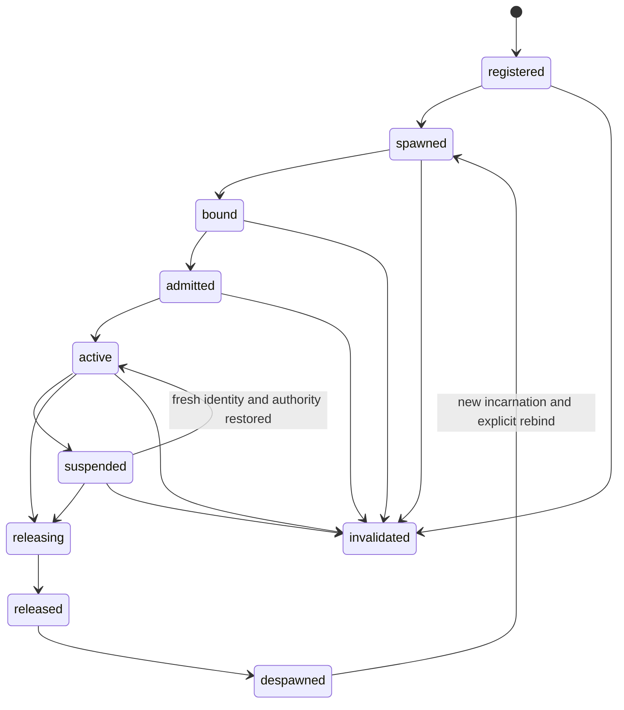

# Helix Minecraft companion embodiment v1

Status: projected architecture and acceptance contract. It does not claim that
a companion entity, its controller, or its live-room experience is implemented
or accepted.

The active gate, dependency order, capability maturity and permission to begin
runtime work are governed only by
`docs/helix-environment-harness-work-program-v1.md`. This contract is reserved
for post-G3 EH-RCC1 through EH-RCC3. It must not broaden the active G3
viability and unexpected-event surface.

## Outcome

CasimirBot may give Runtime Codex a separate, visible Minecraft embodiment so
the player can play alongside the AI instead of surrendering control of their
own player body.

```text
user and room members
  -> Runtime Codex chooses dialogue, strategy and semantic modes
  -> Helix binds identity, consent, leases, capabilities and evidence
  -> resident companion controller maintains admitted local behavior
  -> trusted local arbiter admits or rejects each bounded response
  -> authoritative Fabric/server thread performs the entity effect
  -> measured companion/world observations re-enter Codex when meaningful
```

The companion is an embodiment of Codex's admitted intentions, not a copy of
the model running inside an entity. It cannot sample a model, expand its own
authority, invent a durable goal, write an answer or bypass Helix and the local
arbiter.

## Embodiment kinds

| Kind | Actor | Control surface | Default authority |
| --- | --- | --- | --- |
| `player_proxy` | The selected user's Minecraft player | Fabric client input and typed Player Embodiment workflows | Existing finite Player Embodiment lease |
| `companion_entity` | A distinct server/Fabric-owned assistant entity | Entity-local navigation, orientation, bounded interaction and presentation | Separate finite companion actor lease |

The two actors may cooperate and observe the same world, but they never share
identity, inventory, authority, observations or lifecycle state by implication.
Companion ownership does not grant player control. Player authority does not
grant companion control. Block, inventory, command, summon, weather or other
broader world mutations require their separately admitted capabilities.

## Identity model

Every companion lifecycle fact, proposal, effect and observation binds the
following identities:

```text
environment_id
world_id
connector_epoch
companion_id
actor_entity_id
actor_incarnation_id
controller_profile_id
controller_artifact_hash
owner_account_id
authority_subject_id
beneficiary_player_id
target_subject_id (when applicable)
observation_origin
observation_revision
lease_id
room_id (when room-scoped)
```

`companion_id` is the durable logical assistant identity.
`actor_entity_id` identifies the current Minecraft entity.
`actor_incarnation_id` changes whenever death, respawn, replacement, server
reconstruction or another event creates a new runtime body. No observation,
proposal, path, target, resource claim or action lease from an earlier
incarnation may control the new entity.

Owner, authority subject, beneficiary and target are separate roles. None may
be inferred from proximity, display name, recent chat or the nearest player.
Several room members may be beneficiaries or viewers, but one serialized
execution lease controls the actor at a time.

## Companion lifecycle



| State | Required fact | Allowed behavior |
| --- | --- | --- |
| `registered` | Durable companion profile and owner exist | No Minecraft effect |
| `spawned` | Current entity and incarnation are observed | Read-only identity and presence checks |
| `bound` | Exact world, actor, owner, room/beneficiary and connector epoch agree | Capability discovery only |
| `admitted` | Finite actor lease, repertoire, limits and controller hash are accepted | Controller may initialize but may not act before activation |
| `active` | Identity, observation freshness and lease remain current | Only admitted resident responses through the local arbiter |
| `suspended` | A recoverable boundary interrupted control | Hold/release safely; no new effect until the boundary is repaired |
| `releasing` | Terminal transition has begun | Cancel goals, release navigation/resources and publish evidence |
| `released` | All controller-owned resources and effects are settled | No further control under the old lease |
| `despawned` | Current entity no longer exists | Durable logical identity may remain; runtime identity is absent |
| `invalidated` | Identity, integrity or authority cannot be repaired in place | Fail closed; require a new incarnation/binding/lease as applicable |

Codex deliberation by itself does not suspend an admitted local mode. The
resident controller exists to remain effective during that delay. Suspension
or invalidation occurs for stale observations, target loss, world or connector
epoch change, actor death/replacement, authority loss, lease expiry, manual
override, Emergency Stop, resource/integrity failure or an exhausted response
repertoire.

Death, despawn, server restart and reconnect never resume physical control from
conversation history. The connector first reports the new current entity and
incarnation, Helix rebinds it to the durable companion identity, and a fresh
lease is admitted before the controller becomes active.

## Initial resident profile

The first projected controller is
`resident.minecraft.companion-follow.v1`. It is deterministic trusted code and
supports only:

- follow one admitted target;
- hold position;
- look at one admitted target;
- move to one nearby admitted waypoint;
- return to the bound owner or beneficiary;
- release navigation and presentation resources; and
- abstain and request semantic replanning.

`follow` is one semantic mode, not a stream of model-authored movement calls.
The admitted profile declares a start distance, stop distance, maximum radius,
path-recalculation ceiling, observation-age ceiling, reaction deadline, timeout,
loaded-area boundary and obstruction policy. The separated start/stop distances
provide hysteresis so the entity does not chatter around one threshold.

The controller stops, suspends or abstains when it cannot validate the target,
cannot find a bounded route, would leave the admitted area, exhausts its local
budget, encounters a higher-priority interrupt, or loses current identity or
authority. Runtime Codex receives the compact reason and decides whether to
change the goal, request evidence, select another admitted mode or explain the
blocker.

Combat, item custody, crafting, container access, block interaction, scouting
beyond the admitted nearby envelope, teleportation, summoning and server
commands are absent by default. Each requires a separate capability, effect
lease, postcondition contract and acceptance packet.

## Perception and evidence

Every observation names its origin. At minimum the contract distinguishes:

- `companion_local`: facts visible or measurable from the companion actor;
- `player_proxy`: facts reported from the selected player's client;
- `server_authoritative`: world/entity facts measured by the server connector;
  and
- `room_projection`: a derived room view with exact source references.

An observation carries its actor/entity identity, incarnation, position or
scope, world tick/time, revision, freshness deadline, content hash and source
references. Helix may reconcile compatible observations but cannot silently
present the companion's viewpoint as the player's, or a room projection as a
fresh server measurement. Conflicts and missing coverage re-enter Codex as
typed evidence rather than deterministic substitute prose.

The companion may look, gesture, animate, display an activity state or speak
from its measured location. These are presentation events. They do not prove an
environment effect, satisfy a goal or become terminal authority. Conversation
memory may preserve social continuity, but only canonical environment evidence
supports claims about current Minecraft state or completed actions.

## Events, live mail and threading

Damage, interaction, target departure, target attention, time progression,
idle state, obstruction, mode exhaustion and lifecycle transitions receive
exact event identities. The connector may debounce and coalesce repeated
events, but cooldowns and “already processing” flags are load controls rather
than evidence identity or decision authority.

Meaningful event groups become compact nonterminal live-mail wake evidence.
Live mail may wake Runtime Codex to interpret or replan; it never runs the
tick-level controller, executes an effect or writes the answer.

Model calls, speech generation and other slow semantic work run asynchronously.
All entity and world effects return through the authoritative Fabric/server
execution thread and trusted local arbiter. A background task may propose an
action but cannot mutate Minecraft directly.

## Multiplayer and room arbitration

The room projects the companion's exact owner, current controller, authorized
beneficiaries, target, presence, mode and lease state without exposing connector
credentials. Multiple members may converse with or observe the companion. If
their requests conflict, Helix admits at most one mutation request under the
current serialized execution lease; other proposals remain non-authoritative
until current identity and policy admit them.

Following, observing closely, sharing inventory information or speaking about a
player must respect that player's applicable room/subject consent. Selecting a
beneficiary or target in chat does not create that consent or bind an entity.

## Resource, presence and release contract

The companion declares CPU/time budgets, navigation resources, loaded-area
limits, observation frequency, event/coalescing bounds and any chunk ticket it
requests. It cannot silently force arbitrary or indefinite chunk loading.

Every terminal path—including success, suspension, timeout, target loss,
disconnect, death, despawn, world transition, authority loss, manual override,
Emergency Stop and implementation failure—must:

1. stop or clear native navigation goals;
2. release arbiter resources and transient effects;
3. release bounded chunk/presence claims;
4. settle or cancel outstanding proposals without replaying effects;
5. publish the final lifecycle state and measured postconditions; and
6. prevent the previous lease or incarnation from acting again.

## EH-RCC3 acceptance

EH-RCC3 requires deterministic, direct and governed evidence for all of the
following before the companion profile can advance beyond `projected`:

1. An explicitly created companion binds to the exact owner, world, entity and
   incarnation without proximity inference.
2. Follow maintains its admitted distance band without threshold chatter and
   stops at its maximum area or resource boundary.
3. Hold, look, nearby waypoint, return and abstention produce their exact
   measured postconditions.
4. An obstruction or lost target produces compact evidence, releases unsafe
   behavior and causes Codex to materially replan or report the blocker.
5. Codex delay does not stop an admitted local mode, while lease expiry does.
6. Manual override and Emergency Stop preempt the controller and prove complete
   resource release.
7. Death, respawn, despawn, server restart and reconnect rotate the incarnation
   and cannot replay a stale proposal or lease.
8. Companion-local, player-proxy, server-authoritative and room-projected
   observations remain distinguishable through re-entry and final synthesis.
9. Two authorized room members cannot race the companion; one serialized lease
   determines the actor effect and the rejected/deferred request remains clear.
10. Spatial speech, gaze and activity presentation remain synchronized with the
    actor but cannot satisfy action or terminal evidence.
11. Chunk, navigation, task and memory use remain inside declared budgets, with
    no resource leak after every terminal path.
12. A0 direct Fabric, A1 Codex-through-MCP and B keyed Helix traces preserve the
    same public request, actor/incarnation identity, admitted mode, observations,
    effects, postconditions, Codex candidate and visible/text/voice result.

The comparison uses the same first-divergence method as the current Minecraft
adapter. Direct success is feasibility evidence; only the governed path can
accept Helix identity, admission, evidence re-entry and terminal continuity.

## Clean-room boundary

Verity JE is a behavioral architecture reference for a visible companion,
semantic modes, local pathfinding, event-triggered dialogue and spatial
presentation. It is All Rights Reserved and is not a source, asset, archive or
runtime dependency. CasimirBot's implementation must be independently designed
against this contract and public Minecraft/Fabric APIs.

## Explicit non-goals

- Do not implement this contract during G2.
- Do not make the companion another public MCP server or credential holder.
- Do not infer ownership from proximity, name or chat history.
- Do not merge player and companion observations or inventories.
- Do not resume actions automatically after death, restart or identity change.
- Do not let live mail, presentation, memory or a receipt become an answer.
- Do not grant world mutation, combat, inventory or host access through the
  initial follow profile.
- Do not introduce learned control before the deterministic companion and local
  arbiter pass their scheduled acceptance.
