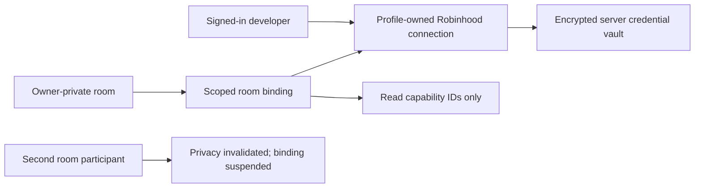

# Robinhood brokerage environment v1

Status: developer-only read plane, deterministic paper execution, expiring
Robinhood equity review, and production-gated tiny live executor implemented;
activation remains locked by deployment flags pending real-account acceptance

This document fixes the first CasimirBot boundary for Robinhood's official
Trading MCP. It authorizes only the enumerated, bounded read tools through a
private owner-room binding. Dedicated exact routes may review and consume one
approved equity order or attempt one explicit cancellation, but only behind
deployment, control, account, risk, freshness, and reconciliation gates. This
does not authorize options, margin, extended-hours, or unattended trading.

## Ownership model

The Robinhood OAuth connection belongs to the signed-in CasimirBot profile.
It is not owned by a room, Codex task, runtime agent, or plugin. A room stores
only a revocable reference to that profile-owned connection plus the immutable
read capabilities the owner consented to expose there.

Therefore the workstation surfaces should eventually show two related lists:

- Account & Sessions: the user's personal provider connections and their
  connection health.
- Shared Live Room environments: references attached to the selected room,
  their consented capabilities, and their privacy state.

OAuth tokens, PKCE verifiers, provider account numbers, and raw provider
payloads never appear in either list.

## Authentication boundaries

There are two independent authorization relationships:

1. The browser authenticates to CasimirBot with the existing first-party
   account-session cookie. Exact same-origin evidence is required for writes.
2. CasimirBot acts as an OAuth public client to Robinhood. It uses live OAuth
   metadata discovery, dynamic client registration, authorization code flow,
   state, and S256 PKCE.

CasimirBot never asks an agent or chat for a Robinhood password. Chrome or
in-app browser automation must not click the brokerage UI. The user completes
Robinhood's hosted authorization page, and Robinhood returns only an
authorization code to the CasimirBot callback.

The accepted provider identities and endpoints are exact allowlists. A changed
issuer, resource identity, token endpoint, registration endpoint, authorization
endpoint, PKCE method, or client authentication method fails closed.

Production requires `HELIX_PROVIDER_CREDENTIAL_ENCRYPTION_KEY`. The value is a
32-byte base64url key supplied by deployment secret management. Stored access
and refresh tokens use AES-256-GCM with owner/connection-specific authenticated
context. OAuth state is stored only as a namespaced SHA-256 digest, and the
stored PKCE verifier is replaced by an encrypted tombstone after one successful
exchange.

An installed development profile may rotate an existing record whose stored
key identity is exactly `dev-local` into a configured stable key. That fallback
is admitted only outside production, requires the authenticated stored key ID,
and the first successful credential lease immediately rewrites the envelope
under the configured key. Production never attempts the development-key
fallback, and any other stored/current key mismatch fails closed.

## Current API surface

All endpoints are mounted below `/api/agi` and require a signed-in developer
account with the `brokerage_environment` feature.

| Method | Path | Purpose |
| --- | --- | --- |
| `GET` | `/brokerage-connections` | List sanitized profile-owned connections. |
| `POST` | `/brokerage-connections/robinhood/oauth/start` | Start discovered OAuth + PKCE. |
| `GET` | `/brokerage-connections/robinhood/oauth/callback` | Exchange one owner-bound authorization code. |
| `DELETE` | `/brokerage-connections/:connectionId` | Remove local access and all room bindings. |
| `POST` | `/brokerage-connections/:connectionId/room-bindings` | Attach selected read capabilities to an owner-private room. |
| `GET` | `/brokerage-connections/rooms/:roomId` | List sanitized bindings and current privacy state. |
| `POST` | `/brokerage-connections/:connectionId/rooms/:roomId/read` | Execute one admitted read tool and return a normalized observation. |
| `POST` | `/brokerage-connections/:connectionId/rooms/:roomId/paper-account` | Create an idempotent paper-risk account with an explicit bankroll. |
| `GET` | `/brokerage-connections/:connectionId/rooms/:roomId/paper-account` | Read sanitized paper-risk state. |
| `POST` | `/brokerage-connections/:connectionId/rooms/:roomId/paper-risk-decisions` | Evaluate and journal one observation-backed candidate. |
| `POST` | `/brokerage-connections/:connectionId/rooms/:roomId/paper-kill-switch` | Stop or resume paper risk evaluations with an audit reason. |
| `POST` | `/brokerage-connections/:connectionId/rooms/:roomId/paper-orders/entries` | Reserve paper cash for one accepted risk decision. |
| `POST` | `/brokerage-connections/:connectionId/rooms/:roomId/paper-observations/process` | Idempotently process stored quote evidence into fills, marks, and stop exits. |
| `POST` | `/brokerage-connections/:connectionId/rooms/:roomId/paper-orders/cancel` | Cancel an open simulated entry and release its reservation. |
| `POST` | `/brokerage-connections/:connectionId/rooms/:roomId/paper-positions/close` | Close a simulated position at a fresh stored bid. |
| `GET` | `/brokerage-connections/:connectionId/rooms/:roomId/paper-lifecycle` | Read bounded orders, positions, fills, and journal events. |
| `POST` | `/brokerage-connections/:connectionId/rooms/:roomId/live-equity-previews` | Convert one fresh accepted risk decision into a non-executing Robinhood equity review. |
| `GET` | `/brokerage-connections/:connectionId/rooms/:roomId/live-equity-previews` | List bounded reviews and their expiry/approval state. |
| `POST` | `/brokerage-connections/:connectionId/rooms/:roomId/live-equity-previews/:previewId/approve` | Record exact-text, explicit-user, one-time approval for the reviewed order. |
| `GET` | `/brokerage-connections/:connectionId/rooms/:roomId/live-acceptance-readiness` | Aggregate sanitized read, contract, supervisor, operator, entry, exit, and exposure gates without provider order-tool calls. |
| `GET` | `/brokerage-connections/:connectionId/rooms/:roomId/live-acceptance-archives/latest` | Read the latest immutable sanitized completed-canary archive for the owning developer. |
| `POST` | `/brokerage-connections/:connectionId/rooms/:roomId/live-acceptance-archives` | After both live flags are off, seal completed entry/exit and zero-exposure evidence under an exact confirmation phrase without calling a provider tool. |
| `GET/POST` | `/brokerage-connections/:connectionId/rooms/:roomId/live-contract-preflight` | Read the latest sanitized receipt or inspect the MCP catalog without calling an order tool. |
| `GET/POST` | `/brokerage-connections/:connectionId/rooms/:roomId/live-control` | Inspect or explicitly arm/stop the fail-closed tiny live-entry control. |
| `POST` | `/brokerage-connections/:connectionId/rooms/:roomId/live-presence` | Maintain a short-lived attended-operator heartbeat while the visible room UI is active. |
| `GET/POST` | `/brokerage-connections/:connectionId/rooms/:roomId/live-equity-executions` | List live receipts or atomically consume one approved review for placement. |
| `POST` | `/brokerage-connections/:connectionId/rooms/:roomId/live-equity-executions/:executionId/reconcile` | Reconcile one placement or cancellation from Robinhood order history. |
| `POST` | `/brokerage-connections/:connectionId/rooms/:roomId/live-equity-executions/:executionId/cancel` | Make one explicit, non-retried `cancel_equity_order` attempt for an open or unresolved order. |
| `GET/POST` | `/brokerage-connections/:connectionId/rooms/:roomId/protective-exit-previews` | List or provider-review a separate sell-stop for one reconciled filled entry. |
| `POST` | `/brokerage-connections/:connectionId/rooms/:roomId/protective-exit-previews/:exitPreviewId/approve` | Record exact explicit-user approval for the reviewed sell-stop. |
| `GET/POST` | `/brokerage-connections/:connectionId/rooms/:roomId/protective-exit-executions` | List protective-stop receipts or consume one approval for placement. |
| `POST` | `/brokerage-connections/:connectionId/rooms/:roomId/protective-exit-executions/:exitExecutionId/reconcile` | Reconcile the separate protective stop from Robinhood order history. |
| `POST` | `/brokerage-connections/:connectionId/rooms/:roomId/protective-exit-executions/:exitExecutionId/cancel` | Make one explicit at-most-once cancellation attempt for an open protective stop. |

Every public projection declares that it contains no credentials, account
numbers, raw provider payload, assistant answer, or terminal authority.

## Read catalog and execution boundary

The v1 contract records only read capability IDs and a reviewed allowlist of
Robinhood read tools. `get_accounts` is excluded from the public read surface
because it can expose full account numbers. The order-preview boundary may call
it internally only to identify exactly one account explicitly labelled Agentic;
the raw account reference is then stored solely inside the encrypted credential
bundle, while public state contains only a namespaced hash and generic label.
Placement and cancellation remain excluded from the generic room read catalog
and agent tool gateway. They are reachable only through the dedicated
developer-session routes and narrower contracts. Options and every other
brokerage mutation remain excluded.

Before the live control can arm, a private-room operator must run the dedicated
provider-contract preflight. It lists the current MCP catalog, exercises the
local argument builders with synthetic values, and calls no provider order
tool. The immutable receipt exposes only catalog/schema hashes and typed gate
results. A PASS is valid for 24 hours and is checked again during the atomic
placement reservation, so missing, failed, stale, duplicate, ambiguously
annotated, or schema-drifted contracts fail closed.

Startup also fails closed when only one of the execution/supervisor flags is
enabled or when live mode lacks an exact 32-byte base64url provider credential
key. The evidence-only acceptance projection separates read acceptance, safe
flag enablement, attended-canary readiness, arming readiness, and completed
entry/exit acceptance. It is derived from sanitized database receipts, invokes
zero provider order tools, and has neither execution nor answer authority.

Completed acceptance is sealed only after both live flags are disabled. The
archive route re-reads the sanitized readiness projection, requires one
reconciled-filled entry, one reconciled-filled exit and zero unresolved
exposure, then locks the active control and rechecks those counts in the insert
transaction. The evidence document excludes credentials, account identifiers,
raw provider payloads and the volatile report-generation time. Its stable hash
makes exact retries idempotent, and the local workstation snapshot includes the
archive table so the record survives a keyed-server restart. Archiving has no
provider-order vocabulary and cannot itself satisfy a missing acceptance gate.

While armed, attended operator presence is a ten-second lease. If it expires or
has a future-invalid timestamp, the next five-second supervisor cycle durably
disarms the control, clears presence, activates the kill switch, and appends an
immutable `operator_presence_expired_relocked` event. The supervisor still
places, cancels, and reconciles zero provider orders.

The server adapter lists the provider's current tool catalog on each fresh MCP
session, requires an exact admitted tool, rejects provider tools marked as
destructive, and retries once after a typed authorization failure by refreshing
the OAuth token. It bounds input size, depth, keys, arrays, and string lengths;
removes credential and account-identifier fields; redacts bearer-like values
and long account-number-like strings; and emits a typed observation with hashes,
freshness, provenance, and a producer epoch.

The audit table stores metadata and input/output hashes, never raw arguments,
results, tokens, account numbers, or provider payloads. A separate evidence
table stores only the already bounded and redacted normalized projection. It is
written atomically with the successful audit row and bound to the same output
hash. Paper fills derive prices from that stored server evidence, so a browser
cannot cite one quote receipt while substituting different prices. Public
projections and observations deliberately report:

- `read_only: true`
- `live_order_execution_enabled: false`
- `raw_provider_payload_included: false`
- `answer_authority: false`

The credential accessor requires all of the following before decrypting
credentials: owner identity, active connection, exact room, active private-only
binding, a room containing only its owner, and a consented read capability.
Adding a second room participant invalidates and suspends the binding.

The Account & Sessions panel now owns connect, status, refresh polling, and
two-step disconnect controls. The Shared Live Room panel lets the owner attach
an active connection to that exact private room. Both surfaces state that live
orders remain disabled.

## Relationship to Codex and the CasimirBot plugin

The future CasimirBot plugin should connect Codex to CasimirBot's governed MCP
surface. It should not hand Robinhood tokens directly to Codex. CasimirBot owns
provider identity, room binding, capability admission, evidence provenance,
and policy receipts. Codex continues to own model sampling, generic tool use,
tool-result re-entry, approvals, and terminal completion.

No brokerage observation is an answer. The read adapter normalizes provider
results into bounded evidence with freshness and provenance; a future governed
workstation capability may re-enter that evidence into a solver turn without
granting it terminal authority.

## Acceptance before the next stage

Deterministic tests cover OAuth discovery and refresh, encrypted persistence,
room privacy invalidation, exact read-tool admission, normalization/redaction,
metadata-only audit, developer policy, and the two UI surfaces. The remaining
v1 acceptance step requires the developer to complete Robinhood's hosted OAuth
flow against a keyed local or deployed CasimirBot server, attach the connection
to a private room, and verify at least portfolio, positions, quote, and order
history observations without account identifiers in the browser or logs.

## Deterministic paper-risk boundary

The paper account is a simulation ledger and cannot submit an upstream order.
In this brokerage contract, **paper** always means simulated cash, orders,
fills and positions in CasimirBot's local ledger. It does not refer to the
Minecraft Paper server adapter. Minecraft's accepted player execution lane is
Fabric; no Paper-server command or authority participates in brokerage
simulation.

Its starter policy is immutable at the public route and uses integer cents and
price micros. At an account equity of $340, the percentage caps resolve to a
$50 maximum position, $1.70 maximum estimated risk per trade, and $6.80 daily
loss cutoff; lower account equity reduces those values automatically.

The risk gate rejects stale or future quotes, invalid or wide spreads, entries
too far from market, non-regular sessions, opening/closing buffers, missing or
near earnings, invalid long stops, daily loss/trade/open-position/consecutive-
loss caps, averaging down, oversized positions, excessive estimated risk,
insufficient cash, and an active kill switch. It accumulates typed reasons
deterministically and records the complete safe candidate/decision snapshots.

A candidate must cite successful brokerage observation IDs belonging to the
same owner, connection, and private room, including at least one market-data
observation. Candidate identity is idempotent: an exact replay returns the
stored result, while changed inputs under the same identity fail closed.

An accepted decision can reserve paper buying power and create one simulated
limit entry. A fresh quote can fill the entry at its stored ask, mark the
position at its stored bid, trigger its stop, fill the simulated exit, and
reconcile cash, equity, realized/unrealized P&L, open symbols, trade counts, and
consecutive losses. Quote processing is idempotent, so replay cannot duplicate
a fill. Two consecutive losing exits or the daily-loss limit activates an
automatic audited kill switch; risk-reducing exits remain available. The New
York clock handles regular-session boundaries, weekends, and standard exchange
holidays.

The room UI can initialize a paper bankroll, inspect its lifecycle, process a
fresh quote, cancel an entry, close a position, and operate the audited kill
switch. There is not yet an unattended market observer/scanner.

## Governed resident-controller mapping

Robinhood reuses the environment harness's generic governed resident-controller
protocol; it does not reuse Minecraft combat rules or Fabric actions. Its first
implemented profiles and next specified simulation profile are:

1. **Brokerage market observer (`monitor_only`).** Read profile-scoped quotes,
   account, position and order state under a finite semantic-monitor lease;
   apply deterministic scheduling, freshness and paper-simulation rules; emit
   ordered typed changes; and wake the exact Codex task for interpretation. It
   has no provider mutation vocabulary.

   Local paper-state processing is admitted separately from Robinhood read
   access through `helix.brokerage.paper_observer.process`. Brokerage read
   permission alone cannot invoke the observer cycle. The separate permission
   authorizes only deterministic simulated-state processing and semantic
   projection; it is not a live-trading permission.

   The installed MCP bootstrap reuses that permission together with room
   read/manage, environment read and agent-run write. It creates or reuses a
   room-scoped paper account and a brokerage-native durable goal only after the
   server verifies the exact private room, read binding, connection epoch,
   owner participant, owner-scoped room-bound run and paper account. The paper
   account may occupy the generic durable identity's `action_authority_id`
   field solely as local simulation authority; it is never Robinhood provider
   order authority.
2. **Brokerage simulated-execution controller (`bounded_reflex`, specified).**
   Consume an admitted, versioned strategy manifest plus fresh ordered quote
   observations; maintain bounded market and simulated-position state; rank
   only the manifest's admitted symbols and conditions; and propose finite
   local-simulation responses through the paper-risk arbiter. Its response
   vocabulary is limited to proposing a simulated limit entry, simulated
   cancellation, simulated risk-reducing exit, simulated kill-switch
   activation, abstention or semantic escalation. The paper ledger—not the
   controller—owns each simulated effect and its idempotent receipt.

   The manifest binds its artifact hash, symbol universe, quote fields,
   schedule, maximum quote age, predicates, ranking function, entry and exit
   limits, stop conditions, state horizon, expiry and reset behavior. Runtime
   Codex may select or revise that finite manifest between admitted runs and
   interpret compact receipts; it does not evaluate every quote update. A
   watchdog independently stops new simulated risk on stale or gapped data,
   producer-epoch change, lease expiry, invariant failure, daily-loss breach,
   manual override or Emergency Stop.

   Initial live input may use bounded Robinhood MCP quote polling. The profile
   remains provider-neutral so a later authenticated event-stream adapter can
   supply the same ordered observation contract. Request/response quotes do
   not justify a high-frequency or exchange-parity latency claim. Historical
   replay and live-data shadow runs must preserve event time, arrival time and
   processing time so evaluation cannot use future information.

   This profile has no Robinhood review, placement, cancellation,
   reconciliation, transfer, option, crypto or liquidation vocabulary. No
   simulated result, profitability metric or controller artifact grants live
   authority. Its staged implementation and acceptance contract is
   `docs/work-packets/eh-g8-brokerage-reactive-simulation-controller-v1.md`.
3. **Brokerage live-risk supervisor (`bounded_reflex`).** Observe the local
   control ledger, quote freshness, protective-exit state and attended-presence
   heartbeat. Its finite response vocabulary is limited to locking new entries,
   expiring stale approval authority, activating the local kill switch and
   raising an operator alert. It cannot place, cancel, replace, reconcile or
   liquidate a provider order.

The live executor is not a resident-controller response. A real order remains a
separate high-consequence route requiring fresh provider evidence, deterministic
risk admission, provider review, exact user approval, at-most-once placement and
reconciliation. If the required response deadline is shorter than fresh
evidence and that route can safely satisfy, the profile must abstain and fail
closed rather than infer permission from urgency.

## Robinhood review and explicit approval boundary

Only a fresh accepted paper-risk decision can request a Robinhood equity
review. The server re-loads the stored candidate, policy, quote evidence, and
current kill-switch state; requires the regular session; derives the fractional
quantity using integer arithmetic; and fixes the intent to a long equity,
buy-limit, good-for-day order with extended hours disabled.

Robinhood does not publish the review input fields in its help catalog. The
adapter therefore reads the live MCP tool descriptor, rejects destructive
annotations, ambiguous aliases, missing safe fields, unknown required fields,
or enums that no longer admit the safe values. It never guesses a new provider
field. An authorization failure refreshes OAuth once; all other contract or
provider failures stop without placing an order.

The raw provider review is encrypted at rest. The public preview includes only
the canonical intent, warning strings, hashes, status, exact approval phrase,
and a 90-second expiration. Proposal hashes bind owner, connection, room, paper
account, risk decision and input hash, policy hash, quote evidence hash, and
every order field. One risk decision can create only one provider preview.

Approval is a first-party developer-session action, not an agent tool. The user
must type the entire server-generated phrase exactly. The stored approval binds
the session hash, proposal hash, provider-review hash, approval time, and
expiration, and can be consumed only once. Consumption is atomic with a durable
placement reservation. The control relocks before the provider call, and the
call is never retried after it may have reached Robinhood. An expired token may
be refreshed and retried only when the adapter proves placement was not
attempted.

The tiny live policy hard-codes a $25 entry cap, $1 estimated-risk cap, $3
daily-loss cutoff, one new entry per day, one position, no existing open order,
regular-hours only, and a dedicated Agentic account. Live portfolio, position,
order, P&L, and quote evidence are refreshed before approval consumption.
Unknown provider schemas, missing idempotency identity, stale evidence, or an
ambiguous provider response fail closed into reconciliation.

Cancellation is also one-shot. It uses only an encrypted provider order
identity, durably reserves the attempt, does not retry after ambiguity, and
always requires order-history reconciliation. A kill switch alone neither
cancels an open order nor sells a filled position.

Production arming additionally requires `protective_exit_ready`, a fresh
supervisor heartbeat, and a fresh attended-operator heartbeat from a visible
developer room UI. The supervisor is enabled only when both
`ENABLE_ROBINHOOD_LIVE_EQUITY_EXECUTION=1` and
`ENABLE_ROBINHOOD_LIVE_SUPERVISOR=1`. It reads and updates only the local
control ledger: it never places, cancels, or reconciles provider orders. It
locks new placement and raises an in-app `role=alert` notification when a
filled entry lacks a submitted/reconciled stop or a stop outcome is ambiguous.

Because Robinhood does not support attaching a bracket order to the entry, a
filled entry creates a distinct sell-stop workflow. The server rechecks that
exactly one matching live position exists, rejects review if the bid has
already breached the intended stop, requests a fresh `review_equity_order`,
encrypts the provider review, and requires exact user approval plus a second
exact placement confirmation. The sell-stop call is at-most-once, risk-reducing
even while the entry kill switch is active, and independently reconciled.
Stop-market execution price is not guaranteed.

The same separately reviewed exit boundary can request an explicit full-position
market close. It omits stop price, requires a fresh position snapshot and a new
exact approval/placement phrase, and remains at-most-once. An open protective
stop must first be cancelled and reconciled before a market-close review is
eligible. Market-close execution price is also not guaranteed.

## Live-trading roadmap

Production acceptance is specified in
`docs/runbooks/robinhood-live-trading-acceptance.md`.

1. Complete the real-account read-only acceptance above and expose the governed
   read capabilities to the CasimirBot plugin/Helix workstation tool gateway.
2. In progress: the versioned `monitor_only` market-observer profile now wraps
   the implemented clock, quote-evidence gate, journal and fill simulator and
   projects bounded changes through the generic semantic-monitor contract. Its
   separately admitted MCP bootstrap now creates the room-scoped paper ledger
   and brokerage-native durable-run identity needed by the generic finite
   monitor. Complete installed delivery, acknowledgement, reconnect,
   revocation and stale-epoch acceptance; keep scheduling, indicators and state
   transitions outside the conversational agent loop.
3. Completed: preview-only equity proposal, live Robinhood review, encrypted
   provider receipt, and expiring exact-text approval with no execution
   authority.
4. Completed locally: the live-equity executor atomically consumes one approval,
   re-runs risk against the live account immediately before placement, reserves
   at-most-once identity, reconciles ambiguous outcomes, and supports explicit
   one-shot cancellation. The separate reviewed protective sell-stop, attended
   supervisor heartbeat, and operator attention alert are implemented. Complete
   real-account read/review/schema acceptance before enabling production flags.

Options, margin, browser automation, self-modifying strategies, and unattended
order placement remain outside this roadmap unless separately authorized and
reviewed.
