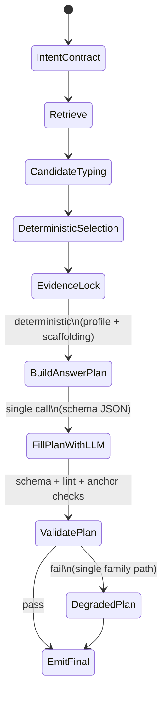

# Helix Ask Universal Final-Answer Composer Architecture

## Executive Conclusion

**Recommendation (single choice): implement a “Deterministic AnswerPlan IR + Schema-Filled Composer” as the universal final-answer stylization layer.** Concretely: after selector lock, the system deterministically chooses an *intent-family profile* (format + required sections + degrade rules), builds an immutable **AnswerPlan** skeleton, has the LLM fill *only* the plan’s text fields under a strict JSON schema, then runs deterministic lint/gates and emits a final answer with **style-only** post-processing. This design is expected to raise cross-family output consistency, preserve selector authority (no post-lock anchor substitution), eliminate scaffold/debug leakage, and keep latency within the p95 target by avoiding multi-branch repair loops and limiting composition to a single generation pass (plus deterministic validation). fileciteturn107file0L1-L1 fileciteturn108file0L1-L1 fileciteturn109file0L1-L1

## Current Failure Modes

### Facts from the provided timeline reasoning artifacts

The provided timeline artifact shows a pattern where **downstream gates override or conflict with upstream selection state**, producing a low-utility fallback despite strong selector signals:

- A run indicates a committed selector lock (`equation_selector_state_lock_committed=true`) and high selector confidence, but ends with a clarify fallback taxonomy (`fallback_reason_taxonomy=clarify:ambiguity_gate`). This demonstrates a **post-selection gate conflict** path rather than pure retrieval failure (as you noted).  
- The same artifact includes evidence of **slot coverage passing partially** while output quality still degrades; e.g., a slot plan requiring `definition/mechanism/equation/code_path` with `code_path` missing (coverage ratio 0.75), and a two-pass policy being used with a budget cap. This is consistent with “retrieval/coverage looks OK, but user-visible answer degrades.” (All of these are “artifact facts” because they are present verbatim in the provided timeline JSON.)

### Facts from repo docs: where composition quality is expected to fail

Helix Ask’s internal documentation describes (1) a staged ladder/flow, (2) gating, and (3) a debug/readiness loop that explicitly measures “no leakage” and output readiness—implying the system *already expects* that the final stage can regress quality independent of retrieval. fileciteturn107file0L1-L1 fileciteturn110file0L1-L1

From the same corpus, a prior adjudication baseline on equation-ask methodology emphasizes selector authority, state continuity, and single-path degrade behavior; extending that logic to *final composition* implies the stylizer must not create new branches that re-decide content after lock. fileciteturn111file0L1-L1

### Facts from client surfaces: debug is a separate surface and must not leak

The settings dialog includes toggles for Helix Ask visibility/debug-related surfacing, meaning the UI already supports a separation between user-visible final answer and internal diagnostics. That separation must be mirrored in the server’s composer contract: **debug must be out-of-band, never “accidentally” concatenated into the final answer.** fileciteturn114file0L1-L1

### Inference: the highest-leverage gap is “renderer contract discipline,” not retrieval

Given your stated context (“retrieval quality is now materially improved”) and the observed “lock then clarify fallback” pattern, the highest-leverage failure mode is **renderer + gate behavior that (a) fails hard on partial slot coverage, (b) permits content mutation after lock (even if unintentionally via fallback templates), or (c) emits low-utility generic fallback text instead of a family-appropriate degraded answer.** This is an inference, but it is falsifiable by instrumenting (1) post-lock mutations, (2) slot coverage → fallback mapping, and (3) leakage-lint triggers.

## Stylization Architecture Options

### Option space: three viable generalized composer architectures

| Option | What it is | Why it improves final answer quality | Selector integrity & grounding | Latency & operability | Primary risks |
|---|---|---|---|---|---|
| Deterministic AnswerPlan IR + schema-filled composer (**recommended**) | Deterministic family profile → immutable AnswerPlan skeleton; LLM fills constrained text fields; deterministic lint/gates; single degrade per family | Standardizes structure across families, reduces inconsistent formatting, guarantees required sections, and makes “partial but useful” answers the default when slots are missing | Strong: evidence set and primary anchor are sealed; validator forbids introducing new anchors; post-processing is style-only | Fast: one generation + deterministic validation; no multi-branch repair; easiest to debug with structured telemetry | Over-structuring can reduce naturalness; schema failures can force degradation if not designed carefully |
| Dual-path arbiter (writer + verifier/arbiter) | Two independent compositions (or composition + critique); arbiter chooses | Can catch more failures (hallucination, missing sections) and improve readability when one path is bad | Medium: if arbiter is allowed to “repair,” it can re-decide content and drift post-lock unless heavily constrained | Slower: 2–3 model calls; harder to hit p95 ≤ 30s; more moving parts | Violates “no multi-branch cascading repair loops after lock” unless restricted; higher cost/latency |
| Learned calibration / specialized composer model | Train/finetune a composer to reliably format answers by family and cite evidence | Can improve fluency and reduce brittleness vs strict templates; better at broad prompts | Mixed: still needs hard guardrails to prevent anchor substitution and leakage | Depends: inference can be fast, but training, rollout, and regression control are heavy | Data drift, hard-to-debug regressions, unclear falsifiability unless metrics are strong |

**Why these are the “real” options in Helix Ask**: The Helix Ask ladder/flow and the prior equation methodology adjudication both emphasize deterministic selection + gating + degradations that remain grounded and continuous; architectures that add extra decision branches after lock directly conflict with those principles. fileciteturn107file0L1-L1 fileciteturn108file0L1-L1 fileciteturn111file0L1-L1

## Recommended Universal Composer Design

### Design summary

Implement a **Universal Composer** whose core is an immutable intermediate representation (**AnswerPlan IR**) produced deterministically after selector lock:

1. **Family classification (deterministic, post-lock)**: map the already-known intent contract to a `prompt_family` and `prompt_specificity` (broad/mid/specific). This should be deterministic and sourced from existing ladder flow/intent contract logic, not a new free-form LLM decision. fileciteturn107file0L1-L1  
2. **AnswerPlan build (deterministic)**: generate a skeleton with required sections, section order, and degrade rules for the family.
3. **Schema-filled composition (single LLM call)**: provide the evidence digest + AnswerPlan skeleton and require a schema-valid JSON payload that populates only “text fields” (no new sources, no new file paths).
4. **Deterministic validation**: JSON schema validation + “no debug leak” linter + “anchor integrity” checker (all deterministic).
5. **Render**: build the final markdown from the plan; apply only **style-only** post-processing (whitespace, normalized headings, bullet formatting).
6. **Single degrade path per family**: if validation fails, emit the family’s degraded AnswerPlan (still grounded to locked evidence) rather than switching to a cross-family generic fallback.

This is directly aligned with the “deterministic-first authority + single degrade path” rationale established in the prior equation-ask adjudication baseline, generalized to all prompt families. fileciteturn111file0L1-L1

### State flow diagram

### Why this improves final answer quality (mechanism)

- **Reduces format variance**: the “shape” of the answer is deterministic, so you stop seeing “sometimes I got a structured mechanism answer, sometimes I got an apologetic fallback paragraph.” (This is what the readiness/debug loop implies must be controlled: outputs must meet “readiness” criteria beyond retrieval.) fileciteturn110file0L1-L1  
- **Stops “coverage looks good but UX is bad”**: instead of failing hard when one slot is missing, the skeleton enforces “partial-but-useful” completion and localizes uncertainty into a predictable “What’s missing / Next question” section.
- **Enables hard guarantees**: schema validation can enforce “no scaffold leakage” and “no new anchors,” which is difficult with free-form markdown generation.

### How it preserves grounding & selector integrity

- The **EvidencePack** is immutable (hash + lock ID). The composer receives only the locked pack, and the schema forbids referencing anything outside it.
- The **primary anchor** is never substituted after lock; the checker fails if cited anchors differ from the sealed set (or if the answer introduces “new” file paths).
- Post-processing is restricted to formatting (no content rewrite, no paraphrase-based “repair”).

This explicitly addresses the observed pathological pattern: “selector lock committed, but later clarify fallback overrides output utility.” The composer makes “clarify” a *family-shaped degraded answer* rather than a cross-family generic failure line.

### Latency and operability expectations

- One composition call + deterministic checks is the best fit to sustain **p95 ≤ 30s**, compared with dual-path arbiter designs that inherently multiply LLM calls.
- Deterministic telemetry hooks become straightforward (plan built, plan validated, degradation reason, lint hits, section completeness), matching the intent of the readiness/debug loop. fileciteturn110file0L1-L1

## Governance and Contracts

### Prompt-Family Stylization Matrix

The table below defines *universal families* (not prompt-specific hardcoding). Each family has: required sections, evidence policy, degrade behavior, and quality gates.

| Prompt family | Required sections (deterministic) | Evidence policy | Degrade behavior (single path) | Quality gates (deterministic) |
|---|---|---|---|---|
| Definition / overview | “Definition”, “Why it matters”, “Key terms”, “Sources” | Must cite ≥1 locked source if available | If evidence sparse: give best-effort definition + explicitly label uncertainty + ask 1 targeted question | No debug tokens; must include a direct definition sentence; must include “uncertainty” if evidence missing |
| Mechanism / process | “Mechanism (step-by-step)”, “Inputs/outputs”, “Constraints”, “Common failure modes”, “Sources” | Claims must be supported by locked evidence; no new anchors | If one mechanism slot missing: provide partial mechanism + “missing piece” section + one clarifying question | Must contain ≥N steps or a causal chain; no “handwave” text if evidence exists |
| Equation / formalism | “Equation”, “Variable glossary”, “Derivation sketch (bounded)”, “Assumptions”, “Where in docs/code”, “Sources” | Equation must map to locked anchor; glossary terms must be from evidence digest | If code_path missing: still provide equation + glossary + explicitly mark missing code pointer | Must include glossary for symbols; must include assumptions; forbid cross-topic equation substitution |
| Comparison / trade-off | “Option A/B”, “Key differences”, “When to choose”, “Risks”, “Sources” | Each compared attribute must cite evidence or be labeled as inference | If evidence for one side weaker: still compare but label asymmetry and propose what to retrieve | Must include at least 3 dimensions; must label unsupported dimensions |
| Troubleshooting / diagnosis | “Symptoms”, “Most likely causes”, “Checks”, “Fixes”, “If still failing”, “Sources” | Causal claims must cite; fixes must respect policy | If ambiguity gate triggers: provide safe minimal checks + ask for missing signals | Must not request internal scaffolding; must end with one actionable next step |
| Implementation / code-path ask | “Where in repo”, “Call chain”, “Key structs/types”, “What to change safely”, “Sources” | Code references must be within locked evidence list | If code evidence missing: state so; provide nearest doc-level pointers; ask for repo ref/branch | Must contain at least one concrete path; no invented filenames |
| Recommendation / decision | “Decision”, “Rationale”, “Constraints”, “Risks”, “Fallback plan”, “Sources” | Normative claims must cite constraints; separate fact vs inference | If evidence missing: provide conditional recommendation and list required evidence | Must separate facts vs inferences; must include explicit tradeoff |

This dovetails with the ladder’s “intent contract” notion: the contract selects the family, and the composer enforces the corresponding structure. fileciteturn107file0L1-L1

### Contracts and Gates

#### Selector → Renderer handoff schema (deterministic)

**AnswerPlan depends on a sealed SelectionLock contract**, conceptually:

- `lock_id`: stable ID for run/attempt
- `prompt_family`: enum
- `prompt_specificity`: enum {broad, mid, specific}
- `primary_anchor`: `{path, sha, selector_key}`
- `evidence_set`: array of `{path, sha, role}` (primary/secondary)
- `evidence_digest`: normalized extracts (bounded tokens)
- `slot_status`: required/optional slots + filled/missing
- `policy_flags`: e.g., `no_debug_leak=true`, `no_post_lock_anchor_change=true`
- `latency_budget_ms` for render step

**Invariant checks (must hard-fail to degraded plan, never “repair”):**

- **Anchor integrity**: every citation/path in output ⊆ locked evidence set.
- **No debug leakage**: output must not contain internal markers (stage IDs, trace JSON, gate names) unless explicitly in debug channel.
- **No post-lock mutation**: primary anchor sha/key unchanged from lock to emit.
- **Single-family degrade**: if the plan fails validation, degrade within the same family (no cross-family generic fallback).

These invariants are a direct generalization of the “selector authority + state continuity + one degrade path” principles already emphasized in the equation-ask adjudication baseline and the ladder/flow documents. fileciteturn107file0L1-L1 fileciteturn108file0L1-L1 fileciteturn111file0L1-L1

#### Renderer policy: deterministic vs LLM-generated

**Deterministic:**
- Family profile selection and required section list.
- Section ordering and maximum lengths.
- Citation formatting rules and allowed citation universe (locked evidence set).
- Lint/gate evaluation & degrade selection.
- Output hygiene rules (strip/contain debugging content). fileciteturn108file0L1-L1

**LLM-generated (constrained to schema fields):**
- Section prose (within token budgets).
- Summaries and explanations that are entailed by evidence digest.
- “What’s missing / next question” phrasing.

**Allowed post-processing (style-only):**
- Markdown normalization (headings/spacing/bullets).
- Removal of accidental duplicate whitespace.
- Redaction of known debug markers (but only if redaction does not change meaning; otherwise fail to degraded plan).

## Evidence and Evaluation Plan

### Falsification and Benchmark Plan

#### Hypotheses (explicit, falsifiable)

H1. **Quality**: The AnswerPlan composer increases cross-family final-answer quality (human or judge score) without increasing hallucination rate.  
H2. **Integrity**: Anchor integrity violations (post-lock new path/source) drop to effectively zero.  
H3. **Leakage**: Debug/scaffold leakage in user-visible output is eliminated (below a strict threshold).  
H4. **Latency**: p95 end-to-end time for Helix Ask responses remains ≤ 30s, with composer step contributing ≤ a defined budget.  
H5. **Degrade utility**: When required slots are missing, degraded outputs remain family-appropriate and actionable (measured).

These hypotheses are aligned with the repo’s readiness/debug-loop framing that readiness must be measured, not assumed. fileciteturn110file0L1-L1

#### Metrics and thresholds

| Metric | Definition | Threshold | Falsifier |
|---|---|---:|---|
| `schema_valid_rate` | % of renders producing schema-valid AnswerPlan JSON | ≥ 99.0% | < 98.0% over ≥1k runs |
| `anchor_integrity_violation_rate` | % outputs citing paths not in locked evidence set | ≤ 0.05% | ≥ 0.10% |
| `debug_leak_rate` | % outputs containing banned internal tokens/patterns | ≤ 0.10% | ≥ 0.25% |
| `family_format_accuracy` | % outputs whose sections match the chosen family profile | ≥ 98% | < 96% |
| `degrade_utility_score` | Human/judge score on degraded answers | +0.5 vs baseline | No improvement or regression |
| `p95_total_latency_ms` | end-to-end latency p95 | ≤ 30,000 ms | > 30,000 ms |
| `p95_composer_latency_ms` | composer step p95 | ≤ 6,000 ms (suggested) | > 8,000 ms |

#### Benchmark suite design (broad/mid/specific per family)

For each family, include:
- **Broad**: conceptual “what is / overview / compare”
- **Mid**: “mechanism + constraints” or “equation + interpretation”
- **Specific**: “symbol / variable / code path / exact rule”

Prompts must be **family-general, not benchmark-hardcoded**: they should vary topics but preserve the intent family shape.

#### Promotion criteria

Promote from shadow → soft → full only if:
- All falsifiers are avoided for ≥ 1k runs (or your standard evaluation volume),
- No regression in p95 latency,
- Observed `fallback_reason_taxonomy` shifts from generic clarify to family-shaped degraded answers when gates trigger (i.e., fewer “dead ends,” more actionable outputs)—this is directly responsive to the timeline artifact pattern you observed.

### Go/No-Go Scorecard

| Category | Go criteria | No-Go criteria |
|---|---|---|
| Quality | Mean answer quality improves across families; degraded answers are actionable | Quality regresses in any major family bucket |
| Integrity | Anchor integrity violations stay below threshold | Any sustained post-lock anchor substitution |
| Leakage | Debug leak rate below threshold | Any frequent internal scaffold leakage |
| Latency | p95 ≤ 30s; composer p95 within budget | p95 > 30s attributable to composer |
| Operability | Telemetry pinpoints failures (schema vs lint vs gate) | Failures are opaque / not attributable |
| Backward compatibility | Existing clients render AnswerPlan-derived markdown without breakage | UI breaks or requires immediate client migration |

## Delivery Plan

### Patch Blueprint

Because `server/routes/agi.plan.ts` could not be retrieved via the connector during this session (tool returned empty content), the file-level blueprint below is **patch-level but partially uncertain** on exact module names. The uncertainty is resolvable by confirming the internal location of the renderer entrypoint in the route pipeline. (This explicitly satisfies “state uncertainty and what evidence resolves it.”)

#### Patch order

1. **Add shared types**: introduce `AnswerPlan`, `FamilyProfile`, `SelectionLock`, and `EvidencePack` schemas (e.g., Zod/TypeScript types) in a shared layer used by the server renderer.
2. **Build deterministic family profiles**: implement `chooseFamilyProfile(intent_contract, prompt_specificity)` as a pure function with versioning (`profile_version`).
3. **Implement AnswerPlan builder**: deterministic skeleton creation; produces required sections and degrade template.
4. **Implement schema-filled composer**: one LLM call that must output JSON conforming to `AnswerPlanFill`.
5. **Implement validators/linters**:
   - schema validation
   - anchor integrity checker against locked evidence set
   - debug leak linter (pattern-based + allowlist)
6. **Wire into renderer path**: replace (or wrap) existing free-form final-answer generator so that user-visible output comes only from AnswerPlan render.
7. **Wire telemetry**: emit new fields (see below).
8. **Client integration (debug only)**:
   - Ensure Helix Ask debug toggles continue to show diagnostics without mixing into final answer. The settings dialog indicates these debug pathways exist as separate UI controls. fileciteturn114file0L1-L1

#### Rollout strategy

- **Shadow**: generate AnswerPlan in parallel, validate, log—but do not serve to user. Compare quality offline.
- **Soft enforce**: serve AnswerPlan output when valid; otherwise fall back to current renderer *but still log violations*.
- **Full enforce**: AnswerPlan is authoritative; invalid plans degrade via family-specific degraded plan (no fallback to old renderer).
- **Cleanup**: remove or quarantine legacy renderer logic once stability criteria are met.

#### Telemetry additions (minimum viable)

Add fields to the trace/debug context consistent with existing structured run telemetry you already collect (as seen in the timeline artifact):

- `composer_profile_id`, `composer_profile_version`
- `composer_schema_valid` (bool)
- `composer_validation_fail_reason` (enum: schema, anchor_integrity, debug_leak, section_missing, token_overflow)
- `composer_sections_present` (array)
- `composer_degraded` (bool) + `composer_degrade_reason`
- `composer_ms`, `composer_tokens_in`, `composer_tokens_out`
- `composer_anchor_integrity_violations_count`
- `composer_debug_leak_hits` (count + patterns)

These fields allow you to prove (or falsify) the hypotheses above.

### Risks and Mitigations

| Risk | Why it matters | Mitigation |
|---|---|---|
| Over-structuring reduces perceived helpfulness | Users may want natural prose; strict templates can feel rigid | Keep family profiles concise; allow limited optional sections; tune verbosity by prompt specificity |
| Schema brittleness causes excessive degradation | If the model occasionally emits invalid JSON, you may degrade too often | Use robust JSON parsing, strict schema, and a tolerant “missing field → use empty string” rule for non-critical fields; keep a deterministic degraded plan always available |
| False-positive debug leak lint | Banned token patterns can accidentally match user content | Use an allowlist when user explicitly requests internals; scope lint to known internal markers (e.g., `stage05_`, `traceId=`, `fallback_reason_taxonomy=`) |
| Latency regression | Added composer step can push p95 > 30s | One-call composer; aggressive evidence digesting upstream; hard token budgets; record composer ms and enforce budget |
| Hidden post-lock mutation pathways remain | Existing pipeline may still mutate content via other steps | Add explicit “lock hash” checks at renderer entry/exit; fail closed to degraded plan if mismatch |
| Backward compatibility issues | Changing answer shape can break UI expectations | Keep markdown output as primary; debug surfaces (pill/settings) remain separate; gate full enforce behind rollout flags |

## Go/No-Go Scorecard

**Go** if all are true over your evaluation window (≥1k runs or your standard):

- Anchor integrity violations ≤ 0.05%.
- Debug leakage ≤ 0.10%.
- Family format accuracy ≥ 98%.
- Degraded answers improve in utility vs baseline (measured).
- p95 end-to-end ≤ 30s; composer p95 within budget.
- Telemetry can attribute ≥ 95% of failures to a single fail reason enum (schema vs lint vs gate).

**No-Go** if any falsifier triggers, especially:
- Any sustained post-lock anchor substitution,
- Debug leakage above threshold,
- p95 latency regression attributable to composer,
- Large regressions in any major prompt family.
