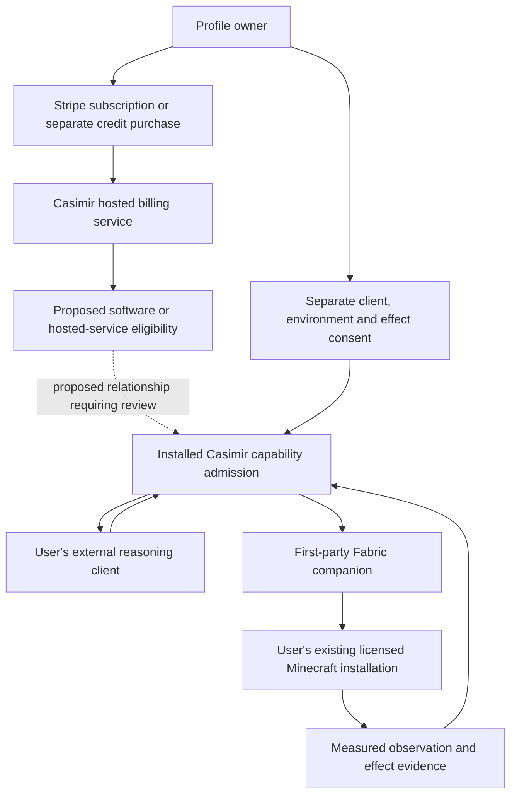

# Payment-to-capability review for the selected broader harness

Status: focused architecture and distribution-rights assessment; no legal
clearance or implementation admission. The owner selected subscription and
Minecraft as a visible technical reference, not a Minecraft-only paid SKU.

## Concrete interaction graph

The dashed commercial connection is a design question, not an implemented or
approved permission. An external reasoning account does not grant Casimir
software, connector or action authority. Credit purchase does not grant effects.

## Observed versus proposed boundary

| Boundary | Evidence and review implication |
| --- | --- |
| Payment | Existing sandbox fixture records $10 starter plan and separate $5 prepaid credit. It does not establish two software tiers, current dashboard configuration or deployed commercial acceptance. |
| Entitlement | `shared/helix-billing-entitlement.ts` defines sandbox state, with provider traffic and billable-lease flags false. New software eligibility is a CFP1 proposal; the existing ledger cannot be relabeled as its implementation. |
| Local game launch | `server/services/helix-ask/workstation-tool-gateway/minecraft-local-lifecycle.ts` currently checks developer policy; this is not an implemented software purchase gate. The proposed ordinary-user policy remains future work. |
| In-game operation | The dual-plane contract uses exact player/world/epoch/lease admission and the Fabric companion for player effects. It does not make Casimir the operator selling access to a public game server. |
| Distribution | Current rights inspection found first-party player/sensor/core JAR build outputs; these were not JAR payloads in the inspected standard EXE. Final separate provisioning and notice obligations remain part of the shipped-product review. No game or modded-game bundle is selected. |
| Evaluation mods | Navigation evaluation mods are excluded before release by owner instruction. That exclusion does not remove the first-party connector from the design or establish its commercial classification. |

This is scoped source/contract evidence, not an exhaustive absence claim about
every billing or connector path. The source references and artifact hashes are
in the adjacent capture and earlier component matrix.

## Questions resolved by the current design evidence

1. **Are we currently proposing sale of access to a Casimir-operated Minecraft
   server?** No such offer is selected. The reference is a user-owned local
   installation. Server monetization permission therefore cannot be the sole
   clearance basis for this design.
2. **Does moving a subscription check outside the mod settle the question?**
   No. A paid-service check at the host can still determine whether in-game
   functions are available. The full dependency must be reviewed.
3. **Does the broader harness scope matter?** Yes: it identifies what is being
   sold and the independent platform value. It does not, by itself, establish
   an exception for every attached environment.
4. **Must Casimir own every dependency's copyright?** No. Established licensed
   rights sufficient for the intended distribution can satisfy a component;
   uncertain provenance and incompatible obligations remain separate issues.

## Proposed state map to resolve before a commercial freeze

| Customer state | Unconditional design boundary | Still needing an exact commercial decision |
| --- | --- | --- |
| No subscription | No borrowed credentials or developer promotion; authorized safety/recovery remain available | Which general harness and hosted features are available; whether Minecraft remains independently usable |
| Active subscription | Payment never grants environment consent or spending authority | Exact general software/service benefits and any effect on the Minecraft connection |
| Optional credits exhausted | No unapproved provider call or automatic API fallback | Which separately purchased consumption products exist; credits do not cancel unrelated software rights |
| Subscription ends | Owner stop/revoke and identity-protected history/recovery persist | Which hosted/software operations end and whether that indirectly disables Minecraft functions |
| Offline or hosted outage | No invented remote authority or claim of offline reasoning | Accepted cached/local path, validation limits and actual dependence on operated services |

These cells cannot be answered by renaming a Minecraft capability as a generic
service. They require the actual supported behavior and terms of the offer.

## Permission assessment and next evidence

The [Minecraft Usage Guidelines](https://www.minecraft.net/en-us/usage-guidelines)
give conditional permissions for server monetization and separately restrict
mods checking outside-product access affecting in-game functions. The
[EULA](https://www.minecraft.net/en-us/eula) limits mod monetization. Applying
those provisions to the graph above leaves a material unresolved commercial
question. Neither infringement nor legality is established by this assessment.

The remaining rights review can now examine the exact state map rather than
the general fact that commercial servers exist. It must identify an applicable
permission basis or obtain appropriate written permission when necessary. No
outside party has been contacted. Existing independent technical work remains
under its own program; no paid connector gate, new hosting business, payment
activation or release is authorized by this document.
