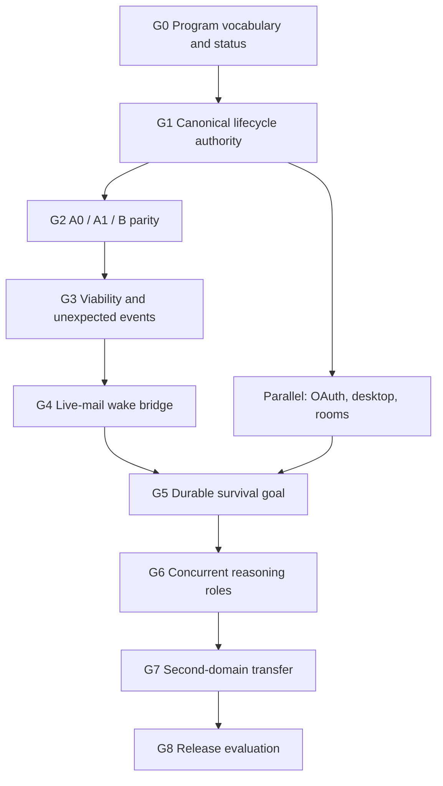

# Helix Environment Harness Work Program v1

Status: canonical program-control document.

Active program gate: **G8**

This document answers the operational question that the product and architecture
contracts intentionally do not:

> What gate are we working on now, what does it depend on, what work is allowed,
> and what evidence permits the program to advance?

It is the single current-status and dependency map for the environment harness.
Product scope and external claims remain governed by
`docs/architecture/casimirbot-environment-harness-product-goal-v1.md`.
Codex/Helix ownership, reasoning roles, reaction timescales and viability remain
governed by `docs/architecture/helix-environment-agent-reasoning-v1.md`.
Provider-neutral clocks, rolling temporal plans, affordance frontiers and
interrupt semantics remain governed by
`docs/architecture/helix-environment-time-action-planning-v1.md`.
Minecraft capability and execution contracts remain governed by
`docs/architecture/helix-minecraft-dual-plane-adapter-v1.md`. Dated audits are
immutable evidence snapshots; they never become the current overall status.

## Source-of-truth map

| Question | Sole authority |
| --- | --- |
| What product are we building and what may we claim externally? | `docs/architecture/casimirbot-environment-harness-product-goal-v1.md` |
| Who reasons, who governs, and which timescale owns a response? | `docs/architecture/helix-environment-agent-reasoning-v1.md` |
| How are environment time, rolling plans, affordance frontiers and interruptions represented across adapters? | `docs/architecture/helix-environment-time-action-planning-v1.md` |
| What can the Minecraft World Authority and Player Embodiment planes do? | `docs/architecture/helix-minecraft-dual-plane-adapter-v1.md` |
| What gate is active, what is blocked, and what evidence advances the program? | this document |
| How is a lifecycle divergence diagnosed and verified? | `docs/helix-ask-readiness-debug-loop.md` and `docs/helix-ask-codex-loop-discipline.md` |
| What happened in one dated run or implementation increment? | the applicable immutable file under `docs/audits/` plus its exact artifacts |
| What must a repository agent declare and verify? | `AGENTS.md` |

An architecture document may explain dependency semantics but must link here
instead of maintaining another current roadmap. An audit may record the status
at capture time but must not be edited to follow later program progress.

## Program vocabulary

Use these terms literally. Do not use `agent`, `lane`, `success`, or `accepted`
without the qualifier that identifies the actual contract.

| Term | Precise meaning |
| --- | --- |
| Development work packet | A bounded repository task assigned to a Codex development agent. |
| Runtime reasoning role | Perception, prospective planning, execution, or verification. |
| Fabric execution lane | A deterministic concurrent movement, camera, safety, hand, world, or inventory lane. |
| Capability route | A provider-visible family through which a typed operation is requested. |
| Background wake job | Event coalescing that wakes semantic reasoning; it is not another mind or an answer. |
| Lifecycle stage | Request, admission, execution, normalization, re-entry, reasoning, materialization, terminal authority, or presentation. |
| Reaction timescale | Tick reflex, short semantic replanning, or durable planning. |
| Capability maturity | One of the seven ordered maturity terms below. |
| Action success | The admitted operation met its declared postconditions. |
| Viability preserved | The subject remains able to continue safely observing and acting. |
| Goal progress | A durable milestone advanced and that advancement was verified. |
| Turn completion | Codex completed its current reasoning turn. |
| Terminal eligibility | Helix verified that the selected candidate may be projected. |
| Resident closed-loop capability | A versioned local controller that continuously observes and may select or propose only pre-admitted bounded responses while Codex is delayed or reasoning; every effect still passes through the trusted local arbiter and environment action lane. Minecraft's concrete action lane is Fabric. |
| Resident controller profile | The exact implementation, sensor schema, artifact hash, deadlines, proposal vocabulary, confidence/abstention policy, and reset behavior allowed for one environment. |
| Resident decision | A causal record linking an observation revision to a controller proposal, arbiter outcome, effect, postcondition, interruption, abstention, or semantic escalation. |
| Environment embodiment | The exact actor through which an admitted controller acts. `player_proxy` uses the selected user's player body; `companion_entity` uses a separate bounded in-world actor. Actor, authority subject, owner, and beneficiary identities must never be inferred to be the same. |

### Capability maturity vocabulary

The only maturity terms allowed in the canonical capability-status table are:

1. `projected`
2. `specified`
3. `implemented`
4. `deterministically verified`
5. `live accepted`
6. `integrated accepted`
7. `release-ready`

Maturity belongs to an exact capability and acceptance surface. It must never be
inferred from a broader phrase such as “the guardian passed” or “Minecraft is
accepted.” A higher maturity claim requires an evidence reference in the table.

### Reaction requirements

Each environment adapter declares the fastest reaction it requires. This is a
control requirement, not a claim that every adapter needs a learned policy:

| Requirement | Meaning | Example |
| --- | --- | --- |
| `none` | No resident controller is required; ordinary request/observation turns are sufficient. | Static document |
| `monitor_only` | Local change detection and cancellation may run, but no resident effect is activated. | Browser workflow |
| `bounded_reflex` | A local controller may select or activate pre-admitted bounded responses under a deadline. | Server circuit breaker, DAW transport guard |
| `continuous_control` | A local controller must sense and maintain bounded control while Codex is delayed. | Minecraft guardian, robot balance controller |

The reaction requirement does not grant authority. Identity, leases, effect
ceilings, manual override, Emergency Stop, provenance, and terminal eligibility
remain governed boundaries.

### One governed protocol, environment-specific profiles

The canonical scaling rule is:

> **One generic governed resident-controller protocol -> unique versioned
> controller profiles for each environment and capability.**

The shared protocol defines profile identity and artifact integrity, authority
leases, observation revisions and freshness, deadlines, a finite proposal or
response vocabulary, abstention and escalation, trusted-arbiter admission,
causal receipts, postconditions, interruption, reset, manual override and
Emergency Stop. It is the stable connection between Runtime Codex and
tick-sensitive or deadline-sensitive local code.

An environment profile supplies only its domain semantics: typed sensors and
state, native timing model, permitted responses, resource locks, consequence
policy, effect ceilings and verification criteria. Minecraft combat, Minecraft
survival, a brokerage market observer and a brokerage live-risk supervisor are
therefore distinct profiles behind the same protocol. A profile cannot inherit
another environment's action vocabulary or authority merely because both use
the shared protocol. An adapter that needs only `none` or `monitor_only` may
implement the same lifecycle without admitting any resident mutation.

### Codex and resident-controller roles

The harness has three distinct Codex/controller roles:

| Role | Can do | Cannot do |
| --- | --- | --- |
| Development Codex | Modify contracts, server/companion code, tests, training harnesses, documentation, and evaluation workflows. | Invent live authority, accept external licenses, or claim live acceptance without evidence. |
| Runtime Codex | Choose an admitted resident profile, author a finite response repertoire, set escalation/completion conditions, interpret summaries, replan, and explain results. | Process every tick, maintain continuous key state, or serve as the millisecond reflex. |
| Resident controller | Continuously sense, maintain bounded local state, select or propose pre-admitted responses, request control release, and emit compact causal evidence. | Execute effects directly, set the durable goal, expand permissions, invent actions, write answers, or bypass the execution arbiter. |

Codex can coordinate the entire engineering and evaluation program in bounded
work packets. Runtime operation still requires compiled local control code.

## Dependency order



The ordering protects causality. More event producers, background wakes, or
reasoning roles would amplify lifecycle contradictions if projections can still
overrule current-turn execution and re-entry facts.

## Program gates

| Gate | State | Depends on | Closure evidence | Downstream gate unlocked |
| --- | --- | --- | --- | --- |
| G0 — Program vocabulary and status | closed | none | this document, canonical backlinks, required task header, and `npm run helix:environment-harness:docs-audit` | G1 |
| G1 — Canonical lifecycle authority | closed | G0 | `docs/audits/helix-environment-harness-g1-closure-audit-2026-08-20.md` | G2 |
| G2 — A0 / A1 / B parity | closed | G1 | `docs/audits/helix-environment-harness-g2-closure-audit-2026-08-20.md` | G3 |
| G3 — Viability and unexpected events | closed | G2 | `docs/audits/helix-environment-harness-g3-closure-audit-2026-08-21.md` | G4 |
| G4 — Live-mail wake bridge | closed | G3 | `docs/audits/helix-environment-harness-g4-closure-audit-2026-08-22.md` | G5 |
| G5 — Durable survival goal | closed | G4 and converged OAuth/desktop/room identity lane | `docs/audits/helix-environment-harness-g5-closure-audit-2026-08-23.md` | G6 |
| G6 — Concurrent reasoning roles | closed | G5 | `docs/audits/helix-environment-harness-g6-closure-audit-2026-08-23.md` | G7 |
| G7 — Second-domain transfer | closed | G6 | `docs/audits/helix-environment-harness-g7-closure-audit-2026-08-24.md` | G8 |
| G8 — Environment-harness release evaluation | active | G7 | one installed-node release packet demonstrates cross-surface lifecycle convergence, credential separation, recovery, and representative post-G7 integration without weakening G1–G7 | release-ready evaluation |

Exactly one gate is active. A blocked gate may receive design clarification but
must not receive runtime implementation that assumes its prerequisites passed.

## G8 paid-product delivery coordination

The paid Codex-first product direction is defined in
`docs/architecture/casimirbot-environment-harness-product-goal-v1.md` and staged
for delegation in
`docs/work-packets/eh-g8-codex-first-paid-product-delivery-v1.md`.
This section is the sole current stage ledger for that delivery lane. G8
remains the only active environment program gate; CFP stages are bounded
delivery tasks, not new program gates or inherited capability acceptance.

| Stage | State | Dependency and advancement evidence |
| --- | --- | --- |
| CFP-0 — Baseline and plan reconciliation | closed (inventory only) | Reviewed 39 recursively linked packets plus the ET6 supplement, assigned 14 release gaps, and prepared the CFP-1 handoff. Closure evidence: `docs/audits/eh-g8-cfp0-repository-release-gap-audit-2026-09-06.md`; validation and packet matrix under `docs/evidence/eh-g8-codex-first-paid-product-delivery-v1/cfp-0/2026-09-06-audit-01/`. No product or G8 acceptance is implied. |
| CFP-1 — Product and rights boundary | active (specification) | `docs/work-packets/eh-g8-cfp1-product-rights-and-offer-contract-v1.md`: owner selected free supported personal tools, hosted collaboration subscription with a seven-day no-card action-inclusive trial, one host sponsoring invited guests with explicit eligible-host handoff, an action-inclusive first paid benefit, and Minecraft as the conditional first paid/trial action target with a non-game fallback. Planned first-cohort versions and D03 action/schema/clocks are selected for validation. D04–D06 exact owner terms now cover trial remedies, 24-hour handoff, cancellation and deletion/refund boundaries; qualified privacy/financial review may still condition them. The first `$20`/50-effect term was rejected; the independently reviewed `$60`/50-effect term is the next validation candidate only; installed connector acceptance, cost validation and commercial rights remain open. Minecraft is also the visible technical proof of concept; component-by-component distribution-rights review is required. Reuse applicable Stripe subscription foundations; credit purchases/bundles and managed model/API services are excluded from the initial offer. Current source/GitHub/domain reconciliation and build direction: `docs/work-packets/eh-g8-cfp1-code-deployment-alignment-audit-v1.md`. The `docs/evidence/eh-g8-codex-first-paid-product-delivery-v1/cfp-1/2026-09-19-cfp1-shared-action-stage-addendum-27.md` records the shared-action closure evidence and guest-action broker denial; later stage clarifications appear below. Qualified rights/privacy/financial returns and D12 acceptance freeze remain open. Child implementation remains unadmitted. |
| CFP-2 — Useful installed capability | blocked | CFP-1 closure plus existing PNA and selected environment prerequisites; a privately signed evaluation tuple from [CFP-2.SIGNED-QUALIFICATION](work-packets/eh-g8-cfp2-signed-qualification-v1.md) before signed P1/PNA2 acceptance; current installed external-Codex useful-task and interruption/recovery evidence. An unpacked diagnostic cannot close a signed-install requirement. |
| CFP-3 — Paid entitlement and distributable build | blocked | CFP-2 closure, including its signed evaluation and ordinary-user results; hosted-collaboration entitlement and sandbox subscription tests, selected rights-cleared cross-participant action delegation with free-personal/self-player regressions, a **new final customer signed cohort**, reviewed customer download/update path, and the [CFP-3.DEVELOPER-KIT candidate](work-packets/eh-g8-cfp3-public-connector-kit-v1.md) with independent-developer acceptance if C10 is selected for that cohort. CFP-2's private signature does not admit publication or replace CFP-3 signing. |
| CFP-4 — Integrated reliability audit | blocked | CFP-3 closure; one signed artifact passes the frozen installed matrix and retains applicable G8 prerequisite evidence. |
| CFP-5 — Attended paid pilot | blocked | CFP-4 closure; explicit owner production activation and attended commercial/external-user acceptance with rollback evidence. |
| CFP-6 — Release decision | blocked | CFP-5 closure; all applicable G8 requirements, claim/evidence review, and owner release decision. |

The [Platform Market Launch Execution Guide](work-packets/eh-g8-casimirbot-platform-market-launch-execution-v1.md)
is the single day-to-day entry point for the free personal harness, selected
no-model hosted collaboration and governed shared action, read-only public
connector kit and curated catalog, commerce, distribution and attended-pilot
journey. It separately tracks the proposed multi-member OpenAI-backed room as a
development evaluation until CFP-1 selects a provider-funded offer. The guide
orders admitted implementation and evidence work without replacing this work
program's sole authority over gate, maturity or CFP-stage admission; its
current primary row is CFP-1 closure while CFP-2/3 remain blocked.

### G1-T1 bounded contract-fixture lane — 2026-09-21

Within active CFP-1, this program admits only the local reference-canvas
schema/fixture lane **G1-T1** defined by the exact file allowlist, CF-01–08
fixtures and stop criteria in the
[G1 release matrix and engineering admission](work-packets/eh-g8-g1-release-matrix-and-engineering-admission-v1.md).
It may add isolated test schemas, test data and tests; it may not modify
production routes, grants, account policies, runtime connectors, dependencies,
billing, signing, public packages or deployment. No native effect/provider
call is admitted. This named exception permits executable contract preparation
without depending on unresolved Minecraft commercial rights or signing access;
it does not admit CFP-2/3 implementation or customer acceptance. Earlier broad
child-implementation holds remain in force outside this exact lane.

The owner explicitly retained paid no-model hosted collaboration for the first
launch on 2026-09-21; free personal MCP remains free and assisted-room AR-1–3
evaluation remains separate. The G1 matrix freezes engineering candidates and
records open D03/D07/D11/D12 release conditions. Microsoft signing access is
deferred until October 1, 2026 or owner-reported restoration; neither that date
nor this lane proves a usable signing identity. G8 remains active, CFP-1 remains
specified, and no capability maturity is promoted by this admission.

The [integrated CFP-1 exit and individual-seller refresh](evidence/eh-g8-codex-first-paid-product-delivery-v1/cfp-1/2026-09-20-cfp1-integrated-exit-and-individual-seller-refresh-275.md)
records the owner's NYC individual-seller route, updates the current guest-room
source fingerprint and checks the parent exit rule against D01–D12. This
specification audit leaves D07 numeric economics, D11 qualified returns, D03
exact rights-cleared action selection and D12 acceptance freeze open. CFP-1
remains active (`specified`), with CFP-2/3 blocked.
The [individual-seller merchant-role boundary](evidence/eh-g8-codex-first-paid-product-delivery-v1/cfp-1/2026-09-20-cfp1-individual-seller-merchant-role-source-boundary-283.md)
and [independent specification review](evidence/eh-g8-codex-first-paid-product-delivery-v1/cfp-1/2026-09-20-cfp1-merchant-role-independent-specification-review-284.md)
make the actual merchant, seller and tax/refund/support responsibility allocation
an explicit D11 and D07 input before D12 seller copy. Current sandbox Checkout
does not verify a production merchant arrangement; CFP-1 status is unchanged.
The [signed-in test-account Managed Payments screen](evidence/eh-g8-codex-first-paid-product-delivery-v1/cfp-1/2026-09-20-cfp1-stripe-managed-payments-test-account-read-285.md)
and [independent documentation review](evidence/eh-g8-codex-first-paid-product-delivery-v1/cfp-1/2026-09-20-cfp1-stripe-managed-payments-read-independent-review-286.md)
show a separate Get started route and displayed transaction add-on. They do not
establish live enrollment, merchant role, Price or effective fee; the individual
seller's direct-processing baseline remains provisional for D07/D11.
The [New York advisory-opinion route screen](evidence/eh-g8-codex-first-paid-product-delivery-v1/cfp-1/2026-09-20-cfp1-ny-tax-advisory-opinion-route-screen-287.md)
adds an optional state-authority path for the actual hosted offer's New York
sales-tax classification. It requires stable product/merchant facts and carries
publication risk; it excludes nexus and does not replace qualified D11 rights,
privacy, accounting or other-jurisdiction review. No petition was submitted and
D07/D11/D12 remain open. An [independent source/link review](evidence/eh-g8-codex-first-paid-product-delivery-v1/cfp-1/2026-09-20-cfp1-ny-tax-advisory-route-independent-review-288.md)
returned PASS on that bounded screen; it is not a tax disposition.
The [current Replit project-unit read](evidence/eh-g8-codex-first-paid-product-delivery-v1/cfp-1/2026-09-21-cfp1-current-replit-project-unit-read-289.md)
adds a dated incomplete-period resource observation to D07. It supports
prioritizing the finite-room database-idle assay, but supplies no matched
sponsor/trial delta, all-input cost or selected hosted price; D07 stays open.
An [independent source/arithmetic review](evidence/eh-g8-codex-first-paid-product-delivery-v1/cfp-1/2026-09-21-cfp1-replit-project-unit-independent-review-290.md)
returned PASS on the bounded read and its private-file digest, without a
financial disposition.
The later [authorized account-cost read](evidence/eh-g8-codex-first-paid-product-delivery-v1/cfp-1/2026-09-21-cfp1-authorized-account-cost-and-token-direction-315.md)
adds a dated `$20/month` Replit Core base-plan assumption, confirms separate
variable resource usage without a proven provider hard cash cap, and finds the
visible Stripe sandbox Product catalog empty. It also reaffirms subscription
access with internal PBT cost admission rather than sold tokens or time. This
does not validate the `$60` candidate, select a Price or close D07/D11/D12.
The [supplemental independent review](evidence/eh-g8-codex-first-paid-product-delivery-v1/cfp-1/2026-09-21-cfp1-account-cost-token-and-envelope-supplemental-review-316.md)
passes the post-315 D07/base-plan arithmetic and then-current T10/P50 and
D11/D12 fingerprints. At that review point it kept variable cash/hard-cap
evidence `missing`, `$60` provisional and CFP-1 active at `specified`.
The [authorized Replit monthly budget-control read](evidence/eh-g8-codex-first-paid-product-delivery-v1/cfp-1/2026-09-21-cfp1-replit-monthly-budget-control-read-317.md)
then proves an account-level additional-usage budget path exists but is unset,
and provider exhaustion suspends services broadly. D07 must select the mapping
and delayed-usage buffer; CFP-3 must configure/re-read only after admission and
prove internal pre-threshold pause plus safe recovery. The variable-cash/hard-
cap row remains `missing`; no setting changed and CFP-1 stays `specified`.
The [post-317 independent integration review](evidence/eh-g8-codex-first-paid-product-delivery-v1/cfp-1/2026-09-21-cfp1-replit-budget-control-integration-review-318.md)
passes the current provider-budget mapping boundary, D11 F-04/F-06 questions,
all ten manifest fingerprints and CFP-3 test-safe handoff. It supplies no
numeric mapping or qualified return; D07/D11/D12 remain open.
The [NYC sole-proprietor launch posture](evidence/eh-g8-codex-first-paid-product-delivery-v1/cfp-1/2026-09-21-cfp1-nyc-sole-proprietor-launch-posture-319.md)
records the owner's selected individual-seller route without inventing a
revenue-based LLC requirement or exemption. It adds exact assumed-name,
tax-recordkeeping, personal-liability/insurance and later entity-review triggers
to D11 and CFP-5. No registration, account or production change follows; D07,
D11 and D12 remain open.
The pre-321 [integration validation](evidence/eh-g8-codex-first-paid-product-delivery-v1/cfp-1/2026-09-21-cfp1-nyc-sole-proprietor-integration-validation-320.md),
SHA-256 `24619CF9CD11F11C66675BF6FE4E8B64F02E75852026CE8783881045DCCE9A44`,
passed its then-current exact-input consistency, canonical documentation audit and scoped link
checks. It is not a qualified legal, tax or insurance return and changes no
CFP stage.
The [Replit account-wide budget-scope read](evidence/eh-g8-codex-first-paid-product-delivery-v1/cfp-1/2026-09-21-cfp1-replit-account-wide-budget-scope-321.md)
then proves the current budget surface is scoped to `All workspaces` /
`Account usage`, including Resource and AI categories, with no app selector in
the spending dialog. D07 now requires an isolated provider scope or complete
shared-account reconciliation and unrelated-use reserve before a numeric
budget can be selected. The value remains unset, the cash/hard-cap row remains
`missing`, and no account setting changed.
The [independent post-321 review](evidence/eh-g8-codex-first-paid-product-delivery-v1/cfp-1/2026-09-21-cfp1-account-wide-budget-scope-independent-review-322.md),
SHA-256 `F2253CDF49A4A665986F1762D5EA08D85FC87F8C34063586A7A0F7E752DD38ED`,
returned PASS after finding and prompting correction of one stale internal D07
hash. All twelve manifest fingerprints and 512 scoped local links then matched;
the canonical documentation audit passed. This does not supply a numeric
provider budget or close D07/D11/D12.
The [post-322 CFP-1 completion audit](evidence/eh-g8-codex-first-paid-product-delivery-v1/cfp-1/2026-09-21-cfp1-post-322-completion-audit-323.md),
SHA-256 `717A35CB3D3EC7C8EF4755B7E7B84496A3AC55369B83468EA88F139C5ED7B402`,
reconciles every D01–D12 row against the parent exit. It treats the NYC sole
proprietorship as the selected planning structure, not a low-revenue exemption,
and keeps D07, D11 and D12 open. CFP-1 remains active at `specified`; CFP-2/3
remain blocked.
The [D01 specification-closure reconciliation](evidence/eh-g8-codex-first-paid-product-delivery-v1/cfp-1/2026-09-21-cfp1-d01-specification-closure-reconciliation-324.md),
SHA-256 `7A3B3EEB1D55C64EEE87A6A6DCBA72DCFC891C791543A7E402C663C69FB9B0AB`,
corrects the completion audit's initially conservative D01 row. The exact
first-cohort target and FP-01–FP-13 operation fixtures close D01's CFP-1
specification dependency; installed support, rights, the combined D12 manifest
and all other stated gates remain separate. D01 and D02 are specification
closed, while CFP-1 remains active at `specified`.
The [independent D01 closure review](evidence/eh-g8-codex-first-paid-product-delivery-v1/cfp-1/2026-09-21-cfp1-d01-specification-closure-independent-review-325.md),
SHA-256 `53BCB45130F6DA0BCADA83B60520BE265A8B91F9FFD471A15053FC55A34CB123`,
returned PASS on the exact inputs, fresh local client/OS identity, stage
boundary, canonical integrations, hashes, documentation audit and 599 scoped
links. It confirms the specification closure only and does not advance any
installed, rights, D07, D11, D12 or CFP-stage result.
The [D07 provider-isolation and budget-mapping selection](work-packets/eh-g8-cfp1-d07-provider-isolation-and-budget-mapping-v1.md),
current SHA-256 `EE52EB06AB656AE1A2043EEF6B56F2E30FA3922A365638369F5ED55C9F34034F`,
selects a dedicated CasimirBot production Replit billing account for the first
pilot and excludes the current shared development account. It freezes the
mapping from the `$200` whole-project ceiling to the later selected provider
shutdown and internal-pause limits.
CFP-3 must provision and prove the boundary only after admission; no account or
budget changed. D07 remains open pending its other cost/review rows.
The [independent provider-isolation review](evidence/eh-g8-codex-first-paid-product-delivery-v1/cfp-1/2026-09-21-cfp1-provider-isolation-selection-independent-review-326.md),
SHA-256 `2D0158F1D3B1C1FE45090F236219BF7D8285CD37256630160C47F80DDD6F0C27`,
returned PASS after identifying and prompting correction of one stale internal
envelope fingerprint. The final review matched all 13 manifest inputs, passed
the canonical documentation audit and resolved 694 scoped links. At that review
point it closed only the provider-scope branch choice; numeric cash and
D07/D11/D12 remained open.
The [authenticated Replit plan/tax/rate refresh](evidence/eh-g8-codex-first-paid-product-delivery-v1/cfp-1/2026-09-21-cfp1-replit-plan-tax-and-rate-refresh-328.md)
records Core at `$20/month`, current displayed resource rates and `8.875%` tax
on the latest settled New York usage invoice without exposing private account
identifiers. The [numeric provider cash-guard freeze](work-packets/eh-g8-cfp1-d07-numeric-provider-cash-guard-owner-freeze-v1.md)
selects a `$100` provider shutdown limit and `$75` earlier internal pause, with
tax, outside-limit and operator reserves under the `$200` ceiling. It closes
the numeric owner choice only; CFP-3 must provision/reread the isolated account,
and distribution/remedy/D11/final-price rows keep D07 open.
The [independent numeric cash-guard review](evidence/eh-g8-codex-first-paid-product-delivery-v1/cfp-1/2026-09-21-cfp1-d07-numeric-provider-cash-guard-independent-review-329.md),
SHA-256 `C99D3735FE058F0AF489E8795F8D14AFA51F8937FA9E729A13C131712404815A`,
returned PASS after correction of one stale T10/P50 source fingerprint. It
matched all 16 return-ready-manifest pins, passed the documentation and link
checks, preserved the NYC sole-proprietor/no-low-revenue-exemption boundary and
made no account or production change. D07/D11/D12 remain open; CFP-1 stays
active at `specified` and CFP-2/3 remain blocked.
The [GitHub release rate/limit source](evidence/eh-g8-codex-first-paid-product-delivery-v1/cfp-1/2026-09-21-cfp1-github-release-distribution-rate-and-limit-source-330.md)
and [D07 distribution cash/repair freeze](work-packets/eh-g8-cfp1-d07-distribution-cash-and-repair-owner-freeze-v1.md)
select direct public Release delivery with no Replit binary proxy, a `$10`
rolling-30-day ceiling, a 50-install attended-support cohort, finite
publication attempts/checks and bounded routine/manual repair reservations.
This promotes ordinary distribution cash and repair to `bounded_policy`; it
does not bound anonymous download quantity, waive mandatory incidents, clear
C15, provision the repository or close D07/D11/D12.
The [independent distribution review](evidence/eh-g8-codex-first-paid-product-delivery-v1/cfp-1/2026-09-21-cfp1-d07-distribution-cash-and-repair-independent-review-331.md)
SHA-256 `0381883AA106503E9F40F9095CBEEAA901184FDFCDA83FCE2CC4F38BB90E6C1C`,
returned PASS after correcting the CFP-3 timeout split and completing the
provider-rate and one-day-retention trace. It matched all 18 manifest inputs,
passed documentation, link and diff checks, and preserves the current
`bounded_policy`, D07/D11/D12 and CFP-2/3 boundaries.
The [post-331 D07 closure audit](evidence/eh-g8-codex-first-paid-product-delivery-v1/cfp-1/2026-09-21-cfp1-post-331-d07-closure-audit-332.md),
SHA-256 `93B850725DD48DF0B7E0AB905CE9939FB51C90051B66BDC23B858F7A433503F7`,
narrows the current remainder without erasing earlier provider-isolation work.
The [current Auth0 and Artifact Signing source](evidence/eh-g8-codex-first-paid-product-delivery-v1/cfp-1/2026-09-21-cfp1-auth0-and-artifact-signing-current-source-333.md)
and [identity/signing cash guard](work-packets/eh-g8-cfp1-d07-identity-and-signing-cash-guard-owner-freeze-v1.md)
now select conditional `$45` Auth0 and `$15` signing ceilings, a full-billed-
scope 450-MAU admission boundary, and a 1,000-signature split with 200 protected
for repair. They promote those cash/admission choices to `bounded_policy` only;
configured eligibility, tax, seller/certificate identity and installed proof
remain CFP-2/3 conditions. The revised `$60` candidate's intended partial case
leaves `$40.40` after the selected baseline reserve and 20% sensitivity, which
is unallocated exposure rather than margin. D07/D11/D12 remain open, CFP-1
stays active at `specified`, and CFP-2/3 remain blocked.
The [independent identity/signing cash-guard review](evidence/eh-g8-codex-first-paid-product-delivery-v1/cfp-1/2026-09-21-cfp1-d07-identity-and-signing-cash-guard-independent-review-335.md),
SHA-256 `7AE419603DD97893FCF5FACA220D59657328961348B3E0DC7EEF38C2EDC9DF3A`,
returned PASS after two review rounds corrected full-billed-scope, per-artifact,
protected-repair, cap-crossing and qualified-return wording. Both reviewers
matched all 20 manifest pins and the revised cohort arithmetic, and passed the
documentation, link and diff checks. This is an independently reviewed
`bounded_policy` input only; no provider or stage state changed.
The [retained-population and mandatory-remedy review](evidence/eh-g8-codex-first-paid-product-delivery-v1/cfp-1/2026-09-21-cfp1-d07-retained-population-and-mandatory-remedy-independent-review-336.md),
SHA-256 `FE9151F96825440C7F695B00EA8D7048AC1230C793ABE4EF0CE06066F3DBC413`,
returned PASS after the source audit added exact local-compaction and immediate-
control fingerprints. It matched all 21 manifest pins and preserves the
ordinary/protected retained-state and mandatory-case rows as open. The review
adds exact CFP-3/4 restore, deletion, money, outage, revoked-session and
simultaneous-case fixtures; it does not choose retention periods, population
bounds, remedy capacity or a qualified D11 term. D07/D11/D12 remain open,
CFP-1 stays active at `specified`, and CFP-2/3 remain blocked.
The [Stripe and sole-proprietor integration review](evidence/eh-g8-codex-first-paid-product-delivery-v1/cfp-1/2026-09-21-cfp1-stripe-and-sole-proprietor-integration-review-339.md),
SHA-256 `601B4768CE1510F49D852C555DC75A76E12F5540110228A5D02CF8F643C65292`,
then returned PASS on the 23-pin qualified-return package after correcting the
sandbox-source history, tax-review wording and Certificate-of-Authority timing.
It accepts the `$60` fee sensitivities and NYC individual-seller forecast as
planning inputs only. Further internal seller/processor expansion is not a
CFP-1 prerequisite unless those facts change; live fee/merchant evidence,
qualified D11 returns and final D07/D12 owner decisions remain open.
The [D04–D06 lifecycle owner freeze](work-packets/eh-g8-cfp1-d04-d06-lifecycle-owner-freeze-v1.md)
selects the remaining product-owner values for trial activation/outage/uncertainty,
a 24-hour suspended sponsor-handoff window, period-end cancellation, fresh-proof
account deletion and the provisional customer-favoring unused-time base-refund
formula. It closes those owner-choice rows only. Qualified D11 review may
condition or reject an affected value; D07, D11, D12 and later installed
fixtures remain open, so CFP-1 stays active at `specified` and CFP-2/3 blocked.
The [independent lifecycle integration review](evidence/eh-g8-codex-first-paid-product-delivery-v1/cfp-1/2026-09-21-cfp1-d04-d06-lifecycle-owner-freeze-independent-review-327.md)
returned PASS after finding and prompting correction of two stale current-status
sections. It matched all 14 reviewer-manifest pins and exact FC-05/07/09 copy,
passed the canonical documentation audit and preserved the D07/D11/D12 and
CFP-2/3 holds. It supplies no qualified legal/privacy/financial disposition.
The [desktop selector/source refresh](evidence/eh-g8-codex-first-paid-product-delivery-v1/cfp-1/2026-09-21-cfp1-desktop-distribution-selector-source-refresh-291.md)
adds current mutable C01 Auth0 callback source to the D11 component review and
reconfirms C13 solar-copy and C15 old-feed gaps. The unchanged builder and
dependency manifests are not signed-byte or license clearance; D11/D12 remain
open and CFP-3's release proof stays blocked.
An [independent selector/source review](evidence/eh-g8-codex-first-paid-product-delivery-v1/cfp-1/2026-09-21-cfp1-desktop-selector-independent-review-292.md)
returned PASS on that dated mutable-source boundary, not authentication,
rights or signed-artifact acceptance.
The [D02 freshness and renewal contract refinement](evidence/eh-g8-codex-first-paid-product-delivery-v1/cfp-1/2026-09-21-cfp1-d02-freshness-and-renewal-contract-refinement-293.md)
set provisional account/security-review fixtures for five-minute factor-event
age at receipt consumption and lost-response recovery of a single P1 grant
successor. At that checkpoint provider selection, reviewed proof/skew, OS
custody, installed acceptance and D02 sign-off remained open; the later review
303 closes only the specification selection. CFP-1 stays active (`specified`)
and CFP-2/3 blocked.
An [independent D02 specification review](evidence/eh-g8-codex-first-paid-product-delivery-v1/cfp-1/2026-09-21-cfp1-d02-refinement-independent-specification-review-294.md)
returned PASS after requiring current session, device/generation, grant and
pending-attempt checks immediately before renewal-successor delivery. It is a
document consistency review, not account/security acceptance or installed proof.
The [CFP-1 stage-evidence split and local version read](evidence/eh-g8-codex-first-paid-product-delivery-v1/cfp-1/2026-09-21-cfp1-stage-evidence-split-and-local-version-read-295.md)
separates frozen CFP-1 specification/reviewer inputs from CFP-2/3/4 executed
results in 13 packet headers. At that checkpoint, local Codex/Windows/Fabric
versions were observations, not a selected supported-customer tuple. D07,
D11 and D12 remained open; CFP-1 stayed active (`specified`) and CFP-2/3
blocked.
An [independent stage-evidence review](evidence/eh-g8-codex-first-paid-product-delivery-v1/cfp-1/2026-09-21-cfp1-stage-evidence-split-independent-review-296.md)
returned PASS after four headers explicitly retained CFP-1 client, Windows and
environment version selection. This is dependency and source review, not the
selected support matrix, signed artifact or installed acceptance.
The [first-cohort compatibility target](work-packets/eh-g8-cfp1-first-cohort-compatibility-target-v1.md)
selects exact Codex AppX, Windows and conditional Minecraft/Fabric/Java versions
for CFP-2/3 qualification, with explicit version-drift denial and rebaseline
rules. It resolves which tuple to test first, not whether it is customer
supported. D12 must still freeze the artifact/hardware, action and claim
matrix; installed proof and public support remain downstream. CFP-1 stays
active (`specified`), CFP-2/3 blocked and G8 active.
The [provisional hosted-term selection](work-packets/eh-g8-cfp1-provisional-hosted-term-selection-v1.md)
selects `$20/month`, 50 verified paid effects, the existing ten-effect no-card
trial and finite-room/PBT controls as D07's primary **validation candidate**.
It supersedes `$10` as the proposed term without reusing either sandbox credit
Price. All-input B/P/T validation, actual account terms, qualified D11 review
and D12 copy remain open; no Stripe or runtime state changed. CFP-1 remains
active (`specified`) and CFP-2/3 blocked.
The [delegated selection record](evidence/eh-g8-codex-first-paid-product-delivery-v1/cfp-1/2026-09-21-cfp1-delegated-provisional-hosted-term-selection-298.md)
and [independent review](evidence/eh-g8-codex-first-paid-product-delivery-v1/cfp-1/2026-09-21-cfp1-provisional-hosted-term-independent-review-299.md)
make the authority boundary explicit: the coordinator applied the owner's
standing recommendation instruction to a validation target; the owner has not
separately approved the post-calculation numbers and retains the final D12
choice. Arithmetic, caveats, links and stage boundaries passed review.
The [conditional D03 Minecraft action freeze](work-packets/eh-g8-cfp1-conditional-minecraft-shared-action-freeze-v1.md)
now fixes the first-cohort game/Fabric/action identity, one-block effect,
first-party schema family, authority bindings and finite invite/share/offer/action
clocks for qualified review and later CFP-3/4 execution. It does not clear
R-MC-01, C07 bytes, privacy, the current guest-broker denial or installed
acceptance. D11/D12 remain open; CFP-1 stays active (`specified`).
The [independent D03 technical review](evidence/eh-g8-codex-first-paid-product-delivery-v1/cfp-1/2026-09-21-cfp1-conditional-minecraft-shared-action-freeze-review-300.md)
found that current player `0.4.12` / adapter `0.4.11` mining can approach or
reposition and therefore cannot satisfy the stationary claim. The corrected
freeze reserves player `0.4.13` / adapter `0.4.12` as planned successor
identities and requires fail-closed `stationary_target_not_ready` plus
zero-locomotion fixtures. The correction passed re-review; it is no evidence
that successor bytes exist or are installed.
The [D12 integrated claim prefreeze](work-packets/eh-g8-cfp1-d12-integrated-claim-prefreeze-v1.md)
provisionally carries FC-01–09 into one first-release acceptance manifest,
aligns exact trial/paid action wording with D03 and the D07 validation term,
and records seller, market, tax/price, rights, privacy/security and artifact
identity as controlled final-review variables. It is not final owner acceptance
or public copy; D07/D11 and independent integrated review remain required.
The [D11/D12, distribution and cost prefreeze review](evidence/eh-g8-codex-first-paid-product-delivery-v1/cfp-1/2026-09-21-cfp1-d11-d12-distribution-and-cost-prefreeze-review-301.md)
reconfirms the NYC individual-seller scope without treating a private forecast
as an exemption, carries D08's 24-month asset-retention and 180-day old-feed
window as delegated provisional values, and charges their storage, egress and
dual-channel support exposure to D07. CFP-3 may prove the migration clock with
a controllable fixture; production later observes the real window. D02, D07,
D11, final D12 and independent integrated review remain open, so no stage
advances.
The [D02 account/security specification](work-packets/eh-g8-cfp1-d02-account-security-specification-acceptance-v1.md)
selects Google ordinary sign-in, an explicitly linked Auth0 TOTP identity,
operation-bound factor-event proof, seven-day absolute sessions, 30-day
per-installation P1 grants, durable receipts and owner-SID local IPC as the
first-cohort contract. The [dated source-gap record](evidence/eh-g8-codex-first-paid-product-delivery-v1/cfp-1/2026-09-21-cfp1-d02-account-security-selection-and-source-gap-302.md)
binds that choice to current source hashes and official provider behavior.
Current Free-plan eligibility, standard `auth_time`, in-memory challenge state,
same-ID recovery and missing stdio/pipe behavior do not pass the contract.
This is specification evidence only; configured-provider and installed P1S/GP
acceptance remain CFP-2 work, and CFP-1 stays active (`specified`).
The [independent D02 acceptance review](evidence/eh-g8-codex-first-paid-product-delivery-v1/cfp-1/2026-09-21-cfp1-d02-account-security-independent-acceptance-303.md)
returned PASS after requiring a pending non-authoritative first Auth0 link,
separate OTP enrollment/challenge branches, a fresh post-link P1 issuance proof,
exact recovery-only predicates, restart invalidation and qualified signed-endpoint
checks inside the declared same-user boundary. D02's CFP-1 specification
dependency is closed. This does not accept the current Free tenant, source,
stdio/pipe bridge or installed journey; CFP-1 remains active (`specified`)
because D07, D11, final D12 and integrated review remain open.
The [D07 conservative-envelope gap and decision packet](work-packets/eh-g8-cfp1-d07-conservative-envelope-gap-and-decision-v1.md)
adds delegated low/intended/growth cohorts, provisional paid/trial resource
reservations, split hard-resource/platform guards and support/refund/
distribution/subsidy assumptions to the `$20/P50/T10` validation case. The
[independent gap audit](evidence/eh-g8-codex-first-paid-product-delivery-v1/cfp-1/2026-09-21-cfp1-d07-conservative-envelope-gap-audit-304.md)
remains the closure baseline. The [T10/P50 hard-budget review](evidence/eh-g8-codex-first-paid-product-delivery-v1/cfp-1/2026-09-21-cfp1-d07-t10-p50-hard-budget-independent-review-306.md)
and [platform cost-guard review](evidence/eh-g8-codex-first-paid-product-delivery-v1/cfp-1/2026-09-21-cfp1-d07-platform-cost-guard-independent-review-308.md)
now pass only the named quantity/admission subrows at `bounded_policy`.
Provider/account/tax cash, whole-project hard spend, anonymous distribution
traffic, mandatory remedies and D11 conditions remain open. Charging the full
selected routine-support ceiling and incident reserve makes the intended
partial case `−$145.19`, with a `−$185.19` 20%-sensitivity residual before
other missing rows. `$20/P50/T10` is the recorded rejected validation case,
not a viable or customer-approved envelope. The [independent envelope integration review](evidence/eh-g8-codex-first-paid-product-delivery-v1/cfp-1/2026-09-21-cfp1-d07-envelope-integration-review-309.md)
passes the promoted status scopes, arithmetic and CFP-1→CFP-3→CFP-4 stage
split without closing D07. CFP-1 remains active (`specified`);
no account, runtime or production state changed.
The [revised hosted-term validation candidate](work-packets/eh-g8-cfp1-revised-hosted-term-validation-candidate-v1.md)
selects `$60/month` as the next delegated D07 assay while preserving P50/T10,
one room/guest/program, finite lease, internal PBT, no credits/overages and no
seller-funded inference. [Independent review 310](evidence/eh-g8-codex-first-paid-product-delivery-v1/cfp-1/2026-09-21-cfp1-revised-60-dollar-term-independent-review-310.md)
passes its arithmetic and fail-closed boundary. The low cohort is non-admitted
under the unchanged `$75` subsidy cap; the intended remainder is unallocated
exposure, not margin. `$60` is not final or public, and D07 remains open.
The [revised-candidate reconciliation review](evidence/eh-g8-codex-first-paid-product-delivery-v1/cfp-1/2026-09-21-cfp1-d07-revised-candidate-reconciliation-review-311.md)
passes the updated envelope: `$20` remains the recorded rejection case and
`$60` only the next assay. No D07 row or stage advances.
The [final rejection-wording review](evidence/eh-g8-codex-first-paid-product-delivery-v1/cfp-1/2026-09-21-cfp1-d07-final-rejection-wording-review-312.md)
passes the exact current envelope bytes after all current-versus-historical
price wording was corrected.
The [final platform-guard source review](evidence/eh-g8-codex-first-paid-product-delivery-v1/cfp-1/2026-09-21-cfp1-d07-platform-guard-final-source-review-313.md)
passes all embedded hashes and the unit-economics `$60`/historical-comparator
status reconciliation without advancing a D07 row.
The [independent D07 packet-quality review](evidence/eh-g8-codex-first-paid-product-delivery-v1/cfp-1/2026-09-21-cfp1-d07-conservative-envelope-independent-review-305.md)
returned PASS after correcting contribution-bound naming, status closure,
visible arithmetic, baseline/free-personal allocation, refund/conversion
treatment, partial-hard-limit wording and a CFP-1/CFP-3 sequencing cycle. The
PASS accepts the fail-closed specification only: it does not bound an open
ledger row, accept `$20/P50/T10`, close D07/D11/D12, admit CFP-2/3 or advance
CFP-1 beyond `specified`.
The [D11–D12 qualified-return-ready manifest](work-packets/eh-g8-cfp1-d11-d12-qualified-return-ready-manifest-v1.md)
is the current reviewer-facing integration entry for the selected individual
seller route, C01–C15, R-MC-01, P-01–07, F-01–07 and exact FC-01–09 sentences.
It converts scattered review questions into explicit blank qualified-return and
owner-after-review fields without self-issuing a legal, privacy, tax or rights
disposition. The [independent return-manifest review](evidence/eh-g8-codex-first-paid-product-delivery-v1/cfp-1/2026-09-21-cfp1-d11-d12-return-manifest-independent-review-307.md)
passes local fillability, backlinks, hashes, privacy boundaries and exact
FC-01–09 consistency. It is not a qualified external disposition. D11, D07,
final D12 and CFP-1 remain open; CFP-2/3 remain blocked.
The [final D11–D12 local integration review](evidence/eh-g8-codex-first-paid-product-delivery-v1/cfp-1/2026-09-21-cfp1-d11-d12-final-integration-review-314.md)
passes current fingerprints, exact FC-01–09 equality, links/backlinks, the
rejected-`$20`/provisional-`$60` state and fail-closed stage claims. It still
does not supply a qualified D11 disposition or final D12 owner acceptance.
The [first hosted route/topology selection](evidence/eh-g8-codex-first-paid-product-delivery-v1/cfp-1/2026-09-20-cfp1-first-hosted-route-and-topology-selection-276.md)
selects the technical first-cohort non-model first-party room and host-owned
program/verified browser-guest path for CFP-3 planning. Existing one-model
room MCP handlers remain deferred from that customer claim; optional guest MCP
needs separate acceptance. This does not clear R-MC-01, D07, D11 or D12 and
does not admit CFP-2/3 implementation.

The [CFP-1 stage-sequencing clarification](evidence/eh-g8-codex-first-paid-product-delivery-v1/cfp-1/2026-09-19-cfp1-stage-sequencing-clarification-34.md)
keeps planned-component rights disposition and frozen release tests in CFP-1,
while final customer signed output bytes, notices and customer-feed acceptance
remain CFP-3 work. It changes no stage state or commercial rights hold.
The [signed P1 stage-cycle audit](evidence/eh-g8-codex-first-paid-product-delivery-v1/cfp-1/2026-09-20-cfp1-signed-p1-stage-cycle-audit-262.md)
separates CFP-2's **private signed evaluation tuple** from CFP-3's final
customer/distribution cohort. CFP-2.SIGNED-QUALIFICATION is a candidate child
inside the still-blocked CFP-2 stage, admitted only after CFP-1 closure and
reviewed signing/rights prerequisites. CFP-4 repeats the selected matrix on
the final CFP-3 signed cohort. No current stage advances.
The [planned release inclusion checkpoint](evidence/eh-g8-codex-first-paid-product-delivery-v1/cfp-1/2026-09-19-cfp1-planned-inclusion-stage-addendum-35.md)
adds a source-backed builder/stager selector for qualified review and CFP-3
verification; its rows remain unselected for customer shipping.
The [operation/context selection checkpoint](evidence/eh-g8-codex-first-paid-product-delivery-v1/cfp-1/2026-09-19-cfp1-operation-context-stage-addendum-36.md)
adds candidate personal and sponsored-room rows with current source IDs and
dependency/authority gaps; the complete supported offer remains unselected.
The [used-trial return selection](evidence/eh-g8-codex-first-paid-product-delivery-v1/cfp-1/2026-09-19-trial-reuse-owner-selection-39.md)
holds the seven-day trial consumed after deletion and return with the same
verified sign-in identity. Trial benefits, start, retention/privacy and other
commercial terms remain open; this does not admit CFP-2/3.
The [staged-data and trial-return checkpoint](evidence/eh-g8-codex-first-paid-product-delivery-v1/cfp-1/2026-09-19-cfp1-trial-reuse-and-staged-data-stage-addendum-41.md)
records independent source review of those account terms and four builder-selected
data/config files. Placeholder reference URLs and qualified shipping dispositions
remain open; G8 and CFP-1 statuses are unchanged.
The [action-inclusive trial selection](evidence/eh-g8-codex-first-paid-product-delivery-v1/cfp-1/2026-09-19-trial-shared-action-benefit-owner-selection-42.md)
requires at least one accepted paid-benefit guest action within the seven-day
trial; [current Minecraft term review](evidence/eh-g8-codex-first-paid-product-delivery-v1/cfp-1/2026-09-19-trial-action-minecraft-rights-term-check-43.md)
keeps its connector classification open. Exact trial rows/limits, paid connector
and rights dispositions remain unselected; CFP-1 stays active.
The [reviewed CFP-1 trial checkpoint](evidence/eh-g8-codex-first-paid-product-delivery-v1/cfp-1/2026-09-19-cfp1-action-inclusive-trial-stage-addendum-44.md)
records the owner selection, current-term check, independent wording review
and unchanged CFP-1/CFP-2/CFP-3 stage states.
The [conditional action-target selection](evidence/eh-g8-codex-first-paid-product-delivery-v1/cfp-1/2026-09-19-conditional-minecraft-paid-action-owner-selection-46.md)
prioritizes the Minecraft paid/trial candidate while preserving a non-game
fallback branch. The [source check](evidence/eh-g8-codex-first-paid-product-delivery-v1/cfp-1/2026-09-19-first-paid-action-fallback-source-check-45.md)
found only a read-only non-game profile and no accepted fallback action. This
does not lift the guest-delegation or rights hold or change the stage states.
The [reviewed conditional action-target checkpoint](evidence/eh-g8-codex-first-paid-product-delivery-v1/cfp-1/2026-09-19-cfp1-conditional-action-target-stage-addendum-47.md)
records the source and independent review with CFP-1 active and CFP-2/3 blocked.
The [provisional hosted-trial limits](evidence/eh-g8-codex-first-paid-product-delivery-v1/cfp-1/2026-09-19-provisional-hosted-trial-limits-owner-selection-48.md)
target one active room, one guest, one program and ten verified bounded effects
per sponsor. Exact effect unit, cost and installed validation still precede a
final entitlement/claim freeze; CFP-1 remains active.
The [reviewed provisional trial-limits checkpoint](evidence/eh-g8-codex-first-paid-product-delivery-v1/cfp-1/2026-09-19-cfp1-provisional-trial-limits-stage-addendum-49.md)
records the independent review and unchanged CFP-1/CFP-2/CFP-3 states.
The [trial-start and rights-submission checkpoint](evidence/eh-g8-codex-first-paid-product-delivery-v1/cfp-1/2026-09-19-cfp1-trial-start-and-rights-submission-stage-addendum-51.md)
records the pending explicit-start proposal and current R-MC-01 review packet;
neither selects a trigger nor clears commercial Minecraft use. CFP-1 remains active.
The [provisional first-customer component selection](evidence/eh-g8-codex-first-paid-product-delivery-v1/cfp-1/2026-09-19-first-customer-component-baseline-owner-selection-52.md)
sets C01–C15 planning treatments while final versions, claims, channel, rights
dispositions and exact signed-byte verification remain open. No stage advances.
The [reviewed component and distribution checkpoint](evidence/eh-g8-codex-first-paid-product-delivery-v1/cfp-1/2026-09-19-cfp1-component-and-distribution-stage-addendum-53.md)
records that owner selection and the unselected, source-backed public binary
release-channel recommendation. CFP-1 remains active; CFP-2/3 remain blocked.
The [component rights submission checkpoint](evidence/eh-g8-codex-first-paid-product-delivery-v1/cfp-1/2026-09-19-cfp1-component-rights-submission-stage-addendum-54.md)
records a reviewed C01–C15 qualified-review request. It is not a qualified
disposition or permission; the stage states remain unchanged.
The [operation/trial reconciliation checkpoint](evidence/eh-g8-codex-first-paid-product-delivery-v1/cfp-1/2026-09-19-cfp1-operation-trial-reconciliation-stage-addendum-55.md)
aligns candidate action and dependent packets with the selected provisional
limits and conditional Minecraft target without selecting exact operations or
clearing rights. CFP-1 remains active; CFP-2/3 remain blocked.
The [subscription cutover checkpoint](evidence/eh-g8-codex-first-paid-product-delivery-v1/cfp-1/2026-09-19-cfp1-subscription-cutover-stage-addendum-57.md)
records source-verified prepaid/credit dependencies and the required hosted-only
cutover tests. Actual Stripe Price metadata and costed SKU selection remain
open; no implementation stage is admitted.
The [used-trial identity checkpoint](evidence/eh-g8-codex-first-paid-product-delivery-v1/cfp-1/2026-09-19-cfp1-used-trial-identity-stage-addendum-58.md)
records the reviewed provider-link/deletion continuity handoff without choosing
retention terms or admitting CFP-2/3.
The [account-deletion authority checkpoint](evidence/eh-g8-codex-first-paid-product-delivery-v1/cfp-1/2026-09-19-cfp1-account-deletion-stage-addendum-60.md)
records the reviewed surviving-room/connector/device/billing source map and
required deletion/return fences; CFP-1 remains active and CFP-2/3 blocked.
The [desktop dependency-rights checkpoint](evidence/eh-g8-codex-first-paid-product-delivery-v1/cfp-1/2026-09-19-cfp1-dependency-rights-stage-addendum-62.md)
narrows C02–C04 package-origin and notice evidence without approving any
rights row or admitting CFP-2/3.
The [paid-host deletion-term checkpoint](evidence/eh-g8-codex-first-paid-product-delivery-v1/cfp-1/2026-09-19-cfp1-paid-host-deletion-term-stage-addendum-63.md)
records the reviewed but unselected immediate-versus-period-end account-deletion
proposal and its separate refund, processor and effect-release dependencies.
The [public distribution checkpoint](evidence/eh-g8-codex-first-paid-product-delivery-v1/cfp-1/2026-09-19-cfp1-public-distribution-stage-addendum-65.md)
records observed public source and unavailable public installer channels, plus
the reviewed prior-install inventory and conditional migration bridge rule.
The customer delivery route remains unselected; CFP-1 is active and CFP-2/3 blocked.
The [CFP-1 closure reconciliation](evidence/eh-g8-codex-first-paid-product-delivery-v1/cfp-1/2026-09-19-cfp1-closure-reconciliation-66.md)
supersedes the earlier closure audit's pre-selection account of O-01–07 without
editing that dated evidence. Product direction is selected in part, while
remaining owner terms, qualified rights dispositions and final acceptance
freeze keep CFP-1 active and CFP-2/3 blocked.
The [hosted Price/SKU checkpoint](evidence/eh-g8-codex-first-paid-product-delivery-v1/cfp-1/2026-09-19-cfp1-price-sku-stage-addendum-67.md)
separates CFP-1's costed commercial term selection from later authorized live
Stripe Price provisioning and checkout verification. Existing account Prices
remain unread and no $5/$10 hosted SKU is selected.
The [MCP source-catalog recheck](evidence/eh-g8-codex-first-paid-product-delivery-v1/cfp-1/2026-09-19-cfp1-current-mcp-source-catalog-recheck-68.md)
confirms the then-current 104-name CFP-1 worksheet covered its bounded source
snapshot. No operation/context row was selected or installed-accepted, and the
descriptor audit remains failed; CFP-1 is active and CFP-2/3 blocked.
The [personal offer-slate checkpoint](evidence/eh-g8-codex-first-paid-product-delivery-v1/cfp-1/2026-09-19-cfp1-personal-offer-slate-stage-addendum-69.md)
classifies the 23 personal-candidate and 15 safety/status source names for an
owner review decision. Customer support and installed acceptance remain
unselected; no child stage advances.
The [client media provenance checkpoint](evidence/eh-g8-codex-first-paid-product-delivery-v1/cfp-1/2026-09-19-cfp1-client-media-provenance-stage-addendum-72.md)
adds 36 source-byte/Git custody leads to the C03/C14 rights submission. Creator,
input and commercial redistribution evidence plus qualified dispositions remain
open; CFP-1 is active and CFP-2/3 blocked.
The [Replit cost-metering checkpoint](evidence/eh-g8-codex-first-paid-product-delivery-v1/cfp-1/2026-09-19-replit-hosted-cost-metering-checkpoint-74.md)
confirms observable project/resource usage categories in the owner's current
account while preserving exact financial figures privately. Representative
paid/trial unit costs, invoices and selected hosted Price terms remain open;
CFP-1 is active and CFP-2/3 blocked.
The [non-game fallback checkpoint](evidence/eh-g8-codex-first-paid-product-delivery-v1/cfp-1/2026-09-19-cfp1-non-game-fallback-stage-addendum-75.md)
makes one first-party reference action and the external-program alternative
reviewable if Minecraft fails rights admission. Neither fallback is selected,
implemented or accepted; CFP-1 remains active and CFP-2/3 blocked.
The [staged JSON rights/claim checkpoint](evidence/eh-g8-codex-first-paid-product-delivery-v1/cfp-1/2026-09-19-cfp1-staged-json-stage-addendum-77.md)
narrows C12/C13 structural-reference and service-inclusion limits without
clearing rights or customer claims. StarSim first-build inclusion is an open
owner decision; CFP-1 remains active and CFP-2/3 blocked.
The [dependent rights-scope checkpoint](evidence/eh-g8-codex-first-paid-product-delivery-v1/cfp-1/2026-09-19-cfp1-dependent-rights-scope-checkpoint-78.md)
aligns CFP-3 admission with qualified review of every planned distributed
component and the paid/trial connector relationship; it also preserves free
personal Minecraft tools while keeping hosted shared actions conditional.
This is no rights clearance or stage promotion; CFP-1 remains active and
CFP-2/3 blocked.
The [C10 public connector export checkpoint](evidence/eh-g8-codex-first-paid-product-delivery-v1/cfp-1/2026-09-19-c10-public-connector-export-closure-79.md)
adds a symbol-level and external-package boundary to the proposed developer
kit. The current wildcard exports and in-repository live acceptance do not
qualify a standalone public package; rights, owner scope and installed developer
acceptance remain open. CFP-1 remains active and CFP-2/3 blocked.
The [trial effect accounting checkpoint](evidence/eh-g8-codex-first-paid-product-delivery-v1/cfp-1/2026-09-19-trial-effect-accounting-source-and-proposal-80.md)
separates verified successful effects from held capacity when a native result
is uncertain. Its one-block count and reconciliation rules are proposals for
owner and connector review, not final trial terms or implemented quota.
CFP-1 remains active and CFP-2/3 blocked.
The [current Minecraft terms question map](evidence/eh-g8-codex-first-paid-product-delivery-v1/cfp-1/2026-09-19-minecraft-current-official-terms-review-81.md)
adds separate server-classification and promotional-use questions to R-MC-01's
paid/trial action review. It grants no commercial permission or launch claim;
CFP-1 remains active and CFP-2/3 blocked.
The [current CFP-1 closure and decision audit](evidence/eh-g8-codex-first-paid-product-delivery-v1/cfp-1/2026-09-19-cfp1-current-closure-decision-audit-82.md)
reconciles owner selections, source-backed scope, rights requests, account and
cost terms, distribution and the dependent acceptance freeze. It confirms
CFP-1 remains active and CFP-2/3 blocked; signed output belongs to later
stages, while owner choices and qualified reviews still gate this one.
The [P1 free personal Codex connection profile](work-packets/eh-g8-cfp1-free-personal-codex-connection-profile-v1.md)
selects the same-host Codex desktop and signed CasimirBot node as the first
CFP-2 installed qualification target, with ordinary-user identity, credential,
catalog, recovery and isolation tests. Its initial loopback HTTP transport
proposal was later refined by the P1 stdio priority decision below. It is not
accepted customer support;
CFP-1 remains active and CFP-2/3 blocked.
The [reviewed P1 stage checkpoint](evidence/eh-g8-codex-first-paid-product-delivery-v1/cfp-1/2026-09-19-cfp1-p1-connection-profile-stage-checkpoint-83.md)
records the independent source/authority review and passing documentation
audit without changing those stage states.
The [public account/device/offline policy checkpoint](evidence/eh-g8-codex-first-paid-product-delivery-v1/cfp-1/2026-09-19-cfp1-public-device-policy-stage-checkpoint-84.md)
maps the pending customer terms and same-ID device reactivation gap to CFP-2
tests. Its reviewed decision brief changes no selected policy or stage state;
CFP-1 remains active and CFP-2/3 blocked.
The [Replit invoice/usage reconciliation](evidence/eh-g8-codex-first-paid-product-delivery-v1/cfp-1/2026-09-19-replit-invoice-usage-reconciliation-85.md)
separates gross usage, pre-purchase offsets, payable vendor tax and still
unmeasured per-host/trial load. It does not select a price or validate Stripe
objects; CFP-1 remains active and CFP-2/3 blocked.
The [reviewed C10 public symbol boundary](evidence/eh-g8-codex-first-paid-product-delivery-v1/cfp-1/2026-09-19-c10-public-symbol-boundary-review-86.md)
reconciles all 71 current wildcard exports with a candidate 43-name read-only
kit and 28 deferred names. The 43/28 scope was subsequently selected as a
provisional owner target; final API/file freeze, qualified rights and standalone
package acceptance remain open. CFP-1 remains active and CFP-2/3 blocked.
The [C10 public kit artifact direction](work-packets/eh-g8-cfp1-c10-public-kit-artifact-decision-v1.md)
selects an archive-first, generated-output and registered-system-clock probe
boundary for the owner-selected 43 names. Repository/scope control, qualified
rights, standalone build and external install remain open. Current pairing
accepts built-in package versions only, so this is not open third-party
registration. The [independent C10 source review](evidence/eh-g8-codex-first-paid-product-delivery-v1/cfp-1/2026-09-20-cfp1-c10-public-artifact-independent-review-145.md)
passes the specification boundary after correction of stale owner-selection
wording. CFP-1 remains active and CFP-2/3 blocked.
The [first-customer claim freeze handoff review](evidence/eh-g8-codex-first-paid-product-delivery-v1/cfp-1/2026-09-19-first-customer-claim-freeze-handoff-review-87.md)
adds nine candidate claim fixtures and a separate non-dispatchable public
connector-kit implementation packet. Final wording, owner/rights decisions,
thresholds and independent integrated acceptance remain open; CFP-1 remains
active and CFP-2/3 blocked.
The [reviewed C13 solar-data disposition](evidence/eh-g8-codex-first-paid-product-delivery-v1/cfp-1/2026-09-19-c13-solar-data-disposition-review-88.md)
makes retain-and-repair versus exclude-and-disable a coherent first-customer
choice for two currently required StarSim JSON files. The owner selection and
qualified content/rights return remain open; CFP-1 remains active and CFP-2/3
blocked.
The [C02–C04 local notice-map review](evidence/eh-g8-codex-first-paid-product-delivery-v1/cfp-1/2026-09-19-c02-c04-notice-map-review-90.md)
records verified candidate license/notice hashes and the tunnel vendor files
omitted by current staging. It is not a complete signed-product SBOM or a
qualified obligation decision; CFP-1 remains active and CFP-2/3 blocked.
The [reviewed CFP-1 owner decision queue](evidence/eh-g8-codex-first-paid-product-delivery-v1/cfp-1/2026-09-19-cfp1-owner-decision-queue-review-91.md)
orders public personal/account, hosted offer, component/channel and qualified
review answers before the final first-customer claim freeze. The unanswered
rows remain owner decisions or reviewer returns, not accepted terms; CFP-1
remains active (`specified`) and CFP-2/3 blocked.
The [reviewed hosted-trial lifecycle decision](evidence/eh-g8-codex-first-paid-product-delivery-v1/cfp-1/2026-09-19-hosted-trial-lifecycle-review-92.md)
connects activation, outage, pending-effect duration/remedy, expiry and paid
conversion with CFP-3 fixtures. T1–T5 still require owner selection and
qualified review; CFP-1 remains active (`specified`) and CFP-2/3 blocked.
The [reviewed C02/C03 package-origin candidate](evidence/eh-g8-codex-first-paid-product-delivery-v1/cfp-1/2026-09-19-desktop-origin-candidate-review-94.md)
compares current desktop lock entries with an older local ASAR/unpacked tree
and records license-text and native-byte leads. It is not the reserved signed
release SBOM or a qualified rights disposition; CFP-1 remains active
(`specified`) and CFP-2/3 blocked.
The [reviewed C03 client copy-origin candidate](evidence/eh-g8-codex-first-paid-product-delivery-v1/cfp-1/2026-09-19-client-copy-origin-review-98.md)
maps all 636 local output/staging files and exact source bytes for 109 explicit
Vite vendor/WASM copies. Bundled-module origin, qualified rights and the
reserved signed client remain open; CFP-1 stays active (`specified`) and
CFP-2/3 blocked.
The [reviewed R-MC-01 endpoint topology](evidence/eh-g8-codex-first-paid-product-delivery-v1/cfp-1/2026-09-19-minecraft-topology-review-100.md)
separates the inspected loopback Minecraft listener from the proposed hosted
room and guest-action path for qualified classification. It supplies no
commercial permission or installed effect; CFP-1 remains active (`specified`)
and CFP-2/3 blocked.
The [reviewed post-inventory CFP-1 closure audit](evidence/eh-g8-codex-first-paid-product-delivery-v1/cfp-1/2026-09-19-cfp1-post-inventory-closure-review-102.md)
reconciles the current component, rights, account, offer and claim packets with
the CFP-1 exit rule. Explicit owner terms, costed limits, qualified returns and
integrated claim acceptance remain open; CFP-1 stays active (`specified`) and
CFP-2/3 blocked.
The [consolidated CFP-1 owner proposal review](evidence/eh-g8-codex-first-paid-product-delivery-v1/cfp-1/2026-09-20-cfp1-consolidated-owner-proposal-review-103.md)
provides one independently reviewed D01–D10 proposal for owner consideration.
It selects no unanswered term or commercial right; CFP-1 remains active
(`specified`) and CFP-2/3 blocked.
The [reviewed D07 unit-economics worksheet](evidence/eh-g8-codex-first-paid-product-delivery-v1/cfp-1/2026-09-20-cfp1-unit-economics-worksheet-review-104.md)
defines matched personal, paid and trial measurement and nonduplicative
tax/refund/cost accounting. Marginal load, account fees and an owner-selected
hosted SKU remain open; CFP-1 stays active (`specified`) and CFP-2/3 blocked.
The [reviewed D11 privacy/financial submission](evidence/eh-g8-codex-first-paid-product-delivery-v1/cfp-1/2026-09-20-cfp1-privacy-financial-review-submission-check-105.md)
adds the missing qualified-review request for actual selected trial, identity,
deletion, refund and payment terms. No qualified disposition has been returned;
CFP-1 stays active (`specified`) and CFP-2/3 blocked.
The [dated owner selection of the consolidated recommended direction](evidence/eh-g8-codex-first-paid-product-delivery-v1/cfp-1/2026-09-20-cfp1-recommended-direction-owner-selection-106.md)
provisionally selects D01–D06 and D08–D10 for planning and dependent acceptance.
It does not settle D07's costed price and final limits, D11's qualified rights,
privacy and financial returns, or D12's integrated component/claim freeze.
Current source and installed evidence still do not establish a customer-ready
paid/trial action. CFP-1 remains active (`specified`), CFP-2/3 blocked and G8
active under the CFP-1 exit rule.
The [independent selection-integration review](evidence/eh-g8-codex-first-paid-product-delivery-v1/cfp-1/2026-09-20-cfp1-owner-selection-integration-review-107.md)
returned PASS after reconciling the live downstream packets and validating the
documentation audit. It does not satisfy the still-open D07/D11/D12 conditions
or advance CFP-1.
The [D06 unused-time refund calculation and independent specification review](evidence/eh-g8-codex-first-paid-product-delivery-v1/cfp-1/2026-09-20-cfp1-d06-refund-calculation-spec-review-255.md)
translate the selected provisional refund basis into exact minor-unit fixtures
and hold a second same-charge refund until any earlier pending one settles.
That bounded PASS is not a qualified tax/financial return, processor sandbox
acceptance or approved customer term; D06 and D11/D12 remain open.
The [selected-offer reviewer-submission recheck](evidence/eh-g8-codex-first-paid-product-delivery-v1/cfp-1/2026-09-20-cfp1-selected-offer-review-submission-recheck-108.md)
returned PASS for the component, Minecraft and privacy/financial D11 requests
after aligning them to selection 106. Qualified returns remain outstanding;
CFP-1 stays active (`specified`) and CFP-2/3 blocked.
The [claim and public-rate reconciliation](evidence/eh-g8-codex-first-paid-product-delivery-v1/cfp-1/2026-09-20-cfp1-claim-and-cost-evidence-reconciliation-109.md)
corrects selected-versus-accepted first-customer wording and adds a sourced
illustrative processor-fee comparator and Replit meter requirements. It is not
account-specific price, marginal paid/trial cost or an accepted customer claim;
D07/D11/D12 remain open and CFP-1 stays active (`specified`).
The [Stripe account-access recheck](evidence/eh-g8-codex-first-paid-product-delivery-v1/cfp-1/2026-09-20-cfp1-stripe-account-access-recheck-110.md)
again found the Dashboard at login, so account Price and fee fields remain
`unavailable`, not verified or `not provisioned`. CFP-1 remains active
(`specified`), CFP-2/3 blocked.
The [reviewer appointment status](evidence/eh-g8-codex-first-paid-product-delivery-v1/cfp-1/2026-09-20-cfp1-reviewer-appointment-status-111.md)
records the owner's local-evidence role but no appointed qualified rights,
Minecraft commercial, privacy or financial reviewer. D11 remains open; the
computer's technical observations do not constitute specialist dispositions.
CFP-1 stays active (`specified`) and CFP-2/3 blocked.
The [selected-operation subcase review](evidence/eh-g8-codex-first-paid-product-delivery-v1/cfp-1/2026-09-20-cfp1-selected-operation-subcase-review-112.md)
returned PASS after correcting three source/claim mismatches in the proposed
first-customer operation fixtures. It is technical specification evidence, not
installed acceptance, qualified rights review or a D12 claim freeze. D07/D11/D12
remain open; CFP-1 stays active (`specified`) and CFP-2/3 blocked.
The [non-game fallback development selection](evidence/eh-g8-codex-first-paid-product-delivery-v1/cfp-1/2026-09-20-cfp1-non-game-fallback-development-selection-113.md)
sets a first-party reference canvas marker as the provisional Path A engineering
target if Minecraft cannot supply the paid/trial action. Customer value, exact
connector, rights, cost and installed acceptance remain open; it is not an
accepted paid benefit. CFP-1 stays active (`specified`) and CFP-2/3 blocked.
The [independent fallback-selection review](evidence/eh-g8-codex-first-paid-product-delivery-v1/cfp-1/2026-09-20-cfp1-fallback-development-selection-review-114.md)
returned PASS on that narrow direction and its living-document alignment, with
the documentation audit passing. It neither closes D07/D11/D12 nor promotes
CFP-1; CFP-2/3 remain blocked.
The [Replit deployment and usage recheck](evidence/eh-g8-codex-first-paid-product-delivery-v1/cfp-1/2026-09-20-cfp1-replit-deployment-and-usage-recheck-115.md)
adds the visible Autoscale/production-database configuration and an unresolved
provider-credit versus public-UI availability signal. It supplies neither
marginal hosted cost nor end-to-end trial readiness; D07/D11/D12 remain open and
CFP-1 stays active (`specified`), CFP-2/3 blocked.
The [independent Replit recheck document review](evidence/eh-g8-codex-first-paid-product-delivery-v1/cfp-1/2026-09-20-cfp1-replit-recheck-document-review-116.md)
returned PASS on bounded wording and handoffs, with the limit that its reviewer
could not repeat the authenticated browser observation. No price or readiness
conclusion follows; CFP-1 remains active (`specified`), CFP-2/3 blocked.
The [domain and candidate-copy review](evidence/eh-g8-codex-first-paid-product-delivery-v1/cfp-1/2026-09-20-cfp1-domain-and-claim-copy-review-117.md)
returned PASS after correcting the checkout-versus-action-grant and successor
handoff wording. Exact page/CTA copy is now proposed for D12 review, not approved
or enabled; D07/D11/D12 remain open and CFP-1 stays active (`specified`), CFP-2/3
blocked.
The [owner-authorized Stripe Dashboard read](evidence/eh-g8-codex-first-paid-product-delivery-v1/cfp-1/2026-09-20-cfp1-stripe-authorized-dashboard-read-121.md)
confirms the $10 monthly and $5 one-time objects only as old sandbox credit
Products. No sandbox webhook destination was listed; the live account reached
incomplete activation rather than a readable live catalog. Account fees,
selected hosted SKU, live Price and costed final limits remain open. D07/D11/D12
remain open; CFP-1 stays active (`specified`), CFP-2/3 blocked and G8 active.
The [independently reviewed working D07 pilot assay](evidence/eh-g8-codex-first-paid-product-delivery-v1/cfp-1/2026-09-20-cfp1-hosted-pilot-price-assay-review-122.md)
defines a provisional $10/month, one-sponsor load envelope and published-rate
break-even thresholds for measurement. It selects no customer price or paid
capacity and supplies no actual per-host cost. D07/D11/D12 remain open;
CFP-1 stays active (`specified`), CFP-2/3 blocked and G8 active.
The [independently reviewed D11 sourcing brief](evidence/eh-g8-codex-first-paid-product-delivery-v1/cfp-1/2026-09-20-cfp1-qualified-reviewer-sourcing-review-123.md)
identifies public screening leads and an exact return scope for component,
Minecraft, privacy and financial specialists. No reviewer is appointed and no
qualified disposition has been returned. D11/D12 remain open; CFP-1 stays
active (`specified`), CFP-2/3 blocked and G8 active.
The [D07 database active-time stress](evidence/eh-g8-codex-first-paid-product-delivery-v1/cfp-1/2026-09-20-cfp1-database-active-time-stress-124.md)
shows that a feasible non-overlap schedule for the candidate paid and trial
room-hours exceeds modeled $10 cohort receipts on database compute alone.
The account-specific rate remains in private evidence; this is a stress case,
not measured marginal cost or final price rejection. D07 still requires
baseline/overlap measurement or sourced bounds and all remaining cost inputs;
D07/D11/D12 remain open, CFP-1 active (`specified`), CFP-2/3 blocked and G8 active.
The [independent D07 stress review](evidence/eh-g8-codex-first-paid-product-delivery-v1/cfp-1/2026-09-20-cfp1-database-stress-independent-review-125.md)
returned PASS on the private arithmetic/hash, public wording and links. It
adds no marginal-cost measurement, selected price or qualified financial
return; D07/D11/D12 remain open and CFP-1 stays active (`specified`).
The [D11 game-counsel license screen](evidence/eh-g8-codex-first-paid-product-delivery-v1/cfp-1/2026-09-20-cfp1-game-counsel-license-screen-126.md)
confirms one named Legal Moves attorney's active California license and firm
association from the State Bar record. It narrows a first inquiry candidate,
but no reviewer is appointed or retained and no R-MC-01 or other qualified
disposition has been returned. D11/D12 remain open; CFP-1 stays active
(`specified`), CFP-2/3 blocked and G8 active.
The [independent counsel-screen review](evidence/eh-g8-codex-first-paid-product-delivery-v1/cfp-1/2026-09-20-cfp1-game-counsel-screen-independent-review-127.md)
returned PASS on the regulator record and narrow first-inquiry wording. It is
technical source review, not an appointed professional's rights disposition;
D11/D12 remain open and CFP-1 stays active (`specified`).
The [unsent D11 game-counsel inquiry draft](work-packets/eh-g8-cfp1-game-counsel-inquiry-draft-v1.md)
prepares a scoped R-MC-01 review request to the screened first-inquiry lead.
It discloses no source or account records and creates no engagement or legal
return. Owner approval of an exact external message and a qualified written
disposition remain required before D11 can close.
The [independent inquiry-draft review](evidence/eh-g8-codex-first-paid-product-delivery-v1/cfp-1/2026-09-20-cfp1-game-counsel-inquiry-independent-review-128.md)
returned PASS on product-scope fidelity, the contact-page fee and
nonconfidentiality notice, and absence of private evidence. It does not send
the inquiry, appoint counsel or clear R-MC-01; D11/D12 remain open.
The [owner's D11 inquiry hold](evidence/eh-g8-codex-first-paid-product-delivery-v1/cfp-1/2026-09-20-cfp1-game-counsel-inquiry-owner-hold-129.md)
keeps the reviewed Legal Moves message unsent. This does not pause CFP-1 or
waive qualified review; internal specification may continue, while D11/D12
and the dependent CFP-1 exit remain open.
The [post-hold CFP-1 closure audit](evidence/eh-g8-codex-first-paid-product-delivery-v1/cfp-1/2026-09-20-cfp1-post-hold-closure-audit-130.md)
rechecks D01–D12 against the actual CFP-1 specification exit: provisional
owner directions are recorded, while D07 has no costed selection, D11 has no
qualified return and D12 has no integrated claim/component freeze. It keeps
installed execution and signed-output proof in CFP-2/3, where they belong;
CFP-1 remains active (`specified`), CFP-2/3 blocked and G8 active.
The [independent post-hold audit review](evidence/eh-g8-codex-first-paid-product-delivery-v1/cfp-1/2026-09-20-cfp1-post-hold-closure-audit-review-131.md)
returned PASS after correcting D07 wording to preserve an amount **or bounded
charge formula**. It validates the stage-hold audit, not final integrated
CFP-1 acceptance; D07/D11/D12 remain open.
The [current MCP source-catalog drift check](evidence/eh-g8-codex-first-paid-product-delivery-v1/cfp-1/2026-09-20-cfp1-current-mcp-source-catalog-drift-132.md)
adds `helix_environment_temporal_plan_submit_direct` to the living CFP-1 offer
worksheet, now 105 source names. The new NAV direct-client route remains
unselected and unqualified for customer support; the MCP descriptor audit
still fails. The catalog change does not alter CFP-1's active (`specified`)
status, admit CFP-2/3 or promote any G8 capability.
The [independent catalog-drift review](evidence/eh-g8-codex-first-paid-product-delivery-v1/cfp-1/2026-09-20-cfp1-current-mcp-source-catalog-drift-review-133.md)
returned PASS for 105-row inventory completeness, source-hash consistency and
the unselected/uninstalled claim boundary. It does not resolve descriptor
gaps, qualify NAV execution or close CFP-1.
The [reduced D07 room-hour assay](evidence/eh-g8-codex-first-paid-product-delivery-v1/cfp-1/2026-09-20-cfp1-reduced-room-hour-assay-134.md)
uses the privately observed database rate to set 20 paid/two trial active
room-hours as the next measurement load after the original 40/7 case failed.
The reduced case passes only a database-cost sensitivity; other marginal
costs, account fees, useful shared-action capacity and final owner terms remain
unproven. D07/D11/D12 remain open; CFP-1 active (`specified`), CFP-2/3 blocked.
The [independent reduced-hour review](evidence/eh-g8-codex-first-paid-product-delivery-v1/cfp-1/2026-09-20-cfp1-reduced-room-hour-assay-review-135.md)
returned PASS on private arithmetic/hash, public-rate comparators, private
amount exclusion and the measurement-only claim. It does not complete D07's
all-in cost case or select a hosted price or limit.
The [P1 MCP credential source gap](evidence/eh-g8-codex-first-paid-product-delivery-v1/cfp-1/2026-09-20-cfp1-p1-mcp-credential-source-gap-136.md)
maps current external bearer, native desktop delegation, device recovery and
session lifetime behavior to the earlier [conditional HTTP-helper contract](work-packets/eh-g8-cfp1-p1-local-mcp-credential-and-recovery-contract-v1.md).
The official Codex helper mechanism does not itself implement or accept the
per-installation broker, revocation and full ordinary-user tool route. D02 and
the final CFP-1 claim freeze remain open; CFP-1 active (`specified`), CFP-2/3
blocked and G8 active.
The [independent P1 credential-contract review](evidence/eh-g8-codex-first-paid-product-delivery-v1/cfp-1/2026-09-20-cfp1-p1-mcp-credential-independent-review-137.md)
returned PASS after the helper design was made conditional on a real
authenticated-transport and same-user process decision, plus deduplication
under Codex's automatic 401/403 retry. It reviews the specification boundary,
not an installed broker or D02 closure.
The [local D08 installed-feed inventory](evidence/eh-g8-codex-first-paid-product-delivery-v1/cfp-1/2026-09-20-cfp1-local-installed-old-feed-inventory-138.md)
found one unsigned developer alpha with updater metadata naming the old draft
GitHub feed, defeating a blanket zero-prior-install claim while leaving
affected supported cohorts unknown. It proposes an exact public binary-channel
name without provisioning
it. The [independent D08 review](evidence/eh-g8-codex-first-paid-product-delivery-v1/cfp-1/2026-09-20-cfp1-local-installed-feed-independent-review-139.md)
returned PASS after the bridge-waiver language was narrowed to zero affected
supported installs, with manual repair for the observed alpha retained. No
installed bridge, signed repair, public feed or source-private access passed;
CFP-1 remains active (`specified`), CFP-2/3 blocked and G8 active.
The [D08 route-language and current-source recheck](evidence/eh-g8-codex-first-paid-product-delivery-v1/cfp-1/2026-09-20-cfp1-distribution-route-selection-consistency-recheck-254.md)
corrects the route packet's stale pre-selection wording: the public binary-only
GitHub route type is selected, while its exact target repository remains
unprovisioned and old-feed migration, retention and access remain conditional.
It changes no repository or updater setting.

The [D01 personal-operation source recheck](evidence/eh-g8-codex-first-paid-product-delivery-v1/cfp-1/2026-09-20-cfp1-personal-operation-source-version-recheck-140.md)
confirms the selected FP-01–13 catalog mapping while identifying distinct
player package `0.4.12` and reported adapter `0.4.11` versions, plus the
separate actor-status compatibility observation. The selected fixtures now
require a reviewed package/manifest compatibility relation and independent
outcomes for the two reads. No installed ordinary-user path or rights decision
is accepted; CFP-1 remains active (`specified`), CFP-2/3 blocked and G8 active.
The [independent D01 source-version review](evidence/eh-g8-codex-first-paid-product-delivery-v1/cfp-1/2026-09-20-cfp1-personal-operation-source-version-review-141.md)
returned PASS after correcting the actor handler's 30-second observation-age
freshness threshold terminology. This is a reviewed source baseline, not an
installed personal-tool or signed-connector acceptance.
The [D07 hosted-cap source audit](evidence/eh-g8-codex-first-paid-product-delivery-v1/cfp-1/2026-09-20-cfp1-hosted-cap-source-boundary-142.md)
found no current sponsor-term room-hour, verified-effect or one-room quota for
the working hosted assay. CFP-1 must cost a separately bounded, conditional
future offer; CFP-3 must implement and accept its durable admission counters.
This is not a margin or price selection. D07/D11/D12 remain open; CFP-1 active
(`specified`), CFP-2/3 blocked and G8 active.
The [independent D07 hosted-cap review](evidence/eh-g8-codex-first-paid-product-delivery-v1/cfp-1/2026-09-20-cfp1-hosted-cap-source-review-143.md)
returned PASS on the source/cost distinction and corrected one adjacent D08
feed-description overclaim. It does not close the all-in cost or qualified
financial-review conditions.
The [D07 Autoscale saturation stress](evidence/eh-g8-codex-first-paid-product-delivery-v1/cfp-1/2026-09-20-cfp1-autoscale-saturation-cost-stress-146.md)
adds a conditional compute-plus-database sensitivity at the observed Replit
configuration. It shows why the reduced database-only screen cannot select a
price without measured B/P/T compute use or sourced full-resource bounds. It
is not typical utilization, a complete cost ceiling, a selected SKU or a stage
advance. D07/D11/D12 remain open; CFP-1 active (`specified`), CFP-2/3 blocked.
The [independent Autoscale and FC-08 review](evidence/eh-g8-codex-first-paid-product-delivery-v1/cfp-1/2026-09-20-cfp1-autoscale-stress-independent-review-147.md)
returned PASS for the private arithmetic/public-summary boundary and for the
registered-starter claim correction. It does not select a price or accept the
public package; CFP-1 remains active (`specified`) and CFP-2/3 blocked.
The [D07 room-hour feasibility comparison](evidence/eh-g8-codex-first-paid-product-delivery-v1/cfp-1/2026-09-20-cfp1-room-hour-feasibility-comparison-152.md)
adds 10 paid/one trial active room-hour as a cost/usefulness measurement point
alongside 20/2. Neither is a final limit or all-resource cost result; D07
price/final limits, D11 and D12 remain open.
The [independent D07 feasibility review](evidence/eh-g8-codex-first-paid-product-delivery-v1/cfp-1/2026-09-20-cfp1-room-hour-feasibility-independent-review-153.md)
returned PASS on the private arithmetic, public-rate boundary and stage holds;
it does not establish marginal B/P/T cost or customer usefulness.
The [owner resource-token direction](evidence/eh-g8-codex-first-paid-product-delivery-v1/cfp-1/2026-09-20-cfp1-owner-resource-token-direction-154.md)
adds an [internal hosted budget candidate](work-packets/eh-g8-cfp1-hosted-resource-budget-token-contract-v1.md)
to D07. Room-hours remain cost/usefulness measurements; paid/trial budget
amounts, per-resource controls, price and customer wording require evidence and
review. This is not a credit sale or a selected/implemented quota; D07/D11/D12
remain open with CFP-1 active (`specified`) and CFP-2/3 blocked.
The [owner's user-base cost direction](evidence/eh-g8-codex-first-paid-product-delivery-v1/cfp-1/2026-09-20-cfp1-owner-resource-budget-scale-direction-169.md)
makes that internal budget the preferred economic-limit candidate, conditional
on [cohort-scale cost evidence](work-packets/eh-g8-cfp1-hosted-unit-economics-worksheet-v1.md)
for free personal, trial and paying users and peak room concurrency. It does
not replace the seven-day trial calendar, select numeric PBT, or remove the
separate per-resource and deployment-wide bounds. D07/D11/D12 remain open.
The [independent scale-contract review](evidence/eh-g8-codex-first-paid-product-delivery-v1/cfp-1/2026-09-20-cfp1-resource-budget-scale-independent-review-170.md)
returned PASS for owner-direction fidelity and preserved stage holds; it is
not a cost measurement, qualified review or customer-capacity selection.
The [hosted rate-limit versus cost-budget source audit](evidence/eh-g8-codex-first-paid-product-delivery-v1/cfp-1/2026-09-20-cfp1-hosted-rate-limit-versus-cost-budget-source-audit-193.md)
confirms that current room and connector request throttles use process-local
IP/principal/authority counters, not durable sponsor-term PBT admission. The
CFP-3 commerce handoff now requires two-instance/restart exhaustion fixtures;
this adds no numeric allowance, cost result or implemented quota. D07/D11/D12
remain open with CFP-1 active (`specified`).
The [hosted model-spend source audit](evidence/eh-g8-codex-first-paid-product-delivery-v1/cfp-1/2026-09-20-cfp1-hosted-model-spend-source-boundary-199.md)
finds the current experimental Shared GPT Live Room requires voice/model consent
and uses an OpenAI API-key SDP path, while model-token account quotas are not
sponsor PBT. The selected no-funded-inference offer now has a separate
[CFP-1 room/provider seam](work-packets/eh-g8-cfp1-hosted-provider-spend-and-room-seam-v1.md)
and CFP-3 zero-provider-call fixtures. This source boundary does not supply a
costed D07 allowance, qualified D11 return or D12 freeze; CFP-1 remains active
(`specified`) with CFP-2/3 blocked.
The [independent provider-spend review](evidence/eh-g8-codex-first-paid-product-delivery-v1/cfp-1/2026-09-20-cfp1-hosted-model-spend-independent-review-200.md)
returned PASS on source fidelity, the distinct non-model first-offer route,
links and preserved G8 voice obligations. It is not installed room acceptance
or a D07/D11/D12 disposition.
The [guest ingress source audit](evidence/eh-g8-codex-first-paid-product-delivery-v1/cfp-1/2026-09-20-cfp1-guest-request-ingress-source-audit-201.md)
distinguishes the owner's guest-requested action selection from a candidate
guest-owned reasoning-client assumption. The provisional [CFP-1 guest request
contract](work-packets/eh-g8-cfp1-hosted-guest-request-ingress-v1.md) adds a
first-party no-guest-model-account baseline and an optional separately qualified
MCP path, converging on the same owner grant and native admission. It is not a
current UI/API capability, installed acceptance or a D12 customer claim; CFP-1
stays active (`specified`) with CFP-2/3 blocked.
The [independent guest ingress review](evidence/eh-g8-codex-first-paid-product-delivery-v1/cfp-1/2026-09-20-cfp1-guest-request-ingress-independent-review-202.md)
returned PASS on source facts, the owner-selection boundary, provisional status,
stage holds and links. It supplies no current guest-action capability or D07,
D11 or D12 disposition.
The [D07 guest-workload reconciliation](evidence/eh-g8-codex-first-paid-product-delivery-v1/cfp-1/2026-09-20-cfp1-d07-guest-workload-reconciliation-203.md)
sets the provisional domain-browser request, owner grant and native result as
the primary paid/trial cost workload, with any guest-owned MCP route separately
measured if advertised. It supplies no matched B/P/T units, all-input cost
bound, PBT allowance or selected price; CFP-1 remains active (`specified`).
The [domain guest-route source seam](evidence/eh-g8-codex-first-paid-product-delivery-v1/cfp-1/2026-09-20-cfp1-domain-guest-route-source-seam-204.md)
confirms that the current invite/join endpoint belongs to a one-model GPT Live
room, and the existing domain shell has no accepted guest-action page. The
provisional first-party route is therefore a CFP-3 implementation and CFP-4/5
acceptance target, not existing hosted access or a D07 measured workload.
The [independent domain-guest/D07 review](evidence/eh-g8-codex-first-paid-product-delivery-v1/cfp-1/2026-09-20-cfp1-domain-guest-and-d07-independent-review-205.md)
returned PASS on source fidelity, links, primary cost workload and stage holds.
It supplies no D07 economic result, qualified D11 return or D12 claim freeze.
The [hosted browser-identity source audit](evidence/eh-g8-codex-first-paid-product-delivery-v1/cfp-1/2026-09-20-cfp1-hosted-browser-identity-source-boundary-206.md)
finds that the experimental room can admit a temporary `guest` session and that
a seven-day cookie does not itself make the server session finite. The selected
paid/trial domain guest path now requires a verified account, current finite
session, route/effect denial and safe same-account return. This is a CFP-1/3
contract, not current public enforcement; D02 account/security review and
D07/D11/D12 remain open.
The [independent browser-identity review](evidence/eh-g8-codex-first-paid-product-delivery-v1/cfp-1/2026-09-20-cfp1-hosted-browser-identity-independent-review-207.md)
returned PASS after correcting one source attribution: active temporary-guest
creation denial resides in the shared-room control service, while an unused
HTTP helper expresses a similar check. The verified-guest/session route remains
a specification, not current public admission or account/security acceptance.
The [independent cost-admission source review](evidence/eh-g8-codex-first-paid-product-delivery-v1/cfp-1/2026-09-20-cfp1-hosted-cost-admission-source-independent-review-194.md)
returned PASS on the worktree source hashes, limiter behavior, links and stage
holds. It is not D07 unit economics or a qualified D11 return.
The [completed-period Replit source reconciliation](evidence/eh-g8-codex-first-paid-product-delivery-v1/cfp-1/2026-09-20-cfp1-completed-replit-period-cost-source-173.md)
records a dated CasimirBot project resource-unit baseline and account invoice
funding/tax arithmetic in operator-private evidence. Its mixed historical
workload has no matched sponsor/trial counters, so it cannot set an internal
resource-token allowance, marginal B/P/T cost or hosted price. D07/D11/D12
remain open; CFP-1 is active (`specified`) and CFP-2/3 blocked.
The [independent completed-period review](evidence/eh-g8-codex-first-paid-product-delivery-v1/cfp-1/2026-09-20-cfp1-completed-replit-period-independent-review-174.md)
passed the private arithmetic/hash, public privacy boundary and local links;
it did not close the marginal-cost or qualified-review requirements.
The [D07 provider-unit allocation assay](work-packets/eh-g8-cfp1-d07-provider-unit-allocation-and-assay-v1.md)
specifies the B/P/T resource partition, overlap and unattributed-use handling
needed to cost an internal sponsor budget against provider gross units and
actual cash. It is a measurement handoff, not a populated marginal-cost case,
numeric allowance or price decision; D07/D11/D12 remain open.
The [independent D07 assay review](evidence/eh-g8-codex-first-paid-product-delivery-v1/cfp-1/2026-09-20-cfp1-d07-provider-unit-assay-independent-review-175.md)
passed after correction of database tariff class, prepaid cash roll-forward and
token-to-unit dimensional comparisons. It does not change CFP-1 maturity or
unblock CFP-2/3.
The [independent resource-token contract review](evidence/eh-g8-codex-first-paid-product-delivery-v1/cfp-1/2026-09-20-cfp1-resource-token-contract-independent-review-155.md)
returned PASS on subscription-only scope, conditional accounting and preserved
authority boundaries; it sets no numeric allowance, price or stage advancement.
The [independent D11 packet audit](evidence/eh-g8-codex-first-paid-product-delivery-v1/cfp-1/2026-09-20-cfp1-resource-token-qualified-review-packet-audit-156.md)
returned PASS after adding resource-budget questions to the Minecraft,
privacy/financial and reviewer-sourcing submissions. It is not a qualified
legal or financial return; the owner-held inquiry remains unsent and D11 open.
The [post-resource-budget CFP-1 stage audit](evidence/eh-g8-codex-first-paid-product-delivery-v1/cfp-1/2026-09-20-cfp1-post-resource-budget-stage-audit-157.md)
and [independent correction review](evidence/eh-g8-codex-first-paid-product-delivery-v1/cfp-1/2026-09-20-cfp1-post-resource-budget-stage-review-158.md)
confirm the current D01/D02, D07, D11 and D12 holds. CFP-1's final exit also
requires independent acceptance of the D07/D11-reconciled dependent work
packets; narrow provisional reviews and docs audit do not satisfy it.
The [P1 client transport feasibility check](evidence/eh-g8-codex-first-paid-product-delivery-v1/cfp-1/2026-09-20-cfp1-p1-client-transport-feasibility-159.md)
confirms the locally available Codex CLI exposes HTTP and stdio MCP choices,
but its cached HTTP helper header does not by itself authenticate a replaced
loopback listener. The current `/mcp` trace request ID is not a stable native
effect key. D02 therefore still requires an installed authenticated transport,
caller-stable retry/effect reconciliation and ordinary-user P1 proof; this
read-only check does not advance CFP-1 or admit CFP-2.
The [independent P1 transport review](evidence/eh-g8-codex-first-paid-product-delivery-v1/cfp-1/2026-09-20-cfp1-p1-client-transport-independent-review-160.md)
returned PASS for the bounded source/client-documentation inference and stage
wording. It does not close D02 or replace installed transport and retry tests.
The [D01/C07 Fabric player identity crosswalk](evidence/eh-g8-codex-first-paid-product-delivery-v1/cfp-1/2026-09-20-cfp1-fabric-player-package-identity-crosswalk-161.md)
separates built-in directory package `0.4.0`, local mod build `0.4.12` and
source action-adapter claim `0.4.11`. Their equality is not assumed, and the
catalog content hash does not bind the JAR. D01's installed operation fixtures
and C07's proposed release bytes require an explicit reviewed mapping; a
persisted `0.4.0` database row requires drift review if its current public
listing is retained or directory pairing is selected, or verified exclusion
from the first-customer service. The later [route split](evidence/eh-g8-codex-first-paid-product-delivery-v1/cfp-1/2026-09-20-cfp1-fabric-player-pairing-route-split-176.md)
shows P03 uses bootstrap `/pairing/redeem` without that directory ID. The
read-only crosswalk does not accept pairing, rights or a customer artifact.
The [independent D01/C07 identity review](evidence/eh-g8-codex-first-paid-product-delivery-v1/cfp-1/2026-09-20-cfp1-fabric-player-identity-independent-review-162.md)
returned PASS after correcting the persisted-catalog drift condition and
keeping signed/installed byte proof in CFP-2/3. It is not an installed or
rights acceptance, and D01/C07 remain conditional.
The [P1 stdio qualification priority](evidence/eh-g8-codex-first-paid-product-delivery-v1/cfp-1/2026-09-20-cfp1-p1-stdio-priority-decision-163.md)
and [stdio/IPC work packet](work-packets/eh-g8-cfp1-p1-stdio-local-bridge-qualification-v1.md)
refine D02's first technical route while preserving the free same-computer
product journey. Plain HTTP plus a cached-header helper is held until send-time
listener authentication is proven. The stdio command mode and IPC do not yet
exist; same-user process trust, finite grants, exact IPC identity and ordinary-
user tool/effect evidence still require review and later installation proof.
CFP-1 stays active (`specified`), CFP-2/3 blocked and G8 active.
The [independent P1 priority review](evidence/eh-g8-codex-first-paid-product-delivery-v1/cfp-1/2026-09-20-cfp1-p1-stdio-priority-independent-review-164.md)
returned PASS on the bounded qualification order, source facts, current-capability
holds, C01 packaging condition and CFP-2 fixtures. Account/security acceptance
and installed proof are still missing. The separate internal PBT cost candidate
continues to preserve the seven-day trial clock; no numeric allowance is set.
The [Fabric identity admission recheck](evidence/eh-g8-codex-first-paid-product-delivery-v1/cfp-1/2026-09-20-cfp1-fabric-identity-admission-gap-165.md)
and [package/runtime identity contract](work-packets/eh-g8-cfp1-fabric-package-runtime-identity-contract-v1.md)
now separate the selected local bootstrap, actual JAR bytes, action manifest
and runtime action-catalog snapshot from the optional directory package row.
The code-owned `0.4.0`, development mod `0.4.12` and action adapter `0.4.11`
remain unverified as a customer cohort; `0.4.0` is not sent by P03. ID-01/03–06
define the local-player handoff; ID-02 tests a retained public directory row
or verifies exclusion, and also applies if directory pairing is selected.
Actual signed-byte and installed proof stay with CFP-2/3; D01/C07 and rights
review remain conditional.
The [independent D01/C07 identity-contract review](evidence/eh-g8-codex-first-paid-product-delivery-v1/cfp-1/2026-09-20-cfp1-fabric-identity-contract-independent-review-166.md)
returned PASS after adding the connector-core library embedded in both player
and sensor JARs to the planned tuple and evidence hashes. Source parity passed
four focused tests. The later route-split audit makes persisted-row proof
conditional on retained public listing or directory pairing, with verified
exclusion as the alternative; nested-byte and installed-manifest proof remain
open for P03. No customer or rights claim advances.
The [D01/C07 player pairing-route audit](evidence/eh-g8-codex-first-paid-product-delivery-v1/cfp-1/2026-09-20-cfp1-fabric-player-pairing-route-split-176.md)
finds that selected local P03 stages bootstrap `/pairing/redeem`, whereas the
`0.4.0` directory package belongs to separate `/pairing/start`/`claim` routes.
The corrected identity packet and FP/C07 handoffs now require bootstrap,
signed JAR, received action manifest and action-catalog evidence on P03;
the current public directory row requires retained-row review or verified
exclusion, independently of P03 pairing. This
source correction does not choose a customer tuple or clear rights.
The [independent route-split review](evidence/eh-g8-codex-first-paid-product-delivery-v1/cfp-1/2026-09-20-cfp1-fabric-player-route-split-independent-review-177.md)
returned PASS after the retained-public-row or verified-exclusion branch was
reconciled across D01/C07/FP packets. It confirms the source-to-plan boundary,
not signed-byte, installed-effect, rights or customer-claim acceptance.
The [C07 local nested-core byte inventory](evidence/eh-g8-codex-first-paid-product-delivery-v1/cfp-1/2026-09-20-cfp1-c07-fabric-nested-core-byte-inventory-185.md)
adds exact development-output hashes and a source dependency map to the
component rights request. Both local mod JARs embed identical core archive
bytes; the standalone core archive differs by generated Fabric metadata, so
the reserved release must inspect and hash each nested archive separately.
These mutable development outputs do not establish signed/installed identity,
notice duty or Minecraft commercial clearance. D01/C07/D11/D12 remain open.
The [independent C07 nested-core review](evidence/eh-g8-codex-first-paid-product-delivery-v1/cfp-1/2026-09-20-cfp1-c07-nested-core-independent-review-186.md)
returned PASS on the local source/JAR hashes, ZIP comparison, link integrity
and stage boundaries. It is not a qualified rights or reserved-build return.
The [C07 version-pinned upstream source check](evidence/eh-g8-codex-first-paid-product-delivery-v1/cfp-1/2026-09-20-cfp1-c07-fabric-pinned-upstream-license-source-187.md)
adds Fabric Loader `0.18.4` and Fabric API `0.136.1+1.21.8` tagged root-license
references for qualified review. They do not establish final dependency bytes,
notices, the customer delivery route or Minecraft commercial permission;
C07/R-MC-01 and D11/D12 remain open.
The [independent C07/source and capacity-copy review](evidence/eh-g8-codex-first-paid-product-delivery-v1/cfp-1/2026-09-20-cfp1-pinned-fabric-and-capacity-copy-independent-review-188.md)
returned PASS on tagged license references and the conditional
[hosted-capacity candidate wording](work-packets/eh-g8-cfp1-landing-and-account-copy-candidate-v1.md).
No numeric PBT, published claim or qualified rights/financial result was selected;
D07/D11/D12 and CFP-1 remain open.
The [browser-guest Minecraft rights scope recheck](evidence/eh-g8-codex-first-paid-product-delivery-v1/cfp-1/2026-09-20-cfp1-minecraft-browser-guest-rights-scope-recheck-208.md)
updates the [current R-MC-01 review submission](work-packets/eh-g8-cfp1-minecraft-commercial-rights-review-submission-v1.md)
for the proposed domain-browser guest who can request a host-player effect
without installing Minecraft or a reasoning client. Qualified review must
classify guest game-copy obligations, the actual game endpoint versus CasimirBot
room, paid/trial admission and PBT exhaustion. This is a review question, not
Minecraft commercial clearance; the owner's external inquiry hold remains in
force, and D11/D12 and CFP-1 remain open.
The [independent browser-guest rights-packet review](evidence/eh-g8-codex-first-paid-product-delivery-v1/cfp-1/2026-09-20-cfp1-minecraft-browser-guest-rights-independent-review-209.md)
returned PASS on topology/question accuracy, official-term framing, PBT and
inquiry-hold boundaries, and local links. It is not qualified legal clearance
or a D11/D12 return; CFP-1 remains `specified`.
The [cumulative PBT ledger and delayed-cost review](evidence/eh-g8-codex-first-paid-product-delivery-v1/cfp-1/2026-09-20-cfp1-pbt-cumulative-ledger-and-tail-review-210.md)
reconciles the D07 cost-token proposal with term-level rounding, atomic pending
reservations, origin-term post-close costs and prospective provider-rate changes.
The independent corrected-specification review passed; no price, numeric PBT
allowance, present meter or financial disposition follows. D07/D11/D12 and
CFP-1 remain open.
The [business-model current-offer reconciliation](evidence/eh-g8-codex-first-paid-product-delivery-v1/cfp-1/2026-09-20-cfp1-business-model-current-offer-reconciliation-211.md)
aligns the draft's current section with owner-selected host sponsorship,
no-card action-inclusive trial, sandbox-credit Price facts, the domain-browser
guest path and the complete still-open D07 price/capacity choice. Its older
mission-overwatch pricing remains a historical proposal. Independent review
passed after a D07 wording correction; no offer or stage status advances.
The [unattended open-browser room cost source audit](evidence/eh-g8-codex-first-paid-product-delivery-v1/cfp-1/2026-09-20-cfp1-open-browser-room-cost-source-audit-212.md)
finds continuing experimental-room background refresh and database-writing
presence while a tab remains open. It is a stress comparator for the proposed
separate no-model guest room, not its measured cost. D07 must cover the
seven-day unattended-open case with a finite idle/lease and return policy or a
sourced sustained-open bound, alongside B/P/T provider-unit and cohort evidence;
no numeric PBT, price, room admission or stage status is selected.
The [independent open-browser cost audit review](evidence/eh-g8-codex-first-paid-product-delivery-v1/cfp-1/2026-09-20-cfp1-open-browser-room-cost-independent-review-213.md)
returned PASS on current timer/DB source trace, nominal request arithmetic,
private-rate boundary and legacy-versus-selected-room distinction. The focused
room-sync test suite passed separately. Neither result supplies selected-room
B/P/T cost or a D07 price/limit; CFP-1 remains `specified`.
The [C07 customer provisioning source audit](evidence/eh-g8-codex-first-paid-product-delivery-v1/cfp-1/2026-09-20-cfp1-c07-customer-provisioning-source-gap-189.md)
finds current desktop profile selection and lifecycle checks but no accepted
customer JAR acquisition or installed-byte attestation. The
[delivery/profile contract](work-packets/eh-g8-cfp1-c07-customer-connector-delivery-and-profile-contract-v1.md)
proposes separate rights-cleared first-party assets on the planned public
binary channel, a signed-EXE-bound hash allowlist or equivalent authenticated
manifest, customer-owned game/Fabric prerequisites and dedicated profile
verification. This is an unimplemented, unreviewed release route; D01/C07,
D08/D11/D12 remain conditional and CFP-2/3 blocked.
The [independent C07 provisioning review](evidence/eh-g8-codex-first-paid-product-delivery-v1/cfp-1/2026-09-20-cfp1-c07-customer-provisioning-independent-review-190.md)
returned PASS on the inspected source/hash facts, local links and proposed
CFP-2/3 handoff. It is not customer acquisition, installed-byte or qualified
commercial-rights evidence; CFP-1 remains active (`specified`).
The [public connector-directory scope audit](evidence/eh-g8-codex-first-paid-product-delivery-v1/cfp-1/2026-09-20-cfp1-public-directory-package-scope-audit-178.md)
extends D12's listing decision to all five built-in package IDs. Source GET
currently seeds and lists them, while generic pairing resolves known IDs
independently of listing before read-only probe admission. The recommended first-cohort rule is explicit per-package
admission: exclude unaccepted IDs from customer listing, generic pairing and
already-claimed device/probe use at cutover,
with `fabric-player:0.4.0` excluded unless separately reviewed; the selected
P03 bootstrap and conditional C10 system-clock path retain separate evidence
requirements. No release policy is implemented or accepted by this audit.
The [independent public-directory review](evidence/eh-g8-codex-first-paid-product-delivery-v1/cfp-1/2026-09-20-cfp1-public-directory-scope-independent-review-179.md)
returned PASS after adding a cutover denial for old claimed credentials and
clarifying read-only probe admission. It validates the source-to-plan rule,
not its implementation, D11 rights or a final D12 customer claim.
The [Fabric sensor/player route check](evidence/eh-g8-codex-first-paid-product-delivery-v1/cfp-1/2026-09-20-cfp1-fabric-sensor-and-directory-scope-191.md)
and [provisional first-cohort directory matrix](work-packets/eh-g8-cfp1-public-directory-first-cohort-scope-v1.md)
select public generic-directory exclusion for Paper, Fabric sensor, Fabric
player and synthetic fixture, with system-clock admission conditional on C10
rights, metadata and clean external probe acceptance. Both selected local
Fabric paths use separate one-time bootstrap; this matrix does not establish
installed JAR identity or deny an independently accepted personal path. The
server-side listing, direct/pending pairing and old-device fences remain
unimplemented; D11 and final D12 acceptance remain open.
The [independent first-cohort directory review](evidence/eh-g8-codex-first-paid-product-delivery-v1/cfp-1/2026-09-20-cfp1-first-cohort-directory-matrix-independent-review-192.md)
returned PASS on source-to-plan consistency and links. It did not accept a
release policy, numeric PBT allowance, qualified rights return or customer
claim; CFP-1 remains active (`specified`) and CFP-2/3 remain blocked.
The [C07/C10 component and rights-submission alignment review](evidence/eh-g8-codex-first-paid-product-delivery-v1/cfp-1/2026-09-20-cfp1-component-rights-directory-scope-independent-review-195.md)
returned PASS on carrying the five-row directory decision into D11 review
scope without dropping separate Fabric bootstrap/JAR or paid Minecraft review.
It does not substitute for a qualified rights disposition or D12 freeze.
The [operation/directory/fallback alignment review](evidence/eh-g8-codex-first-paid-product-delivery-v1/cfp-1/2026-09-20-cfp1-operation-directory-and-fallback-alignment-review-196.md)
returned PASS after correcting fallback customer-value and separate-JAR
signature wording. ID-02 and DIR-01–06 now have distinct planned exclusion
fixtures; this is not installed acceptance or a qualified D11 return.
The [Stripe test-context recheck](evidence/eh-g8-codex-first-paid-product-delivery-v1/cfp-1/2026-09-20-cfp1-stripe-test-context-read-197.md)
found an empty Product catalog in the currently displayed test sandbox and a
business-verification barrier to live-account access. It did not reconcile
that context with the earlier sandbox Product read, establish account fees or
select a hosted Price. D07/D11/D12 remain open; CFP-1 stays active
(`specified`).
The [independent token and Stripe recheck review](evidence/eh-g8-codex-first-paid-product-delivery-v1/cfp-1/2026-09-20-cfp1-token-and-stripe-recheck-independent-review-198.md)
returned PASS after clarifying that room-hours are D07 load samples while PBT
is the proposed internal cost admission measure. It adds no numeric allowance,
costed price, qualified rights return or D12 freeze.
The later [Stripe sandbox Plans read](evidence/eh-g8-codex-first-paid-product-delivery-v1/cfp-1/2026-09-20-cfp1-stripe-sandbox-plan-fee-source-246.md)
supplies displayed test-mode Payments and Billing rate assumptions, correcting
the earlier inference from an empty deducted-fee tab. Effective live fees,
actual payment mix, hosted Price and all-in B/P/T costs remain unverified;
D07/D11/D12 stay open and CFP-1 remains active (`specified`).
The [independent D11 fee-source alignment review](evidence/eh-g8-codex-first-paid-product-delivery-v1/cfp-1/2026-09-20-cfp1-d11-fee-source-alignment-review-247.md)
returned PASS after the financial-review request incorporated that test-mode
Plans assumption without treating it as a live or actual fee.
The owner's [New York individual-seller reply](evidence/eh-g8-codex-first-paid-product-delivery-v1/cfp-1/2026-09-20-cfp1-ny-seller-context-owner-reply-248.md)
and [official-source question screen](evidence/eh-g8-codex-first-paid-product-delivery-v1/cfp-1/2026-09-20-cfp1-ny-individual-seller-official-source-screen-249.md)
scope D11's seller, trade-name and tax review; the private revenue forecast
does not settle registration or offer taxability. No qualified return, costed
D07 term or D12 claim freeze follows; CFP-1 stays active (`specified`) and
CFP-2/3 blocked.
The [C14 Windows icon source-scope check](evidence/eh-g8-codex-first-paid-product-delivery-v1/cfp-1/2026-09-20-cfp1-c14-windows-icon-source-scope-250.md)
narrows the selected vector/derived PNG review input without establishing
brand rights or the reserved signed icon bytes. Its conditional component
treatment and D11/D12 holds remain unchanged.
The [independent New York seller and C14 source reviews](evidence/eh-g8-codex-first-paid-product-delivery-v1/cfp-1/2026-09-20-cfp1-ny-seller-and-c14-independent-review-251.md)
returned PASS for source fidelity and public/private evidence separation.
They do not supply qualified rights, tax or financial dispositions, selected
D07 terms or an accepted customer artifact.
The [New York reviewer lead screen](evidence/eh-g8-codex-first-paid-product-delivery-v1/cfp-1/2026-09-20-cfp1-ny-qualified-reviewer-lead-screen-252.md)
names dated, bounded game/privacy and SaaS-tax candidates for D11 sourcing.
No candidate is appointed or contacted, and the owner-held inquiry remains
unsent; registration snapshots and firm practice pages do not close D11.
The [five-minute finite-room lease candidate](work-packets/eh-g8-cfp1-finite-room-lease-candidate-v1.md)
turns D07's unattended-room risk into a specific first cost/usability assay with
deliberate renewal, suspension and authority-checked return. It is not a
selected customer idle limit, implemented control, priced capacity or D11
return; D07/D11/D12 remain open. The [independent specification review](evidence/eh-g8-codex-first-paid-product-delivery-v1/cfp-1/2026-09-20-cfp1-finite-room-lease-independent-review-253.md)
passed after the early-renewal clock and foreground-reading copy were corrected;
it measured no hosted resource units or customer outcome.
The [CFP-3 directory-admission handoff](work-packets/eh-g8-cfp3-public-connector-directory-admission-v1.md)
assigns DIR-01–06 to the later connector service owner, including old-device
cutover and the conditional C10 system-clock probe. It remains non-dispatchable
until CFP-1 freezes per-package D12 scope and qualified rights, with CFP-3
blocked under the canonical stage order.
The [post-directory-scope CFP-1 stage audit](evidence/eh-g8-codex-first-paid-product-delivery-v1/cfp-1/2026-09-20-cfp1-post-directory-scope-stage-audit-181.md)
reconciles this handoff with D01/D02, D07, D11 and D12. It keeps CFP-1 active
(`specified`), CFP-2/3 blocked and G8 active; planned directory exclusion and
DIR fixtures are not customer or commercial acceptance.
The [independent stage review](evidence/eh-g8-codex-first-paid-product-delivery-v1/cfp-1/2026-09-20-cfp1-post-directory-stage-independent-review-182.md)
returned PASS after restoring explicit planned distribution/rights closure and
the required integrated acceptance of final dependent CFP-2/3 packets. D07,
D11 and D12 remain open; no child implementation is admitted.
The [D02 Google fresh-proof source audit](evidence/eh-g8-codex-first-paid-product-delivery-v1/cfp-1/2026-09-20-cfp1-google-fresh-proof-source-audit-183.md)
finds that ordinary Google auto-select sign-in verifies account subject but not
authentication freshness for first P1 enrollment or recovery. It originally
proposed a separate Google claim flow and GP-01–07 denials; the later Security
Bundle correction below revises the claim-request route and preserves the
operation-bound proof requirement. Google P1 support is not accepted by the
existing login button. CFP-1 remains active (`specified`).
The [independent Google fresh-proof review](evidence/eh-g8-codex-first-paid-product-delivery-v1/cfp-1/2026-09-20-cfp1-google-fresh-proof-independent-review-184.md)
returned PASS for source and primary-provider-documentation fidelity. It does
not accept a provider flow, D02 security terms or an installed P1 journey.
The later [Google Security Bundle source correction](evidence/eh-g8-codex-first-paid-product-delivery-v1/cfp-1/2026-09-20-cfp1-google-security-bundle-source-correction-256.md)
supersedes audit 183's separate-code-flow assumption for merely requesting
signed `auth_time`: verified, enabled GIS can request it, but Google does not
support on-demand Google Account reauthentication. A stale-SSO Google-only P1
journey needs a separately reviewed reachable step-up or an explicitly revised
D02 proof policy; ordinary Google sign-in is still an identity route. D02 and
CFP-1 remain open (`specified`); CFP-2/3 remain blocked.
The [independent live-packet reconciliation](evidence/eh-g8-codex-first-paid-product-delivery-v1/cfp-1/2026-09-20-cfp1-d02-google-live-packet-reconciliation-review-257.md)
found no material contradiction after the D02 lifecycle and feasibility packets
distinguished GIS claim observation from a reachable step-up. It is a document
review, not account/security acceptance or a configured-client proof; D02,
D07/D11/D12 and CFP-1 remain open.
The [linked Auth0 step-up source seam](evidence/eh-g8-codex-first-paid-product-delivery-v1/cfp-1/2026-09-20-cfp1-d02-auth0-linked-step-up-source-seam-258.md)
found a tested native identity-link/MFA pattern for a Google-owned profile,
while its exposed step-up route remains developer-gated. This is a candidate
ordinary-user D02 qualification path, not an accepted first-enrollment or
recovery journey; any tenant/factor cost also belongs in D07's free baseline.
CFP-1 remains active (`specified`) and CFP-2/3 blocked.
The [independent source-seam review](evidence/eh-g8-codex-first-paid-product-delivery-v1/cfp-1/2026-09-20-cfp1-d02-auth0-seam-independent-review-259.md)
returned PASS with 45 targeted deterministic tests. It keeps an operation-time
Auth0 factor event, initial trust and recovery, tenant cost and ordinary-user
installed acceptance open; signed claims or a federated exchange alone do not
establish those results.
The [authenticated Auth0 plan read](evidence/eh-g8-codex-first-paid-product-delivery-v1/cfp-1/2026-09-20-cfp1-auth0-current-plan-and-mfa-entitlement-read-277.md)
confirms the owner's current Free team tier and its displayed Pro MFA exclusion
and over-limit warning. This narrows D07's identity-cost branch and prevents a
zero-cost public Pro MFA assumption; it neither selects a factor/upgrade nor
accepts D02's Google-only enrollment and recovery journey. D02/D07/D11/D12
remain open; CFP-1 stays active (`specified`) and CFP-2/3 blocked.
The [independent implication review](evidence/eh-g8-codex-first-paid-product-delivery-v1/cfp-1/2026-09-20-cfp1-auth0-plan-implication-independent-review-278.md)
returned PASS on those bounded document claims and privacy of the public record;
it did not independently re-read provider billing or accept the D02 factor path.
The [Auth0 passkey/MFA source screen](evidence/eh-g8-codex-first-paid-product-delivery-v1/cfp-1/2026-09-20-cfp1-auth0-passkey-versus-mfa-source-screen-279.md)
separates Free-plan database-connection passkeys from the Google social identity
and plan-conditioned MFA step-up. It keeps linked MFA first for qualification
and retains distinct, fully costed alternatives if that route fails. No
ordinary-user factor or D07 price is accepted; CFP-1 remains `specified`.
The [independent source review](evidence/eh-g8-codex-first-paid-product-delivery-v1/cfp-1/2026-09-20-cfp1-auth0-passkey-source-independent-review-280.md)
returned PASS after narrowing the same-email linking wording and adding the
direct plan comparison citation. It is not a configured-tenant challenge or
account/security acceptance.
The [first-party fresh-proof source boundary](evidence/eh-g8-codex-first-paid-product-delivery-v1/cfp-1/2026-09-20-cfp1-first-party-fresh-proof-source-boundary-281.md)
finds a separate email/password account flow but no existing Google-profile-
bound operation-time password challenge or server WebAuthn/TOTP verifier in the
scoped source. A first-party D02 alternative is implementation and review work,
not a free latent factor; D02/D07/D11/D12 stay open and CFP-1 `specified`.
The [independent first-party proof review](evidence/eh-g8-codex-first-paid-product-delivery-v1/cfp-1/2026-09-20-cfp1-first-party-proof-independent-source-review-282.md)
returned PASS after distinguishing developer/native admission at Auth0 step-up
start from receipt-bound later native endpoints. It did not accept the public
Google-only factor or recovery path.
The [first-customer operation overlay](work-packets/eh-g8-cfp1-first-customer-operation-target-overlay-v1.md)
maps selection 106 into 31 planned context/variant rows over the 105-name
source inventory, with unlisted first-customer public operations deferred.
Its [source reconciliation](evidence/eh-g8-codex-first-paid-product-delivery-v1/cfp-1/2026-09-20-cfp1-first-customer-operation-overlay-167.md)
and [independent review](evidence/eh-g8-codex-first-paid-product-delivery-v1/cfp-1/2026-09-20-cfp1-first-customer-operation-overlay-independent-review-168.md)
passed the bounded mapping check while the separate MCP evidence audit still
fails on descriptor/dynamic-name gaps. The overlay is a product target, not an
installed catalog or final D12 customer-claim acceptance; CFP-1 stays active.
The [D02 account/session source checkpoint](evidence/eh-g8-codex-first-paid-product-delivery-v1/cfp-1/2026-09-20-cfp1-account-session-grant-source-gap-171.md)
and [finite session/grant proposal](work-packets/eh-g8-cfp1-public-session-and-client-grant-lifecycle-decision-v1.md)
make seven-day absolute server sessions and 30-day per-installation P1 client
grants review candidates, with renewal, fresh-proof, same-ID recovery and
pre-effect revoke fixtures. Current web sessions can have null expiry and the
ordinary-user Google management path is unaccepted. The [independent review](evidence/eh-g8-codex-first-paid-product-delivery-v1/cfp-1/2026-09-20-cfp1-account-session-grant-independent-review-172.md)
returned PASS after requiring installation possession for grant renewal and
removing a duplicated CFP-2.ONBOARD paragraph. Account/security review and
installed P1 proof remain open; CFP-1 stays active (`specified`), CFP-2/3
blocked.
The [authenticated GitHub channel inventory](evidence/eh-g8-codex-first-paid-product-delivery-v1/cfp-1/2026-09-20-cfp1-authenticated-github-channel-inventory-148.md)
confirms current source-public/admin access for the connected owner but no
accessible repository at either proposed binary or kit channel name. Those
404/listing results are bounded access observations, not a name reservation,
source-license decision or publication. D08/D09 remain provisional; CFP-1
active (`specified`), CFP-2/3 blocked and G8 active.
The [individual signing route screen](evidence/eh-g8-codex-first-paid-product-delivery-v1/cfp-1/2026-09-20-cfp1-individual-code-signing-route-screen-260.md)
adds a conditional U.S. individual Public Trust signing lane for the reported
New York seller. Freeze the verified publisher and identity presentation before
the signed cohort, and charge actual recurring signing cost to D07. No signing
enrollment, customer artifact, D11 return or stage promotion follows.
The [small-cohort signing sensitivity](evidence/eh-g8-codex-first-paid-product-delivery-v1/cfp-1/2026-09-20-cfp1-small-cohort-signing-cost-sensitivity-261.md)
shows that the public-rate $10 comparator with one paying sponsor would not
cover even one illustrative monthly signing charge. D07 must reconcile actual
fixed costs and free/hosted allocation with low-paying and high-trial cohorts;
this arithmetic selects no price, PBT allowance or margin.
The [independent D11 packet and GitHub inventory review](evidence/eh-g8-codex-first-paid-product-delivery-v1/cfp-1/2026-09-20-cfp1-reviewer-packet-and-github-inventory-review-149.md)
returned PASS after correcting prospective C10 publication wording and the
selected-route/proposed-repository-name distinction. It supplies no qualified
rights or financial return and no channel provisioning or stage advancement.
The [public backend readiness recheck](evidence/eh-g8-codex-first-paid-product-delivery-v1/cfp-1/2026-09-20-cfp1-public-backend-readiness-and-build-recheck-150.md)
found ready JSON and the same September 1 compiled build fingerprint on the
custom domain and Replit subdomain at one instant, while public desktop-release
metadata remained unconfigured. It narrows the static-page/offline-banner
question but proves neither continuous hosted readiness, durable database nor
the selected trial/paid action; CFP-1 active (`specified`), CFP-2/3 blocked.
The [independent public-backend readiness review](evidence/eh-g8-codex-first-paid-product-delivery-v1/cfp-1/2026-09-20-cfp1-public-backend-readiness-review-151.md)
returned PASS on the bounded observation and the CFP-3.COMMERCE handoff; it
does not advance D07/D11/D12 or grant installed-product acceptance.

The owner's 2026-09-14 platform focus is specified in
`docs/work-packets/eh-g8-cfp1-harness-platform-build-plan-v1.md`: this product
task prepares personal/hosted journeys, account continuity, developer
integration and delivery handoffs while Minecraft capabilities evolve under
their existing NAV/CS/ET owners. The eventual game feature set need not be
fixed to prepare the platform. Exact implementation/evaluation slices and
release claims still require frozen scope and evidence. CFP-1 remains active
as specification; no dependent implementation or maturity is promoted.

CFP-0's read-only audits and CFP-1's later specifications may coexist with
already permitted G8 lanes because they do not execute or change those lanes'
open prerequisites. Implementation remains blocked by the exact technical
prerequisites of the capability selected, regardless of commercial priority.
This coordination does not stop an existing authorized work packet or erase
G8 room, voice, temporal, navigation, parity, or integration requirements.
Moving a feature outside the proposed offer does not close G8; a scope change
requires an explicit canonical contract decision. No repository visibility,
license, production charge, or external publication changes are authorized by
this planning record alone.

## Canonical capability status

The status is capability-specific. Evidence paths identify the exact accepted
or verified surface; nearby capabilities do not inherit the maturity.

| Capability or component | Current maturity | Evidence | Open requirement |
| --- | --- | --- | --- |
| Codex-first paid installed-product delivery | specified | `docs/work-packets/eh-g8-codex-first-paid-product-delivery-v1.md`; `docs/audits/eh-g8-cfp0-repository-release-gap-audit-2026-09-06.md` | Complete CFP-1 product/rights/offer specification and the ordered delivery contracts above. Existing software, billing, connection, or environment evidence does not establish rights to relicense, a paid installed journey, or release readiness. |
| Environment-harness product and authority architecture | specified | `docs/architecture/casimirbot-environment-harness-product-goal-v1.md`; `docs/architecture/helix-environment-agent-reasoning-v1.md` | Advance through the gated program below. |
| Keyed natural water-bucket rescue benchmark | live accepted | `artifacts/helix-minecraft-guardian-v0.4/keyed-helix/water-bucket-rescue/attempt-34-balanced-clear-screen/guardian_water_bucket_rescue`; `docs/architecture/helix-environment-agent-reasoning-v1.md` | Retain unchanged as a regression; it does not accept other guardian or fluid workflows. |
| Direct Fabric water-bucket rescue feasibility | live accepted | `artifacts/helix-minecraft-guardian-v0.4/direct-codex/water-bucket-rescue/attempt-4-dynamic-collision-success.json`; `docs/architecture/helix-environment-agent-reasoning-v1.md` | Use as a feasibility oracle, not a hardcoded strategy. |
| Canonical lifecycle authority and poisoned-projection resistance | live accepted | `docs/audits/helix-environment-harness-g1-closure-audit-2026-08-20.md`; `server/services/helix-ask/runtime/turn-lifecycle-differential-audit.ts` | Retain the keyed natural tool turn and poisoned-projection battery as G2+ regressions. |
| Fabric fluid sequence 0.3 through A0 direct, A1 Codex-through-MCP, and B keyed Helix | integrated accepted | `docs/audits/helix-environment-harness-g2-closure-audit-2026-08-20.md`; `docs/audits/helix-environment-harness-g2-a0-b-partial-audit-2026-08-20.md` | Preserve the exact tripath hashes as a regression while G3 tests persistent viability and unexpected events. |
| G2 A0/A1/B differential parity observer | live accepted | `server/services/environment-connectors/actions/workflow-g2-parity-audit.ts`; `docs/audits/helix-environment-harness-g2-closure-audit-2026-08-20.md` | Retain observer-only semantics and fail with the first divergent lifecycle stage on future parity regressions. |
| Pre-action unavailable-inventory cancellation | live accepted | `artifacts/helix-minecraft-guardian-v0.4/keyed-helix/unexpected-event/attempt-37-focused-source-projection/guardian_unavailable_inventory_replan`; `docs/architecture/helix-environment-agent-reasoning-v1.md` | Does not prove mid-execution unexpected-event breadth. |
| Mid-execution health interruption contract | implemented | `artifacts/helix-minecraft-guardian-v0.4/keyed-helix/unexpected-event/attempt-46-safe-interrupt-terminal/guardian_mid_execution_health_interrupt`; `docs/architecture/helix-environment-agent-reasoning-v1.md` | Preserve exact child measurements; the accepted keyed lava trace used an entry health gate and does not independently promote this capability. |
| Persistent viability across model-deliberation gaps | live accepted | `docs/audits/helix-environment-harness-g3-closure-audit-2026-08-21.md`; `artifacts/g3-persistent-viability/g3-keyed-fire-program-live-036.json` | Retain water, fall, fire/lava, unexpected-event, manual-override, Emergency Stop, exact-evidence, and Codex-reentry journeys as regressions. |
| Generic resident closed-loop capability contract | specified | `docs/architecture/helix-environment-agent-reasoning-v1.md`; `docs/architecture/helix-minecraft-dual-plane-adapter-v1.md` | Reserve causal fields in G1; extract the provider-neutral contract only after G3. |
| Minecraft deterministic resident guardian baseline | live accepted | `docs/audits/helix-environment-harness-g3-closure-audit-2026-08-21.md`; `artifacts/g3-persistent-viability/g3-keyed-fire-program-live-036.json` | Preserve the bounded accepted surface; broader hazards and continuously evaluated health interruption require their own evidence. |
| Optional Minecraft companion-entity embodiment | projected | `docs/architecture/helix-minecraft-companion-embodiment-v1.md`; `docs/architecture/helix-minecraft-dual-plane-adapter-v1.md`; `docs/work-packets/eh-mc-companion-survival-party-v1.md`; `docs/research/helix-minecraft-environment-adapter-reference-prompt.md` | Follow-only EH-RCC3 / C1 is live accepted across A0/A1/B; the broader embodiment remains projected and grants no inventory or survival interaction until separately admitted. |
| Learned resident policies and FlyWire profile | projected | `docs/helix-environment-harness-work-program-v1.md` | Shadow-evaluate only after the deterministic baseline and generic contract pass. |
| Live-mail Minecraft wake bridge | live accepted | `docs/audits/helix-environment-harness-g4-closure-audit-2026-08-22.md`; `artifacts/helix-environment-g4-live-2026-08-22-deterministic/helix-minecraft-player-ask-5a72c8a7-4dc7-4546-bf88-15c41a66700f.json` | Preserve exact source identity, deterministic-only preprocessing, deduplication, re-entry, and terminal continuity as G5+ regressions. |
| Durable Minecraft goal lifecycle | integrated accepted | `docs/audits/helix-environment-harness-g5-closure-audit-2026-08-23.md`; `artifacts/g5-durable-survival-goal/owner-natural-progress-report-final.json`; `artifacts/g5-durable-survival-goal/second-participant-natural-progress-report-authorized.json` | Preserve hash-linked recovery, semantic-wake consumption, exact evidence re-entry, read-only participant continuation, and no-action reporting as G6+ regressions. |
| Durable all-advancements survival goal | specified | `docs/architecture/helix-environment-agent-reasoning-v1.md` | Prove checkpointed progress and recovery in G5. |
| Concurrent runtime reasoning roles | integrated accepted | `docs/audits/helix-environment-harness-g6-closure-audit-2026-08-23.md`; `artifacts/g6-concurrent-environment-reasoning/a1-live-latest.json`; `artifacts/g6-concurrent-environment-reasoning/keyed-natural-ask-ask_g6-keyed-natural-1787531751670.json` | Preserve exact revision identity, stale rejection, one-arbiter execution/result linkage, evidence re-entry, provider-neutral itinerary completion, and single-writer parity as G7+ regressions. |
| Second-domain harness transfer | integrated accepted | `docs/work-packets/eh-g7-robinhood-shadow-observation-transfer-v1.md`; `docs/audits/helix-environment-harness-g7-closure-audit-2026-08-24.md`; `artifacts/g7-second-domain-transfer/live-tripath-acceptance-2026-08-24.json` | Preserve the owner-private read-only Robinhood tripath, exact Ask evidence re-entry, terminal continuity, zero mutation authority, and secret exclusion as G8 regressions. |
| User profile connection broker — Robinhood read slice | deterministically verified | `docs/work-packets/eh-g8-installed-profile-connection-broker-v1.md`; `server/routes/__tests__/brokerage-connections.test.ts`; `client/src/components/workstation/__tests__/BrokerageConnectionsCard.spec.tsx`; `client/src/components/helix/ask-console/shared-live-room/__tests__/SharedLiveRoomBrokerageBindingsPanel.spec.tsx`; `apps/desktop/scripts/smoke-service-boundary.mjs` | Extend through trusted native model-provider enrollment, generic opaque handles, authorized multi-member room grants, and live installed-node acceptance without exposing raw secrets or enabling brokerage mutation for users. |
| EXE-first subscription and provider-access broker | deterministically verified | `docs/work-packets/eh-g8-exe-first-subscription-provider-broker-v1.md`; `docs/work-packets/eh-g8-spb3-auth0-mfa-step-up-v1.md`; `docs/work-packets/eh-g8-spb4-stripe-sandbox-entitlement-ledger-v1.md`; `docs/evidence/eh-g8-spb4-stripe-sandbox-entitlement-ledger-v1/2026-08-28-deterministic-acceptance.json`; `apps/desktop/src/provider-credential-broker.ts`; `shared/helix-billing-entitlement.ts`; `shared/helix-installed-account-services.ts`; `client/src/components/workstation/InstalledServicesPanel.tsx`; `server/routes/stripe-sandbox-webhook.ts`; `server/routes/installed-account-services.ts`; `tests/desktop-provider-credential-broker.spec.ts`; `docs/work-packets/eh-g8-installed-profile-connection-broker-v1.md`; `docs/helix-ask-codex-authentication-contract-v1.md` | SPB-0 through SPB-2 are complete at deterministic maturity. SPB-3 Auth0 MFA and fresh step-up is live accepted on one installed Windows node. SPB-4 Stripe sandbox payment and entitlement ledger is active at deterministic maturity: the signed raw-body webhook, exact Checkout and Billing Portal step-up, opaque server-only customer custody, ordered subscription transitions, delta-based cumulative partial refunds, immutable finite-cap ledger, restart persistence, sanitized native projection, 10-file/55-test coverage, hash-bound integrated acceptance evidence, and production builds pass. Live acceptance still requires hosted sandbox configuration and one owner-attended purchase/Portal-cancel/refund trace; the Casimir Stripe secret must never be packaged into the EXE. Production charging, provider traffic, and agent billing authority remain absent. Managed and user-owned providers, public MCP grants, live RTP acceptance, and a signed pilot remain ordered prerequisites. No subscription, provider connection, ordinary account-panel refresh, or Codex login implies MFA or billable authority. |
| Public-user UI agent catalog and MCP discovery | deterministically verified | `docs/work-packets/eh-g8-public-ui-agent-affordance-manifest-v1.md`; `shared/__tests__/helix-public-ui-control-inventory.test.ts`; `server/__tests__/helix.public-ui-capability-audit.test.ts`; `server/mcp/__tests__/helix-mcp-public-ui-catalog.test.ts` | Preserve the generated 398-control public-only catalog, the 43-capability policy projection, fail-closed binding audit, OAuth read scope, and nonterminal flags. Three feature-gated room controls are route-bound to shared `room.floor.acquire`, exact-epoch `room.floor.release`, and owner-exact `environment.action_authority.revoke`; the other 100 room controls remain blocked. Live installed-client catalog refresh and browser-visible parity remain G8 evidence; `client_local` and `blocked_pending_contract` controls gain no execution authority from discovery. |
| Provider-neutral external-agent connection and Helix activity surface | specified | `docs/work-packets/eh-g8-provider-neutral-agent-connection-and-helix-activity-v1.md`; `docs/work-packets/eh-g8-pna1-packaging-ux-readiness-boundary-v1.md`; `docs/evidence/eh-g8-pna1-packaging-ux-readiness-boundary-v1/2026-08-31-deterministic-acceptance.json`; `docs/work-packets/eh-g8-pna2-provider-neutral-agent-connections-v1.md`; `docs/evidence/eh-g8-pna2-provider-neutral-agent-connections-v1/2026-08-31-independent-client-live-checkpoint.json`; `docs/evidence/eh-g8-pna2-provider-neutral-agent-connections-v1/2026-08-31-installed-codex-refresh-continuity-checkpoint.json`; `docs/evidence/eh-g8-pna2-provider-neutral-agent-connections-v1/2026-08-31-agent-connections-disconnect-reactivation-acceptance.json`; `docs/evidence/eh-g8-pna2-provider-neutral-agent-connections-v1/2026-08-31-stage2-completion-audit.json`; `docs/evidence/eh-g8-pna2-provider-neutral-agent-connections-v1/2026-09-01-production-oauth-metadata-and-parity-acceptance.json`; `docs/work-packets/eh-g8-pna3-current-source-cross-surface-live-acceptance-v1.md`; `docs/work-packets/eh-g8-pna3-4-exact-reasoning-binding-voice-pickup-v1.md`; `docs/evidence/eh-g8-pna3-4-exact-reasoning-binding-voice-pickup-v1/2026-09-02-current-service-typed-minecraft-checkpoint.json`; `apps/desktop/scripts/release-signing-config.cjs`; `docs/architecture/casimirbot-environment-harness-product-goal-v1.md`; `docs/architecture/helix-agent-api-v1.md` | PNA1 and the bounded PNA2 contract/status/guided-setup slices are deterministically verified. PNA2 has live independent standards-client authenticated discovery, one safe full-harness catalog call, live installed Codex authorization/presence/restart continuity, fresh unpacked current-source desktop acceptance of the explicit profile-binding disconnect/reconnect journey, a 122/122 focused completion battery, a passing release-slice audit that contains the Stage 2 source and evidence boundaries, a pre-signing desktop workflow gate backed by Casimir adapter run `2605` (PASS, certificate integrity OK), and live production OAuth protected-resource metadata plus deployment parity on both the Replit host and `casimirbot.com`. The reconnect test exposed and repaired a missing explicit store reactivation handoff after fresh native PKCE consent; the final current-source build projected an active binding plus current catalog and chat attachment without expanding Helix authority. The release pipeline now selects fail-closed Azure Artifact Signing with environment-bound GitHub OIDC or the Advanced `pfx` backend; the protected GitHub environment exists, but Azure Public Trust identity/account/profile provisioning and the signed run remain open. PNA2 remains active only because a reviewer-approved signed installed current desktop release has not yet repeated the current-source connection, restart, disconnect, and reactivation journey. No hidden endpoint bypass or integrated-acceptance claim is made. The PNA3 current-source acceptance packet freezes the pre-next-stage live review and repair order across provider-native MCP use, claimed Agent API observation, Helix Ask, chat lifecycle, activity, pagination, isolation, recovery, and accessibility. The bounded PNA3.4 packet is live accepted on one keyed current-source developer node: exact principal binding, natural finalized GPT Live pickup/acknowledgement, separately admitted Minecraft action, observation re-entry, revocation, and stale-pickup rejection are recorded without provider-app task creation, UI puppeteering, hidden reasoning, or receipt authority. This does not promote the broader row beyond `specified`; later stages add optional provider-backed Helix chat and cross-client installed-node acceptance. Codex App is the first supported profile, not the portable runtime contract. |
| Shared Live Room semantic MCP configuration | deterministically verified | `docs/work-packets/eh-g8-shared-live-room-mcp-configuration-v1.md`; `docs/helix-ask/workstation-tool-contracts/shared-live-room-control.md`; `server/services/shared-live-room-control/service.ts`; `server/services/shared-live-room-control/__tests__/mcp-delegation-verifier.test.ts`; `server/mcp/__tests__/helix-mcp-room-delegated-configuration.test.ts` | Authority-reducing consent revoke and exact-epoch floor inspect/release share browser/domain handlers. Authority-increasing own-consent grant and bounded floor acquire require a distinct-audience, exact-client/thread/session/room/input-bound Ed25519 delegation with durable one-use replay consumption. Ordinary MCP fails closed until a trusted native signer and server-injected conversation binding are attached. Invites, provider binding, media, visual capture, and leave/close retain their separate secure-delivery, native-host, or consequential-confirmation prerequisites. |
| Robinhood deterministic market-observer resident profile | live accepted | `docs/work-packets/eh-g8-robinhood-resident-observer-v1.md`; installed monitor `environment_monitor:9b046d52-86a4-4659-84ee-ff0693b16f52`; `shared/trading/brokerage-market-observer.ts`; `server/services/trading/brokerage-market-observer.ts`; `server/services/environment-connectors/brokerage/brokerage-resident-bootstrap.ts`; `server/services/environment-connectors/monitoring/brokerage-market-observer-semantic-source.ts`; focused observer/monitor/bootstrap/canary batteries | Preserve installed material delivery, acknowledgement, restart/reconnect, exact replay deduplication, stale-epoch rejection, simulated cleanup and revocation as G8 regressions. No provider mutation may enter the profile vocabulary; this maturity does not transfer to the attended live-risk supervisor. |
| Brokerage reactive simulated-execution resident profile | deterministically verified | `docs/work-packets/eh-g8-brokerage-reactive-simulation-controller-v1.md`; `docs/architecture/helix-robinhood-brokerage-environment-v1.md`; `shared/trading/brokerage-reactive-simulation.ts`; `shared/trading/brokerage-reactive-controller.ts`; `shared/trading/brokerage-reactive-live-shadow.ts`; `server/services/trading/brokerage-reactive-simulation-arbiter.ts`; `server/services/trading/brokerage-reactive-controller-store.ts`; `server/services/trading/brokerage-reactive-live-shadow-store.ts`; `server/services/trading/brokerage-reactive-live-shadow-evidence-store.ts`; `server/services/trading/paper-execution-store.ts`; `server/db/migrations/068_paper_reactive_partial_fills.ts`; `server/db/migrations/069_brokerage_reactive_controller_runs.ts`; `server/db/migrations/071_brokerage_reactive_live_shadow.ts`; `server/db/migrations/072_brokerage_reactive_shadow_acceptance.ts`; `fixtures/brokerage-reactive-simulation/spy-no-lookahead.v1.json`; focused R0–R3 deterministic battery, including the 5-case authenticated brokerage route suite; Casimir adapter runs `2559` for R2, `2561` for the polling bridge and `2563` for the evidence archive | R0 through R2 are deterministically verified and the R3 finite owner-private polling bridge is implemented with deterministic timing, source-gap, restart-recovery and hash-bound multi-session qualification evidence. The packet's frozen 2026-09-03 continuation ladder now orders R3-A installed read-source preflight, R3-B first regular-hours live shadow, R3-C second-date qualification, R4 exact-task semantic re-entry and R5 cross-surface integrated acceptance. Qualification requires complete identity-matched regular-hours observations on at least two market dates and cannot update canonical maturity itself. The keyed installed node loaded migrations `071` and `072`; however owner-authenticated read acceptance and schema-only MCP contract preflight continued to return typed temporary provider unavailability across three goal continuations while the connection/binding remained active and mutation authority remained absent. No R3 receipt was fabricated and no provider mutation occurred. Resume at R3-A when the provider read surface is available during regular hours. The attended tiny-live packet remains a later separate authority boundary; neither simulation evidence nor Full Harness connection grants order authority. |
| Robinhood attended tiny-live cash-equity path | implemented | `docs/work-packets/eh-g8-robinhood-attended-tiny-live-qualification-v1.md`; `shared/trading/live-execution-contract.ts`; `server/routes/__tests__/brokerage-connections.test.ts`; focused 42-test safety and provider-contract battery | Complete installed real-account read/provider-contract acceptance, attended supervisor and dead-man trace, then stop for exact per-order user approval before the one-entry/one-protective-exit canary. The approximately $200 allocation is an account ceiling, never order authority. |
| Installed multi-surface harness convergence | specified | `docs/architecture/casimirbot-environment-harness-product-goal-v1.md`; `apps/desktop/README.md`; `docs/work-packets/eh-mc-combat-awareness-arena-ladder-v1.md` | G8 must package one self-starting CasimirBot node whose desktop UI and authenticated MCP clients project the same durable runs and evidence while provider, MCP-client, and connector credentials remain separate and outside model context. The 2026-08-28 installed EXE tunnel was healthy and ready, but its intentionally read-only coordination/Device Check surface exposed no source-pairing or Player Embodiment tools to the active Codex task. Preserve that least-authority default while adding an explicit profile-owned developer full-MCP connection with managed catalog synchronization; tunnel readiness alone must never imply environment action readiness. |
| Installed-node agent presence, advisory relay, and restart coordination | live accepted | `docs/work-packets/eh-g8-shared-room-multi-host-capability-federation-v1.md`; `docs/work-packets/eh-g8-local-supervisor-restart-coordination-v1.md`; `docs/work-packets/eh-g8-local-supervisor-mcp-coordination-v1.md`; `shared/helix-local-supervisor-coordination.ts`; focused 122-test supervisor/MCP/route/action-lease battery plus the 2026-08-29 installed-node two-client trace | Preserve exact service-epoch/profile/OAuth-client/client-declared-thread identity, server-derived client sessions, one shared browser/MCP store, registered-client read admission, explicitly declared objective status, server-verified room/environment/run/action-lease claim provenance, inert advisory relay, derived non-executing recommendations, complete handoff/acknowledgement/release clearance, active-client and relay bounds, dynamic affected-client acknowledgement, owner-only approval, verified retained-runtime and mutation-lease drain, fail-closed timeout, one-use trusted-supervisor completion, new service epoch, and reconnect/grant revalidation. The repository rejects the legacy launcher boolean and verifies only a short-lived Ed25519 receipt bound to the opaque workspace and boot epoch. The current installed-node trace proved one service epoch, two distinct client sessions, reconnect stability, 16/16 concurrent heartbeats, target-only acknowledgement, inert command-like relay, advisory handoff/release, disconnect clearance, wrong-continuation denial, and exact two-scope OAuth repair; deterministic evidence supplies wrong-profile and verified-resource cases. No browser, MCP client, relay, vote, or model output receives process authority. |
| Bounded installed-node and room advisory fan-out | deterministically verified | `docs/work-packets/eh-g8-shared-room-multi-host-capability-federation-v1.md`; `shared/helix-local-supervisor-advisory.ts`; `server/services/local-supervisor/local-supervisor-advisory-fanout.ts`; `server/services/local-supervisor/__tests__/local-supervisor-advisory-fanout.test.ts` | Preserve server-resolved service-epoch/room audiences, immutable initial recipient snapshots, exact per-recipient inbox and acknowledgement identity, reconnect and separately governed late attach, TTL/replay/history/recipient bounds, cross-node room isolation and owner-declared resource guidance. Deterministic maturity does not publish a live broadcast tool, measure ambient resources, wake closed tasks, alter goals, vote on or execute restarts, grant process authority, or establish M3-R live same-device or M3-X live cross-device delivery. |
| Profile-native MCP authorization and managed recovery | specified | `docs/architecture/casimirbot-environment-harness-product-goal-v1.md`; `docs/work-packets/eh-g8-installed-profile-connection-broker-v1.md`; `docs/work-packets/eh-mc-nether1-n0-controlled-course-fixture-v1.md`; `docs/work-packets/eh-mc-nether1-perception-parity-v1.md`; `docs/work-packets/eh-mc-combat-awareness-arena-ladder-v1.md`; `docs/helix-environment-harness-work-program-v1.md` | The deterministic Auth0 browser-session slice now resolves the already-linked MCP profile and sets only an HttpOnly Casimir session cookie; focused tests and the compiled client pass. The 2026-08-25 perception-parity run reproduced that an admitted new MCP capability remained absent from one active Codex task after both server reconnect and a later task turn. A bounded actor-status compatibility projection now returns the typed perception snapshot to that unrestarted task while explicitly preserving `catalog_refresh_required=true`; this is continuity mitigation, not catalog convergence or dedicated-tool discovery. The 2026-08-28 installed EXE tunnel handoff further proved that a healthy app-private tunnel does not attach or refresh a full Helix MCP catalog when it is scoped only to coordination and Device Check. Live exact-callback/profile/room convergence, branded consent, OS-protected renewal, an explicit least-authority full-MCP connection, managed MCP reconnect/catalog resynchronization, durable one-instance supervision, revocation and recovery remain required. This is a G8 release blocker. |
| Profile-scoped semantic MCP monitoring and Codex task wake | deterministically verified | `docs/work-packets/eh-g8-profile-semantic-mcp-monitor-v1.md`; `reports/helix-minecraft/g8-m3-external-codex-monitor-continuity-20260825.json`; `shared/helix-client-authorization-readiness.ts`; `server/mcp/__tests__/helix-mcp-environment-monitor.test.ts`; `server/services/environment-connectors/monitoring/__tests__/environment-monitor-store.test.ts`; `docs/architecture/casimirbot-environment-harness-product-goal-v1.md`; `docs/architecture/helix-environment-agent-reasoning-v1.md`; `docs/architecture/helix-minecraft-dual-plane-adapter-v1.md` | The 2026-08-25 bounded installed-node trace repaired the exact Auth0 permission, proved the four-scope readiness projection, semantic delivery, a 264 ms fresh actor snapshot, cursor acknowledgement, bounded typed recovery, fresh-process reconnect without duplicate wake/effect, revocation and post-revocation `lease_inactive`. Complete the remaining M3 release evidence inside the unknown-world Nether course: operator-visible material replanning through the accepted arbiter, portal entry, safe-return-point evidence and cross-surface agreement. Native closed-task wake remains unsupported until the client supplies a continuation transport. |
| Operator-visible Codex steering and action-reaction fidelity | specified | `docs/helix-environment-harness-work-program-v1.md`; `docs/work-packets/eh-g8-profile-semantic-mcp-monitor-v1.md`; `docs/work-packets/eh-mc-nether1-responsive-action-reaction-sensing-v1.md`; `docs/work-packets/eh-mc-nether1-perception-parity-v1.md`; `docs/architecture/casimirbot-environment-harness-product-goal-v1.md` | Prove a bounded, evidence-linked sense-decide-act-observe loop in which an authenticated Codex task receives every admitted material change and action receipt needed for the next decision, the operator can inspect the same ordered trace, latency and gap states are explicit, and neither surface receives raw tick spam, credentials, hidden reasoning, or a second mutation authority. This is required before the full Nether journey is used as G8 release evidence. |
| Provider-neutral environment time and receding-horizon action planning | deterministically verified | `docs/architecture/helix-environment-time-action-planning-v1.md`; `docs/work-packets/eh-g8-et-environment-time-receding-horizon-v1.md`; `docs/evidence/eh-g8-et-environment-time-receding-horizon-v1/2026-09-03-et0-et5-deterministic-acceptance.json`; `shared/helix-environment-time.ts`; `server/services/environment-connectors/temporal-plans/` | ET0–ET5 are deterministically verified: strategy-free shared clocks/plans/frontiers/interruptions, hash-linked lifecycle and rolling recovery, and fail-closed Minecraft compilation to existing finite and concurrent schemas. ET6 must measure runway, stalls, reaction latency, evidence volume and duplicate effects in Minecraft before tuning. ET7 second-adapter conformance and ET8 installed multi-surface acceptance remain specified. |
| Provider-neutral spatial navigation with Minecraft capacity reference | deterministically verified | `docs/work-packets/eh-g8-environment-spatial-navigation-v1.md`; `docs/evidence/eh-g8-environment-spatial-navigation-v1/2026-09-03-nav0-deterministic-acceptance.json`; `shared/helix-environment-navigation.ts`; `shared/__tests__/helix-environment-navigation.spec.ts`; `docs/architecture/helix-environment-time-action-planning-v1.md`; `docs/work-packets/eh-mc-nether1-perception-parity-v1.md`; `docs/work-packets/eh-mc-baritone-v1.15.0-compatibility-license-v1.md`; `docs/work-packets/eh-mc-companion-survival-party-v1.md` | NAV0 is deterministically verified: strict hash-bound spatial, topology, request, plan, feedback and black-box benchmark contracts; adversarial currentness/route/effect/interrupt fixtures; and a non-voxel navmesh-shaped conformance fixture. NAV1-D's restricted synthetic full-cube topology profile is deterministically verified (37 new tests, 15 NAV0 regressions, 9 existing native component tests); see `docs/work-packets/eh-g8-nav1d-offline-minecraft-topology-v1.md`. Remaining NAV1–NAV9 work stays specified; live executor integration requires live-accepted NAV-EQ direct-MCP execution qualification in `docs/work-packets/eh-g8-nav-direct-mcp-execution-qualification-v1.md`. Full ET6 and room-driven steering retain separate exits. Minecraft will own voxel foothold/traversal compilation; FiveM remains contract-only here. Baritone remains isolated, non-shipping and supplies no code, API, structure or product capability. Live-accepted NAV8 is required before companion C4/S6 or the unknown-world Nether journey may rely on fluent goal-directed movement. |
| Minecraft tactical perception parity | specified | `docs/work-packets/eh-mc-nether1-perception-parity-v1.md`; `server/mcp/__tests__/helix-mcp-minecraft-action.test.ts`; `server/mcp/__tests__/helix-mcp-environment-monitor.test.ts`; `shared/__tests__/helix-minecraft-perception-benchmark.spec.ts`; `minecraft/helix-fabric-sensor/src/test/java/com/casimirbot/helixsensor/fabric/FabricManifestContractTest.java` | The typed MCP reads, bounded snapshot, actor-status catalog-compatibility projection, consecutive-change monitor projection, semantic action idempotency and deterministic critical-hazard benchmark are implementation prerequisites only. The unrestarted-task compatibility call is live-proven. The earlier dedicated-server `Invalid session` failure produced no gameplay evidence in that attempt; later observations in the linked perception packet record partial authenticated Survival, narrow movement and sensor evidence. They do not complete the screenshot-labelled P3 benchmark or the full P4 course, and do not accept the separately gated NAV program. Keep this capability `specified` until the screenshot/human ground-truth record and authenticated `keepInventory=false` Survival course prove the packet thresholds, explicit unknowns, latency, zero duplicate effects and safe control release. |
| Responsive Player Embodiment sensing and consecutive native mining | deterministically verified | `docs/work-packets/eh-mc-nether1-responsive-action-reaction-sensing-v1.md`; `reports/helix-minecraft/nether1-responsive-stone-sequence-a0.json`; `minecraft/helix-fabric-player-agent/src/test/java/com/casimirbot/helixplayer/fabric/PlayerSensorFrameTest.java`; `minecraft/helix-fabric-player-agent/src/test/java/com/casimirbot/helixplayer/fabric/MiningTargetAffordanceTest.java`; `minecraft/helix-fabric-player-agent/src/test/java/com/casimirbot/helixplayer/fabric/ConcurrentReactiveSchedulerTest.java` | Preserve the 4 ms p95 tick budget, exact frame identity, typed bounded failures, same-tick handoff, postcondition verification, and control release while completing the remaining N0 compositions and keyed A1/B parity. |
| Baritone v1.15.0 non-shipping navigation comparison | deterministically verified | `docs/work-packets/eh-mc-baritone-v1.15.0-compatibility-license-v1.md`; `reports/helix-minecraft/nether1-baritone-movement-only-a0.json`; `minecraft/helix-fabric-player-agent/src/test/java/com/casimirbot/helixplayer/fabric/BaritoneFacadeTest.java` | Preserve this only as attributed, local, evaluation-only compatibility evidence. Baritone is not a planned product engine, release dependency, or durable harness capability, and shipping profiles must omit it. Use the observed capability requirements to test an independently implemented provider-neutral planner without copying Baritone code, assets, APIs, or implementation structure. This does not promote the Nether objective or admit Baritone mining/building/inventory behavior. |
| N0 controlled-course fixture planner | implemented | `docs/work-packets/eh-mc-nether1-n0-controlled-course-fixture-v1.md`; `scripts/fixtures/minecraft-nether1-n0-course-v1.json`; `scripts/helix-minecraft-nether1-n0-course-plan.ts`; `server/__tests__/minecraft-nether1-n0-course-plan.test.ts` | Preserve exact server/dimension/player/origin/snapshot binding, credential-free non-execution, origin-relative compositions, setup-receipt ineligibility, World Authority release before the course, and snapshot restoration before N1–N4. The account mismatch is now repaired deterministically by the Auth0 profile-session convergence slice; require its live exact-callback proof to project room `1ac9...` before snapshot or authority creation. Live setup, verification, release and restoration receipts remain required for promotion. |
| Legitimate durable Nether entry | specified | `docs/work-packets/eh-mc-nether1-legitimate-nether-entry-v1.md`; `docs/work-packets/eh-mc-nether1-responsive-action-reaction-sensing-v1.md` | After G7, progress from a controlled survival capability course through responsive sensing/consecutive-action verification, direct-Codex/keyed-Helix parity, and one unknown-world recorded portal-entry and safe-return-point demonstration. |

PNA3.5 finite onboarding and managed-recovery checkpoint (2026-09-03): the
provider-neutral connection capability now has a deterministically verified one-entry
`Start Harness` path for native and browser hosts, bounded same-task readiness
diagnosis, same-task catalog-reconnect guidance, binding rehydration, and a
sanitized diagnostic export. The rebuilt unpacked EXE passed the guarded
packaged launch and real-renderer Agent Access smoke; its disposable profile
truthfully exercised the unconfigured fail-closed path. A signed-in installed
time-to-ready measurement remains downstream integrated usability evidence.
See
`docs/work-packets/eh-g8-pna3-5-finite-agent-onboarding-recovery-v1.md` and
`docs/evidence/eh-g8-pna3-5-finite-agent-onboarding-recovery-v1/2026-09-03-deterministic-checkpoint.json`.

PNA3.6 one-start Minecraft journey checkpoint (2026-09-03): the owner Shared
Live Room surface has a deterministic explicit `Play Minecraft with Helix`
activation that verifies the selected chat's existing exact Codex binding,
uses the governed loopback launch and private player pairing paths, and sends
the visible objective through provider-neutral steering. Pickup is not
readiness: the exact-scope projection requires both the matching durable goal
and an active semantic monitor on the same environment, player, producer epoch
and policy revision. The final installed-EXE acceptance composed the previously
accepted external-task/finalized-GPT-Live lifecycle with a clean packaged
Minecraft launch, fresh-perception-derived admitted action, fresh observation
re-entry, truthful summary, revocation, stale-action rejection with zero motion
and normal client/server shutdown. This is live acceptance at that governed
action boundary, not G8 release readiness or identity transfer from the
external plugin principal to the native desktop. See
`docs/work-packets/eh-g8-pna3-6-play-minecraft-with-helix-v1.md` and
`docs/evidence/eh-g8-pna3-6-play-minecraft-with-helix-v1/2026-09-03-installed-exe-exploratory-minecraft-acceptance.json`.

Environment Time deterministic checkpoint (2026-09-03): ET0–ET5 now provide a
provider-neutral three-clock model, finite temporal action-plan envelope,
rolling committed/decision/stop watermarks, semantic lanes/resources,
checkpoint-bound append/replace/reconnect, progressive affordance deltas,
fixed authority-reducing interruption receipts and separated feedback-latency
spans. The Minecraft compatibility compiler targets the existing `survival_tas`
and concurrent scheduler schemas and fails closed when either format cannot
represent the admitted semantics exactly; it does not define shared strategy.
Focused TypeScript, native Fabric, prompt, parity, build and discipline checks
are recorded in the deterministic evidence. ET6 capacity measurement, ET7
second-adapter conformance and ET8 installed convergence remain open. See
`docs/architecture/helix-environment-time-action-planning-v1.md` and
`docs/evidence/eh-g8-et-environment-time-receding-horizon-v1/2026-09-03-et0-et5-deterministic-acceptance.json`.

Spatial-navigation planning checkpoint (2026-09-03):
`docs/work-packets/eh-g8-environment-spatial-navigation-v1.md` specifies the
owned post-ET6 navigation lane. Shared schemas describe bounded coverage,
topology, goal regions, route corridors, short trajectories, checkpoints and
semantic invalidation without Minecraft or FiveM vocabulary. Minecraft is the
first runtime profile; a FiveM-shaped fixture is the second-environment
contract check. Baritone is retained only as an isolated, non-shipping
black-box benchmark. NAV0 specification may proceed during ET6, but runtime
NAV1–NAV9 work, companion C4/S6 reliance and unknown-world Nether reliance do
not begin until the packet's declared prerequisites pass.

## ET6 prerequisite build coordination

At the user's 2026-09-07 request, repeated ET6 live acceptance attempts are
deferred in favor of the build-first prerequisite packet
`docs/work-packets/eh-g8-et6-continuous-session-build-v1.md`.
The user-requested durable-pairing and deterministic-testability repair plan is
`docs/work-packets/eh-g8-cs-onboarding-pairing-plan-v1.md`. It is subordinate to
the same CS1-CS4 exits and does not dispatch the separately gated CFP-2 program
or promote any existing evidence to integrated acceptance.
The current narrow Ready up latency repair is
`docs/work-packets/eh-g8-cs-ready-up-durability-cost-v1.md`. It preserves fresh
durable authorization checks and the existing observation deadline; its
component results do not close CS1 or qualify the packaged workflow.
The reproduced launcher startup classification repair is
`docs/work-packets/eh-g8-cs-launcher-loading-recovery-v1.md`; a successful
inspected retry does not establish a one-call cold-launch workflow.
The first frozen root movement refusals and expiry-diagnostic repair follow
`docs/work-packets/eh-g8-cs3-root-motion-baseline-v1.md` and
`docs/work-packets/eh-g8-cs3-perception-expiry-diagnostic-v1.md`. A candidate,
frontier or rejected submission does not establish actual resident movement.
Finite run-expiry continuation follows
`docs/work-packets/eh-g8-cs-expired-run-goal-continuation-v1.md`; an explicit
owner checkpoint preserves the existing goal without qualifying automatic
recovery. The reproduced pairing-review polling and stale run-choice repair is
`docs/work-packets/eh-g8-cs-pairing-review-polling-v1.md`. Neither preparation
nor editable controls constitute human approval or integrated acceptance.
Direct review recovery after the previous finite pairing ends follows
`docs/work-packets/eh-g8-cs-expired-pairing-review-v1.md`; this presentation
repair must retain submitted requests and require fresh human approval.
The admitted root's measured start-deadline failure and unchanged durable-read
cost investigation follow `docs/work-packets/eh-g8-cs3-durable-binding-read-cost-v1.md`.
Component write-count reduction is not measured resident throughput.
The [2026-09-14 accepted-pairing/root handoff](evidence/eh-g8-et6-continuous-session-build-v1/2026-09-14-pairing-read-cost-cs5-handoff.md)
records one successful fixed-budget packaged root and retains all 17 exits;
three successors and automatic Ready up after the latest restart remain open.
The current automatic Ready up failure localization follows
`docs/work-packets/eh-g8-cs-ready-up-failure-localization-v1.md`.
The [2026-09-14 persistence repair handoff](evidence/eh-g8-et6-continuous-session-build-v1/2026-09-14-snapshot-confirmation-cs5-handoff.md)
records the deterministic queued-read race and repaired packaged same-pairing
recovery, three automatic Ready up reads, ordinary EXE Ready up and exact-chat
prompt pickup/acknowledgement. The full 17 exits remain open as recorded;
three linked successors and complete interruption/recovery are not qualified.
The [2026-09-14 retained-outcome handoff](evidence/eh-g8-et6-continuous-session-build-v1/2026-09-14-retained-outcome-cs5-handoff.md)
retains the distinct linked-walk root's 8.8-block movement and missing-successor
exhaustion, with zero successors submitted. The exact-result projection repair
follows `docs/work-packets/eh-g8-cs3-retained-interruption-status-v1.md`;
27 focused cases and packaged recovery of that original result pass. Same-pairing
recovery and automatic Ready up pass on the repaired package. These do not qualify
three-successor capacity, human interruption or the complete ordinary workflow.
The latest [controlled-course preflight handoff](evidence/eh-g8-et6-continuous-session-build-v1/2026-09-14-course-preflight-cs5-handoff.md)
retains all 17 exits and records trial 2 stopping before submission because
fresh forward geometry is blocked. The small observed platform cannot provide
the proposed long straight course. The unexecuted bounded setup proposal follows
`docs/work-packets/eh-g8-cs3-controlled-corridor-preparation-v1.md`; governed
snapshot and setup execution remain prerequisites before separate human World
Authority consent. No course was built and no stage is promoted.
G8 remains the sole active gate. ET6 remains specified and unproven; existing
ET0–ET5 and NAV0 evidence is unchanged. NAV1 now depends on the separate
NAV-EQ direct-MCP execution qualification; CS1–CS5 and full ET6 retain their
original exits.

| Stage | State | Advancement evidence |
| --- | --- | --- |
| CS0 — First-divergence baseline | closed (inventory only) | CS0 inspected baseline and frozen first CS1 regression in `docs/work-packets/eh-g8-et6-continuous-session-build-v1.md`; retained exact runtime failure, implementation reuse map and 11/11 focused existing-boundary tests. No integrated readiness claim. |
| CS1 — Idempotent Ready up | active | Shared UI/MCP identity, expiry and bounded recovery matrix without unnecessary rotation. |
| CS2 — Exact-chat prompt ingress | pending CS1 | Natural prompt submission, exact pickup/ack and negative identity/idempotency tests. |
| CS3 — Continuous moving runway | pending CS2 | Instrumented real executor successor mechanics; simulations remain non-live evidence. |
| CS4 — Packaged interruption/re-entry rehearsal | pending CS3 | Exact artifacts, ordinary UI/MCP journey, interruption and stale rejection without ad hoc repair. |
| CS5 — Original ET6 acceptance | deferred pending CS4 | All original capacity criteria and canonical capture; no reduced substitute. |

These are prerequisite development stages, not replacement acceptance gates.
Do not mark the persistent ET6 objective complete merely to replace its task.
Product goal controls must be deliberately paused or replaced by the user;
this repository plan governs the next engineering work without claiming a
runtime goal-control operation occurred.

### NAV direct execution prerequisite revision — 2026-09-08

NAV-EQ is a parallel qualification lane within G8:
`docs/work-packets/eh-g8-nav-direct-mcp-execution-qualification-v1.md`.
Its current maturity is `specified`; target maturity is `live accepted` for
the declared direct-MCP execution profile. No live evidence is promoted here.
This supersedes the ET6-only NAV dependency recorded in earlier dated notes.

The 2026-09-19 documentation alignment specifies an addressable bounded skill
operation across the existing reasoning, Environment Time, NAV, federation,
exact-binding, voice and developer contracts. The principal selects semantic
objective and policy; a qualified implementation may derive finite segments
within that exact admission; the existing arbiter/scheduler retains physical
execution authority. Durable history does not renew a lease. The next proposed
demonstration is one controlled actor with causal pause explanation,
non-mutating analysis and attributed revision through the exact principal.
This is specification only: it neither changes NAV-EQ's live acceptance exit
nor admits simultaneous player mutation, room-driven task delivery, a generic
third-party action loader, or a release claim. The platform handoff is in
`docs/work-packets/eh-g8-cfp1-harness-platform-build-plan-v1.md`.

NAV live executor integration depends on a real external-MCP course proving at least
three rolling extensions, fresh evidence re-entry, changed-affordance repair,
local/manual and direct-user interruption, reconnect, explicit revocation and
zero duplicate or stale effects within frozen measured capacity limits. Reuse
the existing temporal compiler, broker, scheduler, controller and watchdog.
Room prompt ingress and acknowledgement are additional requirements for
room-driven use; any current room-scoped execution authorization still applies.
Do not assume that a roomless public execution endpoint already exists.

CS1–CS5 and original ET6 retain their exits and ledger states. NAV-EQ does not
depend on completing the whole collaboration onboarding sequence, but must
resolve any actual execution-path prerequisites it encounters. NAV8 direct
and room-driven evidence is recorded separately, and its full acceptance,
companion/Nether prerequisites and G8 release requirements remain in force.

### NAV personal-product alignment and offline lane — 2026-09-08

The free personal MCP journey is owned by the existing product contract and
CFP onboarding/public-access packets, under their own admission gates.
Navigation consumes their connection, identity, target consent and recovery;
it does not create a parallel personal execution service or require hosted
subscription/room steering for personal use. See
`docs/architecture/casimirbot-developer-platform-product-contract-v1.md` and
`docs/work-packets/eh-g8-cfp2-external-client-onboarding-v1.md`.

NAV1-D is admitted as an offline parallel G8 slice in
`docs/work-packets/eh-g8-environment-spatial-navigation-v1.md`: inventory
existing Minecraft sensor facts, freeze deterministic support/clearance/hazard/
unknown-boundary fixtures and implement a pure bounded evidence-to-topology
compiler. No dispatch, native movement or authority mutation is permitted in
this slice. It therefore does not depend on measured scheduler capacity.
This narrowly supersedes blanket NAV implementation holds above; NAV0 remains
deterministically verified and NAV1–NAV9 remain specified until their own
evidence is recorded. NAV-EQ still gates live executor integration. Full ET6,
NAV8, companion/Nether and product release exits are not reduced.

NAV1-D offline result (2026-09-08): the restricted synthetic full-cube
collision profile is deterministically verified in
`docs/work-packets/eh-g8-nav1d-offline-minecraft-topology-v1.md`, with evidence
in `docs/evidence/eh-g8-environment-spatial-navigation-v1/2026-09-08-nav1d-offline-topology-acceptance.json`.
Thirty-seven new topology tests, fifteen NAV0 regressions, nine existing
native component tests and the targeted typecheck passed. This narrows the
specified status above only for NAV1-D; native snapshot mapping, full NAV1,
NAV-EQ and live integration remain unaccepted. No gameplay was dispatched.

NAV1-M native measurement/replay result (2026-09-08):
`docs/work-packets/eh-g8-nav1m-native-collision-replay-v1.md` records the
deterministically verified unregistered native shape-measurement helper and
offline bridge (64 TypeScript and 16 native tests; zero targeted type errors).
Real Minecraft block-state fixture output enters the neutral topology, but its
identity, ticks and layout remain synthetic. Live capture wiring, selected
player context/provenance and NAV1-wide acceptance remain open. Evidence is
`docs/evidence/eh-g8-environment-spatial-navigation-v1/2026-09-08-nav1m-native-collision-replay-acceptance.json`.

NAV1-C bounded capture result (2026-09-08):
`docs/work-packets/eh-g8-nav1c-bounded-native-capture-v1.md` records the
deterministically verified unregistered capture orchestration and replay
fixtures (65 TypeScript, 30 native tests). The actual ServerLevel/player entry
is implemented and compiles, but selected-player/thread/tick behavior is
fixture-tested rather than live accepted. Next is integration into the existing
admitted observation path and read-only qualification. Full NAV1, NAV-EQ and
gameplay acceptance remain open; no deployment occurred. Evidence is
`docs/evidence/eh-g8-environment-spatial-navigation-v1/2026-09-08-nav1c-bounded-capture-acceptance.json`.

NAV1-O admitted observation result (2026-09-13): the opt-in fixed 125-cell
collision extension through the existing MCP/probe/broker/Fabric read path is
`deterministically verified`. Exact subject, dimension, origin, tick and size
checks, both broker result forms, default opt-out and typed old-sensor
unavailability are covered by 144 focused TypeScript and 26 native tests.
Full discipline (101 tests), server build and adapter run 2691 PASS with
certificate integrity true completed after repairing routing-test ledger
isolation. Evidence:
`docs/evidence/eh-g8-environment-spatial-navigation-v1/2026-09-13-nav1o-deterministic-acceptance.json`;
packet: `docs/work-packets/eh-g8-nav1o-admitted-collision-observation-v1.md`.
No matching live source/runtime was available, so live capture and its latency
remain unaccepted. Full NAV1, NAV-EQ, movement and downstream gates stay open.

NAV1-O installed read checkpoint (2026-09-19): an owner-refreshed Device Check
v2 actor-status input reached the exact selected combat-c0 Fabric player
through the matched unsigned development EXE and sensor. Two stationary opt-in
reads captured provenance-valid 125-cell native collision replays; an earlier
read returned `elapsed_budget_exceeded`. This live-accepts only the bounded
NAV1-O observation path on that profile, with the budget miss and 35
explicitly unsupported cells preserved in the
[`NAV1-O` evidence](evidence/eh-g8-environment-spatial-navigation-v1/2026-09-19-nav1o-installed-live-collision-checkpoint.json).
It does not establish capture reliability, full NAV1, route execution, NAV-EQ,
ET6, room steering or release acceptance. The provider-neutral spatial
navigation capability row remains `deterministically verified`; NAV-EQ's
separate direct-MCP preflight is the next execution step.

NAV1-O matched-runtime repeatability update (2026-09-20): the current patched
unsigned EXE returned five consecutive fresh 125-cell opt-in collision reads
for the stationary selected player, with 25 explicitly unsupported cells per
read and 1.754–2.321-second external MCP wall time. The
[`NAV1-O` record](evidence/eh-g8-environment-spatial-navigation-v1/2026-09-20-nav1o-patched-exe-five-read-checkpoint.json)
is a live read-path checkpoint, not a moving-sensor latency or reliability
SLO. Full NAV1 and NAV-EQ remain open.

NAV-EQ installed preflight update (2026-09-19): the exact selected player was
given a finite walk-only authority and paired opaquely; the action connector
reported ready. A browser-origin setup intent then prepared a verified room/run
for this Codex task without granting binding or gameplay authority. Agent
Access correctly left the binding control disabled because this client only
declares tool activity and has no supported steering pickup. The currently
advertised temporal submit route still requires a room-scoped exact reasoning
binding before compiler/broker admission. The idle walk lease was reduced,
and the post-revoke player observation showed no motion. See the
[NAV-EQ execution-context evidence](evidence/eh-g8-nav-direct-mcp-execution-qualification-v1/2026-09-19-installed-execution-context-preflight.json).
This exposes the product-owned direct-execution-context prerequisite in the
NAV-EQ packet; it does not make room steering a general requirement for direct
MCP or promote NAV-EQ, ET6 or NAV1.

The subsequent [NAV-EQ transport and executor-policy audit](evidence/eh-g8-nav-direct-mcp-execution-qualification-v1/2026-09-19-plugin-transition-and-executor-capability-audit.json)
confirmed a fresh Device Check read and a governed full-MCP tunnel transition,
followed by zero active Player Embodiment leases. Source inspection found a
second prerequisite for the serial course: finite policy admission of
`minecraft.player.sequence.execute` and live native/start-deadline support;
the prior walk-only lease did not satisfy that catalog gate. This is a
source-inferred boundary, not a live rejected plan. No motion was dispatched
and NAV-EQ remains `specified`.

NAV-EQ patched installed root update (2026-09-20): after the direct-MCP
execution-context path was implemented, a matched unsigned EXE admitted and
completed one five-action native Fabric root with two required checkpoints,
20 health, controls released and no reported inventory/world mutation. The
post-route actor was about 2.2 blocks from the frozen predicted endpoint; a
post-completion frontier reported `no_current_verified_checkpoint`, so no
successor was admitted. The
[exact result](evidence/eh-g8-nav-direct-mcp-execution-qualification-v1/2026-09-20-patched-exe-root-without-successor-result.json)
does not live-prove the heartbeat catchup change or close NAV-EQ. Three rolling
successors, changed-affordance repair, both interruptions, reconnect and
revocation/stale denial remain required; maturity stays `specified`.

NAV-EQ in-motion checkpoint update (2026-09-20): one matched installed sweep
published a fresh, verified checkpoint locator while its root was still
moving, but the five-second frontier expired before child submission. A
shorter committed-runway trial canceled safely at `temporal_runway_exhausted`;
a later full sweep succeeded while two in-motion locator reads still returned
`no_current_verified_checkpoint`. The
[trial evidence](evidence/eh-g8-nav-direct-mcp-execution-qualification-v1/2026-09-20-in-motion-checkpoint-and-runway-trials.json)
does not prove a rolling successor. A read-only source diagnostic now
distinguishes bounded locator failures in component tests, but it is not yet
packaged or live checked at this checkpoint; see the
[component record](evidence/eh-g8-nav-direct-mcp-execution-qualification-v1/2026-09-20-successor-locator-diagnostic-component.json).
NAV-EQ remains `specified` with all original acceptance exits open.

NAV-EQ matched-runtime diagnostic update (2026-09-20): the diagnostic source
was packaged in a runtime-tree-verified unsigned EXE. An in-motion V12 sweep
exposed a verified successor context, but its child was not submitted and the
root later exhausted its runway. A subsequent V13 in-motion frontier returned
`temporal_checkpoint_action_event_mismatch`. Read-only event inspection is
consistent with a newer append-only action settlement overtaking its paired
environment projection; this remains an inference, not a proven internal
comparison trace. Source now preserves the exact paired checkpoint prefix
while allowing a running action event to append settlements, with changed or
truncated prefixes rejected in focused tests. That source repair has **not**
been packaged or live exercised. V13 also reported native sequence success
while its fresh pose was about 5.9 blocks short of the predicted destination;
route success therefore needs an explicit measured pose postcondition. The
[matched-runtime evidence](evidence/eh-g8-nav-direct-mcp-execution-qualification-v1/2026-09-20-matched-exe-checkpoint-race-and-prefix-fix.json)
records exact trial and build references. No rolling successor was admitted;
NAV-EQ remains `specified` and its original acceptance exits stay open.
The prefix repair was subsequently packaged in a runtime-tree-verified EXE,
started on the installed node, and returned an online/probe-ready Fabric
Device Check. That is not a live checkpoint-verifier or successor result.
The active package and one rollback remain; the superseded build was recycled
after exact process-path verification.

NAV-EQ packaged-root geometry update (2026-09-20): a V14 direct-MCP root in
the prefix-fix EXE completed 333 native ticks and 11 required checkpoints,
but the first new frontier was post-completion and the measured player pose
was about 5.9 blocks short in x. A complete spatial read showed an air
center-cell row beside a solid neighboring wall row at the attempted last
lane. This supports a body-clearance diagnosis, not a captured native
collision-contact trace. The [V14 record](evidence/eh-g8-nav-direct-mcp-execution-qualification-v1/2026-09-20-prefix-exe-v14-root-and-swept-clearance-failure.json)
requires a footprint-clear course and an end-pose checkpoint before route
success can be claimed. No child was submitted and the prefix repair remains
unqualified live; NAV-EQ stays `specified`.
The subsequent V15 footprint-clear root was admitted and completed 330 native
ticks and all 12 required source checkpoints, including an end-pose condition
within 1.25 blocks of the planned location. Its two in-motion frontiers failed
closed with `temporal_checkpoint_action_event_mismatch`; no child was
submitted. Read-only replay of the archived checkpoint pair verifies under
current source, while byte inspection showed that the running EXE had been
repackaged with a service bundle built before the prefix repair. A corrected
service was rebuilt and verified inside a new running EXE; its local service
and private tunnel are ready, but the Codex MCP task returned
`full_mcp_transition_required` after replacement. The corrected package has
**not** yet been live-tested for a successor. The [V15 record](evidence/eh-g8-nav-direct-mcp-execution-qualification-v1/2026-09-20-v15-root-stale-package-and-corrected-exe.json)
holds the exact refs. NAV-EQ remains `specified`; three linked successors and
the remaining interruption/reconnect/revocation exits are open. The
superseded diagnostic EXE was recycled; current plus rollback are retained.

NAV-EQ corrected-EXE V16/V17 update (2026-09-20): two bounded direct-MCP
roots completed the measured return/sweep course with end-pose conditions and
no world or inventory mutation, but neither admitted a rolling successor.
V17's in-motion frontiers reported `no_recent_player_workflow_event`. Archived
event identity matches the goal; action-workflow progress outlasted the
environment event projection. The first frontier has timestamp-eligible
archived events, but their live commit visibility is unknown, so no transport
cause or successful locator is inferred. The [V16/V17 checkpoint](evidence/eh-g8-nav-direct-mcp-execution-qualification-v1/2026-09-20-v16-v17-corrected-exe-roots-and-successor-gap.json)
records the exact refs and next projection-timing diagnostic. NAV-EQ remains
`specified`; its three-successor and other original exits remain open. The
corrected installed EXE and one rollback are retained, with the superseded
diagnostic build recoverable from the Windows Recycle Bin.

## Closed gate: G1 canonical lifecycle authority

### Problem statement

The current runtime can carry more than one lifecycle snapshot, select between
them with a completeness score, and fall back to compatibility projections for
re-entry. Later typed-failure reconciliation mutates several mirrored summaries,
while the lifecycle differential audit observes contradictions after terminal
materialization. This permits a stale derived rail to relabel an executed call,
drop a re-entered observation, force a retry, or replace a supported Codex
candidate.

G1 makes current-turn facts monotonic and gives them one authority. It does not
weaken Helix identity, permission, provenance, freshness, scientific evidence,
route-authority, or terminal-eligibility boundaries.

### Work permitted

- Establish one append-only authoritative lifecycle fact stream with exact turn,
  route, call, occurrence, capability, observation, candidate, and terminal
  identities.
- Reserve generic causal references sufficient to express
  `observation → resident decision → arbiter outcome → effect → postcondition → escalation`
  without introducing continuous controller traffic or a new runtime in G1.
- Make one reducer the source of execution, normalization, re-entry,
  post-observation completion, and terminal continuity facts.
- Convert rail tables, compatibility records, itinerary summaries, debug
  exports, UI products, and voice products into derived views with source event
  references and a lifecycle revision.
- Remove authoritative dependence on completeness scoring, array position,
  artifact aliases, copied booleans, or late mutation of mirrored records.
- Re-enter repairable evidence/terminal rejection into Codex with the exact
  failed invariant, evidence references, retryability, and available admitted
  repairs.
- Preserve hard fail-closed behavior for identity, permission, provenance,
  freshness, integrity, effect scope, scientific support, and exhausted bounded
  repair.
- Add poisoned-projection fixtures and direct-Codex/keyed-Helix first-divergence
  regressions from real failure traces.

### Explicit non-goals

- Do not broaden Minecraft capabilities or encode a successful gameplay script.
- Do not implement the live-mail wake bridge.
- Do not add a second Codex session or concurrent semantic reasoning role.
- Do not add a private Helix sampling, retry, tool-execution, or answer-writing
  loop.
- Do not grow `server/routes/agi.plan.ts`.
- Do not weaken identity, permission, provenance, freshness, scientific proof,
  route-product, or terminal-eligibility gates.

### Required evidence to close G1

1. One reducer-backed fact stream is authoritative for every current-turn
   execution and re-entry decision used by terminal authority.
2. A verified success cannot regress to unexecuted, unreentered, or missing in a
   later projection.
3. A supported provider candidate retains the same text hash and support refs
   through materialization, terminal selection, API, UI, and applicable voice
   presentation.
4. Every repairable rejection causes a bounded Codex continuation; every hard
   rejection exposes its exact invariant without substitute prose.
5. Poisoned compatibility, itinerary, rail, alias, ordering, and stale-revision
   fixtures cannot change the canonical result.
6. Earlier failed attempts remain provenance, while only a strictly later
   current-turn success for the same read/observe/verify subgoal can supersede
   their blocking effect.
7. Focused lifecycle/reducer, terminal-writer, and API parity tests pass.
8. The unchanged keyed rescue regression or an equivalently deep natural tool
   turn completes with `turn_lifecycle_differential_audit.ok=true` and matching
   terminal hashes. A direct reference run remains diagnostic evidence rather
   than Helix acceptance.

Resident-control causality is reserved here as a generic lifecycle relation;
implementing a persistent resident controller remains a G3 task.

Closure advances the active marker to G2 in this document. It does not silently
advance any capability maturity row; each row changes only with its own evidence.

G1 closed on 2026-08-20. Its exact closure evidence is recorded in
`docs/audits/helix-environment-harness-g1-closure-audit-2026-08-20.md`.

## Closed gate: G2 A0 / A1 / B parity

G2 ran equivalent-state direct Fabric, authenticated Codex-through-MCP, and
keyed Helix Ask traces against the same player/world fixture, authority
envelope, deterministic action program, and fluid micro-course. The observer
reported `ok=true`, no mismatches, and no first divergent stage. Exact closure
evidence is recorded in
`docs/audits/helix-environment-harness-g2-closure-audit-2026-08-20.md`.

G2 did not implement learned controllers, persistent cross-deliberation
viability, companion embodiment, live-mail wake control, durable goals, or
concurrent reasoning.

## Closed gate: G3 viability and unexpected events

G3 must prove that the deterministic Fabric guardian preserves player viability
while Codex is delayed, unavailable, or semantically replanning. The resident
loop must sense continuously without waking Codex every tick, admit only its
bounded repertoire, verify postconditions, compact meaningful deviations into
causal evidence, and release every asserted control on success, failure,
cancellation, manual override, lease loss, or Emergency Stop.

Representative acceptance must include water/submersion, fall or landing risk,
fire or comparable damage pressure, and an unexpected mid-execution event. A
single successful action is insufficient: the subject must remain able to
continue observing and acting after the local response, and the resulting
evidence must materially re-enter Codex for replanning.

G3 must not extract the provider-neutral resident-controller contract, add a
learned controller, turn live mail into a reflex path, add concurrent Codex
roles, or broaden companion embodiment. Those remain downstream workstreams.

G3 closed on 2026-08-21. Its exact closure evidence and bounded claim are
recorded in
`docs/audits/helix-environment-harness-g3-closure-audit-2026-08-21.md`.

## Closed gate: G4 live-mail wake bridge

G4 connects meaningful environment changes to the existing sequential Runtime
Codex solver. A background wake job may coalesce and deduplicate resident or
environment events, preserve their exact source, subject, observation revision,
causal references, and freshness, and re-enter them as nonterminal evidence.

G4 must prove that one semantic change can wake Codex, materially affect the
next plan, and remain consistent across Ask and applicable live presentation.
Repeated equivalent events must coalesce; stale, wrong-room, wrong-subject, or
unbound events must fail with an exact typed reason. The wake path must preserve
G1 canonical lifecycle authority and the G3 local-control boundary.

G4 must not process Minecraft ticks, activate resident effects, become a second
reasoning role, write or replace an answer, loosen source identity, implement a
durable goal, or grow `server/routes/agi.plan.ts`.

G4 closed on 2026-08-22. Its accepted post-repair journey used deterministic
mail preprocessing only, re-entered the exact processed packet through the
existing sequential Runtime Codex solver, materially revised the next plan,
performed no Minecraft action, and retained clean single-writer terminal and
lifecycle-projection audits. Exact evidence is recorded in
`docs/audits/helix-environment-harness-g4-closure-audit-2026-08-22.md`.

## Closed gate: G5 durable survival goal

G5 implements one durable Minecraft survival objective whose verified progress
survives individual Ask turns, disconnect, death, process restart, and an
authorized continuation from another supported device or room participant.
The durable record must bind account, host, room, participant, selected player,
environment source, world, connector epoch, authority lease, current milestone,
completed and incomplete postconditions, attempt history, and exact evidence
references.

Runtime Codex owns milestone strategy, retry, recovery, and replanning. Helix
owns durable identity, checkpoint integrity, capability admission, provenance,
and terminal eligibility. Fabric retains tick-scale viability. G5 must consume
the accepted G4 semantic wake as evidence; it must not convert live mail into a
reflex path, add concurrent reasoning roles, make checkpoint projections answer
authority, or extract a generic resident-controller contract.

G5 closed on 2026-08-23. The accepted keyed journey retained one revision-19
goal across semantic-wake replanning and successor-epoch recovery, verified
restored viable control, and projected the completed ledger through Runtime
Codex without executing a new game action. An owner turn and an explicitly
read-authorized second room participant both reconstructed the same canonical
goal with clean lifecycle, poison, and presentation audits. Exact evidence is
recorded in
`docs/audits/helix-environment-harness-g5-closure-audit-2026-08-23.md`.

## Closed gate: G6 concurrent reasoning roles

G6 may add revision-bound perception and prospective-planning roles around the
accepted sequential Runtime Codex path. These roles may prepare observations,
candidate plans, and invalidation signals, but they are not independent
Minecraft controllers and cannot execute effects, expand permissions, or write
terminal answers. One execution arbiter and one mutation authority remain.

G6 closes only when concurrently prepared outputs carry exact observation and
goal revisions, stale proposals are invalidated before execution, one admitted
proposal reaches the existing execution path, and its measured result re-enters
the principal Runtime Codex turn without lifecycle or presentation divergence.
The accepted G1–G5 journeys remain mandatory regressions.

The active implementation packet is
`docs/work-packets/eh-g6-concurrent-environment-reasoning-roles-v1.md`.
The deterministic implementation checkpoint is complete: exact shared schemas,
hash-linked storage, provider-native revision-identical role batches,
principal disposition, stale-aware one-proposal arbitration, automatic
execution/measured-result linkage, observer-only first-divergence audit, and
provider-neutral MCP/workstation facades are present. The implementation and
natural keyed acceptance are recorded in
`docs/audits/helix-environment-harness-g6-closure-audit-2026-08-23.md`. The
accepted turn preserves one principal solver, one execution arbiter, one
mutation authority, exact observation re-entry, and single-writer terminal
presentation.

## Closed gate: G7 second-domain transfer

G7 must transfer the accepted environment-harness lifecycle into one
deliberately contrasting environment without moving Minecraft-specific
mechanics, player strategy, Fabric assumptions, or game command semantics into
provider-neutral contracts.

The first G7 work packet must select the contrasting domain, declare its exact
identity, evidence, capability, authority, reaction-timescale, and acceptance
surface, and identify which G1–G6 contracts are reused unchanged. Design
clarification may compare Robinhood shadow observation or another non-mutating
environment, but runtime implementation must remain bounded to that declared
packet and must not weaken the accepted Minecraft regressions.

The selected packet is
`docs/work-packets/eh-g7-robinhood-shadow-observation-transfer-v1.md`. It uses
the existing developer-only Robinhood private-room read plane and explicitly
excludes provider UI automation, credentials, paper or live order mutation,
reviews, approvals, control arming, unattended observation, and financial
recommendation authority. The first implementation slice adds the same
nonterminal workstation/MCP observation path used by Runtime Codex while
retaining the existing brokerage adapter's owner, room, capability, producer
epoch, freshness, and redaction boundary. Deterministic verification is recorded
in `docs/audits/helix-environment-harness-g7-progress-audit-2026-08-23.md`.
The post-restart callable-MCP preflight is recorded in
`docs/audits/helix-environment-harness-g7-progress-audit-2026-08-24.md`.
G7 closed through
`docs/audits/helix-environment-harness-g7-closure-audit-2026-08-24.md`.
The authenticated principal used one clean owner-private room and the same
server-derived read binding across the reference, MCP, and keyed-Ask routes.
The Ask observation re-entered Runtime Codex and supported the selected terminal
candidate; all three routes retained zero order authority and secret exclusion.

## Active gate: G8 environment-harness release evaluation

G8 converges the accepted G1–G7 contracts into a release-evaluation surface. It
must preserve one canonical lifecycle and one effect authority across the
installed desktop, authenticated MCP clients, Helix Ask, Shared Live Rooms, and
representative environment journeys. Credential enrollment, storage, renewal,
and revocation must remain outside model context and separated by credential
class.

The first G8 packet must declare the exact installed-node acceptance surface,
recovery and one-instance supervision evidence, cross-surface run identity,
credential-boundary checks, and representative post-G7 integration journey.
The selected first packet is
`docs/work-packets/eh-g8-installed-profile-connection-broker-v1.md`. Its first
slice promotes the already encrypted, owner-private Robinhood read connection
to ordinary signed-in user profiles while retaining developer-only paper and
live mutation authority. It reserves, but does not yet claim, installed MCP
catalog convergence, multi-member sharing, signed-installer acceptance, or G8
closure. No broad mutation-authority expansion or release-ready claim is
permitted from this slice.

The provider-neutral northbound product boundary and its ordered continuation
are specified by
`docs/work-packets/eh-g8-provider-neutral-agent-connection-and-helix-activity-v1.md`.
It preserves the installed profile broker as a prerequisite and does not open a
second program gate. The base release connects a user-selected external agent
to CasimirBot and projects the canonical public lifecycle into Helix; an
external-provider-backed Helix conversation is optional and requires a
separately accepted provider-session connector. MCP connectivity alone is not
evidence that CasimirBot can create, mirror, or control a provider-app chat.

### G8 release blocker: profile-native authorization and managed recovery

The developer acceptance flow currently permits an operator to configure a
callback, run `codex mcp login`, approve scopes in Auth0, restart a client or
server when its cached catalog is stale, and use the opaque repository launcher.
That remains useful diagnostic infrastructure, but it is not an acceptable
ordinary-user onboarding or recovery design. G8 cannot become `release-ready`
while a user must understand CLI commands, callback ports, OAuth resource
parameters, process identifiers, keyed launchers, or application restart order.

The release experience must make one signed-in CasimirBot profile the owner of
its northbound client authorizations and environment/provider connections. The
Account panel must provide one guided, credential-free state machine:

```text
signed out
  -> profile signed in
  -> client connection offered
  -> least-scope consent requested
  -> authorization active
  -> MCP catalog synchronized
  -> environment connection enrolled
  -> optional room grant approved
  -> ready / degraded / action required / revoked
```

The implementation must satisfy all of the following before release:

1. **Profile ownership.** Every MCP client authorization, provider connection,
   environment connector, and room grant binds to the exact CasimirBot profile.
   Auth0 or another identity provider remains infrastructure; users encounter a
   branded CasimirBot sign-in rather than a developer-owned Auth0 workflow.
2. **Native consent.** The Account panel initiates OAuth Authorization Code with
   PKCE or an approved device flow, displays the exact requested capability
   families, and returns to a sanitized connection state. Normal users never run
   `codex mcp login`, edit `config.toml`, choose a callback port, or copy a token,
   pairing code, provider key, or authorization URL.
3. **Stable least-scope bundles.** Initial consent requests only the scopes for
   the selected product surface. A later capability expansion uses explicit
   incremental consent and explains the new authority without revoking unrelated
   profile connections or silently broadening a room member's grant.
4. **Protected renewal.** Refresh material and provider credentials remain under
   OS-protected native custody. Access-token renewal is automatic until expiry,
   revocation, account-policy change, or provider denial requires the user.
   Raw credentials remain absent from renderer state, chat, model context, MCP
   output, logs, debug exports, repository files, environment projections, and
   process arguments.
5. **Managed reconnect and catalog refresh.** A successful consent upgrade,
   server recovery, connector rotation, or token renewal causes a bounded MCP
   reconnect and authoritative tool-catalog re-enumeration. Existing tasks either
   adopt the refreshed client safely or receive one actionable reconnect state;
   the user is not asked to discover a client/server restart sequence.
6. **Durable one-instance supervision.** The installed node retains an
   authenticated instance identity and ownership receipt across desktop, service,
   and operating-system restarts. A healthy owned service is reused, a stale
   owned service is replaced safely, and an unknown listener fails closed with a
   user-facing recovery action. PID reuse, port occupancy, or model-visible
   command-line inspection never establishes ownership.
7. **Connector enrollment without secret relay.** Same-host Minecraft and other
   supported connectors use bounded opaque handoffs owned by the profile. The
   user may approve, revoke, or retry them from the Account panel without
   relaying pairing material to the agent. Remote connectors use an equivalent
   owner-mediated flow rather than a caller-selected filesystem path.
8. **Room grants remain references.** A Shared Live Room receives a revocable,
   capability-narrowed reference to a profile connection, never its credential.
   Members authenticate as themselves, and observation, Player Embodiment, World
   Authority, and higher-consequence mutations remain separately authorized.
9. **Actionable recovery.** Expired consent, missing scope, revoked connector,
   stale catalog, service crash, unknown port owner, wrong profile, and offline
   environment each map to one stable sanitized state, one owner-safe recovery
   action, and no retry loop that repeatedly asks for the same completed step.
10. **Revocation and cleanup.** Disconnecting the client, provider, environment,
    profile, or room grant invalidates only the corresponding authorization,
    releases active controls, removes derived grants, and proves that future
    reads and mutations fail closed.
11. **Guided host-permission recovery.** Before an agent enters a workflow that
    requires a host-filterable mutation, CasimirBot compares the selected
    product bundle with the client-visible catalog and exposes one typed
    `permission_required` or `catalog_refresh_required` state. The native
    harness opens the applicable Account or Agent Access panel, scrolls to and
    highlights the exact user-owned control, and pauses agent execution. The
    user grants only the explained capability family; the client then performs
    one bounded catalog re-enumeration and resumes the exact continuation.
    Missing tools must never degrade into repeated reconnect instructions,
    generic Full Access advice, silent omission, UI hunting, or agent-authored
    consent. Presentation receipts remain non-executable and nonterminal.

Release evidence must include a clean external-user journey on a signed install:

```text
install
-> create or link profile
-> connect one supported Codex client from the Account panel
-> approve initial least scopes
-> enroll one environment connector without secret relay
-> use a fresh observation
-> add one explicitly explained scope
-> encounter one intentionally withheld host action and follow the guided panel
-> observe automatic reconnect and catalog refresh without app/server restart
-> grant and revoke one room-scoped capability
-> survive token renewal plus one service crash/restart
-> disconnect and prove subsequent access fails closed
```

The journey must retain exact profile, client, room, connector, environment,
source/world, credential-class, lifecycle, evidence, and revocation identities.
It must also prove secret exclusion, one mutation authority, control release,
bounded recovery time, and consistent status across the Account panel, MCP,
API, and Shared Live Room. Deterministic unit/UI/service tests are necessary but
do not replace this installed-node acceptance artifact.

Until this evidence exists, the profile-native authorization capability remains
`specified`, the opaque launcher remains developer-only, and G8 release closure
is prohibited.

### G8 release requirement: profile-scoped semantic MCP monitoring

G4 proved that deterministic live-mail preprocessing can coalesce one meaningful
Minecraft change, wake the sequential Runtime Codex solver, re-enter the exact
packet and preserve terminal continuity. G5 proved semantic-wake consumption by
a durable goal. Those accepted server-side paths do not by themselves prove that
an authenticated external Codex client can passively follow the same canonical
run. The current development MCP surface can request observations and inspect
durable state, but it does not yet establish a profile-owned subscription that
wakes the exact linked Codex task when the harness receives a meaningful change.

G8 must add that missing northbound monitoring contract without turning MCP into
the Minecraft credential, the raw 20 Hz sensor stream, a second planner or a
competing execution loop. The release surface must satisfy all of the following:

1. **Exact monitor identity.** A finite monitor lease binds the CasimirBot
   profile, authenticated MCP client, supported Codex task or continuation
   handle, durable `run_id`, room/member grant when applicable, environment,
   source/world, subject, connector epoch and policy revision. Proximity, the
   newest open task, a generic room, or a model-supplied identifier cannot infer
   the binding.
2. **Read-only event scope.** The lease declares admitted event families,
   maximum age, wake budget, expiry and revocation state. Monitoring grants no
   World Authority, Player Embodiment, workstation or terminal authority, and a
   room receives only a revocable narrowed reference to the profile connection.
3. **Resumable ordered cursor.** Codex consumes server-owned semantic event
   batches through a monotonic cursor with exact source event/snapshot refs,
   producer plane and epoch. Acknowledgement advances only that monitor; replay,
   reconnect and multi-surface observers cannot duplicate a physical effect or
   erase immutable evidence.
4. **Bounded semantic projection.** Raw tick frames remain in the connector and
   authoritative evidence ledger. Deterministic change detection, coalescing,
   deduplication and situation digests emit only meaningful hazards, deviations,
   workflow results, authority changes and durable-goal checkpoints. Load
   shedding or backpressure must retain an explicit gap marker and force a fresh
   snapshot instead of silently claiming continuity.
5. **One wake, no hidden reasoning.** One admitted event batch may request at
   most one wake of the exact linked task. A wake is only notice that evidence is
   available; it does not choose a strategy, execute a tool, write an answer,
   mirror hidden reasoning or create a second Runtime Codex solver.
6. **Fresh re-entry before action.** After waking, Codex must materialize the
   referenced event or digest, obtain a fresh subject snapshot when required,
   compare it with the durable goal revision and submit any new action through
   the existing single execution arbiter. Stale, wrong-task, wrong-room,
   wrong-world, superseded-epoch and revoked-lease events fail with stable typed
   reasons.
7. **Reconnect and recovery.** Client, service, connector and operating-system
   restarts resume from the last acknowledged cursor within a bounded window,
   report any retention gap, synchronize the MCP catalog when needed and never
   ask the user to discover a restart sequence. Expiry or revocation prevents
   later reads and wakes and releases any monitor-owned resources.
8. **Consistent projection.** Account, Device Check, MCP, API, Shared Live Room
   and applicable desktop presentation must agree on monitor state, freshness,
   blockers and the canonical `run_id`. A successful probe cannot coexist with
   an unexplained contradictory readiness state.

Release evidence must include one signed-install external-Codex journey:

```text
connect an authenticated Codex client from the profile
-> create a finite read-only monitor lease for one durable environment run
-> admit one bounded local guardian or workflow
-> receive one meaningful semantic event without raw tick projection
-> wake the exact linked task once
-> materialize the event and obtain the required fresh snapshot
-> let Codex materially replan through the existing execution arbiter
-> disconnect while a later event is retained
-> reconnect from the acknowledged cursor without duplicate wake or mutation
-> revoke the monitor and prove subsequent reads and wakes fail closed
```

The N0 controlled-course mechanics may continue with explicit MCP observation
calls while this contract is `specified`. The N1–N4 unknown-world Nether
journey may not serve as integrated G8 evidence until the minimal monitor lease,
semantic wake, fresh re-entry and reconnect path above are accepted on the exact
Codex surface used for the run.

### G8 release requirement: operator-visible Codex steering fidelity

The semantic monitor makes a live task wakeable, but wake capability alone does
not prove that the harness is responsive enough for an unscripted journey. G8
must also prove one continuous, inspectable action-reaction loop. Codex may make
the next decision from fresh evidence as conditions change, and the operator may
watch the same canonical facts arrive, without projecting the connector's raw
tick stream or model-private reasoning into either surface.

This requirement is a tiered observability contract rather than unrestricted
screen streaming or direct credentialed remote control:

1. **Local reflex tier.** Tick-rate sensing, collision avoidance, control
   release, cancellation and admitted guardians remain inside the connector.
   They react at game timescales without waiting for a model turn and emit typed
   evidence when they intervene.
2. **Semantic decision tier.** The monitor projects every admitted material
   state change, hazard, affordance loss, action receipt, postcondition failure,
   authority change and durable-goal checkpoint required to choose the next
   action. Coalescing may suppress redundant frames, but it may not suppress a
   decision-relevant transition.
3. **Operator trace tier.** The Account/Device Check or environment-run surface
   presents the same ordered event, snapshot, action, receipt, cancellation and
   goal-checkpoint references seen through MCP. It shows freshness, elapsed
   latency, cursor, connector epoch, active authority and any retention gap; it
   does not expose credentials, raw private prompts or hidden chain of thought.
4. **Bounded cadence.** Each course declares sensor-to-semantic, wake/re-entry,
   decision-to-dispatch and dispatch-to-receipt budgets. A missed budget is a
   typed degraded result, not silently presented as smooth live control.
5. **Consecutive causality.** Every dispatched action binds the snapshot and
   goal revision that justified it. Its receipt or cancellation becomes input
   to the next decision before another incompatible effect is admitted. Local
   guardians may pre-empt through the existing arbiter, never through a second
   control path.
6. **Coverage and gaps.** Controlled perturbations must demonstrate that each
   admitted material event family is observed exactly once across steady state,
   disconnect/reconnect and connector restart. Backpressure, dropped retention
   or an epoch discontinuity emits an explicit gap and requires a fresh
   authoritative snapshot before further mutation.
7. **Shared-room projection.** A room member sees only the narrowed evidence and
   controls granted to that member. Combining a profile connection with a room
   never transfers the profile credential or silently widens World Authority or
   Player Embodiment.

G8 acceptance evidence must include one recorded N0 course and one unknown-world
journey segment with at least three consecutive sense-decide-act-observe cycles,
one local-guardian intervention, one changed-affordance replan, and one
disconnect/reconnect. The artifact must correlate the operator trace, MCP
cursor, authoritative snapshots, action plan hashes, receipts and durable goal
revision; report measured latency percentiles and event-family coverage; prove
zero duplicate physical effects; and show control release at the end.

This capability remains `specified` until that cross-surface live artifact
exists. Deterministic sensor and monitor tests establish prerequisites but do
not by themselves make the harness ready for the full Nether journey or G8
release closure.


## Parallel delivery lane

OAuth, packaged desktop, Device Check, Shared Live Room identity, provider
deployment, and multi-device continuation may proceed in parallel after G1's
contracts are respected. Their work packets must not claim G7 closure or
substitute deployment readiness for second-domain lifecycle evidence. Remaining
delivery work converges during release evaluation after G7 closes.

### Parallel post-G7 physical-device observer reservation

`docs/work-packets/eh-nfo-0-network-field-observer-v1.md` specifies the
projected Network Field Observer contract and deterministic Block 66 site-graph
fixture. G7 is already closed through Robinhood shadow observation, so EH-NFO-0
is not a replacement second-domain gate. It is a parallel G8 physical-device
adapter candidate that may proceed through strict schemas, canonicalization,
redaction, fixtures, mock drivers, conformance tests, and a developer-only local
field-session surface without claiming live equipment access or G8 closure.
The research basis, product topology, authentication boundary, deployment-form
split, usability threshold, and initial field-market ranking are recorded in
`docs/research/helix-local-first-harness-product-and-field-applicability-v1.md`;
that research file does not replace this program's gate or maturity authority.

The first genuine site read belongs to a separate EH-NFO-1 packet after the
fixture contract is deterministically verified. Northbound clients must reach
the profile-owned CasimirBot node through authenticated MCP or a narrowed room
grant; the southbound field companion alone may resolve selected interfaces,
private endpoints, device credentials, and reviewed local protocols. MCP must
not become a VPN, arbitrary scanner, shell, or private-network route. Later
monitor-only behavior must reuse the finite profile-scoped semantic monitor and
retain its cursor, gap, reconnect, revocation, nonterminal, and secret-exclusion
contracts.

### Installed-node convergence reservation

The release target is one installed CasimirBot node with multiple northbound
clients, not independent reasoning or execution stacks. The packaged desktop
renderer, Codex through authenticated MCP, Helix Ask, Shared Live Rooms, and
voice may initiate, observe, steer, or present an authorized run, but they must
share the same durable `run_id`, canonical lifecycle facts, evidence references,
execution arbiter, cancellation state, and terminal product. They must not race
through separate mutation authorities or manufacture surface-specific answers.

`docs/work-packets/eh-g8-shared-room-multi-host-capability-federation-v1.md`
reserves the projected extension from one installed node with many northbound
participants to two separately owned installed nodes contributing narrowed
capability grants to one room. The room may federate capabilities and normalized
evidence, not ambient device authority. Each node, profile connection, subject,
credential, connector epoch, grant, and revocation remains separate; one
principal Runtime Codex path, execution arbiter, and terminal writer remain.
The M2 two-node read-only identity and M2.1 bounded advisory fan-out contracts
are `deterministically verified`; M3-R is assigned as a same-device dual-EXE
rehearsal, but the 2026-08-29 M3 umbrella live preflight stopped fail-closed
because the healthy service was an external
process and no connector installation was bound to a current installed-node
identity. Signed-install multi-host synthesis remains unperformed and must not
be inferred from deterministic fixtures, remembered room membership, or
current single-host room and subject-binding contracts.

The follow-up native preflight established one active installed Windows node
with ready supervision, ready credential isolation, and an authenticated local
developer profile. Its tunnel remained coordination-only, however, and its only
paired environment device was legacy, offline, contact-stale, probe-blocked,
and unbound to that installed node. No isolated node-B EXE was present. This
narrows the active M3-R blocker without advancing the capability beyond
`deterministically verified`.

The packet's ordered execution ledger defines M0 through M7. M0, the
provider-neutral one-host/two-member read-only grant and deterministic lifecycle,
is deterministically verified by the packet's 2026-08-26 evidence record. M1 is
live accepted by the packet's 2026-08-27 keyed one-host/two-member record. M1.1
restart coordination is separately deterministically verified by
`docs/work-packets/eh-g8-local-supervisor-restart-coordination-v1.md`; its live
signed-bootstrap restart trace remains G8 release evidence. M2 and M2.1 are
deterministically verified by the packet's 2026-08-29 records. M3-R is assigned
and remains at its prior deterministic maturity after the typed live preflight
checkpoint. It uses two isolated installed EXEs, data roots, profile sessions,
node identities, connections, connector credentials, and grants on the current
computer while permitting one protected provider/tunnel broker and one
principal Runtime Codex path. M3-X separately reserves two-physical-device
acceptance. M4 through M6 may advance only after M3-R; M7 additionally requires
M3-X so same-device evidence cannot be promoted into a cross-device or release
claim.
M2.1 freezes a server-resolved service-epoch or
room recipient set, creates recipient-specific delivery and acknowledgement
state, keeps operator resource guidance explicitly owner-declared, and grants
no ambient host observation, process, execution, goal-changing, or terminal
authority. Its deterministic service contract is not live cross-host delivery.
Assigning a development task must
name one exact phase; a broad
request to continue multi-host or shared-room work does not authorize phase
advancement, live authority, or later-stage catalog exposure.

M1 must also close the installed-node coordination blind spot exposed by the
concurrent C0 and federation tasks. The shared supervisor needs a sanitized,
append-only presence ledger and bounded relay inbox keyed to the authenticated
client session and conversation identity. Presence may publish an agent-authored
objective summary, lifecycle state, freshness, resource claims, blockers,
handoff requests and released claims. It must not publish raw prompts, hidden
reasoning, credentials, private endpoints, host paths or process details.
Relay messages may enter another Codex turn only as provenance-linked advisory
context; they cannot execute a tool, change a goal, grant authority, reserve a
mutation lease, write an answer or become terminal evidence. Verified resource
identity and the existing execution arbiter—not the relay text—remain the only
enforceable collision boundary. Concurrent read-only work may proceed under
separate grants, while restart, connector rotation and mutation conflicts must
produce a typed collision or handoff-needed state before either task interferes
with the other.

The present developer and packaged launch paths remain deliberately distinct:

- `start-myapp-for-codex` is the opaque keyed repository launcher for live
  provider and parity testing. It is not a user credential-onboarding design.
- the packaged desktop host owns a private loopback service, per-launch session
  boundary, desktop-local state, and the current narrow Device Check tunnel. It
  does not yet inherit repository provider credentials or expose the complete
  Helix Ask/environment catalog through MCP.

A post-G7 delivery packet may converge those surfaces only through a signed
native bootstrap and credential broker. It must keep three credential classes
separate: model-provider authorization used behind the Runtime Codex boundary,
scoped OAuth/PKCE or device authorization used by an MCP client to reach
CasimirBot, and connector/provider credentials used only by the corresponding
environment adapter. Raw credentials must not enter command-line arguments,
renderer state, chat, MCP results, debug exports, repository configuration, or
model context.

That packet must require OS-protected enrollment and revocation, one-instance
service supervision, health and crash recovery, managed MCP reconnect/catalog
refresh, least-scope authorization, cross-surface run projection, serialized
effects, and clean secret exclusion. It must not be treated as G7 evidence:
G7 still closes only through the selected second-domain tripath acceptance.

### Reserved first post-G7 Minecraft integration objective

`docs/work-packets/eh-mc-nether1-legitimate-nether-entry-v1.md` specifies the
first return-to-Minecraft integration objective after G7: prepare for the
Nether, construct and ignite a portal through legitimate survival Player
Embodiment, enter it, stabilize the arrival state, and verify a usable return
point. The packet uses the accepted durable-goal, resident viability, live-mail,
concurrent-role, MCP, and terminal-lifecycle contracts together.

The objective remains `specified`. With G7 closed, G8 permits its N0
deterministic capability-readiness course and subsequent staged acceptance work,
but no stage inherits acceptance from G7. Runtime Codex reconstructs the larger
objective from the latest verified checkpoint after a gameplay failure;
Development Codex repairs a general Fabric capability when the direct route
fails; and a direct-success/keyed-failure split triggers an adapter
first-divergence repair. No layer may replace the objective with a
portal-specific deterministic walkthrough or use server commands to satisfy
authentic survival postconditions.

## G2 and G3 resident-control acceptance

G2 pins the existing deterministic Minecraft guardian as a resident baseline.
Direct Fabric, Codex-through-MCP, and keyed Helix traces must carry the same
program schema, scheduler/implementation version, sensor and condition
vocabulary, mutation scope, program hash, player/world identity, starting
observation revision, and authority lease. This is differential identity, not
generic resident-controller implementation.

G3 is the first positive resident-control acceptance gate. It must demonstrate:

1. protection remains active during a Codex delay;
2. continuous sensing does not wake Codex on every tick;
3. a pre-admitted stabilization can execute locally;
4. manual input and Emergency Stop override the controller;
5. every control and resource is released on every terminal path;
6. the outcome is compacted into exact causal evidence;
7. Codex receives that evidence and materially replans; and
8. player viability remains preserved after local response, not merely after
   one action completes.

The deterministic guardian is the first concrete implementation. A resident
controller is not a second Codex reasoning lane and cannot become an answer
writer or an authority-expanding planner.

## Post-G3 resident-controller workstreams

These workstreams are intentionally blocked until G3 proves the concrete
Minecraft mechanism:

| Workstream | Purpose | Initial implementation | Promotion boundary |
| --- | --- | --- | --- |
| EH-RCC1 — Extract generic contract | Create provider-neutral profile, lease, revision, proposal, arbiter, postcondition, abstention, interruption, reset, and escalation schemas. | `shared/helix-resident-controller.ts`; `server/services/environment-connectors/resident-control/` | Must fit the accepted guardian without Minecraft strategy leaking into shared types. |
| EH-RCC2 — Re-express Minecraft | Migrate the existing Fabric guardian to the generic contract without changing accepted behavior. | Fabric adapter compatibility layer | Existing rescue and G3 evidence must remain equivalent. |
| EH-RCC3 — Second controller | Prove the contract is reusable across a different embodied actor and resident behavior. | `resident.minecraft.companion-follow.v1`, controlling a separate companion entity through native bounded pathfinding | Same identity, deadline, arbiter, evidence, interruption, reset, and terminal semantics as the guardian; no implicit player takeover or world authority. |
| EH-FW-CLOUD — Offline policy training | Produce candidate learned/FlyWire artifacts for shadow evaluation. | CPU reproduction first; then one approved ephemeral L4 Spot benchmark; A100/H100 only after profiling | Immutable artifact hash, evaluation receipt, hard TTL, cost ceiling, checkpoint recovery, and local-controller acceptance. |

### Companion-embodiment design reservation

EH-RCC3 should prove the generic contract with a deterministic companion before
learned controllers are promoted. Minecraft may expose two independently bound
embodiment kinds:

- `player_proxy`: Codex acts through the selected user's player body under the
  Player Embodiment lease; and
- `companion_entity`: Codex directs a distinct in-world actor under its own
  finite actor-presence and effect lease.

The first companion profile is intentionally narrow: follow, hold position,
look at an admitted target, move to a nearby admitted waypoint, return to the
owner, release control, or abstain and request semantic replanning. `follow`
is a semantic mode backed by local pathfinding and a declared distance band
with hysteresis, not repeated model-authored movement calls. Obstruction,
identity loss, world or connector-epoch change, lease expiry, manual override,
Emergency Stop, or exhausted local behavior stops or suspends the mode and
emits exact causal evidence.

Every companion observation and decision binds at least:

```text
environment_id
world_id
connector_epoch
companion_id
actor_entity_id
actor_incarnation_id
controller_profile_id
controller_artifact_hash
owner_account_id
authority_subject_id
beneficiary_player_id
target_subject_id (when applicable)
observation_origin
observation_revision
lease_id
room_id (when room-scoped)
```

Actor ownership must never be inferred from proximity. A room may expose one
companion to several beneficiaries, but only one admitted execution lease may
control it at a time. Presence is finite, chunk activity is bounded and
explicit, and no profile silently forces indefinite chunk loading. Slow model
or semantic work may run asynchronously; every Minecraft entity or world
effect returns through the authoritative Fabric/server execution thread and
the trusted local arbiter.

The complete projected lifecycle, viewpoint, room-arbitration, presence,
resource-release and acceptance contract is
`docs/architecture/helix-minecraft-companion-embodiment-v1.md`. Death, respawn,
replacement or server reconstruction rotates `actor_incarnation_id`; no prior
proposal, observation or lease may control the new body. Reconnect restores
only durable logical identity until the current entity is observed, rebound
and admitted under a fresh lease.

EH-RCC3 must prove follow hysteresis, obstruction and target-loss replanning,
Codex-delay continuity, lease-expiry stopping, manual/Emergency Stop release,
death/restart stale-proposal resistance, origin-labeled observations,
serialized multi-member control, spatial-presentation separation and bounded
chunk/resource cleanup across A0, A1 and B.

The companion is a deterministic clean-room implementation target. Threshold,
RNN, FlyWire-derived, and shuffled-topology profiles remain later proposal-only
comparisons behind the same arbiter and do not inherit authority from EH-RCC3.

GCP or another cloud provider is an offline experiment surface only. It may
produce a versioned policy artifact; it never sits in the Minecraft reflex
path. Cloud launches require an approved experiment manifest, maximum runtime
and cost, checkpoint destination, evaluation seeds, and automatic cleanup.
Codex may orchestrate an already approved job, but expanding budget, region,
GPU class, or credentials requires fresh user approval.

The training data boundary is explicit. The topology package supplies an
architectural prior; it is not a Minecraft controller. Minecraft episodes,
teacher-controller traces, failed/abstained traces, and synthetic perturbations
teach a candidate how compact sensor histories map to the bounded response
vocabulary. The staged experiment is imitation learning, reinforcement or
simulator learning, topology comparison against equal-capacity controls, and
optional distillation into a predictable local artifact. The deployable result
must contain the policy/topology hash, input schema, response vocabulary,
confidence and abstention thresholds, resource requirements, deterministic
fallback, evaluation receipt, and Helix admission metadata.

The learned artifact remains proposal-only until the local arbiter promotion
gate accepts a narrowly scoped response family. The deterministic Fabric
guardian remains the safety and performance reference even if a learned profile
is eventually promoted.

DAW is a strong later transfer candidate because it shares continuous temporal
control but has different sensors, effects, and success criteria. It remains
part of the later second-domain evaluation, not the active Minecraft gate.

## Development work-packet header

Every environment-harness development work packet begins with this exact
header. Values may be `not applicable` only with a one-line explanation.

```text
Program gate:
Workstream:
Capability or component:
Lifecycle stage:
Reaction timescale:
Authority owner:
Current maturity:
Target maturity:
Required evidence:
Explicit non-goals:
Downstream gate unlocked:
```

The packet must name one primary lifecycle stage. Cross-stage changes may list
secondary stages, but the first-divergence diagnosis and verification remain
stage-specific.

## Evidence and advancement rules

- `implemented` means code exists; it is not deterministic or live acceptance.
- `deterministically verified` requires a named reproducible test/build artifact.
- `live accepted` requires an exact current provider/environment trace and
  capability-specific postconditions.
- `integrated accepted` requires the linked capability to survive the required
  cross-surface lifecycle, including identity and terminal continuity.
- `release-ready` requires the applicable product release ladder, deployment,
  resource, security, recovery, and external-installation evidence.
- Direct Codex success proves feasibility, not Helix acceptance.
- A valid typed hard-boundary failure is a successful governance result only for
  that negative test; it does not prove positive action success.
- An audit is immutable. New evidence produces a new audit or artifact and an
  update to this work program.
- Exactly one active gate is recorded at the top of this document and in the
  program-gates table.

## Documentation audit

Run:

```bash
npm run helix:environment-harness:docs-audit
```

The audit checks that the canonical files link to this work program, that the
canonical status table uses only the allowed maturity vocabulary, that exactly
one program gate is active, and that acceptance-level maturity claims name
existing evidence references. It also checks that resident-controller status
uses `specified` or `projected` until its later gates provide stronger proof.
It is a program-consistency check, not runtime acceptance evidence.
