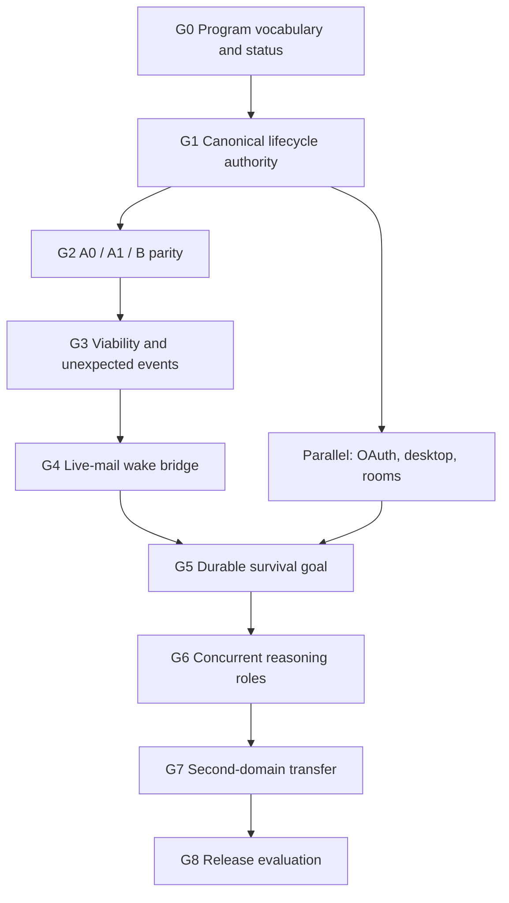

# Helix Environment Harness Work Program v1

Status: canonical program-control document.

Active program gate: **G8**

This document answers the operational question that the product and architecture
contracts intentionally do not:

> What gate are we working on now, what does it depend on, what work is allowed,
> and what evidence permits the program to advance?

It is the single current-status and dependency map for the environment harness.
Product scope and external claims remain governed by
`docs/architecture/casimirbot-environment-harness-product-goal-v1.md`.
Codex/Helix ownership, reasoning roles, reaction timescales and viability remain
governed by `docs/architecture/helix-environment-agent-reasoning-v1.md`.
Minecraft capability and execution contracts remain governed by
`docs/architecture/helix-minecraft-dual-plane-adapter-v1.md`. Dated audits are
immutable evidence snapshots; they never become the current overall status.

## Source-of-truth map

| Question | Sole authority |
| --- | --- |
| What product are we building and what may we claim externally? | `docs/architecture/casimirbot-environment-harness-product-goal-v1.md` |
| Who reasons, who governs, and which timescale owns a response? | `docs/architecture/helix-environment-agent-reasoning-v1.md` |
| What can the Minecraft World Authority and Player Embodiment planes do? | `docs/architecture/helix-minecraft-dual-plane-adapter-v1.md` |
| What gate is active, what is blocked, and what evidence advances the program? | this document |
| How is a lifecycle divergence diagnosed and verified? | `docs/helix-ask-readiness-debug-loop.md` and `docs/helix-ask-codex-loop-discipline.md` |
| What happened in one dated run or implementation increment? | the applicable immutable file under `docs/audits/` plus its exact artifacts |
| What must a repository agent declare and verify? | `AGENTS.md` |

An architecture document may explain dependency semantics but must link here
instead of maintaining another current roadmap. An audit may record the status
at capture time but must not be edited to follow later program progress.

## Program vocabulary

Use these terms literally. Do not use `agent`, `lane`, `success`, or `accepted`
without the qualifier that identifies the actual contract.

| Term | Precise meaning |
| --- | --- |
| Development work packet | A bounded repository task assigned to a Codex development agent. |
| Runtime reasoning role | Perception, prospective planning, execution, or verification. |
| Fabric execution lane | A deterministic concurrent movement, camera, safety, hand, world, or inventory lane. |
| Capability route | A provider-visible family through which a typed operation is requested. |
| Background wake job | Event coalescing that wakes semantic reasoning; it is not another mind or an answer. |
| Lifecycle stage | Request, admission, execution, normalization, re-entry, reasoning, materialization, terminal authority, or presentation. |
| Reaction timescale | Tick reflex, short semantic replanning, or durable planning. |
| Capability maturity | One of the seven ordered maturity terms below. |
| Action success | The admitted operation met its declared postconditions. |
| Viability preserved | The subject remains able to continue safely observing and acting. |
| Goal progress | A durable milestone advanced and that advancement was verified. |
| Turn completion | Codex completed its current reasoning turn. |
| Terminal eligibility | Helix verified that the selected candidate may be projected. |
| Resident closed-loop capability | A versioned local controller that continuously observes and may select or propose only pre-admitted bounded responses while Codex is delayed or reasoning; every effect still passes through the trusted local arbiter and environment action lane. Minecraft's concrete action lane is Fabric. |
| Resident controller profile | The exact implementation, sensor schema, artifact hash, deadlines, proposal vocabulary, confidence/abstention policy, and reset behavior allowed for one environment. |
| Resident decision | A causal record linking an observation revision to a controller proposal, arbiter outcome, effect, postcondition, interruption, abstention, or semantic escalation. |
| Environment embodiment | The exact actor through which an admitted controller acts. `player_proxy` uses the selected user's player body; `companion_entity` uses a separate bounded in-world actor. Actor, authority subject, owner, and beneficiary identities must never be inferred to be the same. |

### Capability maturity vocabulary

The only maturity terms allowed in the canonical capability-status table are:

1. `projected`
2. `specified`
3. `implemented`
4. `deterministically verified`
5. `live accepted`
6. `integrated accepted`
7. `release-ready`

Maturity belongs to an exact capability and acceptance surface. It must never be
inferred from a broader phrase such as “the guardian passed” or “Minecraft is
accepted.” A higher maturity claim requires an evidence reference in the table.

### Reaction requirements

Each environment adapter declares the fastest reaction it requires. This is a
control requirement, not a claim that every adapter needs a learned policy:

| Requirement | Meaning | Example |
| --- | --- | --- |
| `none` | No resident controller is required; ordinary request/observation turns are sufficient. | Static document |
| `monitor_only` | Local change detection and cancellation may run, but no resident effect is activated. | Browser workflow |
| `bounded_reflex` | A local controller may select or activate pre-admitted bounded responses under a deadline. | Server circuit breaker, DAW transport guard |
| `continuous_control` | A local controller must sense and maintain bounded control while Codex is delayed. | Minecraft guardian, robot balance controller |

The reaction requirement does not grant authority. Identity, leases, effect
ceilings, manual override, Emergency Stop, provenance, and terminal eligibility
remain governed boundaries.

### One governed protocol, environment-specific profiles

The canonical scaling rule is:

> **One generic governed resident-controller protocol -> unique versioned
> controller profiles for each environment and capability.**

The shared protocol defines profile identity and artifact integrity, authority
leases, observation revisions and freshness, deadlines, a finite proposal or
response vocabulary, abstention and escalation, trusted-arbiter admission,
causal receipts, postconditions, interruption, reset, manual override and
Emergency Stop. It is the stable connection between Runtime Codex and
tick-sensitive or deadline-sensitive local code.

An environment profile supplies only its domain semantics: typed sensors and
state, native timing model, permitted responses, resource locks, consequence
policy, effect ceilings and verification criteria. Minecraft combat, Minecraft
survival, a brokerage market observer and a brokerage live-risk supervisor are
therefore distinct profiles behind the same protocol. A profile cannot inherit
another environment's action vocabulary or authority merely because both use
the shared protocol. An adapter that needs only `none` or `monitor_only` may
implement the same lifecycle without admitting any resident mutation.

### Codex and resident-controller roles

The harness has three distinct Codex/controller roles:

| Role | Can do | Cannot do |
| --- | --- | --- |
| Development Codex | Modify contracts, server/companion code, tests, training harnesses, documentation, and evaluation workflows. | Invent live authority, accept external licenses, or claim live acceptance without evidence. |
| Runtime Codex | Choose an admitted resident profile, author a finite response repertoire, set escalation/completion conditions, interpret summaries, replan, and explain results. | Process every tick, maintain continuous key state, or serve as the millisecond reflex. |
| Resident controller | Continuously sense, maintain bounded local state, select or propose pre-admitted responses, request control release, and emit compact causal evidence. | Execute effects directly, set the durable goal, expand permissions, invent actions, write answers, or bypass the execution arbiter. |

Codex can coordinate the entire engineering and evaluation program in bounded
work packets. Runtime operation still requires compiled local control code.

## Dependency order



The ordering protects causality. More event producers, background wakes, or
reasoning roles would amplify lifecycle contradictions if projections can still
overrule current-turn execution and re-entry facts.

## Program gates

| Gate | State | Depends on | Closure evidence | Downstream gate unlocked |
| --- | --- | --- | --- | --- |
| G0 — Program vocabulary and status | closed | none | this document, canonical backlinks, required task header, and `npm run helix:environment-harness:docs-audit` | G1 |
| G1 — Canonical lifecycle authority | closed | G0 | `docs/audits/helix-environment-harness-g1-closure-audit-2026-08-20.md` | G2 |
| G2 — A0 / A1 / B parity | closed | G1 | `docs/audits/helix-environment-harness-g2-closure-audit-2026-08-20.md` | G3 |
| G3 — Viability and unexpected events | closed | G2 | `docs/audits/helix-environment-harness-g3-closure-audit-2026-08-21.md` | G4 |
| G4 — Live-mail wake bridge | closed | G3 | `docs/audits/helix-environment-harness-g4-closure-audit-2026-08-22.md` | G5 |
| G5 — Durable survival goal | closed | G4 and converged OAuth/desktop/room identity lane | `docs/audits/helix-environment-harness-g5-closure-audit-2026-08-23.md` | G6 |
| G6 — Concurrent reasoning roles | closed | G5 | `docs/audits/helix-environment-harness-g6-closure-audit-2026-08-23.md` | G7 |
| G7 — Second-domain transfer | closed | G6 | `docs/audits/helix-environment-harness-g7-closure-audit-2026-08-24.md` | G8 |
| G8 — Environment-harness release evaluation | active | G7 | one installed-node release packet demonstrates cross-surface lifecycle convergence, credential separation, recovery, and representative post-G7 integration without weakening G1–G7 | release-ready evaluation |

Exactly one gate is active. A blocked gate may receive design clarification but
must not receive runtime implementation that assumes its prerequisites passed.

## Canonical capability status

The status is capability-specific. Evidence paths identify the exact accepted
or verified surface; nearby capabilities do not inherit the maturity.

| Capability or component | Current maturity | Evidence | Open requirement |
| --- | --- | --- | --- |
| Environment-harness product and authority architecture | specified | `docs/architecture/casimirbot-environment-harness-product-goal-v1.md`; `docs/architecture/helix-environment-agent-reasoning-v1.md` | Advance through the gated program below. |
| Keyed natural water-bucket rescue benchmark | live accepted | `artifacts/helix-minecraft-guardian-v0.4/keyed-helix/water-bucket-rescue/attempt-34-balanced-clear-screen/guardian_water_bucket_rescue`; `docs/architecture/helix-environment-agent-reasoning-v1.md` | Retain unchanged as a regression; it does not accept other guardian or fluid workflows. |
| Direct Fabric water-bucket rescue feasibility | live accepted | `artifacts/helix-minecraft-guardian-v0.4/direct-codex/water-bucket-rescue/attempt-4-dynamic-collision-success.json`; `docs/architecture/helix-environment-agent-reasoning-v1.md` | Use as a feasibility oracle, not a hardcoded strategy. |
| Canonical lifecycle authority and poisoned-projection resistance | live accepted | `docs/audits/helix-environment-harness-g1-closure-audit-2026-08-20.md`; `server/services/helix-ask/runtime/turn-lifecycle-differential-audit.ts` | Retain the keyed natural tool turn and poisoned-projection battery as G2+ regressions. |
| Fabric fluid sequence 0.3 through A0 direct, A1 Codex-through-MCP, and B keyed Helix | integrated accepted | `docs/audits/helix-environment-harness-g2-closure-audit-2026-08-20.md`; `docs/audits/helix-environment-harness-g2-a0-b-partial-audit-2026-08-20.md` | Preserve the exact tripath hashes as a regression while G3 tests persistent viability and unexpected events. |
| G2 A0/A1/B differential parity observer | live accepted | `server/services/environment-connectors/actions/workflow-g2-parity-audit.ts`; `docs/audits/helix-environment-harness-g2-closure-audit-2026-08-20.md` | Retain observer-only semantics and fail with the first divergent lifecycle stage on future parity regressions. |
| Pre-action unavailable-inventory cancellation | live accepted | `artifacts/helix-minecraft-guardian-v0.4/keyed-helix/unexpected-event/attempt-37-focused-source-projection/guardian_unavailable_inventory_replan`; `docs/architecture/helix-environment-agent-reasoning-v1.md` | Does not prove mid-execution unexpected-event breadth. |
| Mid-execution health interruption contract | implemented | `artifacts/helix-minecraft-guardian-v0.4/keyed-helix/unexpected-event/attempt-46-safe-interrupt-terminal/guardian_mid_execution_health_interrupt`; `docs/architecture/helix-environment-agent-reasoning-v1.md` | Preserve exact child measurements; the accepted keyed lava trace used an entry health gate and does not independently promote this capability. |
| Persistent viability across model-deliberation gaps | live accepted | `docs/audits/helix-environment-harness-g3-closure-audit-2026-08-21.md`; `artifacts/g3-persistent-viability/g3-keyed-fire-program-live-036.json` | Retain water, fall, fire/lava, unexpected-event, manual-override, Emergency Stop, exact-evidence, and Codex-reentry journeys as regressions. |
| Generic resident closed-loop capability contract | specified | `docs/architecture/helix-environment-agent-reasoning-v1.md`; `docs/architecture/helix-minecraft-dual-plane-adapter-v1.md` | Reserve causal fields in G1; extract the provider-neutral contract only after G3. |
| Minecraft deterministic resident guardian baseline | live accepted | `docs/audits/helix-environment-harness-g3-closure-audit-2026-08-21.md`; `artifacts/g3-persistent-viability/g3-keyed-fire-program-live-036.json` | Preserve the bounded accepted surface; broader hazards and continuously evaluated health interruption require their own evidence. |
| Optional Minecraft companion-entity embodiment | projected | `docs/architecture/helix-minecraft-companion-embodiment-v1.md`; `docs/architecture/helix-minecraft-dual-plane-adapter-v1.md`; `docs/work-packets/eh-mc-companion-survival-party-v1.md`; `docs/research/helix-minecraft-environment-adapter-reference-prompt.md` | Specify and implement only after the deterministic guardian passes G3 and EH-RCC1/EH-RCC2 preserve its accepted behavior; prove follow-only EH-RCC3 before separately admitting inventory or survival interaction. |
| Learned resident policies and FlyWire profile | projected | `docs/helix-environment-harness-work-program-v1.md` | Shadow-evaluate only after the deterministic baseline and generic contract pass. |
| Live-mail Minecraft wake bridge | live accepted | `docs/audits/helix-environment-harness-g4-closure-audit-2026-08-22.md`; `artifacts/helix-environment-g4-live-2026-08-22-deterministic/helix-minecraft-player-ask-5a72c8a7-4dc7-4546-bf88-15c41a66700f.json` | Preserve exact source identity, deterministic-only preprocessing, deduplication, re-entry, and terminal continuity as G5+ regressions. |
| Durable Minecraft goal lifecycle | integrated accepted | `docs/audits/helix-environment-harness-g5-closure-audit-2026-08-23.md`; `artifacts/g5-durable-survival-goal/owner-natural-progress-report-final.json`; `artifacts/g5-durable-survival-goal/second-participant-natural-progress-report-authorized.json` | Preserve hash-linked recovery, semantic-wake consumption, exact evidence re-entry, read-only participant continuation, and no-action reporting as G6+ regressions. |
| Durable all-advancements survival goal | specified | `docs/architecture/helix-environment-agent-reasoning-v1.md` | Prove checkpointed progress and recovery in G5. |
| Concurrent runtime reasoning roles | integrated accepted | `docs/audits/helix-environment-harness-g6-closure-audit-2026-08-23.md`; `artifacts/g6-concurrent-environment-reasoning/a1-live-latest.json`; `artifacts/g6-concurrent-environment-reasoning/keyed-natural-ask-ask_g6-keyed-natural-1787531751670.json` | Preserve exact revision identity, stale rejection, one-arbiter execution/result linkage, evidence re-entry, provider-neutral itinerary completion, and single-writer parity as G7+ regressions. |
| Second-domain harness transfer | integrated accepted | `docs/work-packets/eh-g7-robinhood-shadow-observation-transfer-v1.md`; `docs/audits/helix-environment-harness-g7-closure-audit-2026-08-24.md`; `artifacts/g7-second-domain-transfer/live-tripath-acceptance-2026-08-24.json` | Preserve the owner-private read-only Robinhood tripath, exact Ask evidence re-entry, terminal continuity, zero mutation authority, and secret exclusion as G8 regressions. |
| User profile connection broker — Robinhood read slice | deterministically verified | `docs/work-packets/eh-g8-installed-profile-connection-broker-v1.md`; `server/routes/__tests__/brokerage-connections.test.ts`; `client/src/components/workstation/__tests__/BrokerageConnectionsCard.spec.tsx`; `client/src/components/helix/ask-console/shared-live-room/__tests__/SharedLiveRoomBrokerageBindingsPanel.spec.tsx`; `apps/desktop/scripts/smoke-service-boundary.mjs` | Extend through trusted native model-provider enrollment, generic opaque handles, authorized multi-member room grants, and live installed-node acceptance without exposing raw secrets or enabling brokerage mutation for users. |
| EXE-first subscription and provider-access broker | deterministically verified | `docs/work-packets/eh-g8-exe-first-subscription-provider-broker-v1.md`; `docs/work-packets/eh-g8-spb3-auth0-mfa-step-up-v1.md`; `docs/work-packets/eh-g8-spb4-stripe-sandbox-entitlement-ledger-v1.md`; `docs/evidence/eh-g8-spb4-stripe-sandbox-entitlement-ledger-v1/2026-08-28-deterministic-acceptance.json`; `apps/desktop/src/provider-credential-broker.ts`; `shared/helix-billing-entitlement.ts`; `shared/helix-installed-account-services.ts`; `client/src/components/workstation/InstalledServicesPanel.tsx`; `server/routes/stripe-sandbox-webhook.ts`; `server/routes/installed-account-services.ts`; `tests/desktop-provider-credential-broker.spec.ts`; `docs/work-packets/eh-g8-installed-profile-connection-broker-v1.md`; `docs/helix-ask-codex-authentication-contract-v1.md` | SPB-0 through SPB-2 are complete at deterministic maturity. SPB-3 Auth0 MFA and fresh step-up is live accepted on one installed Windows node. SPB-4 Stripe sandbox payment and entitlement ledger is active at deterministic maturity: the signed raw-body webhook, exact Checkout and Billing Portal step-up, opaque server-only customer custody, ordered subscription transitions, delta-based cumulative partial refunds, immutable finite-cap ledger, restart persistence, sanitized native projection, 10-file/55-test coverage, hash-bound integrated acceptance evidence, and production builds pass. Live acceptance still requires hosted sandbox configuration and one owner-attended purchase/Portal-cancel/refund trace; the Casimir Stripe secret must never be packaged into the EXE. Production charging, provider traffic, and agent billing authority remain absent. Managed and user-owned providers, public MCP grants, live RTP acceptance, and a signed pilot remain ordered prerequisites. No subscription, provider connection, ordinary account-panel refresh, or Codex login implies MFA or billable authority. |
| Public-user UI agent catalog and MCP discovery | deterministically verified | `docs/work-packets/eh-g8-public-ui-agent-affordance-manifest-v1.md`; `shared/__tests__/helix-public-ui-control-inventory.test.ts`; `server/__tests__/helix.public-ui-capability-audit.test.ts`; `server/mcp/__tests__/helix-mcp-public-ui-catalog.test.ts` | Preserve the generated 398-control public-only catalog, the 42-capability policy projection, fail-closed binding audit, OAuth read scope, and nonterminal flags. Two feature-gated room controls are route-bound to shared `room.floor.acquire` and exact-epoch `room.floor.release`; the other 101 room controls remain blocked. Live installed-client catalog refresh and browser-visible parity remain G8 evidence; `client_local` and `blocked_pending_contract` controls gain no execution authority from discovery. |
| Shared Live Room semantic MCP configuration | deterministically verified | `docs/work-packets/eh-g8-shared-live-room-mcp-configuration-v1.md`; `docs/helix-ask/workstation-tool-contracts/shared-live-room-control.md`; `server/services/shared-live-room-control/service.ts`; `server/services/shared-live-room-control/__tests__/mcp-delegation-verifier.test.ts`; `server/mcp/__tests__/helix-mcp-room-delegated-configuration.test.ts` | Authority-reducing consent revoke and exact-epoch floor inspect/release share browser/domain handlers. Authority-increasing own-consent grant and bounded floor acquire require a distinct-audience, exact-client/thread/session/room/input-bound Ed25519 delegation with durable one-use replay consumption. Ordinary MCP fails closed until a trusted native signer and server-injected conversation binding are attached. Invites, provider binding, media, visual capture, and leave/close retain their separate secure-delivery, native-host, or consequential-confirmation prerequisites. |
| Robinhood deterministic market-observer resident profile | live accepted | `docs/work-packets/eh-g8-robinhood-resident-observer-v1.md`; installed monitor `environment_monitor:9b046d52-86a4-4659-84ee-ff0693b16f52`; `shared/trading/brokerage-market-observer.ts`; `server/services/trading/brokerage-market-observer.ts`; `server/services/environment-connectors/brokerage/brokerage-resident-bootstrap.ts`; `server/services/environment-connectors/monitoring/brokerage-market-observer-semantic-source.ts`; focused observer/monitor/bootstrap/canary batteries | Preserve installed material delivery, acknowledgement, restart/reconnect, exact replay deduplication, stale-epoch rejection, simulated cleanup and revocation as G8 regressions. No provider mutation may enter the profile vocabulary; this maturity does not transfer to the attended live-risk supervisor. |
| Brokerage reactive simulated-execution resident profile | deterministically verified | `docs/work-packets/eh-g8-brokerage-reactive-simulation-controller-v1.md`; `docs/architecture/helix-robinhood-brokerage-environment-v1.md`; `shared/trading/brokerage-reactive-simulation.ts`; `shared/trading/brokerage-reactive-controller.ts`; `shared/trading/brokerage-reactive-live-shadow.ts`; `server/services/trading/brokerage-reactive-simulation-arbiter.ts`; `server/services/trading/brokerage-reactive-controller-store.ts`; `server/services/trading/brokerage-reactive-live-shadow-store.ts`; `server/services/trading/brokerage-reactive-live-shadow-evidence-store.ts`; `server/services/trading/paper-execution-store.ts`; `server/db/migrations/068_paper_reactive_partial_fills.ts`; `server/db/migrations/069_brokerage_reactive_controller_runs.ts`; `server/db/migrations/071_brokerage_reactive_live_shadow.ts`; `server/db/migrations/072_brokerage_reactive_shadow_acceptance.ts`; `fixtures/brokerage-reactive-simulation/spy-no-lookahead.v1.json`; focused R0–R3 deterministic battery, including the 5-case authenticated brokerage route suite; Casimir adapter runs `2559` for R2, `2561` for the polling bridge and `2563` for the evidence archive | R0 through R2 are deterministically verified and the R3 finite owner-private polling bridge is implemented with deterministic timing, source-gap, restart-recovery and hash-bound multi-session qualification evidence. Qualification requires complete identity-matched regular-hours observations on at least two market dates and cannot update canonical maturity itself. The keyed installed node loaded migrations `071` and `072`; however owner-authenticated read acceptance and schema-only MCP contract preflight continued to return typed temporary provider unavailability across three goal continuations while the connection/binding remained active and mutation authority remained absent. No R3 receipt was fabricated and no provider mutation occurred. Installed polling with real read observations across multiple regular-hours sessions remains required before R3 live acceptance; resume when the provider read surface is available during regular hours. R4 semantic re-entry and R5 cross-surface acceptance retain their ordered prerequisites. |
| Robinhood attended tiny-live cash-equity path | implemented | `docs/work-packets/eh-g8-robinhood-attended-tiny-live-qualification-v1.md`; `shared/trading/live-execution-contract.ts`; `server/routes/__tests__/brokerage-connections.test.ts`; focused 42-test safety and provider-contract battery | Complete installed real-account read/provider-contract acceptance, attended supervisor and dead-man trace, then stop for exact per-order user approval before the one-entry/one-protective-exit canary. The approximately $200 allocation is an account ceiling, never order authority. |
| Installed multi-surface harness convergence | specified | `docs/architecture/casimirbot-environment-harness-product-goal-v1.md`; `apps/desktop/README.md`; `docs/work-packets/eh-mc-combat-awareness-arena-ladder-v1.md` | G8 must package one self-starting CasimirBot node whose desktop UI and authenticated MCP clients project the same durable runs and evidence while provider, MCP-client, and connector credentials remain separate and outside model context. The 2026-08-28 installed EXE tunnel was healthy and ready, but its intentionally read-only coordination/Device Check surface exposed no source-pairing or Player Embodiment tools to the active Codex task. Preserve that least-authority default while adding an explicit profile-owned developer full-MCP connection with managed catalog synchronization; tunnel readiness alone must never imply environment action readiness. |
| Installed-node agent presence, advisory relay, and restart coordination | live accepted | `docs/work-packets/eh-g8-shared-room-multi-host-capability-federation-v1.md`; `docs/work-packets/eh-g8-local-supervisor-restart-coordination-v1.md`; `docs/work-packets/eh-g8-local-supervisor-mcp-coordination-v1.md`; `shared/helix-local-supervisor-coordination.ts`; focused 122-test supervisor/MCP/route/action-lease battery plus the 2026-08-29 installed-node two-client trace | Preserve exact service-epoch/profile/OAuth-client/client-declared-thread identity, server-derived client sessions, one shared browser/MCP store, registered-client read admission, explicitly declared objective status, server-verified room/environment/run/action-lease claim provenance, inert advisory relay, derived non-executing recommendations, complete handoff/acknowledgement/release clearance, active-client and relay bounds, dynamic affected-client acknowledgement, owner-only approval, verified retained-runtime and mutation-lease drain, fail-closed timeout, one-use trusted-supervisor completion, new service epoch, and reconnect/grant revalidation. The repository rejects the legacy launcher boolean and verifies only a short-lived Ed25519 receipt bound to the opaque workspace and boot epoch. The current installed-node trace proved one service epoch, two distinct client sessions, reconnect stability, 16/16 concurrent heartbeats, target-only acknowledgement, inert command-like relay, advisory handoff/release, disconnect clearance, wrong-continuation denial, and exact two-scope OAuth repair; deterministic evidence supplies wrong-profile and verified-resource cases. No browser, MCP client, relay, vote, or model output receives process authority. |
| Bounded installed-node and room advisory fan-out | deterministically verified | `docs/work-packets/eh-g8-shared-room-multi-host-capability-federation-v1.md`; `shared/helix-local-supervisor-advisory.ts`; `server/services/local-supervisor/local-supervisor-advisory-fanout.ts`; `server/services/local-supervisor/__tests__/local-supervisor-advisory-fanout.test.ts` | Preserve server-resolved service-epoch/room audiences, immutable initial recipient snapshots, exact per-recipient inbox and acknowledgement identity, reconnect and separately governed late attach, TTL/replay/history/recipient bounds, cross-node room isolation and owner-declared resource guidance. Deterministic maturity does not publish a live broadcast tool, measure ambient resources, wake closed tasks, alter goals, vote on or execute restarts, grant process authority, or establish M3-R live same-device or M3-X live cross-device delivery. |
| Profile-native MCP authorization and managed recovery | specified | `docs/architecture/casimirbot-environment-harness-product-goal-v1.md`; `docs/work-packets/eh-g8-installed-profile-connection-broker-v1.md`; `docs/work-packets/eh-mc-nether1-n0-controlled-course-fixture-v1.md`; `docs/work-packets/eh-mc-nether1-perception-parity-v1.md`; `docs/work-packets/eh-mc-combat-awareness-arena-ladder-v1.md`; `docs/helix-environment-harness-work-program-v1.md` | The deterministic Auth0 browser-session slice now resolves the already-linked MCP profile and sets only an HttpOnly Casimir session cookie; focused tests and the compiled client pass. The 2026-08-25 perception-parity run reproduced that an admitted new MCP capability remained absent from one active Codex task after both server reconnect and a later task turn. A bounded actor-status compatibility projection now returns the typed perception snapshot to that unrestarted task while explicitly preserving `catalog_refresh_required=true`; this is continuity mitigation, not catalog convergence or dedicated-tool discovery. The 2026-08-28 installed EXE tunnel handoff further proved that a healthy app-private tunnel does not attach or refresh a full Helix MCP catalog when it is scoped only to coordination and Device Check. Live exact-callback/profile/room convergence, branded consent, OS-protected renewal, an explicit least-authority full-MCP connection, managed MCP reconnect/catalog resynchronization, durable one-instance supervision, revocation and recovery remain required. This is a G8 release blocker. |
| Profile-scoped semantic MCP monitoring and Codex task wake | deterministically verified | `docs/work-packets/eh-g8-profile-semantic-mcp-monitor-v1.md`; `reports/helix-minecraft/g8-m3-external-codex-monitor-continuity-20260825.json`; `shared/helix-client-authorization-readiness.ts`; `server/mcp/__tests__/helix-mcp-environment-monitor.test.ts`; `server/services/environment-connectors/monitoring/__tests__/environment-monitor-store.test.ts`; `docs/architecture/casimirbot-environment-harness-product-goal-v1.md`; `docs/architecture/helix-environment-agent-reasoning-v1.md`; `docs/architecture/helix-minecraft-dual-plane-adapter-v1.md` | The 2026-08-25 bounded installed-node trace repaired the exact Auth0 permission, proved the four-scope readiness projection, semantic delivery, a 264 ms fresh actor snapshot, cursor acknowledgement, bounded typed recovery, fresh-process reconnect without duplicate wake/effect, revocation and post-revocation `lease_inactive`. Complete the remaining M3 release evidence inside the unknown-world Nether course: operator-visible material replanning through the accepted arbiter, portal entry, safe-return-point evidence and cross-surface agreement. Native closed-task wake remains unsupported until the client supplies a continuation transport. |
| Operator-visible Codex steering and action-reaction fidelity | specified | `docs/helix-environment-harness-work-program-v1.md`; `docs/work-packets/eh-g8-profile-semantic-mcp-monitor-v1.md`; `docs/work-packets/eh-mc-nether1-responsive-action-reaction-sensing-v1.md`; `docs/work-packets/eh-mc-nether1-perception-parity-v1.md`; `docs/architecture/casimirbot-environment-harness-product-goal-v1.md` | Prove a bounded, evidence-linked sense-decide-act-observe loop in which an authenticated Codex task receives every admitted material change and action receipt needed for the next decision, the operator can inspect the same ordered trace, latency and gap states are explicit, and neither surface receives raw tick spam, credentials, hidden reasoning, or a second mutation authority. This is required before the full Nether journey is used as G8 release evidence. |
| Minecraft tactical perception parity | specified | `docs/work-packets/eh-mc-nether1-perception-parity-v1.md`; `server/mcp/__tests__/helix-mcp-minecraft-action.test.ts`; `server/mcp/__tests__/helix-mcp-environment-monitor.test.ts`; `shared/__tests__/helix-minecraft-perception-benchmark.spec.ts`; `minecraft/helix-fabric-sensor/src/test/java/com/casimirbot/helixsensor/fabric/FabricManifestContractTest.java` | The typed MCP reads, bounded snapshot, actor-status catalog-compatibility projection, consecutive-change monitor projection, semantic action idempotency and deterministic critical-hazard benchmark are implementation prerequisites only. The unrestarted-task compatibility call is live-proven, but the Minecraft client was rejected by the dedicated server with `Invalid session`, so no P3/P4 gameplay evidence was produced. Keep this capability `specified` until the screenshot/human ground-truth record and authenticated `keepInventory=false` Survival course prove the packet thresholds, explicit unknowns, latency, zero duplicate effects and safe control release. |
| Responsive Player Embodiment sensing and consecutive native mining | deterministically verified | `docs/work-packets/eh-mc-nether1-responsive-action-reaction-sensing-v1.md`; `reports/helix-minecraft/nether1-responsive-stone-sequence-a0.json`; `minecraft/helix-fabric-player-agent/src/test/java/com/casimirbot/helixplayer/fabric/PlayerSensorFrameTest.java`; `minecraft/helix-fabric-player-agent/src/test/java/com/casimirbot/helixplayer/fabric/MiningTargetAffordanceTest.java`; `minecraft/helix-fabric-player-agent/src/test/java/com/casimirbot/helixplayer/fabric/ConcurrentReactiveSchedulerTest.java` | Preserve the 4 ms p95 tick budget, exact frame identity, typed bounded failures, same-tick handoff, postcondition verification, and control release while completing the remaining N0 compositions and keyed A1/B parity. |
| Optional Baritone v1.15.0 movement-only navigation | deterministically verified | `docs/work-packets/eh-mc-baritone-v1.15.0-compatibility-license-v1.md`; `reports/helix-minecraft/nether1-baritone-movement-only-a0.json`; `minecraft/helix-fabric-player-agent/src/test/java/com/casimirbot/helixplayer/fabric/BaritoneFacadeTest.java` | Preserve the public-API-only settings lease, pre-existing-task rejection, policy-drift cancellation, safe restoration, exact artifact pin, zero mutation effects, and native fallback independence. This does not promote the Nether objective or admit Baritone mining/building/inventory behavior. |
| N0 controlled-course fixture planner | implemented | `docs/work-packets/eh-mc-nether1-n0-controlled-course-fixture-v1.md`; `scripts/fixtures/minecraft-nether1-n0-course-v1.json`; `scripts/helix-minecraft-nether1-n0-course-plan.ts`; `server/__tests__/minecraft-nether1-n0-course-plan.test.ts` | Preserve exact server/dimension/player/origin/snapshot binding, credential-free non-execution, origin-relative compositions, setup-receipt ineligibility, World Authority release before the course, and snapshot restoration before N1–N4. The account mismatch is now repaired deterministically by the Auth0 profile-session convergence slice; require its live exact-callback proof to project room `1ac9...` before snapshot or authority creation. Live setup, verification, release and restoration receipts remain required for promotion. |
| Legitimate durable Nether entry | specified | `docs/work-packets/eh-mc-nether1-legitimate-nether-entry-v1.md`; `docs/work-packets/eh-mc-nether1-responsive-action-reaction-sensing-v1.md` | After G7, progress from a controlled survival capability course through responsive sensing/consecutive-action verification, direct-Codex/keyed-Helix parity, and one unknown-world recorded portal-entry and safe-return-point demonstration. |

## Closed gate: G1 canonical lifecycle authority

### Problem statement

The current runtime can carry more than one lifecycle snapshot, select between
them with a completeness score, and fall back to compatibility projections for
re-entry. Later typed-failure reconciliation mutates several mirrored summaries,
while the lifecycle differential audit observes contradictions after terminal
materialization. This permits a stale derived rail to relabel an executed call,
drop a re-entered observation, force a retry, or replace a supported Codex
candidate.

G1 makes current-turn facts monotonic and gives them one authority. It does not
weaken Helix identity, permission, provenance, freshness, scientific evidence,
route-authority, or terminal-eligibility boundaries.

### Work permitted

- Establish one append-only authoritative lifecycle fact stream with exact turn,
  route, call, occurrence, capability, observation, candidate, and terminal
  identities.
- Reserve generic causal references sufficient to express
  `observation → resident decision → arbiter outcome → effect → postcondition → escalation`
  without introducing continuous controller traffic or a new runtime in G1.
- Make one reducer the source of execution, normalization, re-entry,
  post-observation completion, and terminal continuity facts.
- Convert rail tables, compatibility records, itinerary summaries, debug
  exports, UI products, and voice products into derived views with source event
  references and a lifecycle revision.
- Remove authoritative dependence on completeness scoring, array position,
  artifact aliases, copied booleans, or late mutation of mirrored records.
- Re-enter repairable evidence/terminal rejection into Codex with the exact
  failed invariant, evidence references, retryability, and available admitted
  repairs.
- Preserve hard fail-closed behavior for identity, permission, provenance,
  freshness, integrity, effect scope, scientific support, and exhausted bounded
  repair.
- Add poisoned-projection fixtures and direct-Codex/keyed-Helix first-divergence
  regressions from real failure traces.

### Explicit non-goals

- Do not broaden Minecraft capabilities or encode a successful gameplay script.
- Do not implement the live-mail wake bridge.
- Do not add a second Codex session or concurrent semantic reasoning role.
- Do not add a private Helix sampling, retry, tool-execution, or answer-writing
  loop.
- Do not grow `server/routes/agi.plan.ts`.
- Do not weaken identity, permission, provenance, freshness, scientific proof,
  route-product, or terminal-eligibility gates.

### Required evidence to close G1

1. One reducer-backed fact stream is authoritative for every current-turn
   execution and re-entry decision used by terminal authority.
2. A verified success cannot regress to unexecuted, unreentered, or missing in a
   later projection.
3. A supported provider candidate retains the same text hash and support refs
   through materialization, terminal selection, API, UI, and applicable voice
   presentation.
4. Every repairable rejection causes a bounded Codex continuation; every hard
   rejection exposes its exact invariant without substitute prose.
5. Poisoned compatibility, itinerary, rail, alias, ordering, and stale-revision
   fixtures cannot change the canonical result.
6. Earlier failed attempts remain provenance, while only a strictly later
   current-turn success for the same read/observe/verify subgoal can supersede
   their blocking effect.
7. Focused lifecycle/reducer, terminal-writer, and API parity tests pass.
8. The unchanged keyed rescue regression or an equivalently deep natural tool
   turn completes with `turn_lifecycle_differential_audit.ok=true` and matching
   terminal hashes. A direct reference run remains diagnostic evidence rather
   than Helix acceptance.

Resident-control causality is reserved here as a generic lifecycle relation;
implementing a persistent resident controller remains a G3 task.

Closure advances the active marker to G2 in this document. It does not silently
advance any capability maturity row; each row changes only with its own evidence.

G1 closed on 2026-08-20. Its exact closure evidence is recorded in
`docs/audits/helix-environment-harness-g1-closure-audit-2026-08-20.md`.

## Closed gate: G2 A0 / A1 / B parity

G2 ran equivalent-state direct Fabric, authenticated Codex-through-MCP, and
keyed Helix Ask traces against the same player/world fixture, authority
envelope, deterministic action program, and fluid micro-course. The observer
reported `ok=true`, no mismatches, and no first divergent stage. Exact closure
evidence is recorded in
`docs/audits/helix-environment-harness-g2-closure-audit-2026-08-20.md`.

G2 did not implement learned controllers, persistent cross-deliberation
viability, companion embodiment, live-mail wake control, durable goals, or
concurrent reasoning.

## Closed gate: G3 viability and unexpected events

G3 must prove that the deterministic Fabric guardian preserves player viability
while Codex is delayed, unavailable, or semantically replanning. The resident
loop must sense continuously without waking Codex every tick, admit only its
bounded repertoire, verify postconditions, compact meaningful deviations into
causal evidence, and release every asserted control on success, failure,
cancellation, manual override, lease loss, or Emergency Stop.

Representative acceptance must include water/submersion, fall or landing risk,
fire or comparable damage pressure, and an unexpected mid-execution event. A
single successful action is insufficient: the subject must remain able to
continue observing and acting after the local response, and the resulting
evidence must materially re-enter Codex for replanning.

G3 must not extract the provider-neutral resident-controller contract, add a
learned controller, turn live mail into a reflex path, add concurrent Codex
roles, or broaden companion embodiment. Those remain downstream workstreams.

G3 closed on 2026-08-21. Its exact closure evidence and bounded claim are
recorded in
`docs/audits/helix-environment-harness-g3-closure-audit-2026-08-21.md`.

## Closed gate: G4 live-mail wake bridge

G4 connects meaningful environment changes to the existing sequential Runtime
Codex solver. A background wake job may coalesce and deduplicate resident or
environment events, preserve their exact source, subject, observation revision,
causal references, and freshness, and re-enter them as nonterminal evidence.

G4 must prove that one semantic change can wake Codex, materially affect the
next plan, and remain consistent across Ask and applicable live presentation.
Repeated equivalent events must coalesce; stale, wrong-room, wrong-subject, or
unbound events must fail with an exact typed reason. The wake path must preserve
G1 canonical lifecycle authority and the G3 local-control boundary.

G4 must not process Minecraft ticks, activate resident effects, become a second
reasoning role, write or replace an answer, loosen source identity, implement a
durable goal, or grow `server/routes/agi.plan.ts`.

G4 closed on 2026-08-22. Its accepted post-repair journey used deterministic
mail preprocessing only, re-entered the exact processed packet through the
existing sequential Runtime Codex solver, materially revised the next plan,
performed no Minecraft action, and retained clean single-writer terminal and
lifecycle-projection audits. Exact evidence is recorded in
`docs/audits/helix-environment-harness-g4-closure-audit-2026-08-22.md`.

## Closed gate: G5 durable survival goal

G5 implements one durable Minecraft survival objective whose verified progress
survives individual Ask turns, disconnect, death, process restart, and an
authorized continuation from another supported device or room participant.
The durable record must bind account, host, room, participant, selected player,
environment source, world, connector epoch, authority lease, current milestone,
completed and incomplete postconditions, attempt history, and exact evidence
references.

Runtime Codex owns milestone strategy, retry, recovery, and replanning. Helix
owns durable identity, checkpoint integrity, capability admission, provenance,
and terminal eligibility. Fabric retains tick-scale viability. G5 must consume
the accepted G4 semantic wake as evidence; it must not convert live mail into a
reflex path, add concurrent reasoning roles, make checkpoint projections answer
authority, or extract a generic resident-controller contract.

G5 closed on 2026-08-23. The accepted keyed journey retained one revision-19
goal across semantic-wake replanning and successor-epoch recovery, verified
restored viable control, and projected the completed ledger through Runtime
Codex without executing a new game action. An owner turn and an explicitly
read-authorized second room participant both reconstructed the same canonical
goal with clean lifecycle, poison, and presentation audits. Exact evidence is
recorded in
`docs/audits/helix-environment-harness-g5-closure-audit-2026-08-23.md`.

## Closed gate: G6 concurrent reasoning roles

G6 may add revision-bound perception and prospective-planning roles around the
accepted sequential Runtime Codex path. These roles may prepare observations,
candidate plans, and invalidation signals, but they are not independent
Minecraft controllers and cannot execute effects, expand permissions, or write
terminal answers. One execution arbiter and one mutation authority remain.

G6 closes only when concurrently prepared outputs carry exact observation and
goal revisions, stale proposals are invalidated before execution, one admitted
proposal reaches the existing execution path, and its measured result re-enters
the principal Runtime Codex turn without lifecycle or presentation divergence.
The accepted G1–G5 journeys remain mandatory regressions.

The active implementation packet is
`docs/work-packets/eh-g6-concurrent-environment-reasoning-roles-v1.md`.
The deterministic implementation checkpoint is complete: exact shared schemas,
hash-linked storage, provider-native revision-identical role batches,
principal disposition, stale-aware one-proposal arbitration, automatic
execution/measured-result linkage, observer-only first-divergence audit, and
provider-neutral MCP/workstation facades are present. The implementation and
natural keyed acceptance are recorded in
`docs/audits/helix-environment-harness-g6-closure-audit-2026-08-23.md`. The
accepted turn preserves one principal solver, one execution arbiter, one
mutation authority, exact observation re-entry, and single-writer terminal
presentation.

## Closed gate: G7 second-domain transfer

G7 must transfer the accepted environment-harness lifecycle into one
deliberately contrasting environment without moving Minecraft-specific
mechanics, player strategy, Fabric assumptions, or game command semantics into
provider-neutral contracts.

The first G7 work packet must select the contrasting domain, declare its exact
identity, evidence, capability, authority, reaction-timescale, and acceptance
surface, and identify which G1–G6 contracts are reused unchanged. Design
clarification may compare Robinhood shadow observation or another non-mutating
environment, but runtime implementation must remain bounded to that declared
packet and must not weaken the accepted Minecraft regressions.

The selected packet is
`docs/work-packets/eh-g7-robinhood-shadow-observation-transfer-v1.md`. It uses
the existing developer-only Robinhood private-room read plane and explicitly
excludes provider UI automation, credentials, paper or live order mutation,
reviews, approvals, control arming, unattended observation, and financial
recommendation authority. The first implementation slice adds the same
nonterminal workstation/MCP observation path used by Runtime Codex while
retaining the existing brokerage adapter's owner, room, capability, producer
epoch, freshness, and redaction boundary. Deterministic verification is recorded
in `docs/audits/helix-environment-harness-g7-progress-audit-2026-08-23.md`.
The post-restart callable-MCP preflight is recorded in
`docs/audits/helix-environment-harness-g7-progress-audit-2026-08-24.md`.
G7 closed through
`docs/audits/helix-environment-harness-g7-closure-audit-2026-08-24.md`.
The authenticated principal used one clean owner-private room and the same
server-derived read binding across the reference, MCP, and keyed-Ask routes.
The Ask observation re-entered Runtime Codex and supported the selected terminal
candidate; all three routes retained zero order authority and secret exclusion.

## Active gate: G8 environment-harness release evaluation

G8 converges the accepted G1–G7 contracts into a release-evaluation surface. It
must preserve one canonical lifecycle and one effect authority across the
installed desktop, authenticated MCP clients, Helix Ask, Shared Live Rooms, and
representative environment journeys. Credential enrollment, storage, renewal,
and revocation must remain outside model context and separated by credential
class.

The first G8 packet must declare the exact installed-node acceptance surface,
recovery and one-instance supervision evidence, cross-surface run identity,
credential-boundary checks, and representative post-G7 integration journey.
The selected first packet is
`docs/work-packets/eh-g8-installed-profile-connection-broker-v1.md`. Its first
slice promotes the already encrypted, owner-private Robinhood read connection
to ordinary signed-in user profiles while retaining developer-only paper and
live mutation authority. It reserves, but does not yet claim, installed MCP
catalog convergence, multi-member sharing, signed-installer acceptance, or G8
closure. No broad mutation-authority expansion or release-ready claim is
permitted from this slice.

### G8 release blocker: profile-native authorization and managed recovery

The developer acceptance flow currently permits an operator to configure a
callback, run `codex mcp login`, approve scopes in Auth0, restart a client or
server when its cached catalog is stale, and use the opaque repository launcher.
That remains useful diagnostic infrastructure, but it is not an acceptable
ordinary-user onboarding or recovery design. G8 cannot become `release-ready`
while a user must understand CLI commands, callback ports, OAuth resource
parameters, process identifiers, keyed launchers, or application restart order.

The release experience must make one signed-in CasimirBot profile the owner of
its northbound client authorizations and environment/provider connections. The
Account panel must provide one guided, credential-free state machine:

```text
signed out
  -> profile signed in
  -> client connection offered
  -> least-scope consent requested
  -> authorization active
  -> MCP catalog synchronized
  -> environment connection enrolled
  -> optional room grant approved
  -> ready / degraded / action required / revoked
```

The implementation must satisfy all of the following before release:

1. **Profile ownership.** Every MCP client authorization, provider connection,
   environment connector, and room grant binds to the exact CasimirBot profile.
   Auth0 or another identity provider remains infrastructure; users encounter a
   branded CasimirBot sign-in rather than a developer-owned Auth0 workflow.
2. **Native consent.** The Account panel initiates OAuth Authorization Code with
   PKCE or an approved device flow, displays the exact requested capability
   families, and returns to a sanitized connection state. Normal users never run
   `codex mcp login`, edit `config.toml`, choose a callback port, or copy a token,
   pairing code, provider key, or authorization URL.
3. **Stable least-scope bundles.** Initial consent requests only the scopes for
   the selected product surface. A later capability expansion uses explicit
   incremental consent and explains the new authority without revoking unrelated
   profile connections or silently broadening a room member's grant.
4. **Protected renewal.** Refresh material and provider credentials remain under
   OS-protected native custody. Access-token renewal is automatic until expiry,
   revocation, account-policy change, or provider denial requires the user.
   Raw credentials remain absent from renderer state, chat, model context, MCP
   output, logs, debug exports, repository files, environment projections, and
   process arguments.
5. **Managed reconnect and catalog refresh.** A successful consent upgrade,
   server recovery, connector rotation, or token renewal causes a bounded MCP
   reconnect and authoritative tool-catalog re-enumeration. Existing tasks either
   adopt the refreshed client safely or receive one actionable reconnect state;
   the user is not asked to discover a client/server restart sequence.
6. **Durable one-instance supervision.** The installed node retains an
   authenticated instance identity and ownership receipt across desktop, service,
   and operating-system restarts. A healthy owned service is reused, a stale
   owned service is replaced safely, and an unknown listener fails closed with a
   user-facing recovery action. PID reuse, port occupancy, or model-visible
   command-line inspection never establishes ownership.
7. **Connector enrollment without secret relay.** Same-host Minecraft and other
   supported connectors use bounded opaque handoffs owned by the profile. The
   user may approve, revoke, or retry them from the Account panel without
   relaying pairing material to the agent. Remote connectors use an equivalent
   owner-mediated flow rather than a caller-selected filesystem path.
8. **Room grants remain references.** A Shared Live Room receives a revocable,
   capability-narrowed reference to a profile connection, never its credential.
   Members authenticate as themselves, and observation, Player Embodiment, World
   Authority, and higher-consequence mutations remain separately authorized.
9. **Actionable recovery.** Expired consent, missing scope, revoked connector,
   stale catalog, service crash, unknown port owner, wrong profile, and offline
   environment each map to one stable sanitized state, one owner-safe recovery
   action, and no retry loop that repeatedly asks for the same completed step.
10. **Revocation and cleanup.** Disconnecting the client, provider, environment,
    profile, or room grant invalidates only the corresponding authorization,
    releases active controls, removes derived grants, and proves that future
    reads and mutations fail closed.

Release evidence must include a clean external-user journey on a signed install:

```text
install
-> create or link profile
-> connect one supported Codex client from the Account panel
-> approve initial least scopes
-> enroll one environment connector without secret relay
-> use a fresh observation
-> add one explicitly explained scope
-> observe automatic reconnect and catalog refresh without app/server restart
-> grant and revoke one room-scoped capability
-> survive token renewal plus one service crash/restart
-> disconnect and prove subsequent access fails closed
```

The journey must retain exact profile, client, room, connector, environment,
source/world, credential-class, lifecycle, evidence, and revocation identities.
It must also prove secret exclusion, one mutation authority, control release,
bounded recovery time, and consistent status across the Account panel, MCP,
API, and Shared Live Room. Deterministic unit/UI/service tests are necessary but
do not replace this installed-node acceptance artifact.

Until this evidence exists, the profile-native authorization capability remains
`specified`, the opaque launcher remains developer-only, and G8 release closure
is prohibited.

### G8 release requirement: profile-scoped semantic MCP monitoring

G4 proved that deterministic live-mail preprocessing can coalesce one meaningful
Minecraft change, wake the sequential Runtime Codex solver, re-enter the exact
packet and preserve terminal continuity. G5 proved semantic-wake consumption by
a durable goal. Those accepted server-side paths do not by themselves prove that
an authenticated external Codex client can passively follow the same canonical
run. The current development MCP surface can request observations and inspect
durable state, but it does not yet establish a profile-owned subscription that
wakes the exact linked Codex task when the harness receives a meaningful change.

G8 must add that missing northbound monitoring contract without turning MCP into
the Minecraft credential, the raw 20 Hz sensor stream, a second planner or a
competing execution loop. The release surface must satisfy all of the following:

1. **Exact monitor identity.** A finite monitor lease binds the CasimirBot
   profile, authenticated MCP client, supported Codex task or continuation
   handle, durable `run_id`, room/member grant when applicable, environment,
   source/world, subject, connector epoch and policy revision. Proximity, the
   newest open task, a generic room, or a model-supplied identifier cannot infer
   the binding.
2. **Read-only event scope.** The lease declares admitted event families,
   maximum age, wake budget, expiry and revocation state. Monitoring grants no
   World Authority, Player Embodiment, workstation or terminal authority, and a
   room receives only a revocable narrowed reference to the profile connection.
3. **Resumable ordered cursor.** Codex consumes server-owned semantic event
   batches through a monotonic cursor with exact source event/snapshot refs,
   producer plane and epoch. Acknowledgement advances only that monitor; replay,
   reconnect and multi-surface observers cannot duplicate a physical effect or
   erase immutable evidence.
4. **Bounded semantic projection.** Raw tick frames remain in the connector and
   authoritative evidence ledger. Deterministic change detection, coalescing,
   deduplication and situation digests emit only meaningful hazards, deviations,
   workflow results, authority changes and durable-goal checkpoints. Load
   shedding or backpressure must retain an explicit gap marker and force a fresh
   snapshot instead of silently claiming continuity.
5. **One wake, no hidden reasoning.** One admitted event batch may request at
   most one wake of the exact linked task. A wake is only notice that evidence is
   available; it does not choose a strategy, execute a tool, write an answer,
   mirror hidden reasoning or create a second Runtime Codex solver.
6. **Fresh re-entry before action.** After waking, Codex must materialize the
   referenced event or digest, obtain a fresh subject snapshot when required,
   compare it with the durable goal revision and submit any new action through
   the existing single execution arbiter. Stale, wrong-task, wrong-room,
   wrong-world, superseded-epoch and revoked-lease events fail with stable typed
   reasons.
7. **Reconnect and recovery.** Client, service, connector and operating-system
   restarts resume from the last acknowledged cursor within a bounded window,
   report any retention gap, synchronize the MCP catalog when needed and never
   ask the user to discover a restart sequence. Expiry or revocation prevents
   later reads and wakes and releases any monitor-owned resources.
8. **Consistent projection.** Account, Device Check, MCP, API, Shared Live Room
   and applicable desktop presentation must agree on monitor state, freshness,
   blockers and the canonical `run_id`. A successful probe cannot coexist with
   an unexplained contradictory readiness state.

Release evidence must include one signed-install external-Codex journey:

```text
connect an authenticated Codex client from the profile
-> create a finite read-only monitor lease for one durable environment run
-> admit one bounded local guardian or workflow
-> receive one meaningful semantic event without raw tick projection
-> wake the exact linked task once
-> materialize the event and obtain the required fresh snapshot
-> let Codex materially replan through the existing execution arbiter
-> disconnect while a later event is retained
-> reconnect from the acknowledged cursor without duplicate wake or mutation
-> revoke the monitor and prove subsequent reads and wakes fail closed
```

The N0 controlled-course mechanics may continue with explicit MCP observation
calls while this contract is `specified`. The N1–N4 unknown-world Nether
journey may not serve as integrated G8 evidence until the minimal monitor lease,
semantic wake, fresh re-entry and reconnect path above are accepted on the exact
Codex surface used for the run.

### G8 release requirement: operator-visible Codex steering fidelity

The semantic monitor makes a live task wakeable, but wake capability alone does
not prove that the harness is responsive enough for an unscripted journey. G8
must also prove one continuous, inspectable action-reaction loop. Codex may make
the next decision from fresh evidence as conditions change, and the operator may
watch the same canonical facts arrive, without projecting the connector's raw
tick stream or model-private reasoning into either surface.

This requirement is a tiered observability contract rather than unrestricted
screen streaming or direct credentialed remote control:

1. **Local reflex tier.** Tick-rate sensing, collision avoidance, control
   release, cancellation and admitted guardians remain inside the connector.
   They react at game timescales without waiting for a model turn and emit typed
   evidence when they intervene.
2. **Semantic decision tier.** The monitor projects every admitted material
   state change, hazard, affordance loss, action receipt, postcondition failure,
   authority change and durable-goal checkpoint required to choose the next
   action. Coalescing may suppress redundant frames, but it may not suppress a
   decision-relevant transition.
3. **Operator trace tier.** The Account/Device Check or environment-run surface
   presents the same ordered event, snapshot, action, receipt, cancellation and
   goal-checkpoint references seen through MCP. It shows freshness, elapsed
   latency, cursor, connector epoch, active authority and any retention gap; it
   does not expose credentials, raw private prompts or hidden chain of thought.
4. **Bounded cadence.** Each course declares sensor-to-semantic, wake/re-entry,
   decision-to-dispatch and dispatch-to-receipt budgets. A missed budget is a
   typed degraded result, not silently presented as smooth live control.
5. **Consecutive causality.** Every dispatched action binds the snapshot and
   goal revision that justified it. Its receipt or cancellation becomes input
   to the next decision before another incompatible effect is admitted. Local
   guardians may pre-empt through the existing arbiter, never through a second
   control path.
6. **Coverage and gaps.** Controlled perturbations must demonstrate that each
   admitted material event family is observed exactly once across steady state,
   disconnect/reconnect and connector restart. Backpressure, dropped retention
   or an epoch discontinuity emits an explicit gap and requires a fresh
   authoritative snapshot before further mutation.
7. **Shared-room projection.** A room member sees only the narrowed evidence and
   controls granted to that member. Combining a profile connection with a room
   never transfers the profile credential or silently widens World Authority or
   Player Embodiment.

G8 acceptance evidence must include one recorded N0 course and one unknown-world
journey segment with at least three consecutive sense-decide-act-observe cycles,
one local-guardian intervention, one changed-affordance replan, and one
disconnect/reconnect. The artifact must correlate the operator trace, MCP
cursor, authoritative snapshots, action plan hashes, receipts and durable goal
revision; report measured latency percentiles and event-family coverage; prove
zero duplicate physical effects; and show control release at the end.

This capability remains `specified` until that cross-surface live artifact
exists. Deterministic sensor and monitor tests establish prerequisites but do
not by themselves make the harness ready for the full Nether journey or G8
release closure.


## Parallel delivery lane

OAuth, packaged desktop, Device Check, Shared Live Room identity, provider
deployment, and multi-device continuation may proceed in parallel after G1's
contracts are respected. Their work packets must not claim G7 closure or
substitute deployment readiness for second-domain lifecycle evidence. Remaining
delivery work converges during release evaluation after G7 closes.

### Parallel post-G7 physical-device observer reservation

`docs/work-packets/eh-nfo-0-network-field-observer-v1.md` specifies the
projected Network Field Observer contract and deterministic Block 66 site-graph
fixture. G7 is already closed through Robinhood shadow observation, so EH-NFO-0
is not a replacement second-domain gate. It is a parallel G8 physical-device
adapter candidate that may proceed through strict schemas, canonicalization,
redaction, fixtures, mock drivers, conformance tests, and a developer-only local
field-session surface without claiming live equipment access or G8 closure.
The research basis, product topology, authentication boundary, deployment-form
split, usability threshold, and initial field-market ranking are recorded in
`docs/research/helix-local-first-harness-product-and-field-applicability-v1.md`;
that research file does not replace this program's gate or maturity authority.

The first genuine site read belongs to a separate EH-NFO-1 packet after the
fixture contract is deterministically verified. Northbound clients must reach
the profile-owned CasimirBot node through authenticated MCP or a narrowed room
grant; the southbound field companion alone may resolve selected interfaces,
private endpoints, device credentials, and reviewed local protocols. MCP must
not become a VPN, arbitrary scanner, shell, or private-network route. Later
monitor-only behavior must reuse the finite profile-scoped semantic monitor and
retain its cursor, gap, reconnect, revocation, nonterminal, and secret-exclusion
contracts.

### Installed-node convergence reservation

The release target is one installed CasimirBot node with multiple northbound
clients, not independent reasoning or execution stacks. The packaged desktop
renderer, Codex through authenticated MCP, Helix Ask, Shared Live Rooms, and
voice may initiate, observe, steer, or present an authorized run, but they must
share the same durable `run_id`, canonical lifecycle facts, evidence references,
execution arbiter, cancellation state, and terminal product. They must not race
through separate mutation authorities or manufacture surface-specific answers.

`docs/work-packets/eh-g8-shared-room-multi-host-capability-federation-v1.md`
reserves the projected extension from one installed node with many northbound
participants to two separately owned installed nodes contributing narrowed
capability grants to one room. The room may federate capabilities and normalized
evidence, not ambient device authority. Each node, profile connection, subject,
credential, connector epoch, grant, and revocation remains separate; one
principal Runtime Codex path, execution arbiter, and terminal writer remain.
The M2 two-node read-only identity and M2.1 bounded advisory fan-out contracts
are `deterministically verified`; M3-R is assigned as a same-device dual-EXE
rehearsal, but the 2026-08-29 M3 umbrella live preflight stopped fail-closed
because the healthy service was an external
process and no connector installation was bound to a current installed-node
identity. Signed-install multi-host synthesis remains unperformed and must not
be inferred from deterministic fixtures, remembered room membership, or
current single-host room and subject-binding contracts.

The follow-up native preflight established one active installed Windows node
with ready supervision, ready credential isolation, and an authenticated local
developer profile. Its tunnel remained coordination-only, however, and its only
paired environment device was legacy, offline, contact-stale, probe-blocked,
and unbound to that installed node. No isolated node-B EXE was present. This
narrows the active M3-R blocker without advancing the capability beyond
`deterministically verified`.

The packet's ordered execution ledger defines M0 through M7. M0, the
provider-neutral one-host/two-member read-only grant and deterministic lifecycle,
is deterministically verified by the packet's 2026-08-26 evidence record. M1 is
live accepted by the packet's 2026-08-27 keyed one-host/two-member record. M1.1
restart coordination is separately deterministically verified by
`docs/work-packets/eh-g8-local-supervisor-restart-coordination-v1.md`; its live
signed-bootstrap restart trace remains G8 release evidence. M2 and M2.1 are
deterministically verified by the packet's 2026-08-29 records. M3-R is assigned
and remains at its prior deterministic maturity after the typed live preflight
checkpoint. It uses two isolated installed EXEs, data roots, profile sessions,
node identities, connections, connector credentials, and grants on the current
computer while permitting one protected provider/tunnel broker and one
principal Runtime Codex path. M3-X separately reserves two-physical-device
acceptance. M4 through M6 may advance only after M3-R; M7 additionally requires
M3-X so same-device evidence cannot be promoted into a cross-device or release
claim.
M2.1 freezes a server-resolved service-epoch or
room recipient set, creates recipient-specific delivery and acknowledgement
state, keeps operator resource guidance explicitly owner-declared, and grants
no ambient host observation, process, execution, goal-changing, or terminal
authority. Its deterministic service contract is not live cross-host delivery.
Assigning a development task must
name one exact phase; a broad
request to continue multi-host or shared-room work does not authorize phase
advancement, live authority, or later-stage catalog exposure.

M1 must also close the installed-node coordination blind spot exposed by the
concurrent C0 and federation tasks. The shared supervisor needs a sanitized,
append-only presence ledger and bounded relay inbox keyed to the authenticated
client session and conversation identity. Presence may publish an agent-authored
objective summary, lifecycle state, freshness, resource claims, blockers,
handoff requests and released claims. It must not publish raw prompts, hidden
reasoning, credentials, private endpoints, host paths or process details.
Relay messages may enter another Codex turn only as provenance-linked advisory
context; they cannot execute a tool, change a goal, grant authority, reserve a
mutation lease, write an answer or become terminal evidence. Verified resource
identity and the existing execution arbiter—not the relay text—remain the only
enforceable collision boundary. Concurrent read-only work may proceed under
separate grants, while restart, connector rotation and mutation conflicts must
produce a typed collision or handoff-needed state before either task interferes
with the other.

The present developer and packaged launch paths remain deliberately distinct:

- `start-myapp-for-codex` is the opaque keyed repository launcher for live
  provider and parity testing. It is not a user credential-onboarding design.
- the packaged desktop host owns a private loopback service, per-launch session
  boundary, desktop-local state, and the current narrow Device Check tunnel. It
  does not yet inherit repository provider credentials or expose the complete
  Helix Ask/environment catalog through MCP.

A post-G7 delivery packet may converge those surfaces only through a signed
native bootstrap and credential broker. It must keep three credential classes
separate: model-provider authorization used behind the Runtime Codex boundary,
scoped OAuth/PKCE or device authorization used by an MCP client to reach
CasimirBot, and connector/provider credentials used only by the corresponding
environment adapter. Raw credentials must not enter command-line arguments,
renderer state, chat, MCP results, debug exports, repository configuration, or
model context.

That packet must require OS-protected enrollment and revocation, one-instance
service supervision, health and crash recovery, managed MCP reconnect/catalog
refresh, least-scope authorization, cross-surface run projection, serialized
effects, and clean secret exclusion. It must not be treated as G7 evidence:
G7 still closes only through the selected second-domain tripath acceptance.

### Reserved first post-G7 Minecraft integration objective

`docs/work-packets/eh-mc-nether1-legitimate-nether-entry-v1.md` specifies the
first return-to-Minecraft integration objective after G7: prepare for the
Nether, construct and ignite a portal through legitimate survival Player
Embodiment, enter it, stabilize the arrival state, and verify a usable return
point. The packet uses the accepted durable-goal, resident viability, live-mail,
concurrent-role, MCP, and terminal-lifecycle contracts together.

The objective remains `specified`. With G7 closed, G8 permits its N0
deterministic capability-readiness course and subsequent staged acceptance work,
but no stage inherits acceptance from G7. Runtime Codex reconstructs the larger
objective from the latest verified checkpoint after a gameplay failure;
Development Codex repairs a general Fabric capability when the direct route
fails; and a direct-success/keyed-failure split triggers an adapter
first-divergence repair. No layer may replace the objective with a
portal-specific deterministic walkthrough or use server commands to satisfy
authentic survival postconditions.

## G2 and G3 resident-control acceptance

G2 pins the existing deterministic Minecraft guardian as a resident baseline.
Direct Fabric, Codex-through-MCP, and keyed Helix traces must carry the same
program schema, scheduler/implementation version, sensor and condition
vocabulary, mutation scope, program hash, player/world identity, starting
observation revision, and authority lease. This is differential identity, not
generic resident-controller implementation.

G3 is the first positive resident-control acceptance gate. It must demonstrate:

1. protection remains active during a Codex delay;
2. continuous sensing does not wake Codex on every tick;
3. a pre-admitted stabilization can execute locally;
4. manual input and Emergency Stop override the controller;
5. every control and resource is released on every terminal path;
6. the outcome is compacted into exact causal evidence;
7. Codex receives that evidence and materially replans; and
8. player viability remains preserved after local response, not merely after
   one action completes.

The deterministic guardian is the first concrete implementation. A resident
controller is not a second Codex reasoning lane and cannot become an answer
writer or an authority-expanding planner.

## Post-G3 resident-controller workstreams

These workstreams are intentionally blocked until G3 proves the concrete
Minecraft mechanism:

| Workstream | Purpose | Initial implementation | Promotion boundary |
| --- | --- | --- | --- |
| EH-RCC1 — Extract generic contract | Create provider-neutral profile, lease, revision, proposal, arbiter, postcondition, abstention, interruption, reset, and escalation schemas. | `shared/helix-resident-controller.ts`; `server/services/environment-connectors/resident-control/` | Must fit the accepted guardian without Minecraft strategy leaking into shared types. |
| EH-RCC2 — Re-express Minecraft | Migrate the existing Fabric guardian to the generic contract without changing accepted behavior. | Fabric adapter compatibility layer | Existing rescue and G3 evidence must remain equivalent. |
| EH-RCC3 — Second controller | Prove the contract is reusable across a different embodied actor and resident behavior. | `resident.minecraft.companion-follow.v1`, controlling a separate companion entity through native bounded pathfinding | Same identity, deadline, arbiter, evidence, interruption, reset, and terminal semantics as the guardian; no implicit player takeover or world authority. |
| EH-FW-CLOUD — Offline policy training | Produce candidate learned/FlyWire artifacts for shadow evaluation. | CPU reproduction first; then one approved ephemeral L4 Spot benchmark; A100/H100 only after profiling | Immutable artifact hash, evaluation receipt, hard TTL, cost ceiling, checkpoint recovery, and local-controller acceptance. |

### Companion-embodiment design reservation

EH-RCC3 should prove the generic contract with a deterministic companion before
learned controllers are promoted. Minecraft may expose two independently bound
embodiment kinds:

- `player_proxy`: Codex acts through the selected user's player body under the
  Player Embodiment lease; and
- `companion_entity`: Codex directs a distinct in-world actor under its own
  finite actor-presence and effect lease.

The first companion profile is intentionally narrow: follow, hold position,
look at an admitted target, move to a nearby admitted waypoint, return to the
owner, release control, or abstain and request semantic replanning. `follow`
is a semantic mode backed by local pathfinding and a declared distance band
with hysteresis, not repeated model-authored movement calls. Obstruction,
identity loss, world or connector-epoch change, lease expiry, manual override,
Emergency Stop, or exhausted local behavior stops or suspends the mode and
emits exact causal evidence.

Every companion observation and decision binds at least:

```text
environment_id
world_id
connector_epoch
companion_id
actor_entity_id
actor_incarnation_id
controller_profile_id
controller_artifact_hash
owner_account_id
authority_subject_id
beneficiary_player_id
target_subject_id (when applicable)
observation_origin
observation_revision
lease_id
room_id (when room-scoped)
```

Actor ownership must never be inferred from proximity. A room may expose one
companion to several beneficiaries, but only one admitted execution lease may
control it at a time. Presence is finite, chunk activity is bounded and
explicit, and no profile silently forces indefinite chunk loading. Slow model
or semantic work may run asynchronously; every Minecraft entity or world
effect returns through the authoritative Fabric/server execution thread and
the trusted local arbiter.

The complete projected lifecycle, viewpoint, room-arbitration, presence,
resource-release and acceptance contract is
`docs/architecture/helix-minecraft-companion-embodiment-v1.md`. Death, respawn,
replacement or server reconstruction rotates `actor_incarnation_id`; no prior
proposal, observation or lease may control the new body. Reconnect restores
only durable logical identity until the current entity is observed, rebound
and admitted under a fresh lease.

EH-RCC3 must prove follow hysteresis, obstruction and target-loss replanning,
Codex-delay continuity, lease-expiry stopping, manual/Emergency Stop release,
death/restart stale-proposal resistance, origin-labeled observations,
serialized multi-member control, spatial-presentation separation and bounded
chunk/resource cleanup across A0, A1 and B.

The companion is a deterministic clean-room implementation target. Threshold,
RNN, FlyWire-derived, and shuffled-topology profiles remain later proposal-only
comparisons behind the same arbiter and do not inherit authority from EH-RCC3.

GCP or another cloud provider is an offline experiment surface only. It may
produce a versioned policy artifact; it never sits in the Minecraft reflex
path. Cloud launches require an approved experiment manifest, maximum runtime
and cost, checkpoint destination, evaluation seeds, and automatic cleanup.
Codex may orchestrate an already approved job, but expanding budget, region,
GPU class, or credentials requires fresh user approval.

The training data boundary is explicit. The topology package supplies an
architectural prior; it is not a Minecraft controller. Minecraft episodes,
teacher-controller traces, failed/abstained traces, and synthetic perturbations
teach a candidate how compact sensor histories map to the bounded response
vocabulary. The staged experiment is imitation learning, reinforcement or
simulator learning, topology comparison against equal-capacity controls, and
optional distillation into a predictable local artifact. The deployable result
must contain the policy/topology hash, input schema, response vocabulary,
confidence and abstention thresholds, resource requirements, deterministic
fallback, evaluation receipt, and Helix admission metadata.

The learned artifact remains proposal-only until the local arbiter promotion
gate accepts a narrowly scoped response family. The deterministic Fabric
guardian remains the safety and performance reference even if a learned profile
is eventually promoted.

DAW is a strong later transfer candidate because it shares continuous temporal
control but has different sensors, effects, and success criteria. It remains
part of the later second-domain evaluation, not the active Minecraft gate.

## Development work-packet header

Every environment-harness development work packet begins with this exact
header. Values may be `not applicable` only with a one-line explanation.

```text
Program gate:
Workstream:
Capability or component:
Lifecycle stage:
Reaction timescale:
Authority owner:
Current maturity:
Target maturity:
Required evidence:
Explicit non-goals:
Downstream gate unlocked:
```

The packet must name one primary lifecycle stage. Cross-stage changes may list
secondary stages, but the first-divergence diagnosis and verification remain
stage-specific.

## Evidence and advancement rules

- `implemented` means code exists; it is not deterministic or live acceptance.
- `deterministically verified` requires a named reproducible test/build artifact.
- `live accepted` requires an exact current provider/environment trace and
  capability-specific postconditions.
- `integrated accepted` requires the linked capability to survive the required
  cross-surface lifecycle, including identity and terminal continuity.
- `release-ready` requires the applicable product release ladder, deployment,
  resource, security, recovery, and external-installation evidence.
- Direct Codex success proves feasibility, not Helix acceptance.
- A valid typed hard-boundary failure is a successful governance result only for
  that negative test; it does not prove positive action success.
- An audit is immutable. New evidence produces a new audit or artifact and an
  update to this work program.
- Exactly one active gate is recorded at the top of this document and in the
  program-gates table.

## Documentation audit

Run:

```bash
npm run helix:environment-harness:docs-audit
```

The audit checks that the canonical files link to this work program, that the
canonical status table uses only the allowed maturity vocabulary, that exactly
one program gate is active, and that acceptance-level maturity claims name
existing evidence references. It also checks that resident-controller status
uses `specified` or `projected` until its later gates provide stronger proof.
It is a program-consistency check, not runtime acceptance evidence.
