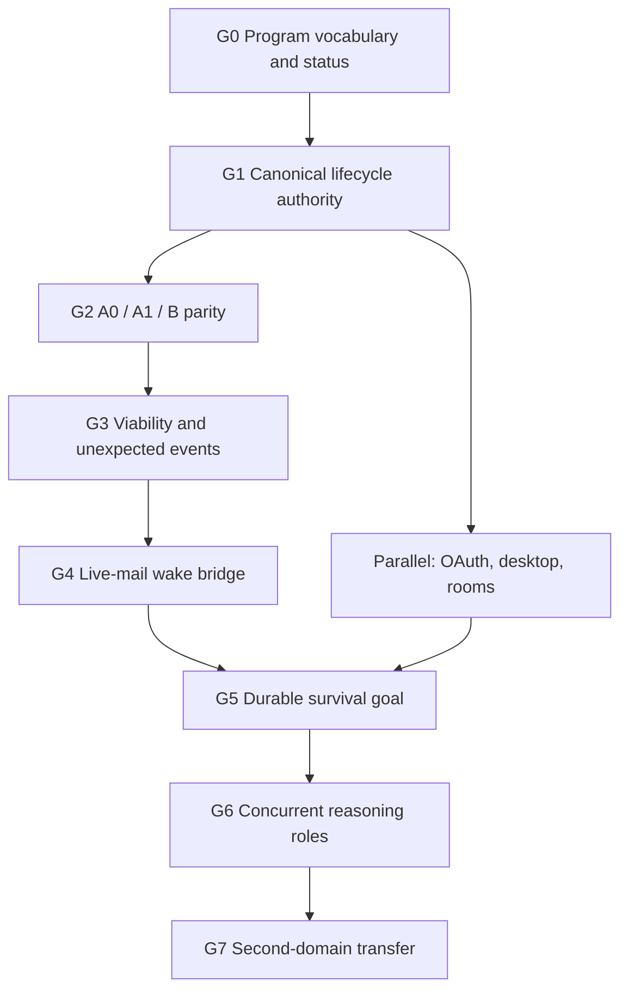

# Helix Environment Harness Work Program v1

Status: canonical program-control document.

Active program gate: **G1**

This document answers the operational question that the product and architecture
contracts intentionally do not:

> What gate are we working on now, what does it depend on, what work is allowed,
> and what evidence permits the program to advance?

It is the single current-status and dependency map for the environment harness.
Product scope and external claims remain governed by
`docs/architecture/casimirbot-environment-harness-product-goal-v1.md`.
Codex/Helix ownership, reasoning roles, reaction timescales and viability remain
governed by `docs/architecture/helix-environment-agent-reasoning-v1.md`.
Minecraft capability and execution contracts remain governed by
`docs/architecture/helix-minecraft-dual-plane-adapter-v1.md`. Dated audits are
immutable evidence snapshots; they never become the current overall status.

## Source-of-truth map

| Question | Sole authority |
| --- | --- |
| What product are we building and what may we claim externally? | `docs/architecture/casimirbot-environment-harness-product-goal-v1.md` |
| Who reasons, who governs, and which timescale owns a response? | `docs/architecture/helix-environment-agent-reasoning-v1.md` |
| What can the Minecraft World Authority and Player Embodiment planes do? | `docs/architecture/helix-minecraft-dual-plane-adapter-v1.md` |
| What gate is active, what is blocked, and what evidence advances the program? | this document |
| How is a lifecycle divergence diagnosed and verified? | `docs/helix-ask-readiness-debug-loop.md` and `docs/helix-ask-codex-loop-discipline.md` |
| What happened in one dated run or implementation increment? | the applicable immutable file under `docs/audits/` plus its exact artifacts |
| What must a repository agent declare and verify? | `AGENTS.md` |

An architecture document may explain dependency semantics but must link here
instead of maintaining another current roadmap. An audit may record the status
at capture time but must not be edited to follow later program progress.

## Program vocabulary

Use these terms literally. Do not use `agent`, `lane`, `success`, or `accepted`
without the qualifier that identifies the actual contract.

| Term | Precise meaning |
| --- | --- |
| Development work packet | A bounded repository task assigned to a Codex development agent. |
| Runtime reasoning role | Perception, prospective planning, execution, or verification. |
| Fabric execution lane | A deterministic concurrent movement, camera, safety, hand, world, or inventory lane. |
| Capability route | A provider-visible family through which a typed operation is requested. |
| Background wake job | Event coalescing that wakes semantic reasoning; it is not another mind or an answer. |
| Lifecycle stage | Request, admission, execution, normalization, re-entry, reasoning, materialization, terminal authority, or presentation. |
| Reaction timescale | Tick reflex, short semantic replanning, or durable planning. |
| Capability maturity | One of the seven ordered maturity terms below. |
| Action success | The admitted operation met its declared postconditions. |
| Viability preserved | The subject remains able to continue safely observing and acting. |
| Goal progress | A durable milestone advanced and that advancement was verified. |
| Turn completion | Codex completed its current reasoning turn. |
| Terminal eligibility | Helix verified that the selected candidate may be projected. |
| Resident closed-loop capability | A versioned local controller that continuously observes and may select or propose only pre-admitted bounded responses while Codex is delayed or reasoning; every effect still passes through the trusted local arbiter and Fabric action lane. |
| Resident controller profile | The exact implementation, sensor schema, artifact hash, deadlines, proposal vocabulary, confidence/abstention policy, and reset behavior allowed for one environment. |
| Resident decision | A causal record linking an observation revision to a controller proposal, arbiter outcome, effect, postcondition, interruption, abstention, or semantic escalation. |

### Capability maturity vocabulary

The only maturity terms allowed in the canonical capability-status table are:

1. `projected`
2. `specified`
3. `implemented`
4. `deterministically verified`
5. `live accepted`
6. `integrated accepted`
7. `release-ready`

Maturity belongs to an exact capability and acceptance surface. It must never be
inferred from a broader phrase such as “the guardian passed” or “Minecraft is
accepted.” A higher maturity claim requires an evidence reference in the table.

### Reaction requirements

Each environment adapter declares the fastest reaction it requires. This is a
control requirement, not a claim that every adapter needs a learned policy:

| Requirement | Meaning | Example |
| --- | --- | --- |
| `none` | No resident controller is required; ordinary request/observation turns are sufficient. | Static document |
| `monitor_only` | Local change detection and cancellation may run, but no resident effect is activated. | Browser workflow |
| `bounded_reflex` | A local controller may select or activate pre-admitted bounded responses under a deadline. | Server circuit breaker, DAW transport guard |
| `continuous_control` | A local controller must sense and maintain bounded control while Codex is delayed. | Minecraft guardian, robot balance controller |

The reaction requirement does not grant authority. Identity, leases, effect
ceilings, manual override, Emergency Stop, provenance, and terminal eligibility
remain governed boundaries.

### Codex and resident-controller roles

The harness has three distinct Codex/controller roles:

| Role | Can do | Cannot do |
| --- | --- | --- |
| Development Codex | Modify contracts, server/companion code, tests, training harnesses, documentation, and evaluation workflows. | Invent live authority, accept external licenses, or claim live acceptance without evidence. |
| Runtime Codex | Choose an admitted resident profile, author a finite response repertoire, set escalation/completion conditions, interpret summaries, replan, and explain results. | Process every tick, maintain continuous key state, or serve as the millisecond reflex. |
| Resident controller | Continuously sense, maintain bounded local state, select or propose pre-admitted responses, request control release, and emit compact causal evidence. | Execute effects directly, set the durable goal, expand permissions, invent actions, write answers, or bypass the execution arbiter. |

Codex can coordinate the entire engineering and evaluation program in bounded
work packets. Runtime operation still requires compiled local control code.

## Dependency order



The ordering protects causality. More event producers, background wakes, or
reasoning roles would amplify lifecycle contradictions if projections can still
overrule current-turn execution and re-entry facts.

## Program gates

| Gate | State | Depends on | Closure evidence | Downstream gate unlocked |
| --- | --- | --- | --- | --- |
| G0 — Program vocabulary and status | closed | none | this document, canonical backlinks, required task header, and `npm run helix:environment-harness:docs-audit` | G1 |
| G1 — Canonical lifecycle authority | active | G0 | poisoned-projection fixtures, canonical-ledger unit evidence, narrow API/terminal parity, and one unchanged natural keyed regression with a clean differential audit | G2 |
| G2 — A0 / A1 / B parity | blocked | G1 | equivalent-state direct Fabric, Codex-through-MCP, and keyed Helix traces for the fluid micro-course, with first-divergence hashes and support refs | G3 |
| G3 — Viability and unexpected events | blocked | G2 | persistent resident control across Codex delays plus representative mid-execution hazard/event recovery and safe cancellation | G4 |
| G4 — Live-mail wake bridge | blocked | G3 | deduplicated nonterminal resident/event escalation evidence re-enters the existing sequential Codex solver without controlling reflexes or authoring an answer | G5 |
| G5 — Durable survival goal | blocked | G4 and converged OAuth/desktop/room identity lane | checkpointed advancement progress and recovery across disconnect, death, restart, and authorized phone continuation | G6 |
| G6 — Concurrent reasoning roles | blocked | G5 | revision-bound perception and prospective outputs converge through one execution arbiter without stale-plan mutation | G7 |
| G7 — Second-domain transfer | blocked | G6 | the accepted lifecycle transfers to a contrasting environment without Minecraft-specific strategy in the generic harness | release evaluation |

Exactly one gate is active. A blocked gate may receive design clarification but
must not receive runtime implementation that assumes its prerequisites passed.

## Canonical capability status

The status is capability-specific. Evidence paths identify the exact accepted
or verified surface; nearby capabilities do not inherit the maturity.

| Capability or component | Current maturity | Evidence | Open requirement |
| --- | --- | --- | --- |
| Environment-harness product and authority architecture | specified | `docs/architecture/casimirbot-environment-harness-product-goal-v1.md`; `docs/architecture/helix-environment-agent-reasoning-v1.md` | Advance through the gated program below. |
| Keyed natural water-bucket rescue benchmark | live accepted | `artifacts/helix-minecraft-guardian-v0.4/keyed-helix/water-bucket-rescue/attempt-34-balanced-clear-screen/guardian_water_bucket_rescue`; `docs/architecture/helix-environment-agent-reasoning-v1.md` | Retain unchanged as a regression; it does not accept other guardian or fluid workflows. |
| Direct Fabric water-bucket rescue feasibility | live accepted | `artifacts/helix-minecraft-guardian-v0.4/direct-codex/water-bucket-rescue/attempt-4-dynamic-collision-success.json`; `docs/architecture/helix-environment-agent-reasoning-v1.md` | Use as a feasibility oracle, not a hardcoded strategy. |
| Canonical lifecycle authority and poisoned-projection resistance | specified | `docs/helix-ask-readiness-debug-loop.md`; `server/services/helix-ask/runtime/turn-lifecycle-differential-audit.ts` | Complete G1; one fact stream must outrank every derived projection. |
| Fabric fluid sequence 0.3 | deterministically verified | `docs/audits/helix-minecraft-fluid-execution-audit-2026-08-12.md` | Complete the live micro-course and A0/A1/B parity in G2. |
| Pre-action unavailable-inventory cancellation | live accepted | `artifacts/helix-minecraft-guardian-v0.4/keyed-helix/unexpected-event/attempt-37-focused-source-projection/guardian_unavailable_inventory_replan`; `docs/architecture/helix-environment-agent-reasoning-v1.md` | Does not prove mid-execution unexpected-event breadth. |
| Mid-execution health interruption contract | implemented | `artifacts/helix-minecraft-guardian-v0.4/keyed-helix/unexpected-event/attempt-46-safe-interrupt-terminal/guardian_mid_execution_health_interrupt`; `docs/architecture/helix-environment-agent-reasoning-v1.md` | Preserve exact child measurements and pass the stronger live acceptance. |
| Persistent viability across model-deliberation gaps | specified | `docs/architecture/helix-environment-agent-reasoning-v1.md` (Attempt 39 and viability sections) | Keep protection active between finite programs and prove recovery in G3. |
| Generic resident closed-loop capability contract | specified | `docs/architecture/helix-environment-agent-reasoning-v1.md`; `docs/architecture/helix-minecraft-dual-plane-adapter-v1.md` | Reserve causal fields in G1; extract the provider-neutral contract only after G3. |
| Minecraft deterministic resident guardian baseline | specified | `docs/architecture/helix-minecraft-dual-plane-adapter-v1.md`; `artifacts/helix-minecraft-guardian-v0.4/keyed-helix/water-bucket-rescue/attempt-34-balanced-clear-screen/guardian_water_bucket_rescue` | Prove continuous protection, abstention, control release, and Codex-delay survival in G3. |
| Learned resident policies and FlyWire profile | projected | `docs/helix-environment-harness-work-program-v1.md` | Shadow-evaluate only after the deterministic baseline and generic contract pass. |
| Live-mail Minecraft wake bridge | specified | `shared/helix-live-source-mail.ts`; `docs/architecture/helix-minecraft-dual-plane-adapter-v1.md` | Convert situation digests into deduplicated nonterminal wake evidence in G4. |
| Durable all-advancements survival goal | specified | `docs/architecture/helix-environment-agent-reasoning-v1.md` | Prove checkpointed progress and recovery in G5. |
| Concurrent runtime reasoning roles | specified | `docs/architecture/helix-environment-agent-reasoning-v1.md` | Add only after the sequential wake/solver path is reliable in G6. |
| Second-domain harness transfer | projected | `docs/architecture/casimirbot-environment-harness-product-goal-v1.md` | Demonstrate the accepted lifecycle in Robinhood shadow observation or another contrasting domain in G7. |

## Active gate: G1 canonical lifecycle authority

### Problem statement

The current runtime can carry more than one lifecycle snapshot, select between
them with a completeness score, and fall back to compatibility projections for
re-entry. Later typed-failure reconciliation mutates several mirrored summaries,
while the lifecycle differential audit observes contradictions after terminal
materialization. This permits a stale derived rail to relabel an executed call,
drop a re-entered observation, force a retry, or replace a supported Codex
candidate.

G1 makes current-turn facts monotonic and gives them one authority. It does not
weaken Helix identity, permission, provenance, freshness, scientific evidence,
route-authority, or terminal-eligibility boundaries.

### Work permitted

- Establish one append-only authoritative lifecycle fact stream with exact turn,
  route, call, occurrence, capability, observation, candidate, and terminal
  identities.
- Reserve generic causal references sufficient to express
  `observation → resident decision → arbiter outcome → effect → postcondition → escalation`
  without introducing continuous controller traffic or a new runtime in G1.
- Make one reducer the source of execution, normalization, re-entry,
  post-observation completion, and terminal continuity facts.
- Convert rail tables, compatibility records, itinerary summaries, debug
  exports, UI products, and voice products into derived views with source event
  references and a lifecycle revision.
- Remove authoritative dependence on completeness scoring, array position,
  artifact aliases, copied booleans, or late mutation of mirrored records.
- Re-enter repairable evidence/terminal rejection into Codex with the exact
  failed invariant, evidence references, retryability, and available admitted
  repairs.
- Preserve hard fail-closed behavior for identity, permission, provenance,
  freshness, integrity, effect scope, scientific support, and exhausted bounded
  repair.
- Add poisoned-projection fixtures and direct-Codex/keyed-Helix first-divergence
  regressions from real failure traces.

### Explicit non-goals

- Do not broaden Minecraft capabilities or encode a successful gameplay script.
- Do not implement the live-mail wake bridge.
- Do not add a second Codex session or concurrent semantic reasoning role.
- Do not add a private Helix sampling, retry, tool-execution, or answer-writing
  loop.
- Do not grow `server/routes/agi.plan.ts`.
- Do not weaken identity, permission, provenance, freshness, scientific proof,
  route-product, or terminal-eligibility gates.

### Required evidence to close G1

1. One reducer-backed fact stream is authoritative for every current-turn
   execution and re-entry decision used by terminal authority.
2. A verified success cannot regress to unexecuted, unreentered, or missing in a
   later projection.
3. A supported provider candidate retains the same text hash and support refs
   through materialization, terminal selection, API, UI, and applicable voice
   presentation.
4. Every repairable rejection causes a bounded Codex continuation; every hard
   rejection exposes its exact invariant without substitute prose.
5. Poisoned compatibility, itinerary, rail, alias, ordering, and stale-revision
   fixtures cannot change the canonical result.
6. Earlier failed attempts remain provenance, while only a strictly later
   current-turn success for the same read/observe/verify subgoal can supersede
   their blocking effect.
7. Focused lifecycle/reducer, terminal-writer, and API parity tests pass.
8. The unchanged keyed rescue regression or an equivalently deep natural tool
   turn completes with `turn_lifecycle_differential_audit.ok=true` and matching
   terminal hashes. A direct reference run remains diagnostic evidence rather
   than Helix acceptance.

Resident-control causality is reserved here as a generic lifecycle relation;
implementing a persistent resident controller remains a G3 task.

Closure advances the active marker to G2 in this document. It does not silently
advance any capability maturity row; each row changes only with its own evidence.

## Parallel delivery lane

OAuth, packaged desktop, Device Check, Shared Live Room identity, provider
deployment, and multi-device continuation may proceed in parallel after G1's
contracts are respected. Their work packets must not claim G2–G6 closure. They
must converge before G5 because a durable room goal depends on stable account,
host, room, participant, subject, source, and device identity.

## G2 and G3 resident-control acceptance

G2 pins the existing deterministic Minecraft guardian as a resident baseline.
Direct Fabric, Codex-through-MCP, and keyed Helix traces must carry the same
program schema, scheduler/implementation version, sensor and condition
vocabulary, mutation scope, program hash, player/world identity, starting
observation revision, and authority lease. This is differential identity, not
generic resident-controller implementation.

G3 is the first positive resident-control acceptance gate. It must demonstrate:

1. protection remains active during a Codex delay;
2. continuous sensing does not wake Codex on every tick;
3. a pre-admitted stabilization can execute locally;
4. manual input and Emergency Stop override the controller;
5. every control and resource is released on every terminal path;
6. the outcome is compacted into exact causal evidence;
7. Codex receives that evidence and materially replans; and
8. player viability remains preserved after local response, not merely after
   one action completes.

The deterministic guardian is the first concrete implementation. A resident
controller is not a second Codex reasoning lane and cannot become an answer
writer or an authority-expanding planner.

## Post-G3 resident-controller workstreams

These workstreams are intentionally blocked until G3 proves the concrete
Minecraft mechanism:

| Workstream | Purpose | Initial implementation | Promotion boundary |
| --- | --- | --- | --- |
| EH-RCC1 — Extract generic contract | Create provider-neutral profile, lease, revision, proposal, arbiter, postcondition, abstention, interruption, reset, and escalation schemas. | `shared/helix-resident-controller.ts`; `server/services/environment-connectors/resident-control/` | Must fit the accepted guardian without Minecraft strategy leaking into shared types. |
| EH-RCC2 — Re-express Minecraft | Migrate the existing Fabric guardian to the generic contract without changing accepted behavior. | Fabric adapter compatibility layer | Existing rescue and G3 evidence must remain equivalent. |
| EH-RCC3 — Second controller | Prove the contract is reusable with a deliberately different resident implementation. | Threshold controller, conventional RNN shadow, or another safe local controller | Same identity, deadline, arbiter, evidence, and terminal semantics across implementations. |
| EH-FW-CLOUD — Offline policy training | Produce candidate learned/FlyWire artifacts for shadow evaluation. | CPU reproduction first; then one approved ephemeral L4 Spot benchmark; A100/H100 only after profiling | Immutable artifact hash, evaluation receipt, hard TTL, cost ceiling, checkpoint recovery, and local-controller acceptance. |

GCP or another cloud provider is an offline experiment surface only. It may
produce a versioned policy artifact; it never sits in the Minecraft reflex
path. Cloud launches require an approved experiment manifest, maximum runtime
and cost, checkpoint destination, evaluation seeds, and automatic cleanup.
Codex may orchestrate an already approved job, but expanding budget, region,
GPU class, or credentials requires fresh user approval.

The training data boundary is explicit. The topology package supplies an
architectural prior; it is not a Minecraft controller. Minecraft episodes,
teacher-controller traces, failed/abstained traces, and synthetic perturbations
teach a candidate how compact sensor histories map to the bounded response
vocabulary. The staged experiment is imitation learning, reinforcement or
simulator learning, topology comparison against equal-capacity controls, and
optional distillation into a predictable local artifact. The deployable result
must contain the policy/topology hash, input schema, response vocabulary,
confidence and abstention thresholds, resource requirements, deterministic
fallback, evaluation receipt, and Helix admission metadata.

The learned artifact remains proposal-only until the local arbiter promotion
gate accepts a narrowly scoped response family. The deterministic Fabric
guardian remains the safety and performance reference even if a learned profile
is eventually promoted.

DAW is a strong later transfer candidate because it shares continuous temporal
control but has different sensors, effects, and success criteria. It remains
part of the later second-domain evaluation, not the active Minecraft gate.

## Development work-packet header

Every environment-harness development work packet begins with this exact
header. Values may be `not applicable` only with a one-line explanation.

```text
Program gate:
Workstream:
Capability or component:
Lifecycle stage:
Reaction timescale:
Authority owner:
Current maturity:
Target maturity:
Required evidence:
Explicit non-goals:
Downstream gate unlocked:
```

The packet must name one primary lifecycle stage. Cross-stage changes may list
secondary stages, but the first-divergence diagnosis and verification remain
stage-specific.

## Evidence and advancement rules

- `implemented` means code exists; it is not deterministic or live acceptance.
- `deterministically verified` requires a named reproducible test/build artifact.
- `live accepted` requires an exact current provider/environment trace and
  capability-specific postconditions.
- `integrated accepted` requires the linked capability to survive the required
  cross-surface lifecycle, including identity and terminal continuity.
- `release-ready` requires the applicable product release ladder, deployment,
  resource, security, recovery, and external-installation evidence.
- Direct Codex success proves feasibility, not Helix acceptance.
- A valid typed hard-boundary failure is a successful governance result only for
  that negative test; it does not prove positive action success.
- An audit is immutable. New evidence produces a new audit or artifact and an
  update to this work program.
- Exactly one active gate is recorded at the top of this document and in the
  program-gates table.

## Documentation audit

Run:

```bash
npm run helix:environment-harness:docs-audit
```

The audit checks that the canonical files link to this work program, that the
canonical status table uses only the allowed maturity vocabulary, that exactly
one program gate is active, and that acceptance-level maturity claims name
existing evidence references. It also checks that resident-controller status
uses `specified` or `projected` until its later gates provide stronger proof.
It is a program-consistency check, not runtime acceptance evidence.
