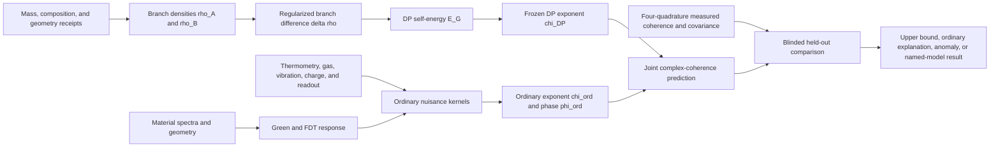

# Casimir-DP Stage-4.2B apparatus-coherence residual forecast

Status: implemented synthetic diagnostic and preserved implementation contract.
Authoritative run
`casimir-dp-apparatus-coherence-residual-stage4-2b-v1-20260726T123523358Z`
and downstream verification receipt
`docs/research/casimir-dp-apparatus-coherence-residual-stage4-2b-verification-receipt.json`
now exist. This plan is not itself runtime or measured evidence, and no
scientific promotion is represented as complete by this file.

Evidence cutoff: 2026-07-26.

Proposed claim ceiling:
`apparatus_coupled_residual_and_dp_scaling_sensitivity_forecast_only`.

## 1. Purpose

Stage 4.2B is the first apparatus-specific, response-complete, and
full-covariance-complete campaign in this study. Stage 3 already placed
synthetic ordinary and Diósi-Penrose (DP) predictions in a common observation
space; Stage 4.2B must carry the measured apparatus response, sensor model, and
shared covariance into that comparison.

Its primary question is:

> Can the frozen apparatus distinguish a preregistered DP-shaped coherence
> exponent from thermal, electromagnetic, vibration, gas, surface, optical,
> and readout effects after their measured transfer functions and shared
> covariance are propagated?

The campaign is a forecast and measurement contract, not an assumed next
proof. It may correctly return:

- `apparatus_not_powered_for_dp`;
- `ordinary_physics_closure_forecast_incomplete`;
- `signature_not_identifiable`;
- `powered_parameter_region_available`; or
- `apparatus_residual_forecast_ready`.

An inaccessible DP effect is a scientifically useful design result. The
runtime must not turn an underpowered design into a positive plausibility
score.

## 2. Relationship to the existing stages

Stage 4.2B must consume, hash-bind, and not rewrite:

- the immutable Stage-3 evidence-map campaign and its six analysis primitives;
- the immutable Stage-4 polarization, thermal/FDT, and congruence campaign;
- the immutable Stage-4.1 QED scale-hierarchy calibration;
- the immutable Stage-4.2A electron-mass/Higgs and Planck/solar calibration;
- the frozen proposal-closure apparatus and acquisition contracts; and
- the data-readiness hash, calibration, covariance, and blinding rules.

The plan enumerates every required tuple role below; short hashes are shown for
review, while the implementation must bind the complete path and 64-character
content hash:

| Authority | Config | Authority manifest | Timestamped report JSON / Markdown | Campaign receipt | Downstream verification receipt |
|---|---|---|---|---|---|
| Stage 3 | `configs/research/casimir-dp-evidence-map-stage3.v1.json` @ `231cb26e…29c2` | `configs/research/casimir-dp-stage3-authorities.v1.json` @ `6f5a0a90…cf13` | `artifacts/research/casimir-dp-evidence-map-stage3/casimir-dp-evidence-map-stage3-v1-20260725T134544Z/evidence-map-stage3-report.{json,md}` @ `feb799bc…508b` / `41aae6d5…cc23` | same timestamped directory, `evidence-map-stage3-receipt.json` @ `5bcd2400…0346` | `docs/research/casimir-dp-evidence-map-stage3-verification-receipt.json` @ `2cf09b5c…0082` |
| Stage 4 | `configs/research/casimir-dp-polarization-congruence-stage4.v1.json` @ `ade06cd7…3d7` | `configs/research/casimir-dp-stage4-authorities.v1.json` @ `3f26ef11…918d` | `artifacts/research/casimir-dp-polarization-congruence-stage4/casimir-dp-polarization-congruence-stage4-v1-20260725T165932120Z/polarization-congruence-stage4-report.{json,md}` @ `2c56cd9b…6d0b` / `1221cf1e…00a8` | same timestamped directory, `polarization-congruence-stage4-receipt.json` @ `185a09ce…74a` | `docs/research/casimir-dp-polarization-congruence-stage4-verification-receipt.json` @ `721b9f6a…8440` |
| Stage 4.1 | `configs/research/casimir-dp-qed-scale-hierarchy-stage4-1.v1.json` @ `e2625c86…478` | `configs/research/casimir-dp-stage4-1-authorities.v1.json` @ `cd681b97…4f4f` | `artifacts/research/casimir-dp-qed-scale-hierarchy-stage4-1/casimir-dp-qed-scale-hierarchy-stage4-1-v1-20260725T183020238Z/qed-scale-hierarchy-stage4-1-report.{json,md}` @ `8f06bf39…42c5` / `6ae95307…ba6` | same timestamped directory, `qed-scale-hierarchy-stage4-1-receipt.json` @ `d835b56a…24af` | `docs/research/casimir-dp-qed-scale-hierarchy-stage4-1-verification-receipt.json` @ `a7f60aa9…b8db` |
| Stage 4.2A | `configs/research/casimir-dp-electron-mass-higgs-anchor-stage4-2a.v1.json` @ `1459d48b…87b2` | `configs/research/casimir-dp-stage4-2a-authorities.v1.json` @ `1e4dde8f…3b5f` | `artifacts/research/casimir-dp-electron-mass-higgs-anchor-stage4-2a/casimir-dp-electron-mass-higgs-anchor-stage4-2a-v1-20260725T211750900Z/electron-mass-higgs-anchor-stage4-2a-report.{json,md}` @ `a53a2f1c…e35d` / `d7dbf59d…357a` | same timestamped directory, `electron-mass-higgs-anchor-stage4-2a-receipt.json` @ `592a6245…17c3` | `docs/research/casimir-dp-electron-mass-higgs-anchor-stage4-2a-verification-receipt.json` @ `debd651e…b66a` |

The Stage-4.2B authority manifest must copy the exact SHA-256 value for every
role from the corresponding downstream verification receipt or authority
manifest and fail closed on a mismatch. It must not rely on receipt hashes
alone, and mutable `current` or `latest` aliases are not evidence authority.
It must not recursively rehash maintained documents or the shared live Theory
Badge graph: Stage 3 intentionally froze an older proposal document. Instead,
bind the immutable timestamped Stage-3 tuple above and separately version the
proposal-closure and data-readiness configs/reports that are current when
Stage 4.2B is frozen.

No Stage-4.2B certificate may reuse an earlier request, trace, run ID, or
receipt. A repeated content-addressed certificate hash is acceptable only when
the fresh trace, request, run identity, and integrity receipt establish the new
execution.

## 3. What “first principles across scales” means here

The study should distinguish **parameter transport** from **evidential
transport**.

First principles precede measurement by specifying, before unblinding:

- which physical state is prepared;
- which variables may enter each model;
- how measured quantities are transported through explicit kernels;
- what scale dependence each model predicts;
- which uncertainties and correlations accompany that transport; and
- which observation would falsify the model.

Evidence then flows in the opposite direction: measured, held-out observables
are compared with those frozen predictions. Shared constants, dimensions, or
successful calculations in another domain do not carry empirical support into
DP.

The intended scale chain is therefore:



Every arrow must have a named equation, unit contract, source, uncertainty
model, content hash, and recovery or falsifier test. A shared symbol without
such an arrow is a semantic non-bridge.

### 3.1 Electron mass is not the nanoparticle mass model

Stage 4.2A supplies a rigorous electron-mass metrology and Standard Model
notation benchmark. It does not derive the mass of the silica nanoparticle.

The Stage-4.2B object ledger must use the measured total mass and spatial
density of each composite object. It must record:

- measured total mass and uncertainty;
- radius, shape, porosity, coating, and density-map receipts;
- chemical and isotopic composition where it affects density or response;
- wavepacket and branch-trajectory receipts; and
- whether a continuum, atomic, nuclear, or smeared density prescription is
  used by the named DP implementation.

The electron rest-mass contribution is only a small part of ordinary bulk
mass. Proton rest energy is predominantly accounted for by QCD quark/gluon
energy and trace terms in a specified renormalization scheme. Measured total
object mass already includes nuclear and chemical binding contributions as an
accounting matter. The runtime must reject an electron-rest-mass or
Compton-frequency reconstruction of the particle mass. The operational DP
input is the complete measured branch mass-density difference, not a count of
electron Compton frequencies or individual QCD energy-momentum-tensor terms.

### 3.2 Solar spectral calibration is not the apparatus thermal model

The Stage-4.2A TSIS/solar calculation demonstrates source, unit, Planck-law,
and temperature-vocabulary discipline. A full solar spectral fit would remain
an ancillary zero-bridge calibration.

The DP-test-relevant ordinary-nuisance spectral task is instead
response-corrected thermometry of the nanoparticle, boundary, and nearby
surfaces. A nanoscale silica particle is not an ideal blackbody. Its emission,
absorption, and scattering must use measured or source-backed complex material
response, geometry, and the applicable boundary-inclusive
fluctuational-electrodynamics or Mie response.

This creates a legitimate apparatus transfer:

\[
\text{measured spectrum}
\longrightarrow
T_{\rm internal}\ \text{and covariance}
\longrightarrow
\chi_{\rm thermal}
\longrightarrow
C(t).
\]

It does not create:

\[
T_\odot \longrightarrow E_G
\quad\text{or}\quad
\text{Planck spectrum}\longrightarrow\Gamma_{\rm DP}.
\]

## 4. Three hypotheses that must remain separate

### 4.1 Composite ordinary-physics null

\[
M_0 =
M_{\rm QED\ phase}
+M_{\rm technical\ dephasing}
+M_{\rm environmental\ decoherence}
+M_{\rm ordinary\ GR}
+M_{\rm polarization\ QED}
+M_{\rm thermal/FDT}.
\]

This is an additive model registry, not an assumption that all observed
effects are simple constant rates.

### 4.2 Named dynamical DP extension

\[
M_{\rm DP}=M_0+M_{\rm DP,\langle manifest\rangle}.
\]

Admission requires one frozen dynamical equation, mass-density convention,
smearing or cutoff \(r_0\), dissipation/color convention, external-bound
ledger, numerical method, uncertainty model, and observation likelihood.

Penrose's \(\tau\sim\hbar/E_G\) remains a heuristic envelope unless a
generative dynamics is separately named. Penrose OR and Diósi's Markovian
master equation must not be represented as identical.

### 4.3 Boundary-conditioned bridge

\[
M_{\rm replacement}=M_0+M_{\rm bridge,\langle kernel\rangle},
\qquad
M_{\rm DP\ modifier}
=M_0+M_{\rm DP,\langle manifest\rangle}
+M_{\rm bridge,\langle kernel\rangle}.
\]

These are distinct registered model roles. The first is an independent or
replacement boundary extension; the second modifies a named DP dynamics. A
bridge implementation must declare exactly one nesting and cannot be scored
under both.

Within the registered nonrelativistic Markovian mass-density DP generator, if
the complete joint-system branch difference
\(\Delta\rho_{\rm joint}\), smearing kernel, trajectories, and model
parameters are identical across boundary states, the DP contribution is
algebraically invariant:

\[
\Delta_b\Gamma_{\rm DP}=0.
\]

A nonzero boundary residual under that complete-equivalence condition therefore
tests ordinary boundary-coupled physics or a separately registered extension.
It does not confirm the registered unmodified DP generator. This conditional
null is not a theorem about Penrose OR, relativistic collapse models, or a
cavity that acquires branch-dependent polarization, stress, mass density, or
entanglement. The bridge model remains blocked unless the existing
manifold-kernel registry admits a numerical, causal, source-backed,
pre-unblinding kernel with uncertainty, recovery limits, a companion
observable, and falsifiers.

## 5. Primary observables and estimands

The campaign must preserve complex coherence:

\[
C_{ib}(t)=V_{ib}(t)e^{i\phi_{ib}(t)},
\]

where \(i\) indexes object, branch geometry, separation, hold time, path swap,
echo, and trajectory, and \(b\) indexes the blinded boundary state.

Define the coherence exponent

\[
d_{ib}(t)
=-\ln\!\left[\frac{V_{ib}(t)}{V_{ib}(0)}\right].
\]

The joint model is

\[
d_{ib}(t)
=
\chi^{\rm ord}_{ib}(t)
+\chi^{\rm DP}_{i}(t)
+\chi^{\rm bridge}_{ib}(t)
+\epsilon_{ib}(t).
\]

The exponent residual is

\[
r_{ib}(t)=d_{ib}(t)-\chi^{\rm ord}_{ib}(t).
\]

A Gaussian likelihood in the derived log-visibility \(d\) is allowed only
after synthetic coverage tests show that it is unbiased and calibrated over
the complete planned visibility range. Near low visibility, the logarithm is
biased and non-Gaussian. Otherwise the confirmatory likelihood must act on the
raw quadrature counts or the measured complex-coherence estimator and its
sampling model; \(Q_M\) below is then a diagnostic summary rather than the
primary likelihood.

A constant residual rate may be reported only as a preregistered slope of
\(r(t)\) over an identifiable hold-time grid with a free
preparation/readout intercept. A single visibility ratio must not be relabeled
as a decay rate.

The paired boundary estimand is

\[
\Delta_b\Gamma_{\rm res}
=
\Gamma_{\rm res,on}-\Gamma_{\rm res,off}.
\]

The registered-DP scale estimand is instead obtained across independently
metrologized object/branch/hold-time cells. These two estimands are orthogonal
only after the complete joint-system equivalence gate passes; under that
registered generator the boundary contrast cancels its DP contribution.

Phase is modeled separately:

\[
\phi_{ib}(t)
=-\frac{1}{\hbar}\int_0^t
\Delta U_{ib}(t')\,dt'.
\]

A coherent Casimir-Polder, electrostatic, optical, inertial, or gravitational
phase is not irreversible collapse.

## 6. Apparatus spectral response and covariance

### 6.1 Response-corrected spectral thermometry

The measured, binned detector spectrum should be modeled with an instrument
operator:

\[
d_k
=
\sum_\ell R_{k\ell}
\left[
\Omega_\ell C_{{\rm abs},\ell}B_\ell(T_{\rm int})
+I_{{\rm reflected},\ell}
+I_{{\rm stray},\ell}
\right]
+b_k+\eta_k,
\]

where \(R_{k\ell}\) includes binning, throughput, polarization response, and
the line-spread convolution. The displayed scalar
\(\Omega C_{\rm abs}B\) term is only a reciprocal, quasi-equilibrium,
free-space/small-particle recovery limit. Anisotropic or finite objects require
direction- and polarization-dependent response; the near-boundary case requires
a boundary-inclusive dyadic Green-tensor/fluctuational-electrodynamics model or
a demonstrated free-space recovery regime.

The model must freeze a consistent convention for radiance or power, solid
angle, wavelength/frequency bandwidth, and detector response. The fit must
carry:

- wavelength calibration and line-spread function;
- spectral response and gain drift;
- complex permittivity or absorption-cross-section uncertainty;
- background, reflection, and stray-light components;
- internal cooling history and non-equilibrium status;
- masks and quality flags;
- cross-wavelength covariance; and
- the Jacobian from fitted spectral parameters to the thermal-decoherence
  prediction.

The ideal-blackbody and free-space limits are recovery tests, not the default
nanoparticle-near-boundary model.

### 6.2 Cross-spectral nuisance propagation

The runtime must distinguish physical disturbance from sensor self-noise:

\[
\mathbf x_{\rm obs}(\omega)
=\mathbf H(\omega)\mathbf x_{\rm phys}(\omega)+\mathbf n(\omega).
\]

\(\mathbf H\), sensor self-noise \(\mathbf n\), their cross-correlations, and
their uncertainty must be learned from calibration/pilot data and frozen before
confirmatory acquisition. Directly treating the observed sensor spectrum as a
physical disturbance spectrum can turn readout noise into fictitious
decoherence.

Let \(\mathbf x_{\rm phys}(\omega)\) contain the inferred synchronized physical
disturbance channels and \(\mathbf K_i(\omega)\) their calibrated
energy-difference transfer functions:

\[
\delta U_i(\omega)=\mathbf K_i(\omega)\mathbf x_{\rm phys}(\omega).
\]

The full energy-difference spectrum is

\[
S_{\Delta U,i}(\omega)
=
\mathbf K_i(\omega)
\mathbf S_{x_{\rm phys}x_{\rm phys}}(\omega)
\mathbf K_i^\dagger(\omega).
\]

\(\mathbf S_{x_{\rm phys}x_{\rm phys}}\) must be a Hermitian
positive-semidefinite cross-spectral matrix inferred through the frozen
sensor/noise forward model. Replacing it with the raw observed spectrum or
independent scalar PSDs is not allowed unless registered tests support those
approximations.

Under the frozen two-sided angular-frequency convention, the Gaussian
dephasing exponent is

\[
\chi^{\rm ord}_{i,\rm Gaussian}
=
\frac{1}{2\hbar^2}
\int_{-\infty}^{\infty}\frac{d\omega}{2\pi}
|Y_i(\omega)|^2 S_{\Delta U,i}(\omega).
\]

\(Y_i(\omega)\) is the Ramsey, echo, path-swap, or other registered sequence
filter. Gas collisions and photon emission, absorption, or scattering are
jump/localization processes and must use their applicable non-Gaussian
coherence kernels rather than being forced into this equation, unless a
controlled diffusion limit is separately validated.

### 6.3 Residual covariance

For a linearized ordinary prediction \(f(\mathbf x)\) with Jacobian \(J\),

\[
\Sigma_r
=
\Sigma_{yy}
+J\Sigma_{xx}J^{\mathsf T}
-\Sigma_{yx}J^{\mathsf T}
-J\Sigma_{xy}.
\]

The cross terms matter because the same sensors and calibrations can enter the
measured coherence and the predicted subtraction. Shared calibration ancestry
must not be counted as independent confirmation.

The full-covariance model score is

\[
Q_M
=
(\mathbf r-\mathbf s_M)^{\mathsf T}
\Sigma_r^{-1}
(\mathbf r-\mathbf s_M),
\]

with whitening from a preregistered factorization
\(\Sigma_r=LL^{\mathsf T}\). The scored covariance must be positive definite;
a merely positive-semidefinite singular matrix cannot be inverted or
Cholesky-factorized and must return `not_identifiable`. Any shrinkage, mode
projection, or jitter rule must be learned and frozen from pilot data, covered
by simulation, and applied without reference to confirmatory outcomes.
Stage 4.2B therefore requires a new full-covariance comparator schema; the
Stage-3 scalar-per-row `sigma` scorer is not sufficient.

## 7. Required ordinary-physics lanes

| Lane | Required inputs | Primary discriminators or companions |
|---|---|---|
| Thermal emission, absorption, and scattering | internal/boundary temperatures, spectral response, emissivity or complex permittivity, cooling history | temperature sweep, spectral thermometry, recoil/heating |
| Near-field EM/FDT | material loss, Green tensor, distance, temperature, geometry | force-noise and heating from the same response receipt |
| Static QED/Casimir-Polder phase | finite geometry, branch potentials and gradients | path-swap sign, force calibrator, distance/material scaling |
| Charge and stray field | net charge, field and bias maps | charge/bias reversal, shielding, neutralization |
| Patch potentials and lateral surface structure | two-surface patch maps, topography, sector position | Kelvin-probe map, surface-sector replication, distance scaling |
| Vibration and inertial motion | synchronized acceleration, tilt, displacement, transfer phase | spectral lines, injection, path swap, echo/filter response |
| Residual gas | pressure, species, gas temperature, collision cross sections | pressure/composition sweep |
| Optical preparation/readout | photon flux, power, polarization, feedback, out-of-loop record | optical-power and gain sweep, independent detector |
| Switching heat and pickup | gate waveform, leakage, thermometry, EM pickup, settling record | matched heat, sham switch, switch-disabled cell |
| Drift and label leakage | timestamps, run order, calibration drift, classifier audit | randomized drift-free blocks, permutation, blind classifier |

Vibration requires special treatment: in relevant limits its apparent
mass/separation dependence can resemble a small-separation DP signature.
Independent spectral monitoring, injections, and sequence-filter dependence
are therefore mandatory. Dimensional scaling alone cannot distinguish it.

Every contribution must have exclusive ownership or a documented shared-term
rule so thermal, QED, optical, and readout effects are not double counted.

## 8. Frozen DP scale transport

For a named smearing kernel \(g_{r_0}\),

\[
\Delta\rho_{r_0}(\mathbf x,t)
=
g_{r_0}*
\left[\rho_A(\mathbf x,t)-\rho_B(\mathbf x,t)\right].
\]

The registered convention should compute

\[
E_G(t)
=
\frac{G}{2}
\int d^3x\,d^3y\,
\frac{
\Delta\rho_{r_0}(\mathbf x,t)
\Delta\rho_{r_0}(\mathbf y,t)}
{|\mathbf x-\mathbf y|},
\]

or a mathematically equivalent source-backed regularization. The runtime must
state any convention-dependent factor.

For the named Markovian rate prescription,

\[
\chi_{\rm DP}(t)
=
\int_0^t\frac{E_G(t')}{\hbar}\,dt',
\qquad
C_{\rm DP}(t)=e^{-\chi_{\rm DP}(t)}.
\]

For a self-similar body this may be written

\[
\Gamma_{\rm DP}
=
\frac{Gm^2}{\hbar R}
F\!\left(
\frac{\Delta x}{R},
\frac{r_0}{R},
\text{shape},
\text{trajectory}
\right).
\]

The Planck-unit form

\[
\chi_{\rm DP}
=
\left(\frac{m}{m_P}\right)^2
\frac{ct}{R}F(\ldots)
\]

uses \(m_P=\sqrt{\hbar c/G}\) and is a dimensionless reparameterization only.
It does not show that the apparatus reaches Planck length or energy,
discretizes spacetime, or supplies a cosmological mechanism.

The runtime should calculate numerical logarithmic sensitivities from the
full density functional instead of assuming a universal \(m^2\) power law:

\[
s_q=\frac{\partial\ln\Gamma_{\rm DP}}{\partial\ln q},
\qquad
q\in\{m,R,\Delta x,r_0\}.
\]

For stationary branch geometry, hold time changes the accumulated exponent,
not the instantaneous rate:

\[
s_t=\frac{\partial\ln\chi_{\rm DP}}{\partial\ln t}.
\]

Object mass, radius, density, and material are correlated between-object
factors. They must not be represented as within-pair mutations.

### 8.1 External-bound ledger

The implementation must update the named Markovian DP parameter ledger with
the 2026 XENONnT result. For the tested radiative implementation, XENONnT
reports no significant excess and

\[
R_0>4.9\times10^{-10}\ {\rm m}
\quad (90\%\ {\rm CL}).
\]

The local DP significance was \(0.2\sigma\); the reported best-fit value must
not be represented as evidence. The bound applies only when the runtime matches
the paper's Markovian/white-noise spontaneous-X-ray implementation, including
its electron-proton charge-cancellation radiation kernel, normalization, and
cutoff convention. It does not exclude Penrose's heuristic generally or every
colored, dissipative, or non-Markovian variant.

Generic \(r_0\) and XENONnT's \(R_0\) must not be silently identified. Before
the bound can truncate a Stage-4.2B parameter region, a parameter-map receipt
must match the kernel shape, width convention (including any \(\sqrt 2\)
factor from one versus two smearings), normalization, constituent
prescription, temporal-noise convention, radiation kernel, and master-equation
version. Without that receipt the result is contextual external evidence only.

No value of \(r_0\), model amplitude, dissipation, color scale, density
granularity, or companion normalization may be retuned after held-out data are
examined.

### 8.2 Existing-manifest reconciliation

The repository currently contains different diagnostic estimates associated
with different density and regularization choices. Stage 4.2B must not quote
“the DP prediction” until it records:

- the exact Stage-3 named-model manifest hash;
- the Stage-2 Plummer or softened-density convention;
- the object mass/radius/branch differences between calculations;
- a common recovery fixture; and
- a source-backed reason for the confirmatory model choice.

The Stage-3 named manifest must remain immutable. A new
`stage4_2b_applicability_manifest` may select and constrain it, but must not
silently modify it.

## 9. Required experimental design grid

The confirmatory forecast should require:

- at least three independently metrologized object mass/density
  configurations;
- multiple branch separations that sample predicted curvature in
  \(F(\Delta x/R,r_0/R)\), rather than only one unresolved small-separation
  point;
- at least four hold times including a zero-time intercept and a span ratio of
  at least four;
- path-swap and echo cells;
- randomized blind paired boundary states;
- independently varied temperature, pressure, vibration, charge, distance,
  polarization, and readout-power controls;
- sham switching, matched heating, and a dummy or detuned boundary;
- a pilot/training partition that cannot enter confirmatory scoring; and
- a genuinely independent replication partition.

The implementation may additionally run a bounded alternative-design sweep.
That sweep must remain separate from the frozen proposal architecture and may
not retroactively change its feasibility verdict.

## 10. Proposed runtime package

### 10.0 Reuse and reconciliation rule

Stage 4.2B is an integration layer, not a parallel rewrite. Its implementation
must first reuse or explicitly reconcile:

- `shared/casimir-optical-response.ts` for optical material response;
- `shared/casimir-lifshitz.ts` for ordinary Casimir/Lifshitz calculations;
- `shared/dp-collapse.ts` for the existing DP numerical kernel;
- `shared/casimir-dp-inference.ts` for inference primitives;
- `shared/casimir-dp-phase-coherence.ts` and
  `shared/casimir-dp-complex-coherence.ts` for phase and four-quadrature
  coherence;
- `shared/casimir-dp-data-readiness.ts` and
  `shared/casimir-dp-proposal-readiness.ts` for evidence and apparatus gates;
- `shared/contracts/casimir-dp-next-computations.v1.ts` and
  `scripts/research/run-casimir-dp-next-computations.ts` for the Stage-1
  computation contract; and
- `shared/contracts/casimir-dp-proposal-closure.v1.ts` for the frozen proposal
  closure.

The earlier
`docs/research/casimir-dp-next-computations-report.md` is a predecessor that
must be mapped term by term into the Stage-4.2B ownership ledger. A new module
may supersede an old responsibility only when the report records the old and
new equation/convention, a recovery comparison, and the reason for the change.
No duplicate implementation may be vote-counted as independent validation.

### Runtime A: apparatus state and scale-transport ledger

Proposed module:
`shared/casimir-dp-apparatus-scale-transport-stage4-2b.ts`.

Inputs:

- object mass, composition, density, geometry, and uncertainty receipts;
- branch wavepacket and trajectory receipts;
- boundary state, distance, orientation, and timing;
- SI/natural-unit conversion registry;
- Stage-4.1/4.2A calibration authority hashes; and
- source-overlap and covariance ancestry.

Outputs:

- validated \(\rho_A,\rho_B,\Delta\rho\) references;
- dimensionless scale vector;
- complete joint-system branch-equivalence result by boundary state;
- parameter-transport DAG;
- composition and approximation ledger; and
- no-bridge ledger.

Hard gates:

- mass conservation and branch-swap symmetry;
- measured or explicitly design-class density provenance;
- a typed separation between assumed, simulated, and measured branch
  preparation fidelity;
- no electron-only bulk-mass reconstruction;
- symbolic recovery of the registered analytic boundary identity when the
  complete joint-system DP inputs are exactly equal;
- numerical null recovery under absolute-plus-relative tolerances derived from
  the convergence error (a relative-only tolerance at zero is forbidden);
- sensitivity-weighted branch mismatch propagated through the DP and ordinary
  response models below its preregistered systematic allocation,
  \[
  |\delta\chi_{\rm branch}|<f_{\rm sys}\sigma_{\rm target};
  \]
- no hidden within-object mass/material mutation; and
- exact unit/convention round trips.

### Runtime B: response-corrected spectral thermometry

Proposed module:
`shared/casimir-dp-apparatus-spectral-thermometry-stage4-2b.ts`.

Inputs:

- measured or synthetic detector spectra;
- detector response and wavelength calibration;
- complex material response or absorption cross sections;
- particle and boundary geometry;
- background/reflection model; and
- complete spectral covariance.

Outputs:

- identifiable internal particle and boundary temperature estimates, or
  `temperature_not_identifiable`;
- response-aware uncertainty and fit residuals;
- blackbody recovery diagnostic;
- thermal-emission/absorption/scattering rates; and
- thermal-to-coherence Jacobian.

Hard gates:

- wavelength coverage and masks frozen;
- response/covariance hashes valid;
- covariance symmetric and positive semidefinite;
- non-blackbody nanoparticle response present;
- internal local-thermal-equilibrium or registered non-equilibrium model
  validity;
- wavelength coverage spans the temperature-sensitive bands;
- signal-to-background and Fisher/posterior identifiability pass before a
  temperature is emitted;
- boundary-inclusive Green response or demonstrated free-space recovery;
- far-field and near-field contributions have a unified ownership ledger that
  prevents double counting but does not assume the effects are physically
  exclusive;
- thermal photon emission, absorption, and scattering use their applicable
  jump/localization kernels and enter the Gaussian spectral-dephasing formula
  only under a validated diffusion limit; and
- no solar temperature used as an apparatus input.

### Runtime C: apparatus response and nuisance covariance

Proposed module:
`shared/casimir-dp-apparatus-response-covariance-stage4-2b.ts`.

Inputs:

- synchronized sensor time series or frozen spectral sidecars;
- sensor response, self-noise, and cross-correlation calibration;
- calibrated complex transfer matrices;
- Green/FDT, patch, gas, optical, vibration, and readout models;
- Ramsey/echo/path-swap filter functions; and
- common calibration/cross-covariance receipts.

Outputs:

- per-channel and joint \(\chi_{\rm ord}(t)\);
- ordinary coherent phase;
- Hermitian cross-spectral matrices;
- physical-disturbance spectra separated from sensor self-noise;
- joint residual covariance and whitening factor;
- channel-ownership ledger; and
- nuisance injection predictions.

Hard gates:

- clock, anti-alias, bandwidth, response-phase, and calibration freshness;
- frozen sensor/noise forward model with uncertainty propagation;
- cross-spectral Hermiticity and positive-semidefinite status;
- scored covariance symmetry, positive-definite status, and registered
  condition threshold;
- singular covariance returns `not_identifiable`; pilot-frozen shrinkage or
  jitter is never learned from confirmatory outcomes;
- no omitted cross-covariance silently set to zero;
- recovery of injected spectral lines and correlated channels; and
- no mean Casimir pressure substituted for a noise PSD.

### Runtime D: DP scaling and companion forecast

Proposed module:
`shared/casimir-dp-dp-scaling-forecast-stage4-2b.ts`.

Inputs:

- Runtime-A branch-density ledger;
- named DP model and applicability manifest;
- \(r_0\) and external-bound receipt;
- adaptive numerical-domain and convergence contract; and
- applicable heating, diffusion, or radiation companion definition.

Outputs:

- \(E_G(t)\), \(\Gamma_{\rm DP}(t)\), and \(\chi_{\rm DP}(t)\);
- numerical uncertainty and convergence;
- mass/radius/separation/hold-time signature vectors;
- predicted companion signature;
- companion power and forecast signal-to-noise ratio;
- powered external-bound parameter regions; and
- the analytic conditional boundary identity, numerical recovery error, and
  experimental branch-equivalence uncertainty as three separate outputs.

Hard gates:

- \(E_G=0\) for identical branches;
- nonnegative rate under the registered convention;
- mass conservation, branch symmetry, domain containment, and sub-voxel
  sensitivity;
- multi-resolution convergence before physical sensitivity is reported;
- model/cutoff/temporal-noise/radiation convention and an explicit parameter
  map compatible with every external bound admitted numerically;
- a named-DP-support path requires an independently powered applicable
  companion with forecast SNR \(\ge 5\); otherwise its role is limited to
  compatibility or exclusion;
- no post-hoc parameter retuning; and
- no boundary term in the registered Newtonian mass-density DP generator
  unless a separately registered modifier is being tested.

### Runtime E: complex residual and full-covariance comparator

Proposed module:
`shared/casimir-dp-apparatus-coherence-residual-stage4-2b.ts`.

Inputs:

- existing four-quadrature complex-coherence output;
- Runtimes B-D predictions and covariance;
- blinded cell registry;
- pilot/training/held-out partitions;
- frozen design matrix and exclusions; and
- model and decision-rule registry.

Outputs:

- joint \((\Re C,\Im C,V,\phi,d)\);
- ordinary prediction and whitened residual;
- paired boundary coefficient;
- DP scale coefficient or strict no-amplitude score;
- full-covariance model scores;
- raw-quadrature or complex-coherence likelihood, or a coverage-qualified
  Gaussian log-visibility likelihood;
- robustness/permutation results; and
- outcome-to-claim status.

The strict DP predictor must have no fitted amplitude and no held-out
\(r_0\) adjustment. An amplitude-fitted shape diagnostic may be retained only
when trained and frozen before held-out scoring and clearly labeled
non-confirmatory. A low-visibility cell must fail closed unless the chosen
likelihood's bias and coverage are validated for that regime.

### Runtime F: signature identifiability and power

Proposed module:
`shared/casimir-dp-apparatus-identifiability-stage4-2b.ts`.

Inputs:

- whitened thermal, EM, vibration, gas, readout, DP, and optional bridge
  signatures;
- forecast covariance;
- planned cell counts and design matrix;
- false-positive and power targets; and
- bounded parameter regions.

Outputs:

- signature rank and condition number;
- pairwise whitened signature cosines;
- Fisher information or equivalent local sensitivity;
- achieved power by parameter region;
- required paired windows;
- apparatus feasibility verdict; and
- bounded redesign requirements.

Hard gates:

- signature rank at least four;
- maximum absolute whitened signature cosine below 0.98;
- achieved power at least 0.8 for any region called testable;
- coverage validated with simulation when asymptotics are unreliable; and
- null exclusions restricted to powered preregistered regions.

### Runtime G: Stage-4.2B orchestrator

Proposed runner:
`scripts/research/run-casimir-dp-apparatus-coherence-residual-stage4-2b.ts`.

The orchestrator binds all inputs, exact upstream authorities, runtime-source
hashes, fixtures, prediction vectors, covariance factorization, blind-custody
state, software versions, tests, report, and receipt. It must never unblind
automatically.

## 11. Synthetic fixture matrix

Synthetic fixtures must include:

1. ordinary closure only;
2. isolated thermal injection;
3. EM/patch injection;
4. vibration-line and correlated-tilt injection;
5. residual-gas injection;
6. optical/readout injection;
7. correlated covariance whose omission creates a false residual;
8. strict frozen DP injection across mass, separation, and hold time;
9. generic irreversible loss that does not follow DP scaling;
10. boundary-only residual at fixed \(\Delta\rho\);
11. joint-system branch mismatch that invalidates the registered conditional
    DP boundary identity;
12. echo-recoverable quasistatic dephasing;
13. blind-label leakage;
14. post-hoc \(r_0\) or amplitude-retuning attempt;
15. signature-collinearity failure; and
16. an underpowered null;
17. sensor self-noise that would mimic physical disturbance if the forward
    sensor model were omitted;
18. singular residual covariance and a prohibited confirmatory-trained jitter
    rescue; and
19. low-visibility data for which a Gaussian log-visibility score loses
    nominal coverage.

Every synthetic report must retain:

- `evidence_class: synthetic_fixture`;
- `measured_evidence: not_ready`;
- `collapse_identification: blocked`;
- `manifold_dynamics: blocked`; and
- `physical_viability: not_evaluated`.

## 12. Required run order

1. Freeze the claim ceiling, evidence policy, conventions, source registry,
   and exact Stage-2 through Stage-4.2A authorities.
2. Freeze the named DP applicability manifest, external-bound ledger, ordinary
   model registry, nuisance ownership, bridge nesting, and bridge-block rule.
3. Validate blind-label generation and a real custodian protocol or declare
   `synthetic_contract_only`; sentinel custody hashes are forbidden.
4. Acquire or ingest calibration and pilot artifacts only; validate timestamps,
   clock audit, calibration freshness, quality flags, candidate exclusions, and
   covariance ancestry.
5. Validate object mass, composition, density map, geometry, and between-object
   hierarchy.
6. Validate complete joint-system branch densities, wavepackets, trajectories,
   path swaps, smearing, model parameters, and equivalence by boundary state,
   including sensitivity-weighted mismatch.
7. Validate material optical response, Kramers-Kronig coverage, geometry,
   surface maps, and finite-geometry solver receipts.
8. Fit response-corrected apparatus spectral thermometry from calibration and
   pilot data and propagate its full covariance.
9. Fit the sensor/noise forward model, synchronized nuisance spectra,
   cross-spectral matrices, transfer functions, and sequence filters using
   calibration and pilot data only.
10. Predict ordinary phase, dephasing, heating, recoil, force noise, gas
    decoherence, and readout effects.
11. Compute the named DP density functional, convergence sweep, scale
    signatures, and applicable companion.
12. Reconcile all earlier DP diagnostic manifests and evaluate the registered
    conditional joint-system boundary identity.
13. Construct the pilot likelihood, complex-coherence estimator, joint
    residual covariance, and whitening transform; validate low-visibility
    coverage and fail closed on singular covariance.
14. Build the signature matrix and run identifiability, power, and coverage
    forecasts.
15. Run all synthetic recovery, contamination, leakage, retuning, and
    fail-closed fixtures.
16. Before confirmatory acquisition, freeze nuisance and response parameters,
    sensor-noise model, covariance and any regularization, source and exclusion
    rules, code hashes, prediction vectors, row/cell ordering, likelihood,
    thresholds, and scoring code.
17. Only after that freeze, acquire or ingest confirmatory data and validate
    blind custody, raw-artifact identity, clocks, quality flags, and the
    preregistered exclusion rules.
18. Estimate confirmatory complex coherence and sampling covariance without
    refitting nuisance, response, covariance, or prediction parameters.
19. Require explicit custodian authorization for confirmatory scoring and
    unblinding.
20. Run the blinded held-out comparison and then the authorized unblinding.
21. Populate the outcome-to-claim ledger and every remaining blocker.
22. Write immutable JSON, Markdown, receipt, trace, and downstream
    verification artifacts.

## 13. Outcome-to-claim matrix

| Outcome | Allowed claim | Explicit nonclaim |
|---|---|---|
| Integrity, custody, covariance, or convergence failure | no physical conclusion | no bound, anomaly, DP, or manifold claim |
| Underpowered forecast | current apparatus cannot test the specified region | DP is not thereby false |
| Powered measured null | apparatus-specific upper bound in the powered region | standard quantum mechanics is not universally proved |
| Residual tracks a registered ordinary channel | quantified environmental or technical coupling | not objective collapse |
| Reproducible unexplained residual | anomaly requiring independent replication and expanded controls | not DP, quantum foam, or manifold dynamics |
| Replicated residual matches a frozen nonunitary signature after powered ordinary-physics closure and rejection of registered unitary/environmental alternatives | objective-collapse candidate for that source-backed discriminating dynamics signature | not yet gravitational identification |
| Branch-provenance-complete, independently replicated, held-out no-retuning \(E_G/\hbar\) mass/geometry/time scaling plus an independently powered applicable companion with forecast SNR \(\ge 5\) | evidence favoring the named DP implementation in its tested domain | not generic Penrose OR, cosmology, or Orch OR; an unpowered companion permits compatibility or exclusion only |
| Complete-equivalence-gated boundary residual with no admitted kernel | boundary-correlated anomaly; the registered Newtonian mass-density DP contribution cancels in this contrast | not a Casimir-DP mechanism or a theorem about other collapse models |
| Fixed-branch result matches a separately preregistered causal bridge and companion | evidence for that specific extension only | not generic manifold control or quantum gravity |

## 14. What this campaign can resolve

### Resolvable by the implementation and forecast

- apparatus-specific spectral-response and covariance software contracts;
- a composition-aware mass-density transport path;
- reconciliation of competing DP diagnostic manifests;
- numerical \(E_G\) convergence and sub-voxel sensitivity, if achieved;
- a frozen DP scale-signature vector;
- ordinary-channel signature rank and identifiability;
- powered parameter regions and required acquisition;
- a fail-closed current-apparatus go/no-go result; and
- an exact analysis path from future measured artifacts to bounded claims.

### Not resolvable without measured apparatus artifacts

- measured material response and geometry closure;
- measured apparatus spectral thermometry;
- ordinary-decoherence closure;
- Level-1 replicated held-out residual evidence;
- Level-2 measured DP scaling evidence; and
- collapse identification, which additionally requires authentic measurements
  and a source-backed discriminating dynamics signature.

### Still blocked without a new theory and evidence package

- a nonzero boundary effect in the registered DP generator after complete
  joint-system equivalence;
- a numerical Casimir-to-collapse transfer;
- covariant manifold dynamics;
- cosmological C2-C4 promotion (`blocked`);
- cosmological C5 expansion backreaction (`not_evaluated`);
- quantum-foam detection;
- generic quantum-gravity claims; and
- Orch OR or consciousness claims.

Stage 4.2B may move a *definition or forecast* from `blocked` to `runnable` or
`not_ready`; it may not move measured evidence merely because a synthetic
fixture passes.

## 15. Expected feasibility result for the frozen proposal

The existing proposal freezes a nominal 75 nm-radius silica sphere of mass
approximately \(3.8877\times10^{-18}\ {\rm kg}\), a 20 nm transverse branch
separation, a 0.1 s hold time, a 5 micrometre surface distance, and a 4 K
environment.

That nominal mass is approximately \(2.34\times10^9\ {\rm Da}\). It is about
\(1.38\times10^4\) times the 170 kDa scale at which the 2026 sodium-cluster
experiment reported a quantum/classical-discriminating matter-wave result.
The apparatus, state preparation, and coherence protocols differ, so this
ratio is a readiness benchmark rather than a universal limit. Stage 4.2B must
nevertheless keep “a branch state assumed by the forecast” distinct from “a
branch state demonstrated with measured preparation fidelity.”

Earlier repository diagnostics use different mass-density and regularization
choices and therefore produce different DP rates. The earlier rate-only power
forecast already required approximately \(1.6\times10^{15}\) shots per
setting under its assumptions. Against the current design-assumption ordinary
rate near \(2.15\ {\rm s}^{-1}\), the present architecture is unlikely to be a
powered direct-DP test.

Stage 4.2B must quantify this rather than smoothing it away. A likely valid
result is:

> The apparatus can search for and constrain a boundary-correlated coherence
> residual, but the frozen mass/separation/hold-time configuration is not
> powered to identify the named DP rate.

Any redesign must be reported as a bounded alternative campaign with its own
mass, coherence time, separation, preparation fidelity, background, and
engineering constraints.

## 16. Repository patch surface

### New implementation artifacts

```text
shared/casimir-dp-apparatus-scale-transport-stage4-2b.ts
shared/casimir-dp-apparatus-spectral-thermometry-stage4-2b.ts
shared/casimir-dp-apparatus-response-covariance-stage4-2b.ts
shared/casimir-dp-dp-scaling-forecast-stage4-2b.ts
shared/casimir-dp-apparatus-coherence-residual-stage4-2b.ts
shared/casimir-dp-apparatus-identifiability-stage4-2b.ts
shared/contracts/casimir-dp-apparatus-coherence-residual-stage4-2b.v1.ts
configs/research/casimir-dp-apparatus-coherence-residual-stage4-2b.v1.json
configs/research/casimir-dp-stage4-2b-authorities.v1.json
configs/research/fixtures/casimir-dp-stage4-2b-*.json
configs/research/source-snapshots/casimir-dp-stage4-2b-*
scripts/research/run-casimir-dp-apparatus-coherence-residual-stage4-2b.ts
docs/research/casimir-dp-apparatus-coherence-residual-stage4-2b-report.md
docs/research/casimir-dp-apparatus-coherence-residual-stage4-2b-verification-receipt.json
artifacts/research/casimir-dp-apparatus-coherence-residual-stage4-2b/<run-id>/apparatus-coherence-residual-stage4-2b-report.json
artifacts/research/casimir-dp-apparatus-coherence-residual-stage4-2b/<run-id>/apparatus-coherence-residual-stage4-2b-report.md
artifacts/research/casimir-dp-apparatus-coherence-residual-stage4-2b/<run-id>/apparatus-coherence-residual-stage4-2b-receipt.json
tests/casimir-dp-apparatus-scale-transport-stage4-2b.spec.ts
tests/casimir-dp-apparatus-spectral-thermometry-stage4-2b.spec.ts
tests/casimir-dp-apparatus-response-covariance-stage4-2b.spec.ts
tests/casimir-dp-dp-scaling-forecast-stage4-2b.spec.ts
tests/casimir-dp-apparatus-coherence-residual-stage4-2b.spec.ts
tests/casimir-dp-apparatus-identifiability-stage4-2b.spec.ts
tests/casimir-dp-stage4-2b-campaign.spec.ts
```

Every external material, optical-response, calibration, and literature-derived
numeric table used by the runtime must have a content-addressed local snapshot
or an explicit immutable authority record. The timestamped report pair and
campaign receipt, not the maintained report or a `current` alias, are the
campaign evidence authority.

The implementation may consolidate modules only when their schemas, evidence
classes, failure codes, and tests remain independently inspectable.

### Required integrations after runtime completion

- `docs/research/casimir-dp-quantum-foam-study.md`;
- `docs/research/casimir-dp-experiment-proposal.md`;
- `docs/research/README.md`;
- white-paper equation-action source and generated sidecars;
- `shared/theory/casimir-dp-study-theory-badges.ts` and focused tests;
- `shared/math-stage.ts`, `MATH_STATUS.md`, and `MATH_GRAPH.json`;
- `configs/physics-root-leaf-manifest.v1.json`;
- `docs/audits/root-to-leaf-theory-congruence-audit.md`;
- paper provenance and root-to-leaf tests; and
- package runner/test scripts.

The later patch should also reconcile the stale badge/edge totals and
repository map currently printed near the end of the white paper.

## 17. Theory Badge and root-to-leaf policy

Do not add a live Stage-4.2B badge until its runtime, strict contract,
fixtures, focused tests, immutable report, and receipt exist.

Proposed future badge:

`study.casimir_dp.apparatus_coherence_residual_stage4_2b`

Proposed properties:

- maturity: `diagnostic`;
- promotable: `false`;
- maximum synthetic claim:
  `apparatus_residual_and_frozen_dp_signature_software_recovery_only`;
- maximum source-backed claim:
  `apparatus_power_and_identifiability_forecast_only`;
- calculator payloads: none until a reviewed forecast payload exists; and
- observable bridge edges: exactly zero for the Stage-4.2B v1 forecast badge.

If future measured evidence and a numerical bridge kernel satisfy admission,
they require a new versioned campaign and badge; they must not mutate this
forecast badge.

Extend, do not duplicate, the existing
`casimir-dp.or-boundary-coherence` bundle and
`path_quantum_semiclassical_to_casimir_dp_or_test`. Preserve
`ROOT_LEAF_CASIMIR_DP_OR_BRIDGE_FAIL`.

Required future graph relations, using only the live
`TheoryBadgeEdgeRelation` vocabulary, include:

- Stage 4.2B `requires` Stage 4.2A constants, units, and parameter semantics;
- the residual runtime `requires` apparatus spectra for thermal and EM
  nuisance kernels;
- the DP forecast `requires` measured object/branch receipts;
- the complete-equivalence boundary-contrast diagnostic `diagnostic_checks`
  the registered Newtonian mass-density DP identity;
- the residual forecast `requires` ordinary-physics closure and covariance;
- the model comparison `requires` held-out power and identifiability; and
- a missing numerical bridge `blocks` every boundary-conditioned manifold
  claim.

Do not connect the electron, solar, cavity, and DP badges with `proves`,
`causes`, or an observable bridge merely because they share \(h\), \(\hbar\),
\(c\), energy, frequency, or inverse-time dimensions.

The implementation patch must also narrow the existing badge phrase “current
independent DP parameter constraints” to “current lower bound on \(R_0\) for
the tested Markovian spontaneous-radiation DP implementation; no significant
excess; not generic Penrose OR or colored, dissipative, or non-Markovian DP.”

## 18. Verification required for the implementation patch

The implementation patch will touch diagnostic physics, math maturity,
root-to-leaf claims, and verifier-scoped evidence. It must run:

1. all new Stage-4.2B focused tests;
2. all reused Stage-3 complex-coherence, phase-coherence, QED Green/noise,
   gravity-upper-bound, DP companion, model-comparison, manifold-registry, and
   evidence-map orchestrator tests;
3. all Stage-4 polarization, thermal/FDT, and congruence tests;
4. all Stage-4.1 and Stage-4.2A focused and immutability tests;
5. data-readiness, proposal-closure, experiment-design, next-computations, and
   `shared/dp-collapse.ts` regression coverage;
6. paper provenance and equation-sidecar checks;
7. math report/validation;
8. root-to-leaf validation;
9. the complete `WARP_AGENTS.md` required regression set;
10. build and dependency checks;
11. `git diff --check`; and
12. a fresh adapter Casimir-verifier run, validated one-record training trace,
    certificate hash, and integrity receipt.

A software `PASS` certifies only the supplied repository constraints. It does
not turn a forecast into measured evidence or certify physical viability.

## 19. Primary-source registry additions

The Stage-4.2B source registry should add, with explicit
`supports`/`does_not_support` fields:

- L. Diósi, *Physics Letters A* 120, 377-381 (1987),
  [DOI 10.1016/0375-9601(87)90681-5](https://doi.org/10.1016/0375-9601(87)90681-5);
  supports a named gravity-related master-equation lineage, not a Casimir
  modifier.
- L. Diósi, *Physical Review A* 40, 1165-1174 (1989),
  [DOI 10.1103/PhysRevA.40.1165](https://doi.org/10.1103/PhysRevA.40.1165);
  supports the mass-density generator imported by the registered manifest.
  The conditional boundary identity is a derived manifest result, not a claim
  made by Diósi about Casimir cavities.
- R. Penrose, *General Relativity and Gravitation* 28, 581-600 (1996),
  [DOI 10.1007/BF02105068](https://doi.org/10.1007/BF02105068);
  supports the branch-geometry lifetime heuristic, not a unique stochastic
  dynamics or cavity kernel.
- XENON Collaboration, *Physical Review Letters* 136, 120201 (2026),
  [DOI 10.1103/2jm3-4976](https://doi.org/10.1103/2jm3-4976);
  supports a lower bound on \(R_0\) for the tested Markovian/white-noise
  spontaneous-radiation DP implementation, including its charge-cancellation
  radiation kernel, with no significant excess; it does not support a generic
  Penrose OR or colored, dissipative, or non-Markovian DP bound.
- S. Donadi et al., *Nature Physics* 17, 74-78 (2021),
  [DOI 10.1038/s41567-020-1008-4](https://doi.org/10.1038/s41567-020-1008-4);
  supports radiative constraints on a named gravity-related collapse
  parameterization, not Penrose OR generally.
- S. Pedalino et al., *Nature* 649, 866-870 (2026),
  [DOI 10.1038/s41586-025-09917-9](https://doi.org/10.1038/s41586-025-09917-9);
  supports high-mass nanoparticle interference and a current multiscale
  apparatus benchmark, not a direct DP or Casimir-DP result.
- K. Hornberger et al., *Physical Review Letters* 90, 160401 (2003),
  [DOI 10.1103/PhysRevLett.90.160401](https://doi.org/10.1103/PhysRevLett.90.160401);
  supports pressure- and collision-dependent matter-wave decoherence.
- L. Hackermüller et al., *Nature* 427, 711-714 (2004),
  [DOI 10.1038/nature02276](https://doi.org/10.1038/nature02276);
  supports thermal-emission decoherence in heated molecular interferometry,
  not silica-nanoparticle spectral thermometry, boundary-modified emission, or
  nanoparticle absorption/scattering.
- J. Schäfer, B. A. Stickler, and K. Hornberger, *Physical Review Research* 6,
  043307 (2024),
  [DOI 10.1103/PhysRevResearch.6.043307](https://doi.org/10.1103/PhysRevResearch.6.043307);
  supports a theoretical free-space emission master equation for
  quasi-equilibrated dielectric rigid bodies with geometry- and material-aware
  response; it does not validate a measured thermometer or a cavity-modified
  emission model.
- J. L. Garrett, J. Kim, and J. N. Munday, *Physical Review Research* 2,
  023355 (2020),
  [DOI 10.1103/PhysRevResearch.2.023355](https://doi.org/10.1103/PhysRevResearch.2.023355);
  supports Kelvin-probe-informed patch-force estimation in its sphere-plate
  Casimir apparatus, not stochastic patch-noise subtraction, a nanoparticle
  coherence kernel, or a collapse signal.
- Y.-B. Yang et al., *Physical Review Letters* 121, 212001 (2018),
  [DOI 10.1103/PhysRevLett.121.212001](https://doi.org/10.1103/PhysRevLett.121.212001);
  supports a scheme- and scale-specified lattice-QCD energy-momentum-tensor
  decomposition in which proton rest energy is predominantly accounted for by
  QCD quark/gluon energy and trace terms, so electron rest mass cannot
  reconstruct bulk object mass. It does not support using individual QCD terms
  as separate DP sources, a universal percentage decomposition, or deriving a
  silica density map.
- C. Rembold et al., *New Journal of Physics* 19, 033009 (2017),
  [DOI 10.1088/1367-2630/aa60a1](https://doi.org/10.1088/1367-2630/aa60a1);
  supports vibration-noise transfer and recovery methods for matter-wave
  interferometry, not DP or a Casimir bridge.
- G. Cowan et al., *European Physical Journal C* 71, 1554 (2011),
  [DOI 10.1140/epjc/s10052-011-1554-0](https://doi.org/10.1140/epjc/s10052-011-1554-0);
  supports profile-likelihood and power/asymptotic method definitions, subject
  to the simulation-coverage gate here; it does not support a physical model.
- PSI nEDM Collaboration, *European Physical Journal A* 57, 152 (2021),
  [DOI 10.1140/epja/s10050-021-00456-1](https://doi.org/10.1140/epja/s10050-021-00456-1);
  supports an implemented physics-analysis blinding precedent, not the
  sufficiency of this campaign's custody protocol or a DP claim.

## 20. Goal completion criteria

The Stage-4.2B implementation goal is complete only when:

- every proposed runtime and strict contract exists or a documented
  consolidation preserves all responsibilities;
- exact upstream authority tuples and the named DP applicability manifest are
  hash-bound;
- synthetic recovery and fail-closed fixtures pass;
- the apparatus ordinary model, DP model, and covariance inhabit one frozen
  observable space;
- assumed and experimentally demonstrated state-preparation domains are
  explicitly separated;
- the registered conditional joint-system DP boundary identity, its numerical
  recovery error, and experimental equivalence uncertainty are separated;
- the forecast returns a powered-region or explicit no-go verdict;
- reports and Theory Badges state the correct evidence class and claim ceiling;
- math and root-to-leaf gates pass;
- the required regressions pass; and
- a fresh Casimir verifier returns `PASS` with certificate integrity `OK`.

Measured evidence, collapse identification, and manifold dynamics must remain
open unless authentic future apparatus data independently satisfy their
registered gates.
