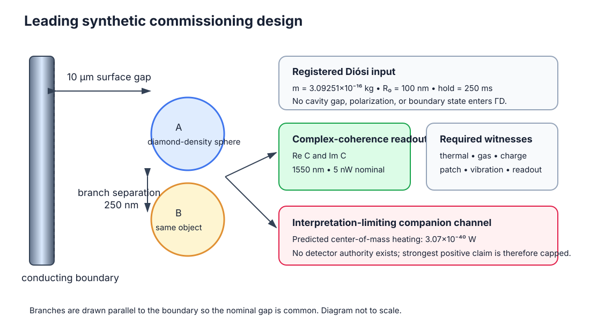
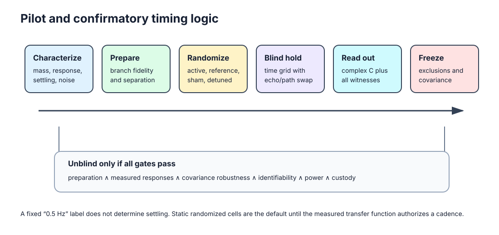
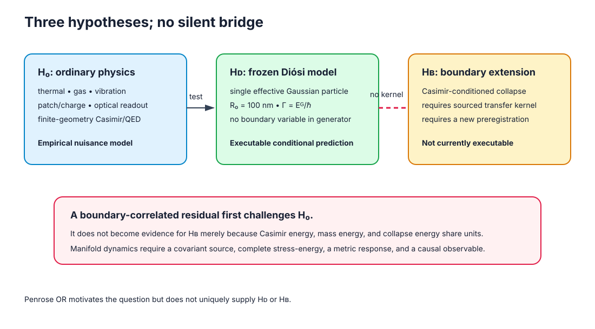
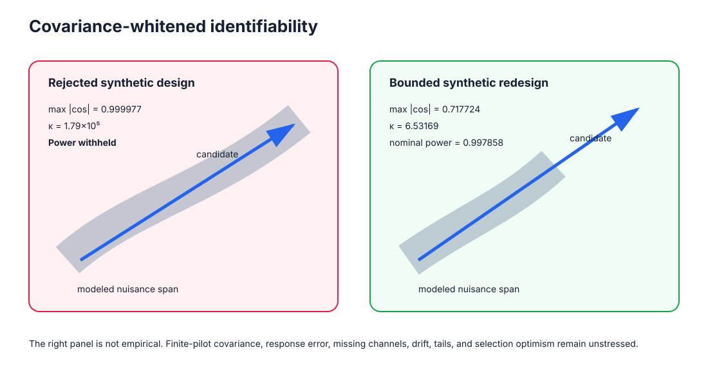
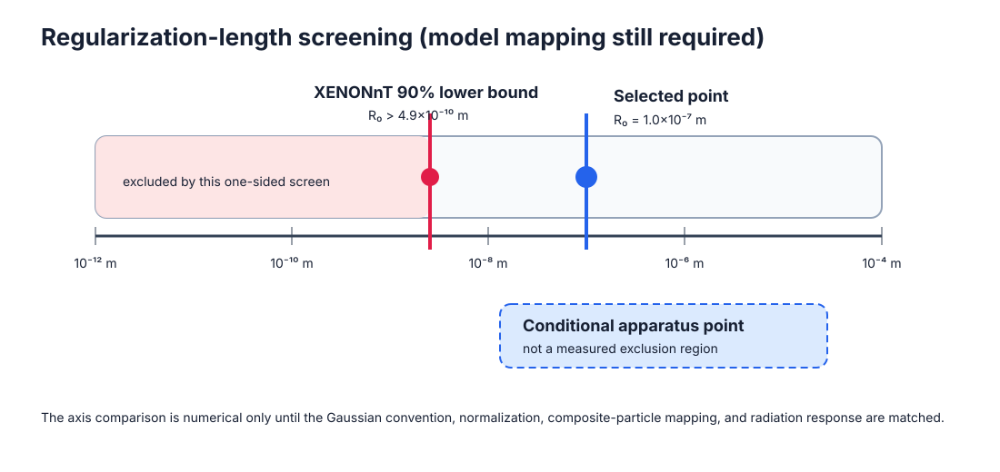
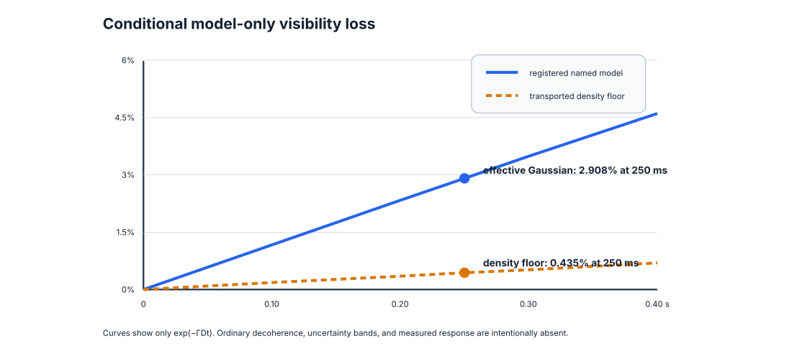

# An Identifiability-First Feasibility Protocol for a Gaussian-Regularized Diósi Collapse Test with a Casimir-Boundary Control

**Document type:** model-specific experimental design and subsystem-commissioning protocol

**Version:** first-reader external-review draft, 24 August 2026

**Authors and affiliations:** to be supplied before external submission

**Corresponding author:** to be supplied before external submission

**External-review status:** protocol/software readiness `PASS`; subsystem
commissioning may proceed; integrated feasibility pilot `NOT AUTHORIZED`; 0 of
8 same-apparatus authority packets ready

> **Scientific standing.** This article does not report measured evidence for
> objective collapse, a physically realized mesoscopic superposition, a
> Casimir-to-collapse coupling, or spacetime-manifold dynamics. It reports a
> model-specific synthetic design result and defines the measurements required
> to determine whether that result survives in hardware.

> **Registration language.** In this draft, *registered* means frozen in a
> versioned executable repository contract. It is not a public, timestamped
> preregistration. A confirmatory protocol must be publicly deposited before
> confirmatory data are inspected.

## Abstract

We propose an identifiability-first feasibility protocol for testing one
specified collapse dynamics: the nondissipative, Gaussian-regularized Diósi
mass-density model for a single effective particle at \(R_0=100\) nm. Penrose
objective reduction motivates the question of finite lifetime for distinct
mass distributions but does not provide the registered master equation. A
nearby Casimir boundary is treated only as an independently controlled
electromagnetic environment. No Casimir variable enters the registered collapse
generator.

The primary observable is complex center-of-mass coherence. The Diósi law and
leading point are frozen, but the crossed mass--separation--hold-time grid must
be qualified during subsystem commissioning and then prospectively frozen. A
covariance-whitened estimator tests whether the Diósi signature remains
identifiable after measured ordinary responses are projected out. A separate
four-cell cross-ratio tests boundary--superposition nonfactorization; the
boundary-independent Diósi factor cancels from this diagnostic when branch
density and separation histories are matched.

Synthetic design screening rejected an initial nonidentifiable apparatus and
found three of 200 bounded configurations that survived the current synthetic
ranking filters. The leading commissioning target is a diamond-density sphere
of mass
\(3.0925\times10^{-16}\) kg, with 250 nm tangential branch separation, 250 ms
hold time, 10 μm boundary gap, 4 K temperature, and \(10^{-15}\) Pa pressure.
The registered effective-particle model predicts 2.908% coherence loss; the
lowest transported mass-density diagnostic gives 0.435%. The selected-world
forecast is 1,028 dimensionless paired allocation units and conditional power
0.927 at 1,600 units. None of these values is empirical or an acquisition-time
estimate.

Only bounded subsystem commissioning is presently authorized. The integrated
feasibility pilot is not: state preparation and selected-specimen mass-density
identity, as-built Green response, material spectra, worldline and phase
covariance, gas-collision kernel, low-statistics four-cell commissioning data,
an independently measurable companion channel, and an exact external-bound
recast are absent. The contribution is therefore a falsifiable design and
fail-closed empirical-readiness contract, not evidence for objective collapse,
Casimir-modified collapse, or manifold dynamics.

**Keywords:** objective collapse; Diósi model; Penrose objective reduction;
matter-wave coherence; Casimir boundary; identifiability; covariance
whitening; experimental design

## 1. Introduction: question, aims, and current result

### 1.1 Scientific context and rationale

Matter-wave and optomechanical proposals have progressively translated
collapse models from broad foundational questions into parameter-specific
experimental signatures. MAQRO derives apparatus requirements from explicit
science requirements; near-field nanoparticle proposals connect a preparation
sequence to predicted collapse-model reach; CANNEX and MAGIS-100 make
systematic-error transfer functions central to instrument design; and
ARCHIMEDES separates its final vacuum-weight measurement from the pathfinder
tasks required to attempt it [24--29]. This study adopts those structural
lessons while addressing a different inference problem: a small coherence
contraction is not evidence for collapse when the same complex-data direction
can be produced by ordinary electromagnetic, thermal, gas, gravitational,
control, or readout processes.

**External empirical precedent.** Coordinated IXPE, NICER, and
Parkes/Murriyang observations of magnetar 1E 1547.0-5408 measured a
\(2\text{--}8\ {\rm keV}\) polarization degree of \(46\pm4\%\), together with
structured rotational-phase and energy dependence. Within the authors'
adopted atmosphere, hotspot-geometry, and radiative-transfer framework,
calculations including magnetospheric strong-field QED vacuum birefringence
described the measured Stokes patterns substantially better than the tested
non-refractive cases [43]. This is external evidence consistent with an
observable, externally conditioned QED vacuum response in its own regime. It
is not a Casimir measurement or an input to the present apparatus and supplies
no collapse rate, gravitational response, or boundary-to-collapse kernel.

Penrose's objective-reduction argument motivates the question of whether
distinct mass distributions have a finite lifetime [4,5]. The numerical
prediction here comes instead from one named Gaussian-regularized Diósi
generator [1--3]. They are not the same theory object. The Casimir boundary is
retained because it creates a tunable electromagnetic environment that can
stress-test the ordinary-physics model; no Casimir variable enters the
registered collapse generator.

The experiment asks:

> After ordinary thermal, electromagnetic, gas, vibration, readout, relativistic
> phase, and boundary-correlated responses have been measured, can the remaining
> complex-coherence data support or exclude the prespecified
> mass--separation--hold-time signature of one regularized Diósi model?

This is intentionally narrower than “does gravity collapse the wave function?”
A sensitive null can constrain only the registered implementation and parameter
region. A positive residual can be associated with that implementation only
when it is identifiable against the measured nuisance span and survives the
prespecified companion and replication rules. Neither outcome establishes
Penrose's spacetime interpretation.

### 1.2 Two aims, not one blended Casimir--collapse claim

The apparatus answers two orthogonal questions:

1. **Primary aim -- named-model scaling.** Test the boundary-independent Diósi
   coherence contraction across mass, branch separation, and hold time after
   ordinary-background closure.
2. **Secondary aim -- boundary interaction.** Test whether the boundary and
   material superposition fail to factorize after the measured electromagnetic
   response is removed. Standard boundary-independent Diósi attenuation
   cancels from this estimator only when the compared cells have matched mass-
   density and branch-separation histories.

**Leading commissioning target:** diamond-density sphere; radius 276.302 nm;
mass \(3.0925\times10^{-16}\) kg; 250 nm tangential separation; 250 ms hold;
10 μm boundary gap; 4 K; \(10^{-15}\) Pa. These are design targets, not achieved
apparatus specifications.

| Test or gate | Experimental contrast | Observable or frozen expectation | Defensible inference | Present authority |
|---|---|---|---|---|
| state feasibility | compact versus verified separated packet | packet centers, covariance, overlap, momentum difference, fidelity, and recombination | failure is an apparatus no-go, not a collapse-model result | no preparation at the registered mass, separation, and hold time has been demonstrated |
| Penrose missing-theory candidate | formal branch objects under one proposed correspondence versus ordinary unitary evolution | Stage-0.1 diagnostic correspondence residuals and weak-field recovery only; no physical rate or prediction vector | a powered test could constrain only a separately completed and frozen candidate | the synthetic correspondence benchmark passes, but 0 of 5 physical reference packets are ready; the parent remains blocked at the scientific branch-correspondence rule |
| primary Diósi test, \(H_{\rm D}\) | prospectively frozen mass, separation, and hold-time cells | \(C=Ve^{i\phi}\); 2.908% named-model loss and 0.435% transported diagnostic benchmark at the leading point | a sensitive null constrains the registered region; a replicated matching contraction is model-consistent phenomenology | complete \(m,d,t\) allocation, complex coherence, nuisance responses, and covariance remain unmeasured |
| boundary interaction | active/reference boundary × separated/compact branches | four-cell ratio \(R_4\); standard boundary-independent Diósi loss cancels for matched mass-density and separation histories | corrected \(R_4\neq1\) establishes a boundary--superposition anomaly, not Casimir-induced collapse | measured Green/FDT response and the four same-apparatus coherence cells are absent |
| ordinary electromagnetic null, \(H_0\) | gap, material, polarization, temperature, sham, and normal/superconducting state | signed phase and contraction from measured material response and a finite-geometry Green tensor | agreement validates the boundary calibration chain; disagreement repairs \(H_0\) first | current values are software fixtures; specimen spectra and the as-built Maxwell solution are absent |
| proper-time and control phase | three-dimensional branch reversal, echo, path swap, local-mass, and rotation controls | signed unitary phase \(\Delta\phi_{\rm prop}=-(mc^2/\hbar)\Delta\tau\) | reversal or echo cancellation identifies ordinary phase contamination | the 0.018007 rad synthetic budget assumes unmeasured \(10^{-4}\) echo rejection |
| same-generator companion | identical \(m,R_0\) parameter point | predicted center-of-mass heating \(\dot E=3.07\times10^{-40}\) W | an independent matching channel could strengthen generator identification | no instrument-level detector receipt is supplied; the strongest positive interpretation is unavailable |
| external and pilot gate | variant-matched external bound plus eight empirical packets | preparation ∧ response ∧ covariance ∧ identifiability ∧ power ∧ custody | every factor must pass before confirmatory planning | scalar external screen only; 0 of 8 authority packets are ready |

Figure 1 shows the proposed geometry. Figure 2 shows the acquisition and custody
sequence.

*Figure 1. The boundary is an electromagnetic control, not a term in the
registered Diósi generator. The two center-of-mass branches are separated
parallel to the boundary so that the nominal surface distance is common to both
branches. Environmental witnesses and a separate companion channel are required
for interpretation.*

*Figure 2. Preparation and branch verification precede the blinded hold. Path
swap, echo, sham-switch, and detuned-boundary cells are randomized. Unblinding
is permitted only after exclusions, response vectors, covariance ancestry, and
analysis code are frozen.*

### 1.3 Evidence tiers and present readiness

Every quantitative statement in this paper belongs to one of five evidence
tiers:

| Evidence tier | Meaning in this paper | Current state |
|---|---|---|
| software recovery | equations, ordering, provenance, and fail-closed behavior recover in synthetic fixtures | available |
| external empirical precedent | a published external measurement supports a relevant ordinary-physics phenomenon or analysis strategy in its own physical regime | magnetar strong-field QED vacuum response [43], as cited context only; no data replay, parameter transfer, apparatus-authority packet, or likelihood contribution |
| public-data component replay | a bounded analysis operation runs on a real external dataset | available separately; no cross-apparatus fusion |
| conditional apparatus forecast | a prediction under the selected synthetic apparatus and covariance assumptions | available, not empirical |
| same-apparatus measurement | jointly acquired preparation, response, covariance, coherence, and companion evidence | absent |

The latest integrated gate therefore reads:

> **Protocol/software readiness: PASS. Subsystem commissioning: permitted.
> Integrated feasibility pilot: NOT AUTHORIZED. Same-apparatus authority
> packets: 0/8 ready. Measured collapse evidence: not ready. Collapse
> identification and manifold dynamics: blocked.**

The 2.908% contraction is presently a single leading-point sensitivity target,
not yet a demonstrated test of the complete \(m,d,t\) law. The acquisition grid,
statistical analysis plan, physical interpretation of a paired allocation unit, and
apparatus-specific systematic budget must be closed by subsystem commissioning
and the integrated feasibility pilot before the 1,028-unit estimate can become
an actionable duration.

Three stages are deliberately distinct. **Subsystem commissioning**, which may
proceed now, produces the eight authority packets and includes only
low-statistics four-cell readout checks, not collapse-model scoring. An
**integrated feasibility pilot** may begin only after all eight packets qualify;
it tests the crossed design, response geometry, covariance, and analysis gates.
A blinded **confirmatory acquisition** may begin only after that pilot passes
and its protocol is publicly preregistered.

### 1.4 What expert review is being asked to decide

This draft is intended to elicit bounded decisions from specialists:

- **mesoscopic-state preparation:** identify or reject a platform capable of
  the registered mass, separation, hold, and recombination;
- **collapse theory:** assess the \(R_0\) choice, composite mass-density map,
  external-bound recast, and companion relation;
- **quantum-gravity foundations:** assess the relational branch-state and
  equivalence-principle preflight, identify a defensible branch-correspondence
  construction, or explain why no such invariant construction is possible;
- **Casimir and macroscopic QED:** specify the selected specimen, measured
  spectra, as-built Green response, force-noise spectrum, and uncertainty;
- **relativistic phase and metrology:** close three-dimensional worldlines,
  echo/path-swap transfer, local gravity, and joint covariance;
- **statistics:** freeze the \(m,d,t\) allocation, likelihood, robustness
  family, stopping rule, and replication criterion.

The study should be judged as a model-specific design and subsystem-
commissioning protocol seeking expert collaboration, not as an experiment-ready
apparatus or a detection claim.

**Reading order.** Sections 2--4 define the tested theory, target state, and
hypotheses. Section 5 maps every observable and ordinary-background channel into
the complex-coherence analysis. Sections 6--9 define reach, pilot admission,
collaboration packets, and inference rules. Detailed runtime chronology,
superseded designs, and machine receipts are retained in the reproducibility
supplement rather than used as scientific evidence.

## 2. Exact tested dynamics

### 2.1 Registered Gaussian-regularized Diósi model

The executable prediction is not a generic “Diósi–Penrose” rate. It is one
named reduced-order implementation: a nondissipative Diósi mass-density master
equation for a single effective particle whose mass-density operator is
Gaussian-smeared over the physical length \(R_0\) [1–3]. The registered
normalization is

<!-- helix-doc-equation-action/v1 id=cdp-stage4-2f-dp-master-model -->
\[
\hat M_{R_0}(\mathbf x)=
m(2\pi R_0^2)^{-3/2}
\exp\!\left[-\frac{|\mathbf x-\hat{\mathbf q}|^2}{2R_0^2}\right],
\qquad
\frac{d\hat\rho}{dt}
=-\frac{i}{\hbar}[\hat H,\hat\rho]
-\frac{G}{2\hbar}
\int d^3x\,d^3y\,
\frac{[\hat M_{R_0}(\mathbf x),
[\hat M_{R_0}(\mathbf y),\hat\rho]]}
{|\mathbf x-\mathbf y|}.
\tag{1}
\]

The implementation freezes this standard-deviation convention, the mass
representation, and \(R_0\). A paper using a different Gaussian width convention
must transform \(R_0\) before comparing rates.
For two branches of the same effective Gaussian particle, with mass m and
center separation d, the registered self-energy difference is

<!-- helix-doc-equation-action/v1 id=cdp-stage4-2g-single-identity-dp -->
\[
E_G(m,d,R_0)=Gm^2\left[
\frac{1}{\sqrt{\pi}R_0}
-\frac{\operatorname{erf}(d/2R_0)}{d}
\right],
\qquad
\Gamma_{\rm D}=\frac{E_G}{\hbar},
\qquad
\mathcal V_{\rm D}(t)=e^{-\Gamma_{\rm D}t}.
\tag{2}
\]

The d→0 limit is evaluated analytically. A Fourier-space Simpson quadrature is
used only as a numerical cross-check; its softening parameter is not the
physical cutoff.

For the leading synthetic commissioning point,

\[
\begin{aligned}
m &=3.0925053\times10^{-16}\ {\rm kg},\\
d &=2.50\times10^{-7}\ {\rm m},\\
R_0&=1.00\times10^{-7}\ {\rm m},\\
E_G&=1.2448784\times10^{-35}\ {\rm J},\\
\Gamma_{\rm D}&=1.1804586\times10^{-1}\ {\rm s^{-1}},\\
\tau_{\rm D}&=8.47128\ {\rm s}.
\end{aligned}
\tag{3}
\]

At t=0.25 s,

\[
1-\mathcal V_{\rm D}
=1-e^{-\Gamma_{\rm D}t}
=2.90803\times10^{-2}
=2.90803\%.
\tag{4}
\]

This is the registered effective-Gaussian forecast for the leading design. A
second value is required because the mass-density representation is not yet an
empirical authority. Transporting the existing representation envelope gives
an exponent of 0.00435852, or 0.434903% loss at the same hold time. This is the
lowest transported diagnostic forecast among the representations evaluated so
far, not a physical lower bound: selected-specimen homogeneous, layered,
coarse-grained, and atomistic maps remain uncomputed. Neither value is a total
measured-visibility forecast.

#### 2.1.1 From Schrödinger evolution to the measured residual

The experiment does not measure \(E_G\) directly. Its theoretical target is the
off-diagonal center-of-mass density-matrix element
\(\rho_{AB}(t)=\langle A|\hat\rho(t)|B\rangle\), or its normalized form
\(c_{AB}(t)=\rho_{AB}(t)/\rho_{AB}(0)\). Section 5 defines the calibrated fringe
estimator used to infer this quantity; the two are not identified without that
readout map.
For two Hamiltonian energy eigenstates, ordinary Schrödinger evolution gives

\[
|\psi(t)\rangle
=c_1e^{-iE_1t/\hbar}|E_1\rangle
+c_2e^{-iE_2t/\hbar}|E_2\rangle,
\qquad
\rho_{12}(t)=c_1c_2^*e^{-i(E_1-E_2)t/\hbar}.
\]

Thus the beat frequency is \((E_1-E_2)/\hbar\), while
\(|\rho_{12}(t)|=|c_1c_2^*|\) remains constant in an ideal closed system. The
energy variance
\(\sigma_H^2=\langle H^2\rangle-\langle H\rangle^2\) describes the outcome
spread of Hamiltonian-energy measurements; it is not the gravitational
mass-density difference energy \(E_G\). The localized apparatus branches
\(|A\rangle\) and \(|B\rangle\) need not themselves be stationary energy
eigenstates, so the experiment reconstructs their projected complex coherence
rather than assuming a literal two-line atomic spectrum.

For the registered hypothesis lanes, a transparent reduced branch-basis ansatz
is

<!-- helix-doc-equation-action/v1 id=cdp-stage4-2j-schrodinger-coherence-factorization -->
\[
c_{AB}(t)=
e^{-i\hbar^{-1}\int_0^t\Delta E_H(t')dt'}
e^{-\chi_{\rm env}(t)}
e^{-\int_0^t\Gamma_{\rm D}[d(t')]dt'}.
\tag{5}
\]

The Hamiltonian energy difference \(\Delta E_H\) rotates phase. The ordinary
open-system functional \(\chi_{\rm env}\) represents environmental contraction
after the environment is traced out. The final factor is the additional
nonunitary contraction of the frozen Diósi model, with
\(\Gamma_{\rm D}=E_G/\hbar\). This product is authorized only when the effective
channels are additive and separable (or commute in the reduced description),
the branch histories are fixed, and no boundary--collapse coupling is present.
For coupled or noncommuting dynamics the campaign must instead register and
solve a joint master equation or time-ordered propagator. Constant
\(\Delta E_H\), \(E_G\), and separation reduce Eq. (5) to the simpler exponential
form used by the current synthetic fixture. Equal units do not make these
objects interchangeable: a Schrödinger energy variance, a photon frequency,
and the gravitational mass-density difference energy are not the same source
term.

After ordinary loss has been estimated from blinded controls, a remaining
scalar contraction can be expressed as

<!-- helix-doc-equation-action/v1 id=cdp-stage4-2j-dp-equivalent-energy-inverse -->
\[
E_{\rm loss,eq}
=-\frac{\hbar}{t}
\ln\!\left|c_{AB,{\rm residual}}(t)\right|.
\tag{6}
\]

Equation (6) is a conditional equivalent loss scale, not a calorimetric
measurement of gravitational energy. It may be identified with \(E_G\) only
after independently constrained ordinary loss has been removed and the
registered Diósi-only exponential fixture is the model under test. The full
whitened complex estimator in Eqs. (12)--(13), rather than this scalar summary,
remains authoritative for distinguishing phase, loss, and correlated nuisance
responses.

#### 2.1.2 Closed-system mass and energy accounting

The measured neutral-specimen mass is the authoritative \(m\) for an admitted
apparatus identity. It already includes nuclear and electron rest masses and
their binding and internal-energy contributions; none may be added again as an
independent "electron weight." Absorption or emission changes the energy of a
closed system by \(\pm h\nu\), and therefore its energy-equivalent mass by
\(\pm h\nu/c^2\), but the same quantum is not also counted as a second mass
source. Charge, current, polarizability, and photon exchange remain in the
ordinary electromagnetic response lane.

Only the branch-dependent total mass density enters
\(\Delta\rho=\rho_A-\rho_B\). Common internal energy cancels from that
difference; branch-correlated energy retained by the environment, boundary,
supports, or readout does not cancel and must be carried in the complete
joint-system ledger. Consequently any cross-ratio cancellation of Diósi loss
requires identical complete branch-correlated mass-density histories,
regularization, separation, exposure, and preparation in the paired cells.
Otherwise each cell receives its own integrated \(E_G\) calculation.

#### 2.1.3 Constituent mass density changes the forecast

Equation (2) treats the apparatus as one effective Gaussian particle. Stage
4.2J also evaluates a homogeneous sphere of physical radius \(R\), convolved
with the identical Gaussian regularization \(R_0\). Its radial Fourier form is

<!-- helix-doc-equation-action/v1 id=cdp-stage4-2j-homogeneous-sphere-energy -->
\[
E_G^{\rm sphere}
=\frac{2Gm^2}{\pi R_0}\int_0^\infty du\,e^{-u^2}
\left[\frac{3(\sin q-q\cos q)}{q^3}\right]^2
\left[1-\frac{\sin(ud/R_0)}{ud/R_0}\right],
\qquad q=\frac{uR}{R_0}.
\tag{7}
\]

For the earlier silica reference, the converged homogeneous-sphere diagnostic
was 0.249896 of its effective-Gaussian energy. The subsequent representation
audit widened the registered envelope to a factor of 6.77099. The bounded search
transports that factor to the leading candidate rather than pretending that a
diamond-density label supplies an atomistic density map. This yields the
0.434903% transported diagnostic benchmark quoted above. A direct homogeneous,
layered, coarse-grained, and atomistic calculation for the selected specimen
remains blocked pending provenance-bound density and coating inputs.

#### 2.1.3 Cheap feasibility screens precede power

For an ideal equilibrium residual gas, the conservative screen uses

<!-- helix-doc-equation-action/v1 id=cdp-stage4-2j-residual-gas-screen -->
\[
n=\frac{P}{k_BT},\qquad
\bar v=\sqrt{\frac{8k_BT}{\pi m_g}},\qquad
\Gamma_{\rm coll}^{\rm screen}=n\bar v\,\pi R^2.
\tag{8}
\]

The earlier \(2\times10^{-11}\) Pa silica reference failed this screen. The
leading design therefore registers 4 K and \(10^{-15}\) Pa. Its transported
transported QLBE proxy gives
\(\Gamma_{\rm gas}=8.64118\times10^{-4}\ {\rm s^{-1}}\), or 0.007320 of the
registered Diósi rate. This clears the synthetic one-tenth-Diósi gate, but it is not
a measured vacuum receipt or a complete collisional decoherence kernel [13].
Species-resolved differential scattering, confinement, pressure calibration,
and collision-veto performance must replace the proxy. The leading mass is
also about \(1.0955\times10^6\) times the 170 kDa cross-platform benchmark
cited in Ref. [6], so state preparation remains the first independent hardware
gate.

Hydrogen and Rydberg scales remain useful dimensional calibration checks. The
registered \(E_G\) is about \(5.71\times10^{-18}\) of the Rydberg energy, but
that ratio supplies neither a cavity coupling nor a collapse mechanism. It
only states the scale of the residual that the coherence estimator would infer
if the frozen Diósi model were selected after ordinary channels were excluded.

### 2.2 Penrose OR motivation, notation, and scope

Penrose's objective-reduction argument motivates an order-of-magnitude lifetime
\(\tau_{\rm OR}\sim\hbar/E_G\) for incompatible mass distributions [4,5].
That heuristic and Eq. (2) share a gravitational self-energy scale, but they
are not the same theory object:

| Question | Penrose OR motivation | Registered Diósi runtime |
|---|---|---|
| Why consider finite branch lifetime? | incompatibility of alternative spacetime geometries | not supplied |
| Numerical lifetime scale | \(\tau\sim\hbar/E_G\) | \(\Gamma=E_G/\hbar\) |
| Stochastic master equation | not uniquely specified | specified |
| Gaussian cutoff R0 | not fixed by OR | frozen at 100 nm |
| Diffusion/heating companion | not uniquely specified | specified |
| Casimir-boundary modifier | not supplied | absent |

Consequently, an exclusion of Eq. (2) is not an exclusion of every
Penrose-motivated theory. A match to Eq. (2) is not direct evidence for
spacetime “snapping” or manifold instability.

#### 2.2.1 A registered missing-theory program, not a new prediction

The equivalence-principle argument can be made more precise without pretending
that it is already complete. Penrose's concern is not merely that a
gravitational potential appears in a quantum Hamiltonian. Each superposed mass
distribution would define a different freely falling or spacetime description,
and general relativity supplies no automatic point-by-point identification of
the events, clocks, and time translations belonging to those alternatives
[4,34]. Competing quantum-reference-frame work also shows why equivalence plus
superposition should not be presented as a theorem that uniquely implies
collapse [35].

We have therefore registered a Stage-0 **relational branch-incompatibility
candidate**. A branch is formally represented by its manifold, metric, quantum
state, complete renormalized stress tensor, and physical reference system. The
candidate then asks for four structures that Penrose's lifetime notation alone
does not supply:

1. a relational rule identifying physical events and clocks across the two
   branches;
2. a gauge-independent incompatibility functional with energy units that
   recovers the Newtonian \(E_G\) expression;
3. a causal reduction dynamics with a survival distribution, Born
   probabilities, normalization, no-signalling, vacuum stability, and
   energy--momentum bookkeeping; and
4. a projection into both quadratures of measured complex coherence plus an
   independently testable companion or a sourced reason that none occurs.

In this program, \(E_I\) names the not-yet-supplied covariant branch-
incompatibility functional. Its required stationary Newtonian recovery is
\(E_I^{N}\rightarrow E_G\), where \(E_G\) is the weak-field mass-density energy
used in Eq. (2). Recovering \(E_G\) therefore checks a limit; it does not define
\(E_I\).

These requirements reflect known difficulties in relativistic reduction and
semiclassical/stochastic-gravity programs [36--38]. The maintained preflight
stops deterministically at
`PCT_BRANCH_CORRESPONDENCE_MISSING`. It records
\(\tau_{\rm OR}\sim\hbar/E_G\) only as a heuristic scale, returns no numerical
collapse rate, admits no held-out prediction vector, and makes no empirical
validation claim. A schema-complete future definition would still remain
Stage 0 until a separate source-backed calculator, recovery tests, and
preregistration passed.

#### 2.2.2 Stage-0.1 relational-correspondence benchmark

The first missing step now has an executable benchmark without being declared
solved. In a static weak-field laboratory domain, a branch-blind apparatus
clock and three apparatus fiducials define a shared relational label space
\(B_{\rm lab}\). Two embeddings, \(X_A:B_{\rm lab}\rightarrow\mathcal M_A\)
and \(X_B:B_{\rm lab}\rightarrow\mathcal M_B\), give the proposed local event
correspondence
\(\varphi^{\rm corr}_{A\rightarrow B}=X_B\circ X_A^{-1}:
X_A(B_{\rm lab})\rightarrow X_B(B_{\rm lab})\). The superposed probe is not
allowed to be the sole anchor because that could align away the displacement
being tested. This is a local affine material-reference proxy, not a computed
Fermi/radar chart or a preferred global map between arbitrary spacetimes
[35,39--42].

The frozen benchmark requires identity recovery, an invertible map and inverse,
branch-swap symmetry, invariance under independent rigid coordinate
redescriptions, preservation of a known branch displacement, equality of the
declared common-acceleration and common-potential inputs, agreement between two
independently named reference sets, coverage of the declared \(6R_0\) Gaussian
finite-support proxy in every primary and alternate chart, and recovery of the
Gaussian Newtonian target in Eq. (2). The exact named gate ledger in the
content-addressed Stage-0.1 report is authoritative:

<!-- helix-doc-equation-action/v1 id=cdp-penrose-stage0-1-correspondence-gate -->
\[
\mathcal G_{\rm corr}
=\mathcal G_{\rm id}\wedge\mathcal G_{\rm inv}
\wedge\mathcal G_{\rm swap}\wedge\mathcal G_{\rm coord}
\wedge\mathcal G_{\rm sensitivity}\wedge\mathcal G_{\rm common}
\wedge\mathcal G_{\rm ref}\wedge\mathcal G_{E_G}.
\]

The displayed conjunction is a grouped mnemonic, not an alternate gate list:
`G_ref` expands to the reference-subsystem, branch-map, declared-support,
causal-order, alternate-reference, and reference-spread rows; `G_inv` expands
to Jacobian and inverse-map rows; `G_coord` is rigid relabeling only;
`G_common` is common-input equality only; and the authoritative ledger also
contains its explicit output-policy row.

All synthetic gates pass. The pulled-back branch-center separation is
\(2.5000\times10^{-7}\) m; the registered analytic target is
\(1.2448784\times10^{-35}\) J; and the independently integrated Fourier value
is \(1.2448786\times10^{-35}\) J, a relative discrepancy of
\(1.88\times10^{-7}\). The identity target and branch-swap residual are zero,
and the independent coordinate-relabel residual is
\(3.56\times10^{-22}\) m.

That is a software/theory recovery result. All five physical authority packets:
measured worldlines, clock/pulse dictionary, as-built landmarks and tetrads,
selected-specimen density support, and reference-choice covariance, remain
`not_ready`. The scientific standing therefore stops at
`PRC_REFERENCE_RECEIPTS_MISSING`, and the parent Stage-0 candidate remains at
`PCT_BRANCH_CORRESPONDENCE_MISSING`.
The frozen v1 schema cannot be filled in place to claim readiness; measured
packet admission requires a versioned successor with path, hash, custody,
calibration, and uncertainty validation.

Passing Stage-0.1 shows that one proposed local correspondence survives frozen
local affine and rigid-relabeling tests;
it does not select a unique physical correspondence, establish a covariant
incompatibility functional, or generate a lifetime, collapse rate, coherence
law, Casimir modifier, or model-comparison row. The content-addressed gate ledger is in the
[Stage-0.1 report](./casimir-dp-penrose-relational-correspondence-stage0-1-report.md).
The rigid-relabeling pass is not arbitrary diffeomorphism covariance, and
common-input equality is not the still-blocked full equivalence-principle
recovery obligation.

The boundary policy is deliberately independent. At matched branch mass-density
and trajectory histories, changing the Casimir boundary does not modify this
intrinsic candidate. Any proposed boundary modifier is a different model and
must pass the existing tensor/noise/retarded-response manifold registry. Thus
the experiment remains two-axis: an admitted mass--separation--time campaign
would test the frozen Diósi model; a future Penrose candidate would require its
own completed dynamics, prospective freeze, and admission before it could be
tested;
the four-cell estimator separately tests boundary-superposition
nonfactorization.

The full obligation, nonbridge, falsifier, and outcome ledger is preserved in
the [Stage-0 candidate preflight report](./casimir-dp-penrose-candidate-theory-stage0-report.md).

### 2.3 Mass-density representation is part of the hypothesis

The leading object's geometric radius is 276.3 nm, but Eq. (2) treats its
center of mass as one Gaussian-smeared effective particle. This is not
equivalent to resolving a selected specimen's atomic or layered density. The
current representation audit is:

| Representation of the same apparatus | Current standing | Consequence |
|---|---|---|
| single effective Gaussian particle | executable; Eq. (2) | 2.90803% leading-design forecast |
| transported representation envelope | executable diagnostic benchmark | 0.434903% lowest transported result evaluated so far; not a selected-specimen bound or map |
| homogeneous selected sphere | not yet recomputed for the selected material identity | bulk-profile dependence unresolved |
| coated or layered selected sphere | not computed | coating dependence unknown |
| coarse-grained or atomistic selected density | no admissible density provenance | granularity dependence unknown |
| R0 sweep with converged selected representations | sensitivity-only calculations exist | parameter stability unresolved |

Therefore this article proposes a test of the effective-particle Diósi model,
not a representation-independent test of the broader collapse-model family. A revised confirmatory
analysis must either demonstrate stability across physically defensible mass
representations or preserve that narrower claim in its title and conclusion.

## 3. Leading Synthetic Commissioning Design

The following manifest is the current target for measured subsystem
commissioning. It supersedes earlier design assumptions for forward planning,
but it does not claim an as-built apparatus or physical feasibility.

| Field | Leading design value | Evidence role |
|---|---:|---|
| identity | `stage4_2m_candidate_002` | frozen synthetic search identity |
| material and geometry | diamond-density sphere | bounded-search assumption; specimen not selected |
| radius | 276.302 nm | derived from frozen mass/material identity |
| mass | \(3.0925053\times10^{-16}\ {\rm kg}\) \(1.86235\times10^{11}\ {\rm Da}\) | frozen model input |
| branch separation | 250 nm, parallel to boundary | frozen model input |
| principal hold time | 250 ms | frozen model input |
| hold-time requirement | include prespecified shorter and longer cells | identifiability check |
| nominal surface gap | 10 μm, common to both branches | boundary-control input |
| finite plate size | 80 μm × 80 μm | transported finite-geometry input |
| boundary program | static randomized cells; nominal cadence label 0.5 Hz | transfer function unmeasured |
| primary sequence | Ramsey-type branch preparation/recombination | design assumption |
| control sequences | identical-branch/sham splitter, echo, path swap, sham switch, detuned boundary | required nuisance and interaction discrimination |
| temperature | 4 K | design target, unmeasured in integrated apparatus |
| pressure | \(1\times10^{-15}\ {\rm Pa}\) | design target, unmeasured in integrated apparatus |
| registered echo residual | \(1\times10^{-4}\) | synthetic control assumption |
| vibration target | \(5\times10^{-10}\ {\rm m\,s^{-2}\,Hz^{-1/2}}\) | design target |
| readout | 1550 nm, 5 nW nominal | design assumption |
| polarization | circular-control pair plus linear-basis checks | electromagnetic witness |
| companion channel | center-of-mass energy increase | detector authority absent |
| settling rule | to be measured and frozen from transfer-function data | not inherited from old design |

The “0.5 Hz” value is a configuration label, not permission to assume that a
two-second cycle is quasistatic. No continuous modulation or ten-second
settling rule is admitted until the measured boundary-to-apparatus transfer
function defines a compatible sequence. Static randomized cells are the
default pilot implementation.

### 3.1 Design selection status

The current diamond-density target follows two explicit rejections: the first
candidate was nuisance-collinear, and the later silica parent failed the
combined gas, phase, and preparation screens. The complete stage-by-stage
crosswalk is preserved in Section 8.1 of the reproducibility supplement.
“Frozen” means immutable within a particular run; it does not make a superseded
run the current proposal. Only the manifest above is used for forward
commissioning.

### 3.2 The dominant scale gap

The leading mass is approximately \(1.86235\times10^{11}\) Da. Matter-wave
interference has recently been demonstrated for sodium clusters above
170,000 Da [6]. The proposed object is therefore about
\(1.0955\times10^6\) times more massive than that free-particle interference
benchmark. The comparison is not a universal impossibility theorem—trapped
mechanical systems use different state-preparation strategies—but it prevents
the manuscript from treating preparation as an ordinary checklist item.

State preparation is the first physical go/no-go:

1. verify the object's mass and internal-state distribution;
2. demonstrate coherent branch preparation at the registered separation;
3. verify the 250 ms branch hold without conditioning on successful
   recombination;
4. measure visibility and phase stability over the full control schedule;
5. show that the preparation procedure does not itself generate the fitted
   nuisance signature.

Until these steps are demonstrated, the leading 1,028-window requirement and
1,600-window planning ceiling are not actionable acquisition durations. The
older 542-unit value remains only a parent-design record.

### 3.3 Platform position and required preparation receipt

This study is presently platform-agnostic. “Ramsey-type
preparation/recombination” identifies the required logical sequence; it is not
a demonstrated preparation Hamiltonian or a selected hardware implementation.
The bounded preparation-scale screen used in the apparatus search was a mass,
geometry, and separation filter. It supplies no evidence that the leading
state can be prepared. The diamond sphere is therefore a target-state
specification awaiting a platform receipt, not a build-ready apparatus.

A qualifying receipt must provide the preparation/control Hamiltonian and the
trap, cooling, splitting, hold, recombination, and readout sequence; measured
mass and internal state; three-dimensional packet centers and covariance;
packet width, overlap, momentum difference, and trajectory; preparation and
recombination fidelity including failed attempts without success-conditioned
postselection; survival during the 250 ms hold; preparation-induced heating,
charge, magnetic, optical, vibration, and boundary-correlated responses; and
the sham, echo, path-swap, cycle-time, and duty-time characterization.

If no platform demonstrates the registered state while satisfying packet
equivalence and covariance gates, the candidate is rejected and its power and
window forecasts remain non-actionable. That is an apparatus no-go and carries
no inference about the Diósi model.

### 3.4 Operational status of the \(m,d,t\) scaling test

The leading manifest defines a point prediction at
\(m=3.0925053\times10^{-16}\) kg, \(d=250\) nm, and \(t=250\) ms. The 2.908%
forecast can test pointwise compatibility with Eq. (2), but cannot by itself
establish the complete mass--separation--hold-time dependence. The superseded
silica grid is not transported to the diamond candidate.

Before confirmatory freeze, pilot capability measurements must populate and
power a current-platform crossed grid. The existing hold-time contract requires
a zero-time intercept, at least four distinct hold times, and a positive-time
span of at least a factor of four. The exact current-platform times, mass/density
cohorts, nonzero separations, allocation, and hierarchical model remain
`not_ready`. Mass/material changes are between-object effects, not within-object
knobs, and each cohort requires its own geometry, density, charge,
polarizability, surface-response, and gas-scattering characterization.
Separation cells must preserve the common boundary distance and measured
three-dimensional branch geometry.

If an identifiable crossed grid cannot be realized, the experiment may report
only pointwise compatibility or exclusion at the cells actually measured. It
must not claim confirmation of the \(m,d,t\) scaling law.

## 4. Hypotheses separated before data

*Figure 3. The ordinary-physics null, the frozen effective-particle Diósi
generator, and a possible boundary-to-collapse extension are separate
hypotheses. A Casimir-correlated residual cannot move from the left branch to
the right branch without a registered transfer kernel and new data.*

### 4.1 Ordinary-physics null, H0

H0 contains all registered ordinary mechanisms that can alter complex
coherence:

- blackbody emission, absorption, scattering, and temperature drift;
- residual-gas collision and recoil;
- patch potentials, charge, dielectric response, and electromagnetic forces;
- vibration, tilt, support motion, and clock error;
- optical back-action, detector self-noise, and analysis leakage;
- boundary switching, material hysteresis, and finite-geometry Casimir/QED
  response.

The nuisance model is empirical. Textbook formulas provide priors and
dimensional checks, not a substitute for measured response vectors.

### 4.2 Frozen Diósi hypothesis, HD

HD adds Eq. (2) to H0 with the mass, separation, R0, and hold-time law frozen
before confirmatory data. The Casimir gap and modulation state do not enter the
collapse generator. Under complete joint-system equivalence, standard HD
therefore predicts the same collapse term in boundary-active and
boundary-reference cells.

### 4.3 Lane C: boundary-conditioned extension, HB

HB is a future model slot in which a Casimir boundary changes collapse or
coherence through an explicitly sourced transfer kernel. No such kernel is
registered. The ideal Casimir energy [11],

<!-- helix-doc-equation-action/v1 id=cdp-casimir-energy-per-area -->
\[
\frac{E_{\rm C}}{A}=-\frac{\pi^2\hbar c}{720a^3},
\qquad
P_{\rm C}=-\frac{\pi^2\hbar c}{240a^4},
\tag{9}
\]

does not define a map from plate gap a to \(\Gamma_{\rm D}\). Real-material
Lifshitz theory [12], finite geometry, temperature, patches, roughness, and
nonequilibrium response belong first in H0.

### 4.4 Manifold-response hypothesis

The motivating manifold statement is a research question, not an admitted
mechanism: if alternative mass configurations source incompatible
gravitational geometries, a collapse-like lifetime might scale with a
gravitational self-energy. The present nonrelativistic master equation is a
separate phenomenological Diósi model that uses the same Newtonian self-energy
scale. It neither realizes nor directly tests Penrose's manifold hypothesis. A
spacetime claim would
additionally require a covariant source, a complete apparatus stress-energy
tensor, a specified dynamical metric response, and a causal observable. Those
objects are absent.

#### 4.4.1 QED-vacuum precedent and the gated bridge

The magnetar vacuum-birefringence result is relevant in one precise sense: it
is empirical evidence that a strong external field can make photon propagation
through the QED vacuum polarization dependent [43]. It does **not** measure a
Casimir stress tensor, gravitational curvature, coherence loss, or objective
collapse, and none of its field strengths, atmosphere, geometry, or fitted
amplitudes is transferred into this apparatus. The study therefore represents
the proposed connection as three blocked obligations rather than one inferred
arrow.

First, the complete branch-and-boundary-conditioned source would have to be
constructed:

<!-- helix-doc-equation-action/v1 id=cdp-branch-conditioned-total-stress-energy -->
\[
\Delta T_{\mu\nu}^{AB,\beta}(x)
=T_{\mu\nu}^{A,\beta}(x)-T_{\mu\nu}^{B,\beta}(x),
\qquad
\nabla^\mu T_{\mu\nu}^{j,\beta}=0.
\]

Here each \(T_{\mu\nu}^{j,\beta}\) must include the material object, plates,
supports, classical electromagnetic fields, and renormalized QED contribution
without double counting. A Casimir pressure, negative renormalized scalar
energy density, or polarization-dependent refractive index is not by itself
this conserved tensor.

Second, a gravitational response model would have to map the complete source
and its fluctuations into a gauge-controlled, causal metric response:

<!-- helix-doc-equation-action/v1 id=cdp-boundary-metric-response-slot -->
\[
\delta g_{\mu\nu}^{AB,\beta}
=\frac{8\pi G}{c^4}
G^{\rm ret}_{\mu\nu\rho\sigma}*\Delta T_{AB,\beta}^{\rho\sigma},
\qquad
N_{\mu\nu\rho\sigma}^{AB,\beta}(x,x')
=\frac12\left\langle
\left\{\hat t_{\mu\nu}(x),\hat t_{\rho\sigma}(x')\right\}
\right\rangle_{\rm ren}.
\]

This is a notation slot, not an apparatus calculation. The retarded kernel,
gauge, boundary conditions, renormalization, noise kernel, covariance, and GR
recovery limits are not registered. In particular, an effective optical metric
is not automatically the gravitational metric.

Third, even a validated metric or stress-noise response would still require a
separate physical law mapping it into complex matter-wave coherence:

<!-- helix-doc-equation-action/v1 id=cdp-boundary-conditioned-coherence-extension -->
\[
C_\beta(t)=C(0)
e^{i\Phi_{{\rm EM},\beta}(t)-\chi_{0,\beta}(t)}
e^{-\Gamma_{\rm D}t}
e^{-\chi_{{\rm bridge},\beta}(t)},
\qquad
\chi_{{\rm bridge},\beta}
=\mathcal D_{\rm coh}[\delta g^{AB,\beta},N^{AB,\beta};\theta],
\quad \mathcal D_{\rm coh}\ \text{not registered}.
\]

The first factor is the measured ordinary electromagnetic phase and loss, the
second is the frozen boundary-independent Diósi prediction, and the last is the
hypothetical extension. A support-eligible extension would need causal and
normalization consistency, a complete-positive or explicitly justified
alternative dynamics, recovery limits, a companion prediction, and powered
held-out replication. Until then, all three nodes are Stage-0, noncomputable,
and non-promotable in the Theory Badge graph.

Only after that non-biological chain survived replication could it constrain an
Orch-OR or biological model. It would still not establish microtubule
coherence, neural relevance, consciousness, or evolutionary control; each
biological proposal would need its own prepared state, mass-density map,
lifetime prediction, ordinary-decoherence budget, and independent falsifier.

#### 4.4.2 Conditional evolutionary coherence control

The scientifically admissible evolutionary implication is not that life
"seeks coherence" or that collapse contains purpose. It is narrower: **if** a
replicated intrinsic coherence lifetime exists, natural selection could in
principle favor heritable molecular geometries, dielectric environments,
collective modes, or operating times that let a useful transformation finish
before that lifetime expires. The selected object would be an operational
phenotype and its functional consequence, not coherence as an abstract good.

The Theory Badge graph therefore admits the hypothesis only through the
following dependency gate:

<!-- helix-doc-equation-action/v1 id=cdp-evolutionary-coherence-control-conditional-gate -->
\[
\operatorname{Admit}(H_{\rm evo})=
R_{\rm bridge}^{\rm rep}
\land M_{\rm bio}
\land (\tau_{\rm coh}-\tau_{\rm function}>0)
\land h_z^2>0
\land \operatorname{Cov}(w,z)\ne0
\land R_{\rm selection}^{\rm rep}.
\]

Here \(R_{\rm bridge}^{\rm rep}\) is a powered replicated non-biological
result, \(M_{\rm bio}\) is a separately validated biological state and
mass-density mapping, \(z\) is a prespecified measurable phenotype, \(h_z^2\)
records heritable variation, and \(w\) is reproductive or survival fitness.
The final term requires a replicated phylogenetic, selection, or experimental-
evolution response after ordinary biochemical mechanisms are modeled. These
conditions are all presently absent. The badge is consequently Stage-0,
noncomputable, and non-promotable.

This dependency makes the implication falsifiable in both directions. A
positive non-biological result need not produce a biological adaptation; and a
negative comparative or experimental-evolution result would constrain this
life extension without falsifying the underlying non-biological coherence law.
Neither outcome establishes Orch-OR, consciousness, intention, or teleology.

### 4.5 Compton-frequency non-bridge

Rest energy may be written as a frequency,
\(\nu_{\rm C}=mc^2/h\), and the collapse energy as
\(\nu_G=E_G/h\). Atomic, QED, Higgs, blackbody, Zeeman, Stark, Maxwell, and
gravitational benchmarks use compatible energy and frequency units. That
compatibility is valuable for calibration and unit recovery but does not
create a coupling between cavity modes and collapse:

<!-- helix-doc-equation-action/v1 id=cdp-frequency-cavity-bridge-gate -->
\[
\mathcal K_{\mathrm{boundary}\rightarrow
\mathrm{branch/coherence}}\quad\text{is not registered}.
\tag{10}
\]

The same rule applies to light cones, spinors, gravitational waves, Jeans
instability, Schwarzschild radii, and mass–energy equivalence. They validate
parts of relativistic or quantum notation; they do not supply Eq. (10).

## 5. Complex-coherence estimator and identifiability

The primary datum is not a fitted scalar decay constant. After a calibrated
readout maps fringe quadratures to the branch basis, each control cell supplies
the complex fringe-coherence estimator

\[
C_k(t)=\langle e^{i\phi}\rangle_k
=\operatorname{Re}C_k+i\,\operatorname{Im}C_k.
\tag{11}
\]

Here \(C_k\) is the calibrated fringe observable before zero-hold
normalization; it is related to \(\rho_{AB}\) by the registered readout model.
Section 5.1 defines
\(\bar C_k(t)=C_k(t)/C_k(0)\), which estimates the normalized theoretical
coherence \(c_{AB}\). Real and imaginary components retain phase rotations that
a visibility-only analysis would discard. Recovery after independent phase
conditioning, echo, or path swap diagnoses reversible dephasing rather than
intrinsic contraction. A non-exponential line shape alone is not evidence for
collapse: prespecified ordinary and Diósi line shapes must be compared on the
complete hold-time grid. Let y be the stacked real vector of all components,
X the matrix of registered nuisance signatures, sD the frozen Diósi signature,
and Σ the block covariance. Whitening gives

<!-- helix-doc-equation-action/v1 id=cdp-stage4-2c-control-response-whitening -->
\[
\tilde y=L^{-1}y,\qquad
\tilde X=L^{-1}X,\qquad
\tilde s_{\rm D}=L^{-1}s_{\rm D},
\qquad LL^{\mathsf T}=\Sigma.
\tag{12}
\]

The collapse-sensitive component is the part orthogonal to the whitened
nuisance span:

\[
s_\perp=(I-P_{\tilde X})\tilde s_{\rm D}.
\tag{13}
\]

**Integrated ordinary-physics authority map.** The response-function discipline
used in mature interferometer and force-metrology proposals is applied here as a
fail-closed requirement [24--29]. Each channel must be propagated into the same
complex-coherence space and joint covariance used by Eqs. (12)--(13).

| Channel | Transfer to the measured datum | Reversal or witness | Required authority | Current standing |
|---|---|---|---|---|
| state preparation, recombination, and specimen identity | packet mismatch, phase, contrast loss, or wrong mass-density representation | sham split, path swap, tomography, failed-attempt ledger, mass/coating assay | measured packet/worldline and specimen-density receipt for every boundary state | absent |
| material and electromagnetic response | finite-geometry QED phase, force gradient, heating, and FDT contraction | gap, polarization, detuning, impedance state, independent solver | as-built geometry, measured spectra, Green tensor, convergence, and covariance | synthetic fixture only |
| gas and thermal environment | collisional and radiative contraction, drift, and heating | species/pressure/temperature monitors and collision veto | species-resolved collision kernel and measured thermal transfer | absent |
| gravity, kinematics, and control | signed proper-time, gradient, Sagnac, laser, and timing phase | branch-vector reversal, echo, path swap, local-mass survey | measured 3D worldlines and joint phase covariance | synthetic budget only |
| magnetic boundary toggle | electromagnetic phase/loss, trap transfer, vortex and hysteresis response | fixed-temperature field sham and pickup channels | measured complex impedance and state-conditioned Maxwell response | candidate strategy only |
| readout and covariance | phase mixing, apparent visibility loss, and estimator bias | raw I/Q retention, blind labels, train/holdout split | calibrated transfer, attrition record, positive-definite frozen covariance | absent |
| same-generator companion | diffusion/heating or another derived channel | independent sensor and cross-covariance audit | instrument-level prediction using the identical frozen parameters | no detector authority |
| external bound | admissibility of the exact parameter convention | independent published analysis | exact variant and composite-particle recast | scalar screen only |

An ordinary channel without a same-apparatus transfer function and covariance is
treated as unbounded, not as zero. No synthetic ordinary-physics value is
eligible for subtraction from measured coherence. If the permitted response of
any open channel destroys the rank, cosine, conditioning, phase, or covariance
gates, confirmatory acquisition is not admitted.

### 5.1 Boundary--branch interaction diagnostic

The full whitened estimator remains primary, but the boundary question has a
transparent four-cell projection. Let \(\beta=0,1\) denote reference and active
boundary states, and let \(q=0,1\) denote a measured identical-branch (or
prespecified sham-split) control and the separated material superposition.
Normalize each cell without discarding phase,

\[
\bar C_{\beta q}(t)=\frac{C_{\beta q}(t)}{C_{\beta q}(0)}.
\]

The four-cell diagnostic freezes the complex cross-ratio

<!-- helix-doc-equation-action/v1 id=cdp-stage4-2i-complex-cross-ratio -->
\[
R_4=
\frac{\bar C_{11}\bar C_{00}}
     {\bar C_{01}\bar C_{10}},
\qquad
I_4=-\ln|R_4|,
\qquad
\Phi_4=\arg R_4 .
\tag{14}
\]

The registered ordinary-physics prediction is not assumed to factorize
perfectly. Its measured response model supplies \(R_{4,0}\), and
the corrected interaction is

<!-- helix-doc-equation-action/v1 id=cdp-stage4-2i-ordinary-corrected-interaction -->
\[
R_{4,\mathrm{corr}}=
\frac{R_{4,\mathrm{obs}}}
     {R_{4,0}},
\quad
I_{4,\mathrm{corr}}=I_{4,\mathrm{obs}}-I_{4,0},
\quad
\Phi_{4,\mathrm{corr}}=
\operatorname{wrap}(\Phi_{4,\mathrm{obs}}-\Phi_{4,0}).
\tag{15}
\]

Standard \(H_{\rm D}\) multiplies both separated-branch boundary cells by the
same \(e^{-\int\Gamma_{\rm D}[d(t)]dt}\), provided the registered mass-density
and branch-separation histories are matched between boundary states. That
factor cancels from Eq. (14), so this statistic is not the primary
standard-Diósi test. It asks the separate question: does the boundary change
branch-dependent coherence? A corrected \(R_{4,\mathrm{corr}}\neq1\),
equivalently nonzero \(I_{4,\mathrm{corr}}\) or
\(\Phi_{4,\mathrm{corr}}\), first challenges \(H_0\) or complete-joint-system
equivalence. It cannot identify a Casimir-to-collapse mechanism without the
separate kernel prohibited by Eq. (10).

For log-loss cells \(Y=(Y_{00},Y_{01},Y_{10},Y_{11})\), the elementary
contrast is \(c^{\mathsf T}Y\) with \(c=(1,-1,-1,1)^{\mathsf T}\) and variance
\(c^{\mathsf T}\Sigma_Yc\). The synthetic recovery reproduces this as the saturated four-cell
special case of covariance-weighted projection; Eq. (12), with all controls and
quadratures retained, remains the general estimator. If any normalized
coherence is outside the registered log-coverage domain, Eq. (14) is withheld
and the raw complex cells remain authoritative.

The same campaign replaces an opaque wave-packet receipt with explicit
center-of-mass custody:

<!-- helix-doc-equation-action/v1 id=cdp-stage4-2i-wavepacket-custody -->
\[
\mathbf d=\mathbf x_B-\mathbf x_A,
\qquad
\sigma_{\rm CM}=\sqrt{\frac{\operatorname{tr}\Sigma_{\rm CM}}{3}},
\qquad
\{R_{\rm sphere},R_0,\sigma_{\rm CM}\}
\quad\text{have distinct physical and model roles}.
\tag{16}
\]

Centers, packet covariance, overlap, momentum difference, separation
uncertainty, hold jitter, preparation fidelity, trajectory, and tomography
provenance must agree across boundary states within frozen tolerances. The
maintained fixture exercises this contract synthetically with
\(\sigma_{\rm CM}=10\ \mathrm{nm}\); it is not a prepared-state measurement.
In that boundary-independent-Diósi recovery,
\(I_{4,\mathrm{corr}}=1.11\times10^{-16}\),
\(\Phi_{4,\mathrm{corr}}=-9.30\times10^{-19}\ \mathrm{rad}\), and the
maximum interaction significance is \(3.85\times10^{-13}\). An adversarial
fixture recovers an injected (0.002) loss interaction and
\((0.004\ \mathrm{rad})\) phase interaction, while low coherence, packet
mismatch, non-positive covariance, and boundary-dependent Diósi attenuation
fail closed.
These are software-recovery results only; the four cells, packet metrology,
and ordinary response are not measured.

The prespecified nominal design gates are

<!-- helix-doc-equation-action/v1 id=cdp-stage4-2c-identifiability-power-gates -->
\[
\max_j|\cos(\tilde s_{\rm D},\tilde x_j)|\le0.97,\quad
\kappa(G_{\rm norm})\le100,\quad
\mathrm{power}\ge0.80,\quad
\mathrm{FPR}\le0.05.
\tag{17}
\]

These are design-admission gates, not proof that the modeled nuisance set is
complete.

### 5.2 Rejected design

The initial synthetic design produced

| Diagnostic | Result | Gate |
|---|---:|---|
| maximum absolute whitened cosine | 0.999977 | fail |
| normalized Gram condition number | 179,104 | fail |
| acquisition power | withheld | not meaningful |

The correct result was an apparatus-design no-go. It was not a null result on
the Diósi model.

### 5.3 Parent synthetic redesign

The parent synthetic redesign produced

| Diagnostic | Nominal synthetic value | Gate |
|---|---:|---|
| maximum absolute whitened cosine | 0.717724 | pass |
| normalized Gram condition number | 6.53169 | pass |
| forecast power | 0.997858 | pass in nominal world |
| nominal paired allocation units | 542 | dimensionless synthetic result |
| planned allocation ceiling | 1,600 | not yet an acquisition plan |

*Figure 4. The first design's candidate direction lies almost inside the
nuisance span. The parent redesign supplies the nominal synthetic whitened geometry
later transported by the bounded search. Both panels remain conditional on synthetic
response vectors and an assumed covariance.*

### 5.4 Selected bounded design

The downstream search evaluates 200 bounded configurations under the frozen
Diósi law and the same registered whitened geometry. Three survive all bounded
synthetic search filters; none has physical companion authority. The leading
point is:

| Diagnostic | Leading synthetic value | Gate |
|---|---:|---|
| maximum absolute whitened cosine | 0.717724 | pass; transported geometry |
| normalized Gram condition number | 6.53169 | pass; transported geometry |
| effective-Gaussian visibility loss at 250 ms | 2.90803% | conditional named-model forecast |
| lowest transported density diagnostic at 250 ms | 0.434903% | representation benchmark; not a physical floor |
| gas-to-Diósi proxy ratio | 0.007320 | conditional synthetic screen |
| transported electromagnetic phase-jitter surrogate | \(1.109\times10^{-8}\ {\rm rad}\) | conditional; excludes gravity/worldline terms |
| integrated proper-time/control phase standard uncertainty | 0.018007 rad | conditional on unmeasured echo and worldline assumptions |
| companion scaling surrogate | 8.668 | ranking arithmetic only; no detector authority |
| required paired allocation units | 1,028 | dimensionless planning value; no duty-cycle map |
| forecast power at 1,600 windows | 0.927386 | conditional synthetic pass |

This table, not the 542-window parent result, is the current synthetic
allocation forecast. The value 8.668 transports an assumed reference SNR by mass and
readout-efficiency scaling; it is not derived from the predicted
\(3.07013\times10^{-40}\) W heating power and a detector-noise model. The point
therefore does not pass a physical companion-feasibility gate. It remains a
subsystem-commissioning target because its response, covariance, gas, phase,
preparation, and companion inputs are transported surrogates rather than
measurements.

### 5.5 Material-resolved ordinary complex-coherence null

The material/Green/FDT analysis module replaces the transported
electromagnetic scalar with an executable ordinary-response chain for the
leading design. A passive specimen loss table
is converted to \(\epsilon(i\xi)\), a finite-geometry Green table supplies the
mean branch potential, and a two-sided fluctuation--dissipation spectrum
supplies phase/loss covariance [30].

Stewart *et al.* [43] provide an analysis-design precedent, not a parameter
transfer: phase- and energy-resolved photon-polarization quadratures are
retained and compared with forward calculations in which vacuum birefringence
is enabled or disabled. The methodological lesson here is to retain both
quadratures of material coherence and compare them with measured,
apparatus-specific Green/FDT predictions before scoring any residual
contraction. The magnetar magnetic field, plasma, atmosphere, emission
geometry, and polarization amplitudes do not enter Eq. (18).

The transparent ordinary prediction is

<!-- helix-doc-equation-action/v1 id=cdp-stage4-2n-complex-ordinary-null -->
\[
C_{0,\beta}(t)=C(0)
\exp\!\left[i\Phi_{{\rm EM},\beta}(t)-\chi_{0,\beta}(t)\right].
\tag{18}
\]

The boundary-by-superposition control is represented by the normalized
four-cell ratio

<!-- helix-doc-equation-action/v1 id=cdp-stage4-2n-four-cell-cross-ratio -->
\[
R_4=
\frac{\bar C_{{\rm active},{\rm separated}}
      \bar C_{{\rm reference},{\rm compact}}}
     {\bar C_{{\rm active},{\rm compact}}
      \bar C_{{\rm reference},{\rm separated}}},
\qquad
\Phi_4=\arg R_4,
\qquad
I_4=-\ln|R_4|.
\tag{19}
\]

This is the explicit form of the comparison already defined in Section 5.1;
each barred cell is normalized to its own zero-hold reference. A corrected
\(R_{4,\mathrm{corr}}\neq1\) challenges factorization of
the boundary and branch responses; it does not by itself identify collapse.
The boundary-independent registered Diósi factor is identical in active and
reference cells and therefore cancels from this interaction statistic when
their mass-density and separation histories match. The
separate Diósi exponents remain the mass--separation--time comparator for the
primary coherence analysis; the module does not add them to the ordinary
Green/FDT exponent and supplies no Casimir-to-collapse kernel.

The current synthetic fixture recovers
\(\Phi_4=0.01999999999\ {\rm rad}\) and
\(I_4=1.34165\times10^{-6}\), with propagated phase uncertainty
\(6.30\times10^{-5}\ {\rm rad}\). It also recovers zero response at zero
coupling and infinite distance and a Stefan--Boltzmann relative error of
\(1.38\times10^{-14}\). These values validate executable bookkeeping only.
Measured evidence and ordinary-null authority remain `not_ready`; residual
attribution, collapse identification, and manifold dynamics remain `blocked`.

### 5.6 Public-data component validation

The public-data component campaign asks a deliberately narrower
question than the proposed experiment:
can the registered analysis code recover its constituent operations from real,
open measurements? Four independent archives are assigned one role each.

| Public record | Recovered operation | Result | Claim ceiling |
|---|---|---:|---|
| sodium-cluster interference [6,31] | complex fringe coefficient | 95 scans; alternating-split mean Mahalanobis squared 0.01143 | measured matter-wave fringe reconstruction only |
| superconducting drum [21,32] | paired nonlinear boundary/drive response | 108 traces; RMS up/down centroid shift 7.358 kHz | measured boundary-response replay only |
| LISA Pathfinder [33] | multichannel covariance and held-out residual | 421,912 active rows; 16 channels; shrunk condition numbers 3.323 and 3.338 | classical covariance/re-entry replay only |
| Gran Sasso underground spectrum [8] | external Diósi-bound source record | 4,000-bin spectrum and 140-bin data/simulation comparison authenticated | parameter-free bound authority only |

For the sodium record, the importer reconstructs the first normalized Fourier
coefficient

<!-- helix-doc-equation-action/v1 id=cdp-stage4-2o-public-fringe-coefficient -->
\[
S_\ell=\frac{1}{N}\sum_{j=0}^{N-1}n_j
e^{-2\pi i\ell j/N},
\qquad
\widetilde C_1=2\frac{S_1}{S_0}=V e^{i\phi}.
\tag{20}
\]

Here \(n_j\) is the binned detected count and the registered finite-bin phase
correction is applied after the transform. The symbol \(\widetilde C_1\) is a
fringe-transfer observable. It is not identified with
\(\rho_{AB}=\langle A|\hat\rho|B\rangle\) for the proposed diamond sphere.

The LISA replay standardizes each channel on the training half, forms a
regularized covariance, and evaluates a frozen linear residual on held-out
windows:

<!-- helix-doc-equation-action/v1 id=cdp-stage4-2o-heldout-covariance-residual -->
\[
\widehat\Sigma_{\rm tr}=\operatorname{Cov}(\mathbf z_{\rm tr}),
\qquad
\mathbf r_{\rm ho}=\mathbf z_{1,\rm ho}
-\mathbf X_{\rm ho}\widehat{\boldsymbol\beta}_{\rm tr}.
\tag{21}
\]

This exercises covariance ancestry and held-out residual handling on a real
multichannel physical record; it does not validate those operations for the
proposed apparatus, quantum coherence, Casimir
subtraction, or collapse. The superconducting-drum replay likewise establishes
a measured paired spectral response but does not independently identify the
force or calibrate this apparatus. The Gran Sasso replay authenticates the
parameter-free exclusion record, but the registered \(R_0=100\) nm comparator
remains `not_adjudicated` until a variant-matched recast is supplied.

The separation rule is absolute: the four archives have different apparatuses,
state spaces, transfer functions, and covariance ancestry. The campaign therefore
constructs no shared likelihood, cross-apparatus covariance, transported
residual, or observable bridge. Its component replay passes while
`measured_evidence` and `joint_protocol_validation` remain `not_ready`, and
collapse identification and manifold dynamics remain `blocked`.

### 5.7 Proper time, worldlines, and the ordinary phase budget

The Schrödinger Hamiltonian baseline must include the phase generated by the
actual branch worldlines. In a stationary weak field, the branch difference is

<!-- helix-doc-equation-action/v1 id=cdp-stage4-2p-weak-field-proper-time -->
\[
\Delta\tau=
\int_0^T\!\left[
\frac{\Phi_A(t)-\Phi_B(t)}{c^2}
-\frac{v_A^2(t)-v_B^2(t)}{2c^2}
\right]dt,
\tag{22}
\]

and the corresponding propagation phase follows from the branch action:

<!-- helix-doc-equation-action/v1 id=cdp-stage4-2p-matter-wave-phase -->
\[
\Delta\phi_{\rm prop}
=-\frac{mc^2}{\hbar}\Delta\tau.
\tag{23}
\]

This is a physical transfer law from proper time to an ordinary **signed
unitary phase**. It is not the unsupported Compton-frequency bridge rejected
elsewhere in this paper: the experiment does not claim that the sphere exposes
a directly readable Compton clock, and Equations (22)--(23) do not terminate
in a collapse rate [14,15]. Spatial separation alone is insufficient. If the branches
sample equal potentials and equal squared velocities, then
\(\Delta\tau=\Delta\phi_{\rm prop}=0\) even when their centers are distinct.

For the leading apparatus, the registered separation vector is nominally
horizontal with respect to local gravity. Its linear Earth-potential difference
is therefore zero. The fully vertical reference below is a worldline-
propagation sensitivity scale, not a standalone closed-interferometer
observable:

\[
\frac{\Delta\tau}{T}=\frac{gd}{c^2}
=2.72784\times10^{-23},\qquad
\Delta\tau=6.81961\times10^{-24}\ {\rm s},
\]

\[
\left|\Delta\phi_g\right|=\frac{mgdT}{\hbar}
=1.79736\times10^{12}\ {\rm rad}.
\]

Consequently, the declared \(10^{-10}\) rad vertical-tilt standard uncertainty
would map to about 180 rad before cancellation. The current calculation
transports a \(10^{-4}\) signed-phase echo residual and adds a small frequency-
binned tilt response, giving an Earth-tilt phase-standard-uncertainty component
of 0.017979 rad. Gravity-gradient, balanced local-mass, kinematic,
Earth-rotation/Sagnac, laboratory-clock, control-phase, and electromagnetic
phase-standard-uncertainty components are then added in quadrature, yielding
\(\sigma_{\phi,{\rm total}}=0.018007\) rad. This is below the frozen 0.034644
rad design limit by 0.016638 rad. The margin is useful but not generous:
without the assumed echo rejection the design fails by orders of magnitude.

A measurable closed-interferometer phase also contains the preparation,
trap/support, pulse, recombination, endpoint, separation, and readout actions.
The worldline calculation is therefore an admission screen until a complete
apparatus sensitivity function or action calculation closes those terms.

Internal energy supplies a separate ordinary reduced-state bound:

<!-- helix-doc-equation-action/v1 id=cdp-stage4-2p-internal-time-dilation-coherence -->
\[
C_{\rm int}(\Delta\tau)
=\operatorname{Tr}\!\left[
\rho_{\rm int}e^{-iH_{\rm int}\Delta\tau/\hbar}
\right],\qquad
|C_{\rm int}|\simeq
\exp\!\left[-\frac{\operatorname{Var}(H_{\rm int})\Delta\tau^2}
{2\hbar^2}\right].
\tag{24}
\]

The synthetic variance screen is negligible, but no specimen heat-capacity or
internal-spectrum receipt exists. It therefore remains an ordinary-background
requirement rather than evidence. Echo and path swap are applied only to
signed ordinary phases. The positive frozen Diósi exponent is unchanged only
when those controls preserve the registered mass-density and separation
history; otherwise \(\int\Gamma_{\rm D}[d(t)]dt\) must be recomputed. It is
never echo-scaled or added to the phase covariance [16,17]. Optical-clock
redshift measurements establish the underlying proper-time metrology principle
but do not supply the apparatus's matter-wave worldlines or covariance [18].

The proper-time module passes its software recoveries and synthetic total-phase screen.
Measured three-dimensional worldlines, the local gravity-gradient map, the
as-built local-mass CAD, tilt spectra, frequency-dependent echo transfer,
clock/control covariance, and internal-energy variance remain `not_ready`.
Measured evidence remains `not_ready`; collapse identification and manifold
dynamics remain `blocked`; physical viability remains `not_evaluated`; and no
proper-time-to-collapse or Casimir-to-collapse bridge is registered.

### 5.8 Superconducting boundary control: bridge and nonbridges

A superconducting boundary is useful here as an **ordinary-response control**,
not as a proposed origin of Diósi collapse. For a charged condensate, London
screening gives

<!-- helix-doc-equation-action/v1 id=cdp-stage4-2q-london-screening -->
\[
\lambda_L^{-2}=\mu_0\frac{n_s(q^*)^2}{m^*},
\qquad
m_{\gamma,{\rm eff}}=\frac{\hbar}{\lambda_Lc}.
\tag{25}
\]

The second quantity is an in-medium electromagnetic mass scale. It is not a
vacuum photon rest mass and does not identify the Standard-Model Higgs field.
Likewise, zero DC resistance does not imply zero finite-frequency impedance:

<!-- helix-doc-equation-action/v1 id=cdp-stage4-2q-finite-impedance -->
\[
Z_s(\omega)=R_s(\omega)+iX_s(\omega),
\qquad
X_s(\omega)\simeq\mu_0\omega\lambda_L
\tag{26}
\]

in the declared London-limit recovery. The experimentally meaningful chain is
\(Z_s,\sigma,\epsilon\rightarrow\mathbf G_{\rm EM}\rightarrow
(\Phi_{\rm EM},\chi_{\rm EM})\rightarrow C\). That is an ordinary observable
bridge into the ordinary Green/FDT null. It is not a condensate-to-collapse bridge
[19--23].

For software recovery, the control analysis freezes a linearized weighted impedance-
contrast surrogate and requires it to reproduce every supplied
\((\Delta\Phi_{\rm EM},\Delta\chi_{\rm EM})\) point. That numerical transfer passes, but
it is explicitly a synthetic stand-in for the missing specimen-specific,
finite-geometry Maxwell/Green calculation.

Writing the normal and superconducting boundary states as \(N\) and \(S\),

<!-- helix-doc-equation-action/v1 id=cdp-stage4-2q-boundary-ratio -->
\[
C_\beta(t)=C(0)e^{i\Phi_{{\rm EM},\beta}(t)
-\chi_{{\rm EM},\beta}(t)-\Gamma_Dt},
\qquad
\frac{C_S}{C_N}
=e^{i(\Phi_S-\Phi_N)-(\chi_S-\chi_N)}.
\tag{27}
\]

The frozen boundary-independent Diósi factor cancels. This ratio therefore
tests ordinary boundary response or an additional boundary-conditioned
interaction; it cannot replace the primary mass--separation--hold-time Diósi
contrast. The synthetic fixture recovers that cancellation to
\(2.22\times10^{-16}\) in its synthetic fixture.

The bounded strategy result is deliberately asymmetric. Crossing \(T_c\)
fails because the thermal nuisance is collinear with the intended contrast.
A matched static pair fails its SNR and fabrication-degeneracy gates. A
fixed-temperature magnetic toggle is the only synthetic candidate, with
contrast SNR 10.04, maximum nuisance cosine 0.367, and augmented condition
number 1.47. This is not an apparatus selection: magnetic pickup, trap
transfer, vortex state, field-sham covariance, specimen impedance, and the
state-conditioned Green response have not been measured.

For the hypothetical niobium coating, the condensation-energy screen
\(B_c^2V/(2\mu_0c^2)\) gives a mass equivalent
\(2.27\times10^{-28}\ {\rm kg}\), or \(7.33\times10^{-13}\) of the probe mass.
It is retained as an ordinary stress-energy upper bound, not inserted into the
Diósi generator. The Anderson--Higgs/Standard-Model Higgs relation remains a
structural analogy; BEC coherence remains a conditional replication-platform
relation requiring a new many-body density contract. Neither supplies a
collapse kernel.

### 5.9 Integrated empirical-pilot closure

The integrated readiness gate turns the remaining feasibility
questions into one fail-closed same-apparatus packet contract. It preserves the
leading design, public component replays, proper-time budget, and
superconducting boundary control as upstream records retained at their original
evidence tiers. Public
measurements from different instruments remain useful component checks, but
they are not fused into the proposed apparatus covariance or likelihood.

Two estimands are now made impossible to confuse. The primary Diósi test is a
held-out contraction that follows the frozen mass--separation--hold-time law.
For the leading apparatus,

<!-- helix-doc-equation-action/v1 id=cdp-stage4-2r-diosi-precision-target -->
\[
V_{\rm D}=e^{-\Gamma_{\rm D}t}=e^{-0.0295115}=0.970920,
\qquad
\sigma_{|C|}\leq
\frac{1-e^{-\Gamma_{\rm D}t}}{\mathrm{SNR}_{\min}}
=5.816\times10^{-3}.
\tag{28}
\]

The 2.908% contraction and precision target at the registered SNR floor of
five are conditional predictions of the frozen effective-Gaussian model, not
measured evidence.

The boundary-by-superposition estimator is instead the four-cell cross-ratio

<!-- helix-doc-equation-action/v1 id=cdp-stage4-2r-four-cell-cross-ratio -->
\[
R_4=
\frac{\bar C_{\mathrm{active,sep}}\bar C_{\mathrm{reference,compact}}}
{\bar C_{\mathrm{active,compact}}\bar C_{\mathrm{reference,sep}}}.
\tag{29}
\]

A standard boundary-independent Diósi factor multiplies both separated cells
and cancels exactly from \(R_4\) when the active and reference cells share the
same mass-density and branch-separation histories. Otherwise the two integrated
Diósi exponents must be computed separately and cancellation is not asserted.
Therefore an admitted primary contraction would test the registered Diósi law,
whereas
non-unit \(R_4\) tests boundary--superposition nonfactorization after the
ordinary electromagnetic response is calibrated. Neither statistic alone
establishes a Casimir-to-collapse mechanism.

The integrated feasibility pilot remains unauthorized because all eight joint
authorities are absent: (1) state preparation/recombination plus the selected-
specimen mass-density identity; (2) as-built geometry and finite Green response;
(3) measured material spectra; (4) worldline and phase covariance; (5) the
quantum gas-collision kernel; (6) low-statistics four-cell complex-coherence
commissioning data; (7) an independently powered companion channel; and (8) an
exact external-bound recast for the registered \(R_0=100\) nm normalization.

Two numerical limits are design conventions, not physical constants or achieved
tolerances. The 0.034644-rad phase ceiling was transported from the superseded
parent forecast by allocating Gaussian phase-jitter loss to one tenth of that
forecast's exponent,

\[
\sigma_{\phi,\max}
=\sqrt{2(0.1)(0.00600105)}
=0.034644\ {\rm rad}.
\]

It has not been reoptimized against the selected specimen or the 0.00435852
transported diagnostic exponent and must be refrozen in the pilot analysis
plan. The 0.10 pilot-to-confirmatory relative covariance-drift ceiling is a
provisional engineering convention; covariance uncertainty must be propagated
and the threshold justified before confirmatory use. Blinding, train/holdout
separation, custody, and zero cross-apparatus covariance fusion are mandatory.

### 5.10 Retarded-source propagation adds an executable ordinary-physics lane

Empirical closure of this lane remains open.

The leading design does not treat the boundary label as a magical switch.
Every time-dependent voltage, current, trap field, compensation channel, and
readout field can propagate to the two branches with a delay, polarization,
phase, and dissipative response. Those responses belong to the ordinary null
before any remaining contraction is compared with the frozen Diósi law.

The familiar kinked-field-line construction is useful intuition, but field
lines are not the dynamical derivation. For a nonrelativistic point charge in
vacuum, observed in the radiation zone, Maxwell's equations with a conserved
source and retarded boundary condition give

<!-- helix-doc-equation-action/v1 id=cdp-stage4-2s-retarded-radiation-field -->
\[
\mathbf E_{\rm rad}(\mathbf r,t)=
\frac{q}{4\pi\epsilon_0c^2R}\,
\hat{\mathbf n}\times
\left[\hat{\mathbf n}\times\mathbf a(t-R/c)\right].
\tag{30}
\]

The Stage-4.2S analytic benchmark recovers the transverse field, zero-
acceleration limit, \(1/R\) amplitude law, retarded delay, circular-
polarization projector, current conservation, and Larmor power. Numerical
angular integration agrees with the analytic radiated power to relative error
\(2.57\times10^{-16}\). This establishes software and equation recovery, not a
measured radiation background.

The dimensionless propagation screen is

<!-- helix-doc-equation-action/v1 id=cdp-stage4-2s-propagation-scale -->
\[
kL=\frac{2\pi fL}{c}.
\tag{31}
\]

For the frozen \(f=0.5\) Hz boundary label and \(L=80\,\mu{\rm m}\),
\(kL=8.38\times10^{-13}\): geometric electromagnetic retardation at the
fundamental is negligible. A synthetic 1550-nm optical benchmark gives
\(kL=324.29\), so optical response requires a wave calculation. The registered
1-kHz switching-edge and 1-MHz RF rows are scale demonstrations only; they do
not assert the final rise time, trap frequency, or readout wavelength. A slow
fundamental also does not bound unmeasured switching harmonics, ringing,
material relaxation, mechanical sidebands, or optical backaction.

The apparatus calculation must therefore use the measured source spectrum and
the as-built retarded dyadic Green response:

<!-- helix-doc-equation-action/v1 id=cdp-stage4-2s-green-to-coherence -->
\[
E_i(\mathbf r,\omega)
=i\mu_0\omega\int d^3r'\,
G^{\rm ret}_{ij}(\mathbf r,\mathbf r',\omega)J_j(\mathbf r',\omega),
\qquad
\nabla_\mu J^\mu=0,
\qquad
C_{{\rm EM},\beta}=C(0)e^{i\Phi_{{\rm EM},\beta}-\chi_{{\rm EM},\beta}}.
\tag{32}
\]

This Larmor recovery is a software benchmark, not a radiation model for the
neutral diamond. Stage 4.2S verifies, with a polarization-retaining synthetic Green matrix, the
algebraic map from branch fields into differential energy and phase, absorption
and heating, radiated-energy/recoil screens, ordinary contraction, and the complex-coherence
nuisance vector \((-\chi_{\rm EM},\Phi_{\rm EM})\). Its numerical phase and
loss are deliberately synthetic and are not apparatus forecasts. A photon-rate
observable additionally requires a band-resolved \(P(\omega)\), quantum state,
and detector response; a generic classical field supplies radiated-energy flux,
not a unique photon count.

Ordinary-null integration remains unauthorized because 0/7 authorities are
ready: measured source current maps and waveforms; the as-built retarded Green
tensor; measured complex material response; branch geometry and polarization
transfer; switching-edge spectral coverage; joint phase/loss/recoil/heating
covariance; and independent full-wave plus energy-balance verification.
Consequently measured evidence and retarded-source covariance remain
`not_ready`, residual attribution and collapse identification remain
`blocked`, physical viability remains `not_evaluated`, and the physical
pilot remains unauthorized. The frozen Diósi generator is unchanged and no
radiation-, polarization-, Green-tensor-, frequency-, or Casimir-to-collapse
edge is registered.

### 5.11 Why the selected power is still conditional

The response/covariance geometry used by the bounded search was transported from the
same synthetic world used to establish the parent candidate family.
Finite-pilot covariance uncertainty was not propagated. Accordingly, 0.927386
is a conditional calculation, not a robust power claim. The 0.997858 value is
retained only as the parent-design result. The next empirical computation
must report an envelope rather than a single number.

The prespecified stress family must include:

| Stress axis | Required analysis | Current status |
|---|---|---|
| finite-pilot covariance | nested simulation, bootstrap, or analytical propagation | not run |
| shrinkage/regularization | repeat whitening across declared estimators | not run |
| drift and non-Gaussian tails | correlated drift and heavy-tail worlds | not run |
| response amplitude/phase error | perturb every nuisance vector within pilot uncertainty | not run |
| missing nuisance | inject unregistered channels and test residual inflation | not run |
| branch and hold-time jitter | propagate preparation/metrology distributions | not run |
| shared calibration ancestry | model cross-control correlation explicitly | partially represented, not stressed |
| leave-one-control-out | refit after withholding each control family | not run |
| covariance structure | alternate prespecified block families | not run |
| selection optimism | repeat candidate search in independent synthetic worlds | not run |

The accepted future headline has the form: “Across the registered uncertainty
family, power ranged from X to Y and all design gates survived in Z% of worlds.”
Until X, Y, and Z are computed, the acquisition-power claim remains
provisional.

### 5.12 Confirmatory analysis plan still to be frozen

The primary confirmatory comparison will score the frozen \(M_0\) and
\(M_0+{\rm D}\) predictions in joint complex-coherence space with the
pilot-frozen full covariance. Neither the Diósi amplitude nor \(R_0\) may be
fitted on confirmatory data. An amplitude-fitted curve may be shown only as a
labeled diagnostic. The raw-complex likelihood is authoritative unless a
Gaussian log-visibility likelihood demonstrates at least 95% coverage over the
planned visibility range.

Nuisance responses, covariance regularization, exclusions, cell order,
prediction vectors, and robustness thresholds must be learned from calibration
and pilot partitions, then frozen before held-out acquisition. Confirmatory and
independent-replication data may not refit them. A complete statistical analysis
plan must additionally define the primary test statistic, calibrated decision
threshold, interval construction, missing-shot and failed-preparation handling,
stopping rule, multiplicity across \(R_4\), companion, and diagnostic analyses,
and the independent-replication criterion.

The quoted 1,028 paired allocation units and power 0.927 are planning values,
not an acquisition plan. A paired unit is presently a dimensionless synthetic
allocation unit; it has no frozen mapping to shots per cell, cycle duration,
attrition, duty cycle, or wall-clock time. Those quantities and the complete
\(m,d,t\) allocation must be fixed before the number can guide acquisition.
Failure to recover the declared error guarantees under covariance uncertainty,
non-Gaussian coverage, attrition, selection optimism, or a newly observed
nuisance produces a statistically indeterminate result or apparatus no-go, not
a measured null or positive collapse result.

## 6. External constraints and scientific reach

The selected \(R_0=100\) nm point must be compared with constraints on the same
model convention. Direct spontaneous-radiation searches currently provide a
strong lower-bound axis for the nondissipative Markovian Diósi implementation. The 2026 XENONnT analysis reports
\(R_0>4.9\times10^{-10}\) m at 90% confidence and
\(R_0>4.5\times10^{-10}\) m at 95% confidence in its stated Diósi convention
[7]. Earlier germanium searches ruled out the natural parameter-free proposal
and progressively strengthened the lower limit [8,9].

The selected \(R_0=1.0\times10^{-7}\) m is about 204 times the XENONnT
90%-confidence lower bound. It is therefore not excluded by that one-sided
screening comparison. This is not yet a full admission receipt: the
mass-density smearing definition, normalization convention, charged-constituent
radiation map, and treatment of the effective composite particle must be
matched line by line before the point is called externally allowed.

*Figure 5. Logarithmic R0 screening. The XENONnT lower bound and the selected
100 nm point are shown on the same numerical axis. The shaded “apparatus”
marker is conditional sensitivity, not a measured exclusion. The formal
model-equivalence audit remains open.*

The current reach statement is therefore limited:

- a measured null with validated sensitivity could exclude the registered
  effective-particle point;
- it would not exclude all regularized, dissipative, colored-noise, or
  Penrose-motivated models;
- a positive coherence residual could favor the frozen line shape over the
  registered nuisance span;
- it could not distinguish neighboring collapse generators without additional
  parameter and companion observables;
- a boundary-correlated excess would first challenge H0 and the joint-system
  equivalence assumption, not prove HB.

## 7. Leading-design forecast

Figure 6 shows the conditional coherence curve from Eq. (2). It contains no
ordinary-decoherence band because that band must be learned from pilot data.

*Figure 6. The registered effective-Gaussian curve reaches 2.908% loss at
250 ms, while the lowest transported density diagnostic evaluated so far
reaches 0.435%. This is a model-sensitivity comparison, not a statistical
confidence band or physical lower bound. Neither curve is a total visibility
forecast.*

### 7.1 Companion observable and interpretation ceiling

The same nondissipative generator predicts momentum diffusion [1--3,10]

\[
D_{pp}=\frac{G\hbar m^2}{12\sqrt{\pi}R_0^3}
\tag{33}
\]

and a center-of-mass energy increase

\[
\dot E=\frac{3D_{pp}}{m}
=\frac{G\hbar m}{4\sqrt{\pi}R_0^3}.
\tag{34}
\]

For the leading manifest,
\(\dot E=3.07013\times10^{-40}\) W. If 100 independent samples and SNR≥5
were demanded, the algebraic maximum one-shot standard uncertainty would be

<!-- helix-doc-equation-action/v1 id=cdp-stage4-2g-companion-threshold -->
\[
\sigma_{\dot E,\mathrm{one\ shot}}
\le \frac{\dot E\sqrt{100}}{5}
=6.14027\times10^{-40}\ {\rm W}.
\tag{35}
\]

Equation (35) is not an instrument model. No registered detector demonstrates
this bandwidth, calibration, independence, or noise floor. The companion
observable is therefore presently a structural no-go for the paper's strongest
positive interpretation.

This revision adopts the conservative third option:

> Unless an independently powered companion channel becomes feasible, a
> replicated Diósi-shaped coherence residual may be reported as unexplained
> model-consistent phenomenology, but not as support-eligible identification of
> the Diósi generator.

The project may replace the heating channel only through a prespecified
derivation from the same frozen dynamics, with an instrument-level bandwidth,
integration-time, noise, calibration-transfer, and cross-covariance model.

## 8. Commissioning, feasibility-pilot, and confirmatory decisions

### 8.1 Subsystem commissioning first

The presently authorized activity is subsystem commissioning, not a search for
collapse and not the integrated feasibility pilot. It must deliver
provenance-bound measurements of:

1. object mass, geometry, material, coating, and internal-density model;
2. state-preparation fidelity, an explicit identical-branch or sham-split
   control, and separated-branch metrology;
3. center-of-mass packet centers/covariances, overlap, momentum difference,
   hold-time jitter, and recombination metrology in both boundary states;
4. finite-geometry electromagnetic Green response and material permittivity;
5. boundary-switching transfer functions and settling time;
6. thermal, gas, vibration, tilt, patch, charge, optical, and sensor responses;
7. raw complex-coherence covariance, including shared calibration ancestry;
8. sham, detuned, echo, and path-swap controls;
9. companion-channel feasibility or the lower interpretation ceiling;
10. blinded data custody and independent solver replication.

The four-cell item at this stage is a low-statistics readout, randomization, and
custody demonstration. It is not powered model comparison and cannot be
reported as a collapse null or excess.

### 8.2 Integrated feasibility-pilot admission rule

<!-- helix-doc-equation-action/v1 id=cdp-stage4-2g-whitened-pilot-gates -->
\[
\mathcal G_{\rm pilot}=
\mathcal G_{\rm preparation}\land
\mathcal G_{\rm response}\land
\mathcal G_{\rm covariance}\land
\mathcal G_{\rm identifiability}\land
\mathcal G_{\rm power}\land
\mathcal G_{\rm custody}.
\tag{36}
\]

The integrated feasibility pilot is authorized only after all eight authority
packets in Section 8.5 qualify. It is admitted to confirmatory planning only if
every factor above is then true. The numerical identifiability gates remain Eq.
(17), but power must additionally survive the uncertainty envelope in Section
5.10. If any factor fails, the result is an explicit apparatus-redesign no-go.

### 8.3 Confirmatory campaign

Only after pilot admission may the team freeze:

- one canonical apparatus identity;
- one mass-density representation and \(R_0\) point or prespecified grid;
- exclusions and quality-control rules;
- response and covariance ancestry;
- analysis code and randomization;
- companion interpretation ceiling;
- primary and replication sample sizes.

The confirmatory data remain blinded until completeness and custody checks
pass. An independent replication is required for any positive interpretation.

### 8.4 Decisive outcomes

| Observed outcome | Defensible inference | Not established |
|---|---|---|
| pilot cannot prepare the state | current apparatus infeasible | collapse model false |
| pilot fails cosine/conditioning gates | current design non-identifiable | collapse model false |
| measured null with demonstrated sensitivity | registered point disfavored/excluded at stated confidence | all Diósi-family models or Penrose OR false |
| residual follows ordinary control | H0 response model repaired | collapse |
| corrected four-cell interaction is null | no resolved boundary--branch nonfactorization at demonstrated sensitivity | standard boundary-independent Diósi model false |
| corrected four-cell interaction is nonzero | H0 or complete-joint-system equivalence challenged | Casimir-modified collapse without a registered kernel |
| boundary-correlated residual without transfer kernel | anomaly eligible for a new bridge study | Casimir-induced collapse |
| replicated Diósi-shaped coherence residual, no companion | unexplained model-consistent phenomenology | generator identified |
| replicated shape plus independent companion | tested generator gains support within registered alternatives | manifold dynamics or universal objective collapse |
| powered null against a separately completed and frozen Penrose candidate | that candidate and powered parameter region excluded | every Penrose-inspired completion false |
| frozen Penrose-specific time shape plus same-kernel companion | that registered candidate gains support among tested alternatives | a unique quantum-gravity theory or direct observation of two manifolds |

### 8.5 Expert collaboration work packages

We are not asking external readers to endorse the synthetic candidate. We are
asking whether each same-apparatus authority packet below can be produced, and
whether any packet falsifies the apparatus before an integrated feasibility
pilot is attempted.
All eight are presently absent.

| Authority packet | Minimum contribution requested | Acceptance boundary |
|---|---|---|
| state preparation, recombination, and specimen identity | demonstrate branch separation, 250 ms hold, recombination, path swap, internal-state equivalence, fidelity, non-postselected failure accounting, measured object mass, and the specimen-specific mass-density/coating map used in \(E_G\) | measured on the leading state and selected specimen with a content-addressed receipt |
| as-built geometry and Green response | metrology-bound geometry including edges, apertures, branch vector, tilt, and nearby conductors; independently checked finite-geometry Green/scattering solution | computed from measured leading-apparatus geometry, with convergence and independent-solver checks |
| measured material spectral response | temperature-dependent complex dielectric or impedance data for the actual sphere, coatings, plates, and contamination state | same specimens and states used in acquisition, with calibration uncertainty |
| worldline and phase covariance | 3D worldlines plus gap, tilt, vibration, voltage, patch, thermal, clock, readout, local-gravity, and echo-transfer covariance | measured on the leading apparatus; covariance ancestry frozen before held-out data |
| quantum gas-collision kernel | species-resolved pressure and temperature, scattering inputs, confinement geometry, momentum transfer, and independent pressure calibration | computed from measured gas conditions with uncertainty and zero-density limit |
| four-cell complex-coherence commissioning | low-statistics raw I/Q or equivalent data for active/reference × separated/compact cells, randomized acquisition, witnesses, exclusions, and held-out ancestry | all four cells from one apparatus with blinded labels and frozen covariance; readout/custody qualification only, not model scoring |
| independent companion channel | instrument-level same-generator observable with bandwidth, integration time, noise, calibration transfer, independence, and cross-covariance--or a documented physical no-go | measured/computed-from-measured receipt; no proxy SNR |
| exact external-bound recast | source-backed mapping of independent bounds to the exact nondissipative Gaussian Diósi convention and composite-particle representation at \(R_0=100\) nm | published external evidence or independently audited recast |

A qualifying packet is complete, content-addressed, and reviewed by an
independent custodian. Worldline, four-cell, and companion packets must preserve
frozen covariance ancestry. Except for the external-bound recast, every packet
must refer to the leading apparatus. A partial packet set may motivate redesign
but cannot authorize the integrated feasibility pilot; synthetic fixtures and measurements from
other apparatuses do not substitute for a missing packet.

## 9. Observable-separation gate

Force, phase, coherence, heating, curvature, and collapse rate are different
observables. They may be connected only by a declared model with units,
parameters, provenance, and falsifiers. The governing gate is:

<!-- helix-doc-equation-action/v1 id=cdp-observable-separation-gate -->
\[
\text{observable A}\rightarrow\text{observable B}
\quad\Longrightarrow\quad
\{\text{transfer law, units, source, parameters, test}\}.
\tag{37}
\]

Equation similarity, shared use of Planck's constant, or a common
energy-frequency conversion is insufficient. In particular:

- Casimir pressure is not Diósi self-energy;
- renormalized negative energy density is not automatically negative spacetime
  curvature for the complete apparatus;
- virtual-particle language is not a detector model;
- gravitational-wave interference does not imply phase coherence between
  Casimir and matter-wave channels;
- circular polarization is an electromagnetic control degree of freedom, not a
  collapse source;
- a light cone defines causal structure, not a nonrelativistic collapse
  generator.

## 10. Limitations

The main limitations are scientific, not typographic:

1. **State preparation:** the leading mass is approximately 1.10 million times the
   170 kDa free-particle interference benchmark; measured packet width,
   overlap, trajectory, and boundary-to-boundary branch equivalence are absent.
2. **Synthetic optimization:** the selected design was evaluated in the same
   assumed response/covariance world in which it was found.
3. **External-bound mapping:** the selected R0 passes a numerical lower-bound
   screen, but the exact convention/composite mapping is not certified.
4. **Mass representation:** the 2.908% prediction is specific to one effective
   Gaussian particle; the transported representation envelope lowers the
   transported diagnostic benchmark to 0.435%, while selected-specimen homogeneous, layered,
   coarse-grained, and atomistic calculations are incomplete.
5. **Companion channel:** the heating signal lacks a physically credible
   detector receipt, lowering the maximum positive interpretation.
6. **Ordinary physics:** finite-geometry material and environmental responses
   are unmeasured for the integrated apparatus.
7. **Relativity:** the registered dynamics is nonrelativistic and does not
   compute manifold evolution.
8. **Boundary bridge:** no Casimir-to-collapse transfer kernel exists in the
   tested model.

The machine-readable status is equivalent to the following prose: measured
evidence is not yet available; empirical pilot readiness and physical
viability have not been established; collapse identification and manifold
dynamics remain blocked.

## 11. Discussion

### 11.1 What is new

The useful result is not that a sufficiently massive object has a large
collapse rate; that scaling is already built into the selected model. The
advance is the conversion of that rate into a fail-closed experimental
comparison. A candidate signal is expressed in the same complex-coherence
coordinates as the measured control responses, whitened by their joint
covariance, and tested for linear dependence before acquisition power is
reported. The rejected design demonstrates why this order matters. A nominally
nonzero loss can be statistically powerless as evidence when its direction is
indistinguishable from ordinary drift or decoherence.

The individual ingredients are not claimed as novel: matter-wave collapse-model
reach, nanoparticle preparation sequences, Casimir-systematic accounting,
response-function metrology, and staged pathfinder programs all have established
precedents [24--29]. The contribution is their synthesis into two explicitly
different estimands--a model-specific \(m,d,t\) contraction and a boundary
nonfactorization ratio--with complex-data retention, covariance-aware
identifiability, packet-level authority, and an inference rule that leaves an
unexplained residual unexplained.

This approach also changes what counts as a useful negative result. Failure to
prepare the state is an apparatus no-go. Failure of the cosine or conditioning
gate is an identifiability no-go. A measured null becomes a model constraint
only after the apparatus demonstrates sensitivity to the frozen direction.
These outcomes answer different questions and should not be combined into a
single “experiment failed” category.

### 11.2 Why retain the Casimir boundary

The Casimir boundary remains valuable even though it does not enter Eq. (2).
It creates a tunable electromagnetic and material environment with strong gap,
temperature, polarization, and surface dependence. That makes it an unusually
demanding test of whether the ordinary-physics null is complete. Sham switching,
detuning, static gap cells, path swaps, and polarization controls can reveal
phase rotations or losses that might otherwise be misidentified as a
mass-dependent collapse residual.

This use is scientifically asymmetric. Agreement with finite-geometry
macroscopic QED improves confidence in H0; disagreement produces a
boundary-response anomaly. Neither result modifies HD automatically. Only a
new, independently motivated transfer law could make the boundary a parameter
of a collapse generator. Keeping that bridge closed protects both sides of the
experiment: ordinary boundary physics is not mislabeled as gravity, and a
failure of the particular Diósi model is not mislabeled as a failure of Casimir
theory.

### 11.3 What a positive result would mean

A coherence residual with the registered mass, separation, and hold-time
dependence would be more informative than an unexplained scalar decay rate.
Replication across object masses and branch geometries would make an
ordinary single-channel explanation progressively less plausible. Even so, the
interpretation remains conditional on the alternative set. An unmodeled gas,
patch, readout, preparation, or calibration response can imitate a structured
signal if it shares the same experimental schedule.

The companion channel was intended to reduce that ambiguity by demanding a
second prediction from the same generator. Its forecast, however, is too small
to count as an experimental discriminator without a credible instrument
proposal. The present claim ceiling is therefore deliberately lower than the
original protocol's aspirational ceiling. A replicated coherence residual
without a companion would motivate new tests and model comparison; it would not
identify objective collapse. This is a scientific consequence of the detector
gap, not merely cautious wording.

### 11.4 From residual inference to an internal-energy universality successor

Rutherford's scattering analysis and modern collider reconstruction provide a
methodological precedent, not a mechanism analogy. Rutherford inferred a
compact central charge--the structure later called the nucleus--because a controlled probe produced an angular
distribution that the diffuse-charge alternative could not explain [44]. At
CERN and other collider programs, quark and gluon dynamics are inferred from
detector-level final states through conservation laws, calibrated response,
and competing QCD event models; confined quarks and gluons are not recovered as
free objects [45]. The corresponding lesson here is narrower: a missing
coherence term may justify a new dynamical hypothesis only after the apparatus
response and alternative generators have been made predictive.

This paper therefore registers a **successor experiment**, not an additional
claim about the present data. Its admission trigger is a powered, independently
replicated residual that follows the frozen mass--separation--hold-time law,
survives the signed-phase controls, and retains the paper's lower interpretation
ceiling while no independent companion is available. Design work may precede
that trigger; physical acquisition may not.

For composition cohort \(k\), define the registered Diósi exposure and a signed
ordinary-null residual coordinate by

<!-- helix-doc-equation-action/v1 id=cdp-composition-universality-successor -->
\[
\Lambda_k=\int_0^{T_k}\frac{E_{G,k}(t)}{\hbar}\,dt,\qquad
\chi^{\rm res}_k=-\ln|C^{\rm meas}_k|+\ln|C^{H_0}_k|,
\qquad
\eta_k=\frac{\chi^{\rm res}_k}{\Lambda_k},\qquad
\Delta\eta_{k\ell}=\eta_k-\eta_\ell .
\tag{38}
\]

Here \(C^{H_0}_k\) is the cohort-specific complex-coherence prediction after
measured ordinary response and covariance have been fitted without using the
held-out residual cells. Equation (38) is a proposed comparison coordinate,
not a presently authorized estimator: the joint complex likelihood, denominator
uncertainty, selection rule, and coverage must be frozen before use. The
registered universal Diósi comparator predicts \(\eta_k=1\) and hence
\(\Delta\eta_{k\ell}=0\). A nonzero value first challenges ordinary-null closure,
cohort equivalence, or the effective mass-density representation; it does not
identify a constituent-specific collapse interaction.

The successor should advance in four gated steps:

| Step | Controlled change | Required matching and measurement | Maximum initial inference |
| --- | --- | --- | --- |
| material universality | low-loss specimens with different composition | measured total mass and three-dimensional density, geometry, preparation, optical and electromagnetic response, temperature, gas kernel, and readout covariance | whether the normalized residual is portable across materials |
| isotope universality | isotope-enriched versions of one host material | isotopic assay, nuclear mass and binding ledger, density and phonon shifts, identical-branch preparation, and cohort-specific ordinary response | whether neutron content and nuclear binding expose a composition dependence after total-mass normalization |
| internal-energy equivalence | independently prepared electronic, hyperfine, or ultimately nuclear-isomer states | state population, lifetime, emitted radiation, recoil, heating, branch-common energy history, and a complete source convention | whether a residual tracks a controlled internal-energy increment as its measured mass equivalent |
| QCD interpretation | scheme- and scale-specified nuclear and lattice-QCD calculations applied after the physical comparisons | renormalization convention, nuclear-structure uncertainties, and no constituent double counting | bounds on a sourced model class, never direct gluon detection |

The neutral specimen mass remains the authoritative input. It already contains
nuclear rest energy, quark and gluon field dynamics, electrons, and nuclear,
electromagnetic, and chemical binding contributions once. Lattice-QCD
decompositions of proton energy are scheme and scale specified [46]; their
individual terms are not invariant extra masses that may be added to the
Diósi source. Moreover, the frozen \(R_0=100\) nm smearing scale is about eight
orders of magnitude larger than hadronic structure. The present experiment is
therefore insensitive to a spatially resolved quark or gluon distribution.

The first two steps remain tests of the existing coarse-grained mass-density
law. The third step is more demanding. Although conventional gravity couples
to total stress-energy and mass--energy equivalence has been tested with atoms
of specified mass and internal state [47], the registered nonrelativistic
Diósi model does not provide a covariant rule that assigns separate collapse
weights to internal QCD, nuclear, or electronic operators. Any such claim would
require a new conserved-source dynamics, conventional gravitational-phase
prediction, and preregistered likelihood. Agreement across cohorts would be
consistent with universality of total mass-energy but would not prove QCD as a
collapse mechanism. Disagreement would first be a material/source-model anomaly.

### 11.5 What a null result would mean

At a demonstrated sensitivity, a null result can exclude the registered
effective-particle point. It cannot directly exclude a rigid-sphere
representation that was never converged, a different regularization length, a
dissipative or colored-noise theory, or Penrose's broader lifetime motivation.
The mass-density robustness campaign therefore determines how widely the null
may be interpreted. If several defensible representations predict comparable
losses and all are within reach, the experiment tests a family. If their
predictions diverge substantially, the representation itself becomes part of
the prespecified alternative set.

### 11.6 Priority order after this design study

The next scientific work should be ordered by the chance that it invalidates
the apparatus before costly acquisition:

1. demonstrate or reject state preparation at the registered mass, separation,
   and hold time;
2. replace the conservative residual-gas no-go with a measured composition,
   pressure, and scattering/collision-veto model or redesign the apparatus;
3. complete provenance-bound layered and constituent density maps;
4. complete the exact external-bound convention and composite-particle map;
5. measure finite-geometry material and boundary transfer functions;
6. obtain pilot response vectors and covariance;
7. run the registered robustness envelope and repeat candidate selection in
   independent synthetic worlds;
8. either demonstrate a companion instrument or retain the lower
   interpretation ceiling;
9. only then freeze a blinded confirmatory campaign;
10. only after a powered independent positive replication, admit the
    composition and internal-energy universality successor in Section 11.4.

This sequence keeps the paper's methodological core useful even if the present
apparatus is rejected. The estimator, hypothesis separation, packet custody,
and design gates can be carried into a lower-mass or otherwise redesigned
platform without preserving the current sphere as a favored physical object.

### 11.7 Supporting derivations and design ancestry

The full supporting derivations and historical apparatus narrative are
preserved in Sections B.13--B.20 of the reproducibility supplement. The compact
record below retains the equations needed to understand why the present design
was selected.

**Electromagnetic and environmental closure.** For an isotropic ground state,
the ordinary macroscopic-QED chain is [30]

<!-- helix-doc-equation-action/v1 id=cdp-stage4-2k-ground-state-green-chain -->
\[
\alpha_g(i\xi)=\frac{2}{3\hbar}\sum_n
\frac{\omega_{ng}|\langle n|\hat{\mathbf d}|g\rangle|^2}
{\omega_{ng}^2+\xi^2},\qquad
U_{\rm CP}(\mathbf r)=\frac{\hbar\mu_0}{2\pi}\int_0^\infty d\xi\,
\xi^2\alpha_g(i\xi)\operatorname{Tr}\mathbf G^{(1)}(\mathbf r,\mathbf r;i\xi).
\]

For an isotropic pointlike atom the first expression uses microscopic
transition matrix elements. Alternatively, for a homogeneous isotropic sphere
small compared with the relevant wavelengths and distances, the diagnostic
macroscopic model is

<!-- helix-doc-equation-action/v1 id=cdp-stage4-2k-sphere-polarizability -->
\[
\alpha_{\rm sph}(i\xi)=4\pi\epsilon_0R^3
\frac{\epsilon(i\xi)-1}{\epsilon(i\xi)+2}.
\]

These are alternative response models, not consecutive multiplicative factors:
the microscopic response must not be counted again if it is already encoded in
the measured dielectric function \(\epsilon\). Neither point-dipole expression
is authority for the finite, potentially anisotropic selected diamond; that
case requires the as-built Maxwell/Green-tensor solution.

Charge/current response controls this Casimir lane; mass density controls the
registered Diósi lane. Phase fluctuations and gas collisions enter separately:

<!-- helix-doc-equation-action/v1 id=cdp-stage4-2k-phase-jitter-loss -->
\[
\left\langle e^{i\delta\phi}\right\rangle
=e^{-\sigma_\phi^2/2},\qquad
\chi_\phi=\frac{\sigma_\phi^2}{2}.
\]

<!-- helix-doc-equation-action/v1 id=cdp-stage4-2k-qlbe-decoherence -->
\[
\Gamma_{\rm gas}(\Delta\mathbf x)=n_g\!\int d^3v\,\mu(\mathbf v)v
\int d\Omega\,|f(\mathbf q,\mathbf v)|^2
\left[1-e^{i\mathbf q\cdot\Delta\mathbf x/\hbar}\right].
\]

Within the superseded silica surrogate, the calculation produced two
conditional design warnings: a normal split can generate an overwhelming
boundary phase, whereas ideal-plane
tangential symmetry cancels the nominal differential phase but not sensitivity
to alignment noise. The selected specimen still requires a finite-geometry
Maxwell solution, measured spectra, and a species-resolved gas kernel.

**Geometry and representation audit.** The finite-rectangle surrogate and its
phase-covariance map are

<!-- helix-doc-equation-action/v1 id=cdp-stage4-2l-finite-rectangle-surrogate -->
\[
\Omega(\mathbf r)=\iint_A
\frac{z\,dA'}{[(x'-x)^2+(y'-y)^2+z^2]^{3/2}},\qquad
U_{\rm rect}(\mathbf r)=\frac{\Omega(\mathbf r)}{2\pi}
U_{\rm CP}^{\infty}(z).
\]

<!-- helix-doc-equation-action/v1 id=cdp-stage4-2l-phase-covariance -->
\[
J_i=\frac{\partial\Phi_{\rm EM}}{\partial\theta_i},\qquad
\sigma_\phi^2=\mathbf J\,\boldsymbol\Sigma_\theta\mathbf J^{\mathsf T}.
\]

The isotropic gas proxy and density-representation screen are

<!-- helix-doc-equation-action/v1 id=cdp-stage4-2l-qlbe-isotropic-proxy -->
\[
\Gamma_{\rm gas}(d)=\sum_s n_s\bar v_s\sigma_s
\frac12\int_{-1}^{1}d\mu\,
\left[1-\operatorname{sinc}\!\left(
\frac{m_s\bar v_s d\sqrt{2(1-\mu)}}{\hbar}\right)\right].
\]

<!-- helix-doc-equation-action/v1 id=cdp-stage4-2l-density-regularization-envelope -->
\[
E_G^{(a)}(d,r_0)=\frac{2Gm^2}{\pi r_0}
\int_0^\infty du\,e^{-u^2}|F_a(uR/r_0)|^2
\left[1-\operatorname{sinc}(ud/r_0)\right].
\]

These diagnostics rejected the parent tolerances, showed a factor-6.77 spread
across the registered density profiles, and exposed the preparation-scale gap.
They do not select the physical density profile or establish achieved
environmental control.

**Bounded apparatus selection.** The search uses the conjunction

<!-- helix-doc-equation-action/v1 id=cdp-stage4-2m-multigate-objective -->
\[
G_M(q)=G_{\rm D}\wedge G_{\rho}\wedge G_{\phi}\wedge G_{\rm gas}
\wedge G_{\rm prep}\wedge G_{\rm bound}\wedge G_{\rm id}
\wedge G_{\rm power}\wedge G_{\rm companion},
\]

with transported backgrounds

<!-- helix-doc-equation-action/v1 id=cdp-stage4-2m-transported-backgrounds -->
\[
\sigma_{\phi,\rm echo}^2
=\eta_{\rm echo}^2\mathbf J_{\phi}(q)\boldsymbol\Sigma_q
\mathbf J_{\phi}^{\mathsf T}(q),\qquad
\Gamma_{\rm gas}(q)=\Gamma_{\rm gas,L}\,\mathcal T_{P,T,R,d}(q).
\]

Three of 200 candidates survived the bounded synthetic filters. The best-ranked
diamond-density point is the commissioning target summarized in Sections 1.2
and 5.4. The apparent companion value is only a scaling surrogate; measured
response, covariance, gas, preparation, companion-detector, and exact-bound
authority remain absent. Thus the search selects what to commission, not an
experiment-ready apparatus or a physical result.

## 12. Claim boundaries

This paper establishes:

- the exact model and parameter point used by the forecast;
- the failure of the first synthetic identifiability design;
- the nominal separability of a bounded redesign under stated assumptions;
- a leading synthetic design with a 2.908% effective-Gaussian prediction and
  a 0.435% lowest transported density diagnostic evaluated so far;
- a selected-candidate forecast of 1,028 dimensionless paired allocation units
  and power 0.927 at the 1,600-unit ceiling;
- a representation envelope showing that the effective-Gaussian prediction is
  not representation-independent;
- a transported gas screen that passes at the leading \(10^{-15}\) Pa target
  while remaining unmeasured;
- an ideal-plane orientation screen showing that boundary phase and phase
  jitter can dominate the target residual unless geometry is frozen and
  empirically calibrated;
- a frozen 3D search geometry, a crosschecked finite-plate surrogate, and
  explicit phase-control tolerances that define the selected echo/alignment
  target;
- a QLBE-structured gas proxy, current scalar external-bound screen, and
  four-representation Diósi sensitivity envelope;
- a bounded 200-candidate redesign search with three points that survive the
  synthetic ranking filters, while physical companion authority remains absent;
- a synthetic normal/superconducting control assessment that preserves finite-
  frequency impedance, rejects thermally collinear and fabrication-degenerate
  toggles, and recovers algebraic cancellation of standard boundary-independent
  Diósi attenuation in the matched-history synthetic boundary-ratio fixture;
- an executable integrated-pilot contract that separates the primary Diósi
  contraction from the four-cell boundary interaction and records a fail-closed
  readiness no-go while all eight same-apparatus authorities are absent;
- a fail-closed pilot and confirmatory decision structure;
- a Stage-0.1 synthetic relational-correspondence benchmark that preserves the
  known branch displacement, survives the frozen local invariance tests, and
  recovers the registered Gaussian Newtonian target to a relative discrepancy
  of \(1.88\times10^{-7}\), while remaining blocked with 0 of 5 physical
  reference packets ready;
- the empirical and computational work still required.

This paper does not establish:

- that the apparatus can be built or the state prepared;
- that the nominal power survives model uncertainty;
- that the selected point is fully admitted by all external constraints;
- that a Casimir boundary changes a collapse rate;
- that a superconducting condensate, the Standard-Model Higgs field, or a BEC
  order parameter changes the registered Diósi rate;
- that evidence consistent with magnetar strong-field QED vacuum
  birefringence constitutes a model-independent direct detection, a Casimir
  measurement, apparatus calibration, same-apparatus authority packet, or
  evidence for Diósi/Penrose collapse, quantum foam, or manifold dynamics;
- that the synthetic magnetic-toggle candidate is apparatus-ready;
- that objective collapse occurs;
- that Penrose's geometric interpretation is observed;
- that the Stage-0.1 local affine prescription is a unique or measured physical
  correspondence, a covariant incompatibility functional, or a reduction law;
- that spacetime manifold dynamics have been measured or simulated.

## 13. Conclusion

The strongest result is methodological. A scalar loss rate that is nearly
collinear with ordinary backgrounds is not an adequate collapse test. The
experiment must operate in raw complex-coherence space, measure the nuisance
responses and covariance, project the frozen candidate away from that span,
and fail closed when the geometry is ill-conditioned.

The bounded search yielded three synthetic survivors; the current commissioning
manifest is its best-ranked point, not the earlier silica reference. It is a
diamond-density 276.302 nm-radius sphere,
250 nm tangential split, 250 ms hold, 10 μm gap, 4 K, and \(10^{-15}\) Pa. The
frozen effective-Gaussian model predicts 2.908% loss; the lowest transported
mass-density diagnostic evaluated so far gives 0.435%. In the registered whitened
space, the point retains cosine 0.7177 and condition number 6.53. The synthetic
calculation assigns 1,028 dimensionless paired allocation units and gives
conditional forecast power 0.927 at 1,600 units.

The synthetic no-go calculations are design ancestry. Within their declared
assumptions they found that the first signature was non-identifiable, the silica parent was gas
dominated at its declared pressure, normal boundary orientation created an
overwhelming phase screen, centered tangential cancellation was tolerance
sensitive, and the Diósi energy varied by a factor of 6.77 across registered mass
profiles. Those results are retained as derivation ancestry rather than
presented as competing current apparatuses.

The leading design is still not physically viable evidence. Its electromagnetic
response, covariance, gas kernel, echo rejection, measured worldlines and
gravity covariance, state preparation, material
density, external-bound mapping, and companion detector are transported or
unmeasured. It therefore authorizes measured subsystem commissioning only, not
an integrated feasibility pilot, confirmatory campaign, collapse claim, or
manifold claim.

The Penrose candidate preflight and its new Stage-0.1 benchmark sharpen the
theoretical destination without changing that standing. Stage-0.1 shows that
one branch-blind local prescription survives the registered synthetic
correspondence tests and recovers the existing Newtonian target. Because its
five physical reference packets are absent, it does not clear the parent
scientific correspondence blocker. Until that and the subsequent invariant-
functional, causal-dynamics, probability, conservation, recovery, coherence,
and companion gates close, the experiment supplies constraints that a missing
theory must satisfy rather than evidence that the missing theory has been
found.

The maintained runtime receipts record passing software, contract, equation-
sidecar, theory-graph, and adapter checks for the design ancestry. Detailed test
counts, run identifiers, hashes, and certificate records are kept in the
reproducibility supplement and machine-readable receipts. They establish
repository convergence only; they supply none of the eight missing empirical
packets and do not validate a physical collapse, boundary bridge, or manifold
claim.

The appropriate next action is therefore to complete the eight authority
packets in Section 8.5. If the subsequently authorized integrated feasibility
pilot reproduces the response geometry and survives the registered robustness
family, a blinded confirmatory campaign becomes justified. If it does not, the
apparatus is redesigned or rejected without converting an engineering failure
into a claim about nature.

## Publication declarations

**Author contributions.** To be completed by the human authors before
submission. Repository history records the provenance of calculations and
AI-assisted drafting; it does not determine scholarly authorship.

**Code and data availability.** The executable configurations, synthetic
fixtures, reports, tests, equation-action sidecars, and receipts are maintained
in the CasimirBot repository. The complete development record is preserved in
[the reproducibility supplement](casimir-dp-quantum-foam-study-reproducibility-supplement.md).
No measured experimental dataset is reported. Before journal submission or
public confirmatory registration, this statement must be completed with a
public repository URL, archived DOI, release or commit identifier, software
license, and reproducible environment manifest.

**Competing interests.** To be declared by the human authors before
submission.

**Acknowledgments.** To be completed before submission.

## References

1. L. Diósi, “A universal master equation for the gravitational violation of
   quantum mechanics,” *Physics Letters A* **120**, 377–381 (1987).
   https://doi.org/10.1016/0375-9601(87)90681-5
2. L. Diósi, “Models for universal reduction of macroscopic quantum
   fluctuations,” *Physical Review A* **40**, 1165–1174 (1989).
   https://doi.org/10.1103/PhysRevA.40.1165
3. A. Bassi, K. Lochan, S. Satin, T. P. Singh, and H. Ulbricht, “Models of
   wave-function collapse, underlying theories, and experimental tests,”
   *Reviews of Modern Physics* **85**, 471–527 (2013).
   https://doi.org/10.1103/RevModPhys.85.471
4. R. Penrose, “On gravity's role in quantum state reduction,” *General
   Relativity and Gravitation* **28**, 581–600 (1996).
   https://doi.org/10.1007/BF02105068
5. R. Penrose, *The Road to Reality* (Jonathan Cape, London, 2004), Chapter 30.
6. S. Pedalino *et al.*, “Probing quantum mechanics with nanoparticle
   matter-wave interferometry,” *Nature* **649**, 866–870 (2026).
   https://doi.org/10.1038/s41586-025-09917-9
7. E. Aprile *et al.* (XENON Collaboration), “Challenging Spontaneous Quantum
   Collapse with the XENONnT Dark Matter Detector,” *Physical Review Letters*
   **136**, 120201 (2026).
   https://doi.org/10.1103/2jm3-4976
8. S. Donadi *et al.*, “Underground test of gravity-related wave function
   collapse,” *Nature Physics* **17**, 74–78 (2021).
   https://doi.org/10.1038/s41567-020-1008-4
9. I. J. Arnquist *et al.* (Majorana Collaboration), “Search for Spontaneous
   Radiation from Wave Function Collapse,” *Physical Review Letters* **129**,
   080401 (2022); Erratum **130**, 239902 (2023).
   https://doi.org/10.1103/PhysRevLett.129.080401
10. M. Carlesso, S. Donadi, L. Ferialdi, M. Paternostro, H. Ulbricht, and
    A. Bassi, “Present status and future challenges of non-interferometric tests
    of collapse models,” *Nature Physics* **18**, 243–250 (2022).
    https://doi.org/10.1038/s41567-021-01489-5
11. H. B. G. Casimir, “On the attraction between two perfectly conducting
    plates,” *Proceedings of the Royal Netherlands Academy of Arts and
    Sciences* **51**, 793–795 (1948).
12. E. M. Lifshitz, “The theory of molecular attractive forces between solids,”
    *Soviet Physics JETP* **2**, 73–83 (1956).
13. M. Arndt and K. Hornberger, “Testing the limits of quantum mechanical
    superpositions,” *Nature Physics* **10**, 271–277 (2014).
    https://doi.org/10.1038/nphys2863
14. R. Colella, A. W. Overhauser, and S. A. Werner, “Observation of
    Gravitationally Induced Quantum Interference,” *Physical Review Letters*
    **34**, 1472–1474 (1975).
    https://doi.org/10.1103/PhysRevLett.34.1472
15. A. Roura, “Gravitational redshift in quantum-clock interferometry,”
    *Physical Review X* **10**, 021014 (2020).
    https://doi.org/10.1103/PhysRevX.10.021014
16. M. Zych, F. Costa, I. Pikovski, and Č. Brukner, “Quantum interferometric
    visibility as a witness of general relativistic proper time,” *Nature
    Communications* **2**, 505 (2011).
    https://doi.org/10.1038/ncomms1498
17. I. Pikovski, M. Zych, F. Costa, and Č. Brukner, “Universal decoherence due
    to gravitational time dilation,” *Nature Physics* **11**, 668–672 (2015).
    https://doi.org/10.1038/nphys3366
18. T. Bothwell *et al.*, “Resolving the gravitational redshift across a
    millimetre-scale atomic sample,” *Nature* **602**, 420–424 (2022).
    https://doi.org/10.1038/s41586-021-04349-7
19. P. W. Anderson, “Plasmons, Gauge Invariance, and Mass,” *Physical Review*
    **130**, 439–442 (1963). https://doi.org/10.1103/PhysRev.130.439
20. D. C. Mattis and J. Bardeen, “Theory of the Anomalous Skin Effect in
    Normal and Superconducting Metals,” *Physical Review* **111**, 412–417
    (1958). https://doi.org/10.1103/PhysRev.111.412
21. M. J. A. de Jong *et al.*, “Measurement of a strong nonlinear force
    between superconductors compatible with the Casimir force,” *Nature
    Communications* **17** (2026).
    https://doi.org/10.1038/s41467-026-75261-9
22. D. M. Harber *et al.*, “Measurement of the Casimir–Polder force through
    center-of-mass oscillations of a Bose–Einstein condensate,” *Physical
    Review A* **72**, 033610 (2005).
    https://doi.org/10.1103/PhysRevA.72.033610
23. P. W. Higgs, “Broken Symmetries and the Masses of Gauge Bosons,” *Physical
    Review Letters* **13**, 508–509 (1964).
    https://doi.org/10.1103/PhysRevLett.13.508
24. R. Kaltenbaek *et al.*, “Macroscopic Quantum Resonators (MAQRO): 2015
    update,” *EPJ Quantum Technology* **3**, 5 (2016).
    https://doi.org/10.1140/epjqt/s40507-016-0043-7
25. J. Bateman, S. Nimmrichter, K. Hornberger, and H. Ulbricht, “Near-field
    interferometry of a free-falling nanoparticle from a point-like source,”
    *Nature Communications* **5**, 4788 (2014).
    https://doi.org/10.1038/ncomms5788
26. G. Gasbarri, A. Belenchia, M. Paternostro, and H. Ulbricht, “Prospects for
    near-field interferometric tests of collapse models,” *Physical Review A*
    **103**, 022214 (2021).
    https://doi.org/10.1103/PhysRevA.103.022214
27. R. I. P. Sedmik and M. Pitschmann, “Next Generation Design and Prospects
    for CANNEX,” *Universe* **7**, 234 (2021).
    https://doi.org/10.3390/universe7070234
28. M. Abe *et al.*, “Matter-wave Atomic Gradiometer Interferometric Sensor
    (MAGIS-100),” *Quantum Science and Technology* **6**, 044003 (2021).
    https://doi.org/10.1088/2058-9565/abf719
29. E. Calloni *et al.*, “The Archimedes experiment,” *Nuclear Instruments and
    Methods in Physics Research A* **824**, 646–647 (2016).
    https://doi.org/10.1016/j.nima.2015.09.071
30. S. Scheel and S. Y. Buhmann, “Macroscopic quantum electrodynamics--concepts
    and applications,” *Acta Physica Slovaca* **58**, 675–809 (2008).
    https://arxiv.org/abs/0902.3586
31. S. Pedalino *et al.*, “Probing quantum mechanics with nanoparticle
    matter-wave interferometry - Dataset and code,” Zenodo data record (2025).
    https://doi.org/10.5281/zenodo.17502163
32. M. J. A. de Jong *et al.*, “Data supporting the paper ‘Measurement of the
    Casimir force between superconductors’,” Zenodo data record (2026).
    https://doi.org/10.5281/zenodo.18682702
33. NASA High Energy Astrophysics Science Archive Research Center,
    “LPFFILES--LISA Pathfinder Archive Data Summary.”
    https://heasarc.gsfc.nasa.gov/w3browse/all/lpffiles.html
34. R. Penrose, “On the Gravitization of Quantum Mechanics 1: Quantum State
    Reduction,” *Foundations of Physics* **44**, 557--575 (2014).
    https://doi.org/10.1007/s10701-013-9770-0
35. F. Giacomini and Č. Brukner, “Quantum superposition of spacetimes obeys
    Einstein's equivalence principle,” *AVS Quantum Science* **4**, 015601
    (2022). https://doi.org/10.1116/5.0070018
36. W. C. Myrvold, “Relativistically invariant Markovian dynamical collapse
    theories must employ nonstandard degrees of freedom,” *Physical Review A*
    **96**, 062116 (2017). https://doi.org/10.1103/PhysRevA.96.062116
37. B. A. Juárez-Aubry, B. S. Kay, and D. Sudarsky, “Generally covariant
    dynamical reduction models and the Hadamard condition,” *Physical Review D*
    **97**, 025010 (2018). https://doi.org/10.1103/PhysRevD.97.025010
38. B. L. Hu and E. Verdaguer, “Stochastic Gravity: Theory and Applications,”
    *Living Reviews in Relativity* **11**, 3 (2008).
    https://doi.org/10.12942/lrr-2008-3
39. B. Dittrich, "Partial and Complete Observables for Canonical General
    Relativity," *Classical and Quantum Gravity* **23**, 6155--6184 (2006).
    https://doi.org/10.1088/0264-9381/23/22/006
40. J. Tambornino, "Relational Observables in Gravity: a Review," *SIGMA* **8**,
    017 (2012). https://doi.org/10.3842/SIGMA.2012.017
41. J. D. Brown and K. V. Kuchar, "Dust as a Standard of Space and Time in
    Canonical Quantum Gravity," *Physical Review D* **51**, 5600--5629 (1995).
    https://doi.org/10.1103/PhysRevD.51.5600
42. K. Giesel and T. Thiemann, "Scalar Material Reference Systems and Loop
    Quantum Gravity," *Classical and Quantum Gravity* **32**, 135015 (2015).
    https://doi.org/10.1088/0264-9381/32/13/135015
43. R. E. Stewart *et al.*, "Vacuum birefringence and the polarized X-ray
    emission from a radio magnetar," *Nature* (2026).
    https://doi.org/10.1038/s41586-026-10859-z; arXiv:2509.19446v4.
44. E. Rutherford, "The Scattering of Alpha and Beta Particles by Matter and
    the Structure of the Atom," *Philosophical Magazine* **21**, 669--688
    (1911). https://doi.org/10.1080/14786440508637080
45. S. Navas *et al.* (Particle Data Group), "Quantum Chromodynamics," in
    *Review of Particle Physics*, *Physical Review D* **110**, 030001 (2024).
    https://pdg.lbl.gov/2024/reviews/rpp2024-rev-qcd.pdf
46. Y.-B. Yang *et al.*, "Proton Mass Decomposition from the QCD
    Energy-Momentum Tensor," *Physical Review Letters* **121**, 212001 (2018).
    https://doi.org/10.1103/PhysRevLett.121.212001
47. L. Zhou *et al.*, "Joint mass-and-energy test of the equivalence principle
    at the 10^-10 level using atoms with specified mass and internal energy,"
    *Physical Review A* **104**, 022822 (2021).
    https://doi.org/10.1103/PhysRevA.104.022822
