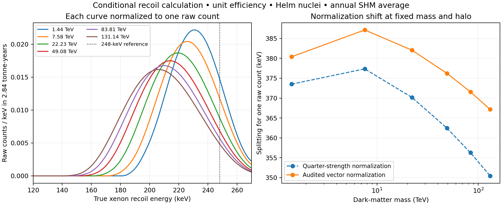

# Audited neutral-current xenon recoil calculation

Date: September 6, 2026 America/New_York. Evidence: conditional raw recoil-level benchmark, not an experimental likelihood. Independent research gate S1 remains open.

## Result

Replacing the quarter-strength neutral-current normalization with the audited vector normalization shifts the splitting required for **one raw benchmark count** upward by **6.88–16.71 keV** across the six fixed masses. The calculation now includes natural xenon isotopes, a Helm nuclear response and a seasonally averaged truncated Maxwellian halo. It produces reproducible spectra rather than rescaling a single outlier.

The count condition is a diagnostic contour. It does not assign the LZ event to dark matter, infer a confidence interval or update the source's relic-density benchmark. Unit efficiency is used throughout; no curve is described as an accepted-event prediction.

| Fixed mass (TeV) | One-count splitting, quarter strength (keV) | One-count splitting, audited strength (keV) | Normalization-only shift (keV) |
|---|---:|---:|---:|
| 1.44 | 373.503 | 380.388 | 6.884 |
| 7.58 | 377.344 | 387.128 | 9.784 |
| 22.23 | 370.137 | 382.029 | 11.893 |
| 49.08 | 362.448 | 376.227 | 13.778 |
| 83.81 | 356.258 | 371.539 | 15.281 |
| 131.14 | 350.438 | 367.152 | 16.714 |

These are our two calculations under identical assumptions, not differences obtained by comparing unlike published analyses. Applying our full normalization at the source's original splittings yields 3.62–5.21 raw counts; the departure from exactly four also reflects the source/implementation choices. The neutral-state mixing correction below 1.3e-7 from the preceding audit is neglected here and cannot affect the quoted precision materially.

## Inputs and response

The [NIST xenon isotope table](https://physics.nist.gov/cgi-bin/Compositions/stand_alone.pl?ele=Xe) supplies all nine atomic masses and amount fractions, transcribed into the replay and JSON. Fractions sum to one. Target counts use isotope amount fractions and the mixture's mean atomic mass; they are not incorrectly treated as mass fractions. Recoil masses subtract the 54 electron rest masses; electronic binding corrections are neglected.

The audited contact normalization is sigma_n=G_F² mu_n²/(2 pi), with weak charge Q_A=(A−54)−(1−4 sin²theta_W)54 and sin²theta_W=0.23122. Nuclear scattering uses

\[
\frac{d\sigma_A}{dE_R}=\frac{m_A\sigma_n Q_A^2}{2\mu_n^2 v^2}F_A^2(E_R),
\qquad
v_{min}=\frac{m_AE_R/\mu_A+\delta}{\sqrt{2m_AE_R}}.
\]

The selected phenomenological Helm model has c=1.23 A^(1/3)−0.60 fm, surface parameters a=0.52 fm and s=0.9 fm, R1²=c²+7 pi² a²/3−5s² and F=3j1(qR1)/(qR1) exp[−(qs)²/2]. This replaces the earlier uniform-density toy nucleus but is not an authenticated isotope density-matrix response or exact neutron distribution.

The halo choices follow the explicit benchmark described in [Di Mauro, section III.2](https://arxiv.org/html/2609.02608v2): density 0.3 GeV/cm³, velocity scale 238 km/s, escape speed 544 km/s and Earth speed 250.2+14.9 cos(phase) km/s. We average 32 equally spaced annual phases. This is not LZ's actual live-time weighting. The raw integration window is 5.4–270 keV with exposure 2.84 tonne-years and efficiency one. The [electroweak source](https://arxiv.org/html/2609.04144v1) also labels its event estimate as rate-level rather than a full likelihood; our source-mass choices do not reproduce its complete thermal calculation.

The code evaluates the analytic truncated-Maxwellian mean inverse speed in km/s, then converts energy and speed units explicitly. It checks the result against a separately integrated normalized speed distribution and against an elastic point-target flux-times-cross-section calculation. Acceptance is not counted twice because none is applied.

## Sensitivity and falsification

At fixed mass 1.44 TeV, the audited one-count splitting is 380.388 keV. Changing individual modeling choices gives:

| Change, holding other choices fixed | One-count splitting (keV) |
|---|---:|
| Velocity scale 220 km/s | 377.387 |
| Escape speed 528 km/s | 368.938 |
| Escape speed 560 km/s | 391.705 |
| Replace annual averaging with mean Earth speed | 374.655 |
| Helm c decreased by 2% | 382.691 |
| Helm c increased by 2% | 377.997 |

These are diagnostic variations, not probability distributions or confidence bounds. The escape-speed variation alone moves the contour by about 11 keV in either direction, larger than the 6.88-keV normalization shift at this mass. Nuclear-model changes and actual exposure timing also matter.

The predicted rates are strongly seasonal. At the first one-count contour, summer and winter instantaneous rates differ by roughly 20,000 in this hard-cutoff halo, while the highest-mass contour differs by about ten. The near-zero winter denominator makes the first ratio especially fragile. It is a conditional falsifiable pattern, not a robust measured modulation amplitude. Exact velocities, live intervals, backgrounds and smoothing of the halo tail must be propagated before comparison to event dates.

## Connection to the frozen sphere

Even the maximum seasonal speed here, 809.1 km/s, gives a free-carbon endothermic ceiling below 40.71 keV for any of these masses. Thus the direct ground-state free-carbon upscatter remains closed at all newly calculated splittings. That conclusion survives this normalization change. It does not exclude a solid-assisted channel or the separate elastic loop interaction.

No local percent-level residual is fitted, and no boundary-dependent force is introduced. The earlier loop-channel calculations remain conditional until their Wilson coefficients and nuclear matching are verified. The thermal trajectory must also be re-intersected before treating the adjusted splitting as a complete electroweak benchmark.

## Artifacts and checks

- `casimir-dp-xe-recoil-recast-2026-09-06.py`: model and numerical replay.
- `casimir-dp-xe-recoil-recast-2026-09-06.json`: source inputs, assumptions, contours and sensitivities.
- `casimir-dp-xe-recoil-recast-spectrum-2026-09-06.csv`: six full-normalization spectra.
- `casimir-dp-xe-recoil-plot-2026-09-06.py`: chart renderer from saved data.

Run both Python scripts from the canonical root with NumPy/SciPy/Matplotlib. Nine checks pass. Doubling the energy grid and annual phase samples changes the first contour's count from one to 1.000000506. An initial independent speed-normalization check used the wrong numerical breakpoint; fixing it to escape speed minus Earth speed removed the quadrature error without changing the analytic halo rates. The chart was visually inspected.

Atlas build/why/upstream trace succeeded before additions. Frozen candidate, runtime physics, adapters, constraints and certificate semantics are unchanged. No Casimir certificate or physical-admissibility claim is made. Next requirements are detector-response authentication, isotope-response refinement, loop matching and thermal consistency; the shared-model goal remains active.
