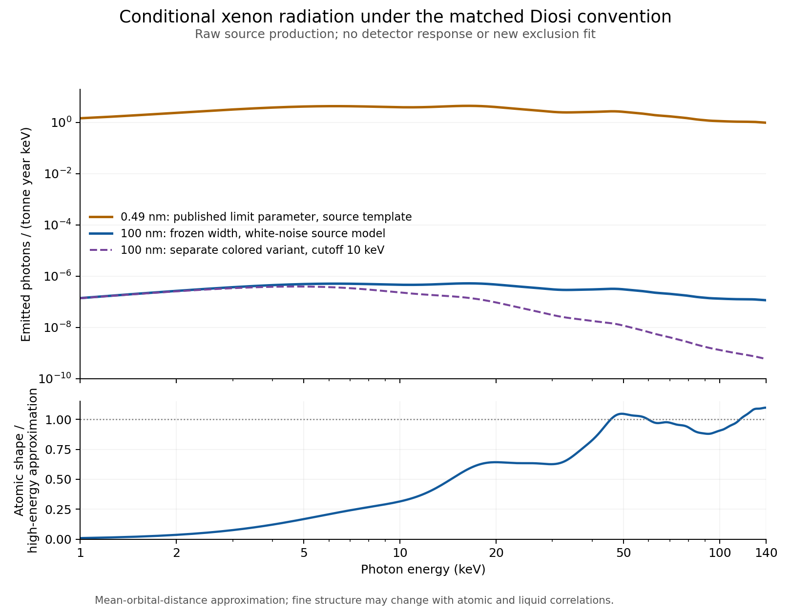

Program gate: Independent exploratory follow-up; canonical commissioning requirements unchanged.
Workstream: Common microscopic Diosi model across center-of-mass coherence and xenon radiation.
Capability or component: Published atomic-spectrum replay and finite-sphere companion calculation.
Current maturity: Analytically matched Gaussian convention; diagnostic mass representation.
Target maturity: Reproducible source-model spectrum, scale comparison, and explicit limits of the microscopic reduction.
Required frozen inputs: Stage-4.2R candidate and R0; preceding bridge diagnostics; XENONnT Table S1; Piscicchia et al. Eq. 10.
Required evidence: Unit checks, charge-pair accounting, independent integration, and input hashes.
Stop/fail criteria: No new experimental bound without detector likelihood; no substitution of total charge for internal charges; no replacement of the frozen effective-particle comparator.
Explicit non-goals: LZ event identification, measured collapse, new model admission, specimen validation, or pilot authorization.
Downstream gate unlocked: Constituent-spectrum diagnostic available for a separately specified response-folded comparison.

# Constituent-level coherence and xenon radiation

Follow-up to the [initial mechanism investigation](casimir-dp-lz-mechanism-bridge-research-2026-09-06.md). Research date: September 6 local / September 7 UTC, 2026. This packet adds calculations without altering its inputs or earlier evidence.

## Result

Under the published Gaussian, white-noise Diosi atomic model, the frozen **R0 = 100 nm** gives approximately **3.35e-5 emitted photons per tonne-year of xenon between 1 and 140 keV**. This is a source-emission forecast, before any detector response. The same approximation at the published 0.49-nm bound parameter gives 285 photons per tonne-year. The rate ratio is **1.175e-7**.

Thus a future percent-level coherence effect in the proposed massive object could coexist with an undetectably small xenon radiation signal under this model. Xenon radiation is a consistency test, but the present forecast does not make it a practical companion measurement at the frozen point. This does not explain LZ's nuclear-recoil-like event.

## 1. The source calculation

Use the Gaussian convention matched in the preceding packet. The published DP atomic emission expression is Eq. 10, not XENONnT's CSL Eq. S1. With the xenon occupations and mean radii in Table S1, use alpha=1.25 and beta=1.04 for the orbital-pair approximation. These are source-model inputs, not fitted apparatus data. [XENONnT Appendix A](https://arxiv.org/html/2506.05507v2#A1), [Piscicchia et al., Eq. 10](https://wigner.hu/~diosi/prints/2024prl132_250203.pdf)

Write the per-atom spectrum as

\[
\frac{d\Gamma}{dE}=\frac{G e^2}{12\pi^{5/2}\epsilon_0c^3R_0^3}\frac{S(E,R_0)}{E},
\qquad K(r)=e^{-r^2/(4R_0^2)}\operatorname{sinc}(Er/\hbar c),
\]
\[
S=Z^2+Z-2Z\sum_o N_o K(\rho_o)
+\sum_o N_o(N_o-1)K(\alpha\rho_o)
+2\sum_{o<o'}N_oN_{o'}K(\beta|\rho_o-\rho_{o'}|).
\]

The sum retains proton-electron cancellation and electron-pair terms. The nucleus is unresolved by these photons in the source approximation. S tends to Z squared plus Z only when the relevant electronic pairs become incoherent; using that asymptote throughout the X-ray band overestimates this calculation by about a factor of 2.17 at 100 nm.

The prefactor has units of inverse seconds; dividing by energy gives rate per energy. Converting a spectrum per joule to one per keV includes the energy-bin Jacobian. Numerically, the same expression can use E in keV when the sinc argument also uses hbar c in keV metres. This cancellation of conversion factors is checked explicitly in the replay.

### Calculated production, not detected events

| Model input | Raw photons / tonne-year, 1-140 keV |
|---|---:|
| R0=100 nm; alpha=1.25; white noise | 3.35214e-5 |
| R0=100 nm; alpha=1.00 | 3.38683e-5 |
| R0=100 nm; alpha=1.50 | 3.32473e-5 |
| R0=0.49 nm; alpha=1.25; white noise | 285.292 |
| R0=100 nm; high-energy Z-squared-plus-Z approximation over entire band | 7.26776e-5 |
| R0=100 nm; colored variant Ec=10 keV | 5.60965e-6 |
| R0=100 nm; colored variant Ec=100 keV | 2.61141e-5 |

The 0.49-nm row evaluates the theoretical spectrum at a published limit parameter; it does not reproduce the confidence-limit fit. At 100 nm, one expected emitted photon corresponds to roughly **29,800 tonne-years** in this approximation. That is not a discovery exposure: background, acceptance, energy migration, live time, and statistics would still matter.

The colored rows multiply the white spectrum by Ec squared/(Ec squared + E squared). They are separately labeled alternative temporal kernels, not changes to the frozen white-noise model. The recent atomic-correlation preprint replaces mean-distance approximations with radial distributions; its proposed refinement has not been numerically reproduced here. The plotted fine structure must not be treated as a robust prediction independent of that approximation. [Manti et al., Eqs. 27-28 and discussion](https://arxiv.org/html/2608.07205v1)



Figure: source-model production only. The second panel displays atomic cancellation relative to the high-energy approximation, not detector efficiency. The two R0 curves are not a measured confidence band.

### An upper bound independent of intra-atomic geometry

Within the same additive-atom emission model, every Gaussian-sinc pair factor has magnitude at most one. The triangle inequality gives

\[
S\leq\left(\sum_i|z_i|\right)^2=(2Z)^2=11664.
\]

Integrating this bound gives **2.85425e-4 photons per tonne-year** at R0=100 nm over 1-140 keV. Even this loose ceiling gives fewer than 0.001 emitted photons in a hypothetical 2.84 tonne-year xenon exposure. That comparison concerns X-ray production; it is not an NR prediction or a replay of LZ acceptance.

This bound does not depend on the approximate orbital radii, alpha, beta, or intra-atomic cancellation. It still assumes additive atomic emission, the stated Gaussian noise, and the source approximation. It is not a universal bound on an arbitrary collective liquid response. A full treatment of inter-atomic correlations or a new mechanism needs its own structure factor; it cannot be silently folded into this result.

## 2. What a common microscopic model means for the sphere

In a universal mass-density completion, the COM kernel contains

\[
e^{-R_0^2 k^2}|\widetilde\mu(k)|^2,
\qquad \widetilde\mu(k)=\sum_j m_j e^{-ik\cdot s_j}.
\]

The frozen effective particle uses the constant m squared in place of the mass form factor. An ideal rigid uniform sphere instead supplies m squared F(kR) squared. Neither choice determines the charge-pair sum for atomic radiation: total neutral charge is not a substitute for the internal charged degrees of freedom.

The previous independent integrals gave **0.844242%** coherence loss for an ideal uniform sphere at the unchanged geometry, versus **2.90803%** for the frozen effective-particle representation. This follow-up derives its COM heating from the same sphere transfer kernel:

\[
\dot E_{\rm COM}=\frac{G\hbar m}{\pi R_0^3}
\int_0^\infty du\,u^2e^{-u^2}F(uR/R_0)^2
=6.82440\times10^{-41}\ {\rm W}.
\]

This is 0.222284 of the effective-particle COM heating. The small-separation identity

\[
\dot E_{\rm COM}=\frac{3\hbar^2}{m}
\lim_{d\to0}\frac{\Gamma(d)}{d^2}
\]

provides an independent check tying diffusion and coherence to the same kernel. COM heating is not the total energy budget of a charged composite system and must not be used as a shortcut to its photon luminosity. Internal modes and electromagnetic dynamics require a consistent microscopic treatment.

The ideal continuum is not an authenticated specimen, and neither its new heating result nor its earlier coherence forecast replaces the frozen comparator. Layering, density, internal-state motion and actual preparation remain empirical/model inputs to qualify.

## 3. Inference and remaining work

| Question | Result of this step |
|---|---|
| Can identical Gaussian conventions be used? | Yes, as matched previously. |
| Can the cited atomic formula now be evaluated with published Xe shell inputs? | Yes; source-model spectrum and raw normalization reproduced independently. |
| Does net atomic neutrality make the radiation identically zero? | No; finite photon resolution and charge correlations enter the pair sum. |
| Is the 100-nm point near the published radiation sensitivity? | No in this source model; its integrated template is about 8.51 million times smaller than the bound-parameter template. |
| Does this yield a new experimental exclusion or allowed-region receipt? | No detector likelihood or microscopic specimen admission has been completed. |
| Does this rescue the LZ hard nuclear kick? | No; neither the signal class nor the Gaussian momentum obstruction changes. |
| What could falsify the calculation? | Wrong pair counting or units; incompatible Gaussian/noise convention; failure of the additive-atom approximation or a different verified atomic/medium response. |

The next useful work is a **response and structure comparison**, not increasing the presumed gravitational interpretation:

1. Reproduce the newer radial-distribution spectrum from authenticated author data, keeping the published mean-radius calculation as a separate baseline. Include liquid inter-atomic response if materially relevant.
2. Fold the source spectra through detector acceptance, energy response and background likelihood before making any revised experimental bound. Bound templates at different R0 need their actual shapes, not just an assumed R0-cubed rescaling.
3. Keep LZ scattering as a separate branch requiring authenticated operator/coupling data, nuclear structure, carbon response and object-loss accounting. No radiation template should be relabeled as an NR template.

No result here closes the local same-apparatus companion gate or supplies missing hardware evidence.

## 4. Reproducibility and scope

The [JSON diagnostics](casimir-dp-xenon-constituent-radiation-diagnostics-2026-09-06.json) contain constants, source-table values, hashes of frozen local inputs, integrated rates and checks. The [CSV spectrum](casimir-dp-xenon-constituent-radiation-spectrum-2026-09-06.csv) contains raw model rates, not measured detector counts. Appendix A generates both; the plot uses those values.

Atlas build/why/upstream trace were run for the canonical article before drafting. Ten numerical checks passed, including expanded versus grouped charge-pair counting, independent linear/log-energy integration, the energy-unit Jacobian, and the COM coherence/diffusion identity. This is a documentation and diagnostic-data addition. It changes no physics runtime, constraint, adapter, certificate, empirical maturity or frozen source. The scoped AGENTS.md documentation rule applies; no server-backed Casimir verification or certificate claim is made.

## Appendix A. Standard-library numerical replay

Run from the repository root. Output filenames are restricted to this packet. The source shell table is XENONnT Table S1, linked above. Shell averaging follows the stated approximation, not an atomistic or radial-distribution calculation.

```python
import csv, hashlib, json, math
from pathlib import Path

base = Path('docs/research')
config_path = Path('configs/research/casimir-dp-integrated-feasibility-pilot-stage4-2r.v1.json')
parent_path = base/'casimir-dp-lz-mechanism-bridge-diagnostics-2026-09-06.json'
cfg = json.loads(config_path.read_text(encoding='utf-8'))
parent = json.loads(parent_path.read_text(encoding='utf-8'))
G, e, eps, c, hb, u = 6.67430e-11, 1.602176634e-19, 8.8541878188e-12, 299792458., 1.054571817e-34, 1.66053906892e-27
year = 365.25*86400
Z, atomic_mass = 54, 131.293*u
shells = list(zip(['1s','2s','2p','3s','3p','3d','4s','4p','4d','5s','5p'],
    [2,2,6,2,6,10,2,6,10,2,6],
    [.015,.064,.055,.170,.165,.149,.395,.412,.461,1.024,1.231]))
R0 = cfg['frozen_diosi']['R0_m']
Rlim = 4.9e-10

def sinc(x):
    return 1-x*x/6+x**4/120 if abs(x)<1e-4 else math.sin(x)/x

def pairs(alpha=1.25):
    out = [(Z*Z+Z,0.)]
    for i,(_,n,rA) in enumerate(shells):
        r = rA*1e-10
        out.extend([(-2*Z*n,r),(n*(n-1),alpha*r)])
        for _,nj,rjA in shells[:i]:
            out.append((2*n*nj,1.04*abs(r-rjA*1e-10)))
    return out

def shape(EkeV,R,alpha=1.25):
    return math.fsum(w*math.exp(-r*r/(4*R*R))*sinc(EkeV*1000*e*r/(hb*c))
                     for w,r in pairs(alpha))

def prefactor(R):
    return G*e*e/(12*math.pi**2.5*eps*c**3*R**3)

conversion = 1000/atomic_mass*year
def rate(EkeV,R=R0,alpha=1.25,Ec=None):
    temporal = 1 if Ec is None else Ec*Ec/(Ec*Ec+EkeV*EkeV)
    return prefactor(R)*shape(EkeV,R,alpha)/EkeV*conversion*temporal

def simpson(f,a,b,n=10000):
    h=(b-a)/n
    return h/3*(f(a)+f(b)+math.fsum((4 if i%2 else 2)*f(a+i*h) for i in range(1,n)))

def integrated(R=R0,alpha=1.25,Ec=None):
    return simpson(lambda E:rate(E,R,alpha,Ec),1,140)

baseline = integrated()
log_integral = simpson(lambda x:rate(math.exp(x))*math.exp(x),0,math.log(140))
limit_template = integrated(Rlim)
upper = prefactor(R0)*conversion*(2*Z)**2*math.log(140)
high_energy = prefactor(R0)*conversion*(Z*Z+Z)*math.log(140)

# Independently expand proton/electron pair categories to check shell multiplicities.
electrons = [(i,r*1e-10) for i,(_,n,r) in enumerate(shells) for _ in range(n)]
def expanded_shape(E,R):
    def K(r): return math.exp(-r*r/(4*R*R))*sinc(E*1000*e*r/(hb*c))
    out = Z*Z+len(electrons)-2*Z*math.fsum(K(r) for _,r in electrons)
    return out+2*math.fsum(K(1.25*r if i==j else 1.04*abs(r-s))
        for a,(i,r) in enumerate(electrons) for j,s in electrons[:a])

design=cfg['leading_design']; m=design['mass_kg']; radius=design['radius_m']
def form(z):
    return 1-z*z/10+z**4/280 if abs(z)<1e-3 else 3*(math.sin(z)-z*math.cos(z))/z**3
moment=simpson(lambda x:x*x*math.exp(-x*x)*form(x*radius/R0)**2,0,10,20000)
heating=G*hb*m/(math.pi*R0**3)*moment
dsmall=R0*1e-4
def coherence_integrand(x):
    z=x*dsmall/R0
    one_minus_sinc=z*z/6-z**4/120+z**6/5040 if abs(z)<.01 else 1-sinc(z)
    return math.exp(-x*x)*form(x*radius/R0)**2*one_minus_sinc
small_gamma=2*G*m*m/(math.pi*R0*hb)*simpson(coherence_integrand,0,10,20000)
heating_from_coherence=3*hb*hb/m*small_gamma/dsmall**2

grid=[1+i*.25 for i in range(557)]
rows=[{'photon_energy_keV':E,'raw_photons_per_tonne_year_keV_R100nm':rate(E),
       'raw_photons_per_tonne_year_keV_R049nm':rate(E,Rlim),
       'raw_photons_per_tonne_year_keV_colored_Ec10keV':rate(E,Ec=10),
       'atomic_shape_over_high_energy_R100nm':shape(E,R0)/(Z*Z+Z)} for E in grid]
unit_test= prefactor(R0)*shape(10,R0)/(10*1000*e)*(1000*e)*conversion
checks={
    'occupations_sum_to_Z':sum(n for _,n,_ in shells)==Z,
    'formal_fully_coherent_neutral_charge_sum_zero':sum(w for w,_ in pairs())==0,
    'absolute_charge_pair_weight_matches_triangle_bound':sum(abs(w) for w,_ in pairs())==(2*Z)**2,
    'expanded_pair_count_matches_grouped_formula':all(abs(expanded_shape(E,R)/shape(E,R)-1)<1e-10
        for E in [1,5,10,50,140] for R in [R0,Rlim]),
    'linear_log_energy_integrals_agree_1e_8':abs(log_integral/baseline-1)<1e-8,
    'joule_to_keV_jacobian_agrees':abs(unit_test/rate(10)-1)<1e-12,
    'positive_sampled_spectrum':all(row['raw_photons_per_tonne_year_keV_R100nm']>0 for row in rows),
    'atomic_triangle_bound_respected':all(abs(shape(E,R0))<=(2*Z)**2 for E in grid) and baseline<upper,
    'sphere_coherence_diffusion_identity_1e_8':abs(heating_from_coherence/heating-1)<1e-8,
    'colored_spectrum_never_exceeds_white':all(rate(E,Ec=10)<=rate(E) for E in grid),
}
assert all(checks.values()),checks
data={
 'evidence_class':'conditional_source_emission_and_COM_diagnostics_not_detector_fit',
 'source_refs':{'shell_table':'https://arxiv.org/html/2506.05507v2#A1',
                'DP_equation_10':'https://wigner.hu/~diosi/prints/2024prl132_250203.pdf'},
 'source_sha256':{str(p).replace('\\','/'):hashlib.sha256(p.read_bytes()).hexdigest() for p in [config_path,parent_path]},
 'constants':{'G_SI':G,'charge_C':e,'epsilon0_F_m':eps,'c_m_s':c,'hbar_J_s':hb,'u_kg':u,'year_s':year},
 'shell_table_columns':['orbital','occupation','mean_radius_in_1e_minus_10_m'],'shell_table':shells,
 'model':{'R0_m':R0,'comparison_R0_m':Rlim,'alpha':1.25,'beta':1.04,'xenon_mean_mass_u':131.293,
          'energy_band_keV':[1,140],'medium_assumption':'additive_atomic_emission',
          'atomic_approximation':'published_clamped_mean_orbital_distances'},
 'results':{'raw_photons_per_tonne_year':baseline,'log_energy_integral':log_integral,
    'alpha_sweep':{str(a):integrated(alpha=a) for a in [1.,1.25,1.5]},
    'bound_parameter_raw_photons_per_tonne_year':limit_template,'integrated_ratio_to_bound_parameter':baseline/limit_template,
    'pure_R0_cubed_ratio':(Rlim/R0)**3,'atomic_triangle_upper_photons_per_tonne_year':upper,
    'high_energy_approximation_photons_per_tonne_year':high_energy,
    'colored_Ec10_raw_photons_per_tonne_year':integrated(Ec=10),
    'colored_Ec100_raw_photons_per_tonne_year':integrated(Ec=100),
    'raw_exposure_for_one_photon_tonne_year':1/baseline,
    'sphere_COM_heating_W':heating,'sphere_COM_heating_from_small_separation_W':heating_from_coherence,
    'sphere_to_point_COM_heating_ratio':moment/(math.sqrt(math.pi)/4),
    'prior_ideal_sphere_coherence_loss':parent['results']['ideal_uniform_sphere_visibility_loss']},
 'checks':checks,
 'limitations':['No detector-response or likelihood replay.','No new confidence limit.',
    'No RDF or liquid inter-atomic correlation calculation.','No measured sphere density or charge mapping.',
    'Colored variants are not the frozen white-noise model.','Photon spectra are not nuclear-recoil spectra.']}
json_path=base/'casimir-dp-xenon-constituent-radiation-diagnostics-2026-09-06.json'
csv_path=base/'casimir-dp-xenon-constituent-radiation-spectrum-2026-09-06.csv'
json_path.write_text(json.dumps(data,indent=2,allow_nan=False)+'\n',encoding='utf-8')
with csv_path.open('w',newline='',encoding='utf-8') as f:
    writer=csv.DictWriter(f,fieldnames=list(rows[0]));writer.writeheader();writer.writerows(rows)
print(json.dumps({'results':data['results'],'checks':checks},indent=2))
```

## Appendix B. Figure replay

After Appendix A, run this block with Matplotlib installed. It plots the saved CSV rather than recomputing a different model.

```python
import csv
from pathlib import Path
import matplotlib
matplotlib.use('Agg')
import matplotlib.pyplot as plt
from matplotlib.ticker import FixedLocator, FuncFormatter

base=Path('docs/research')
with (base/'casimir-dp-xenon-constituent-radiation-spectrum-2026-09-06.csv').open(encoding='utf-8') as f:
    rows=[{k:float(v) for k,v in row.items()} for row in csv.DictReader(f)]
E=[r['photon_energy_keV'] for r in rows]
plt.rcParams.update({'font.family':'DejaVu Sans','font.size':10,'axes.spines.top':False,'axes.spines.right':False})
fig,(ax,bx)=plt.subplots(2,1,figsize=(9,7),sharex=True,gridspec_kw={'height_ratios':[2.1,1]})
ax.plot(E,[r['raw_photons_per_tonne_year_keV_R049nm'] for r in rows],color='#ad6400',lw=2,
        label='0.49 nm: published limit parameter, source template')
ax.plot(E,[r['raw_photons_per_tonne_year_keV_R100nm'] for r in rows],color='#125a9c',lw=2,
        label='100 nm: frozen width, white-noise source model')
ax.plot(E,[r['raw_photons_per_tonne_year_keV_colored_Ec10keV'] for r in rows],color='#76449b',lw=1.6,ls='--',
        label='100 nm: separate colored variant, cutoff 10 keV')
ax.set_yscale('log');ax.set_ylim(1e-10,20)
ax.set_ylabel('Emitted photons / (tonne year keV)')
ax.legend(loc='center left',frameon=False,fontsize=9)
ax.grid(axis='y',alpha=.15)
bx.plot(E,[r['atomic_shape_over_high_energy_R100nm'] for r in rows],color='#125a9c',lw=1.8)
bx.axhline(1,color='#777777',ls=':',lw=1)
bx.set_ylabel('Atomic shape /\nhigh-energy approximation')
bx.set_xlabel('Photon energy (keV)');bx.set_ylim(0,1.15)
bx.set_xscale('log');bx.set_xlim(1,140)
bx.xaxis.set_major_locator(FixedLocator([1,2,5,10,20,50,100,140]))
bx.xaxis.set_major_formatter(FuncFormatter(lambda x,pos:f'{x:g}'))
bx.grid(alpha=.15)
fig.suptitle('Conditional xenon radiation under the matched Diosi convention',fontsize=14,y=.985)
fig.text(.5,.938,'Raw source production; no detector response or new exclusion fit',ha='center',fontsize=10,color='#555555')
fig.text(.12,.018,'Mean-orbital-distance approximation; fine structure may change with atomic and liquid correlations.',fontsize=8.5,color='#555555')
fig.tight_layout(rect=[0,.04,1,.925])
fig.savefig(base/'casimir-dp-xenon-constituent-radiation-spectrum-2026-09-06.png',dpi=180)
plt.close(fig)
```
