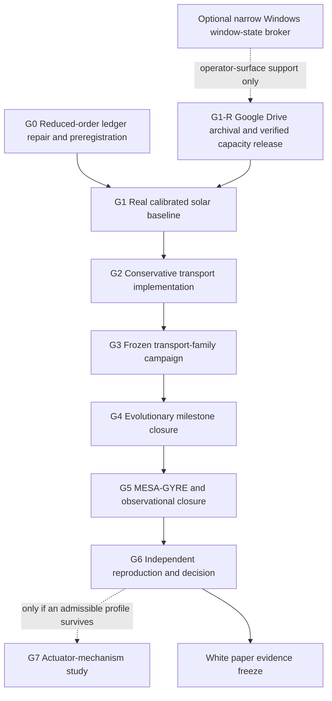

# Controlled Stellar Composition Transport Work Program

Status: canonical program-control document.

Active program gate: **G1 — real calibrated solar baseline (image installed; source and execution preparation open)**

Status date: **September 24, 2026**

This document is the sole current dependency and status roadmap for the solar
restoration deep-mixing research branch. Dated audits, solver receipts, UI
presets, and theory-graph rows are evidence snapshots or implementation
surfaces; they do not replace this roadmap.

The completed G0 packet is
[`controlled-stellar-composition-transport-g0-reduced-order-preregistration.md`](./controlled-stellar-composition-transport-g0-reduced-order-preregistration.md),
and its result is preserved in
[`controlled-stellar-composition-transport-g0-result-record.md`](./controlled-stellar-composition-transport-g0-result-record.md).
The sole active packet is now
[`controlled-stellar-composition-transport-g1-solar-baseline-calibration.md`](./controlled-stellar-composition-transport-g1-solar-baseline-calibration.md).
The first G1 attempt is preserved in
[`controlled-stellar-composition-transport-g1-result-record.md`](./controlled-stellar-composition-transport-g1-result-record.md)
with terminal decision `BLOCKED_BASELINE_CALIBRATION`; G2 remains blocked.
The [September 13 installation record](./controlled-stellar-composition-transport-g1-image-install-2026-09-13.md)
confirms the frozen image is installed and identity-verified. This supersedes
the installation blocker, not attempt 1's historical result or the science
gate. Post-install free space is about 22.96 GB; a new science attempt still
requires explicit run-capacity checks and frozen inputs before execution.
The [G1 preparation v1 packet](./controlled-stellar-composition-transport-g1-preparation-v1.md)
records the toolchain inspection and unresolved science-freeze requirements.
Its newer preflight measured about 17.7 GB free; execution remains disabled.
The preparation deliverable is complete, but the executable observation/input
freeze is not. The current [source and input validation work](./controlled-stellar-composition-transport-g1-source-validation-v1.md)
binds structural inversion data and checks zero-transport input dependencies
without stellar evolution. The numerical structural table is retained and
cross-checked, with `BLOCK_SOURCE_BINDING` for unresolved resolution/systematics.
The [G1 structural comparison method decision](./controlled-stellar-composition-transport-g1-structural-comparison-method-v1.md)
records the fixed-reference-kernel and source-matched re-inversion routes; it
does not admit either route or close the source blocker.
The [September 24 author-data intake](./controlled-stellar-composition-transport-g1-basu-author-intake-2026-09-24.md)
recovers a strongly matching sound-speed solution and 76 numerical averaging
kernels. Density, cross terms, exact BP04 mapping and systematic-error policy
remain unbound; the structural comparison operator is still null.
The [author follow-up plan](./controlled-stellar-composition-transport-g1-basu-followup-plan-2026-09-24.md)
records her September 24 reply: density results and kernels may be available,
inversion coefficients may be available, and the cross-term file is probably
not. A Monday reminder is scheduled; source admission awaits actual files and
numerical validation.
The [sound-speed primary-term operator packet](./controlled-stellar-composition-transport-g1-sound-speed-operator-v1.md)
records a tested convolution over the author kernels and non-running trial
rendering/resource-stop components. It does not define the full structural
operator or enable a science run.
The [BP04 reference and no-run check packet](./controlled-stellar-composition-transport-g1-bp04-reference-and-no-run-checks-2026-09-24.md)
confirms the historical BP04 radius convention but finds that the public
model export lacks sound speed, Gamma1 and the outer kernel support. Exact
reference binding therefore remains open; the runtime stop decision now
fails closed on relaxed limits. A read-only MESA history parser is tested
against restart-superseded rows; it is not yet an admitted calibration
extractor or execution adapter.
The outermost published sound-speed kernel has roughly 94% absolute weight
beyond the public BP04 table's radius endpoint, so truncating that export
cannot close the source gap.
The pinned MESA default history omits an explicit surface Z/X output;
history-only three-target calibration therefore needs custom columns, but
the default final profile contains total H and metals in surface zone 1.
No-run extractors now validate that profile and join it to the default
history's L/R only when model number and age agree. This yields a candidate
three-target path without custom columns; native format, installed constants,
termination and surface convention remain unverified. The Docker engine was
not reachable in a September 24 evening read-only
check, so native validation remains pending.
The [G1 no-run launcher preflight](./controlled-stellar-composition-transport-g1-launcher-preflight-v1.md)
adds tested fail-closed host/input checks and a pure calibration objective;
the execution adapter is not implemented and launch remains disabled.
The 73 inlist assignments pass a static group check and an independent
namelist parse with selected zero-transport invariants. A read-only inventory
hashes 3,552 installed MESA files and 885 SDK files; all 13 selected upstream
source hashes match the installed image. MESA's native reader and the exact
loaded microphysics subset await an execution attempt. The Docker socket
startup issue was recoverably repaired on September 19. The September 24
intake measured about 40.7 GB free on C:, above the frozen 25 GB science-start
threshold, while available physical memory was about 2.05 GB, below the 4 GiB
start threshold at that moment. Fresh checks are still required before any
run. G1 and its launch prerequisites remain open.
The bounded infrastructure response is specified in
[`controlled-stellar-composition-transport-g1-runtime-capacity-recovery.md`](./controlled-stellar-composition-transport-g1-runtime-capacity-recovery.md):
a Google Drive archival connector is the primary recovery path, and a narrow
Windows window-state broker is an optional reusable capability. This parallel
packet can enable another G1 attempt but cannot close G1 or unlock G2.
The intended manuscript structure and evidence map are maintained in
[`controlled-stellar-composition-transport-white-paper-outline.md`](./controlled-stellar-composition-transport-white-paper-outline.md).

## Permanent research objective

Determine whether at least one conservative, controlled composition-transport
field can measurably delay the end of core hydrogen burning in a calibrated
solar-mass stellar model while satisfying structural, thermal, seismic,
neutrino, chemical, conservation, and stability constraints.

The target existence question is:

```text
Does there exist u(r,t) such that

  Delta t_TAMS(u) >= Delta t_star

subject to

  structure residuals <= preregistered tolerances,
  seismic + neutrino + chemical residuals <= preregistered tolerances,
  stability margins >= 0,
  species, mass, and energy ledgers close, and
  actuation energy is explicitly bounded?
```

The primary scientific output may be a null result. Failure to find an
admissible profile inside a preregistered transport family is useful evidence
and must not be retuned into a positive result.

## Claim boundary

This program does not presently establish that:

- the Sun can be refuelled or prevented from becoming a red giant;
- any fleet, wave, magnetic, or exotic actuator can realize the requested
  transport field;
- the repository's `+0.6 Gyr` preset is valid;
- p modes, granulation, or sunquakes are transport mechanisms;
- a static hydrostatic panel is a stellar-evolution solution; or
- solar restoration supplies evidence for NHM2, warp, ER=EPR, or any
  stress-energy or propulsion claim.

Hydrostatic equilibrium is treated as a local force-balance condition. The
evolutionary target is delayed post-main-sequence expansion through a sequence
of quasi-hydrostatic models, not an "expansion of hydrostatic equilibrium."

## Program maturity vocabulary

Only the following terms may be used for new program-status claims:

| Maturity | Meaning |
| --- | --- |
| `mission_hypothesis` | Narrative objective with no numerical closure. |
| `reduced_order_diagnostic` | Ledger or toy-model calculation useful for falsification and scale checks, not a stellar prediction. |
| `calibrated_baseline` | Solver-evolved solar reference that passes the frozen baseline acceptance vector. |
| `transport_solver_experiment` | Conservative transport is implemented and evolved, but has not passed the full observational gate. |
| `observationally_constrained_candidate` | One frozen solver candidate passes the declared structural, seismic, neutrino, chemical, and stability gates in the chosen model family. |
| `independently_reproduced_candidate` | A second source/runtime lineage reproduces the candidate and its acceptance decision. |
| `mechanism_hypothesis` | A separately modeled actuation proposal with explicit energy, momentum, angular-momentum, entropy, and instability ledgers. |

No maturity term implies engineering feasibility.

## Source-of-truth map

| Question | Sole authority |
| --- | --- |
| What is the objective, active gate, and dependency order? | this document |
| What closes the current gate? | the linked active-gate packet |
| What does the current reduced-order implementation do? | `client/src/lib/deepMixingPhysics.ts`, `client/src/lib/deepMixingPreset.ts`, and the restoration theory-graph source |
| What is the present solar observational scaffold? | `docs/starsim/solar-baseline.md` and its versioned reference pack |
| What does the current MESA/GYRE worker support? | `docs/starsim/mesa-gyre-worker.md` and the worker contracts |
| What proves a particular solver execution occurred? | immutable inputs, logs, manifests, hashes, profiles, histories, and mode artifacts from that run |
| What is allowed in the paper? | the white-paper outline plus evidence produced by closed gates |

Imported fixtures, mock lanes, schemas, green tests, and artifact labels are not
substitutes for an externally executed stellar-evolution calculation.

## Current position

Current maturity: **`reduced_order_diagnostic`**.

| Layer | Present state |
| --- | --- |
| Mission hypothesis | Present |
| Scalar transport equations | Present, with unresolved ledger semantics |
| Theory graph and claim boundaries | Present as a planning/diagnostic chain |
| Observational anchor schema | Substantial |
| Real calibrated evolving solar baseline | Absent |
| Conservative radiative-interior transport bridge | Absent |
| TAMS, shell ignition, and subgiant evolution solve | Absent |
| Solver-produced helioseismic mode closure | Absent |
| Independent reproduction | Absent |
| Actuator mechanism and energy ledger | Absent and downstream-blocked |

The frozen starting audit records these implementation discrepancies for G0:

- `DOTM_SUN_KG_S` is described as solar mass loss while used as a hydrogen
  burning/mass-processing scale;
- `alpha`, the accessible fuel fraction, is not derived from `epsilon`, the
  requested mass-flow fraction;
- target lifetime extensions are mapped directly to epsilon presets rather
  than computed by an evolution solve;
- luminosity and core-temperature guardrails are implemented one-sided even
  though the graph describes absolute logarithmic drifts;
- seismic and neutrino channels are signed values rather than
  uncertainty-normalized residual magnitudes; and
- the tachocline setpoint is connected directly to a one-zone core abundance
  without a conservative transport model across the radiative interior.

The numerical values in the user-supplied audit, including the approximately
`22.7 Myr` constant-one-zone extension and the approximate `epsilon=0.242`
backsolve for `+0.6 Gyr`, are hypotheses to reproduce in G0. They are not
accepted repository evidence until the calculation, units, constants, and
rounding rules are encoded and tested.

## Dependency order



The order is causal. In particular, a transport sweep cannot promote a result
against an uncalibrated baseline, and an actuator narrative cannot repair a
failed observational closure.

## Program gates

### Deferred three-dimensional convection study

The [StarSim convection extension packet](./controlled-stellar-composition-transport-3d-convection-plan.md)
defines a proposed MESA-background-to-flow-to-transport-to-observables study,
with Rayleigh as a candidate solver. Its C0 source/interface inventory is an
allowed parallel planning lane during G1. C1-C5 execution requires an accepted
G1 baseline and explicit admission here; it does not add a second active gate.
Validated diagnostics may inform a versioned G2/G3 transport prescription and
G5 comparison, subject to conservation, convergence, and mapping checks.
The optional Navier–Stokes benchmark requires source identification and equation
matching and does not establish stellar, intervention, or NHM2 validity.

The packet also inventories a Sun-first transport laboratory: rotating
hydrodynamics before a controlled magnetic comparison, measurement operators,
separate atmospheric/heating domains, and filter-aware momentum-closure tests.
These are deferred capabilities, not additional requirements to close G1-G6.
Only source/requirements inventory is admitted now. Imposed, fitted, assimilated,
and independently predicted quantities must remain distinct. Broader execution
requires a separately preregistered packet and explicit admission here; neither
the proposed Solar Transport v1 milestone nor an incompressible benchmark
promotes the lifetime-extension program or changes its active gate.

### Gate acceptance table

| Gate | State | Required closure evidence | Downstream gate unlocked |
| --- | --- | --- | --- |
| G0 — Reduced-order ledger repair and preregistration | **closed: `PASS_REDUCED_ORDER_PREREGISTERED`** | Typed ledgers separate hydrogen-burning reference, gross circulation, net hydrogen delivery, and cumulative accessible fuel; numerical audit and adversarial controller tests pass; future-gate semantic contract is versioned; claim boundary remains diagnostic | G1 |
| G1 — Real calibrated solar baseline | **active; sound-speed kernels received, full source binding and execution preparation pending** | Actual MESA or equivalent run from a frozen inlist; solver/version/runtime identities; complete hashes and logs; solar-age fit against frozen luminosity, radius, effective temperature, surface Z/X, surface helium, convection-zone depth, sound-speed/density residuals, and neutrino vector; no fixture fallback | G2 |
| G2 — Conservative transport implementation | blocked by G1 | Species-conservative diffusion/advection implementation; boundary conditions; mass/species/energy closure tests; radiative-interior bridge; resolution and timestep convergence; zero-transport recovery of the G1 baseline | G3 |
| G3 — Frozen transport-family campaign | blocked by G2 | Preregistered families, parameter bounds, sampling/optimization procedure, compute budget, seeds where applicable, first-failure rules, and retained artifacts for null as well as surviving candidates | G4 |
| G4 — Evolutionary milestone closure | blocked by G3 | Each candidate evolved through central hydrogen exhaustion, TAMS, core contraction, shell ignition, early subgiant evolution, and a frozen radius threshold; physical `Delta t_TAMS` and `Delta t_R>R_star` outputs replace the hazard proxy | G5 |
| G5 — Seismic and observational closure | blocked by G4 | GYRE or equivalent modes tied to parent structure hashes; sound-speed and density residuals; mode frequencies and separation ratios; neutrino, surface helium, convection-zone depth, Li/Be, abundance drift, and stability acceptance vector with uncertainties/covariance policy | G6 |
| G6 — Independent reproduction and terminal decision | blocked by G5 | Source/runtime-disjoint reproduction of baseline and any survivor; artifact rehash; preregistered decision `NO_ADMISSIBLE_PROFILE`, `NARROW_ADMISSIBLE_PROFILE`, or `ROBUST_ADMISSIBLE_FAMILY`; manuscript evidence freeze | G7 if eligible |
| G7 — Actuator-mechanism study | eligibility blocked by G6 survivor | Explicit mechanism equations and energy, momentum, angular-momentum, entropy, thermal, and instability ledgers; no relabeling of oscillations as pumps; separate feasibility boundary | separate mechanism program |

## Active-gate rule

Exactly one gate is active. Until G1 closes, implementation work must contribute
directly to the calibrated solar baseline, or be declared as a parallel
literature/data-inventory lane that cannot perturb frozen G1 definitions after
results are observed.

The G1 runtime-capacity recovery packet is a non-evidentiary enabling lane. Its
Drive connector and optional window-state broker are governed environment G8
capability specifications, not new solar gates. Upload verification and local
capacity release may authorize a new versioned G1 attempt; they do not establish
a solver execution, calibrated baseline, intervention result, or G2 eligibility.

The following do not close G1:

- rerunning the fixture-only solar reference and relabeling it as external;
- importing an undeclared profile without solver inputs, logs, and hashes;
- adding more UI controls or fleet details;
- treating a MESA-like fixture or mock worker result as a real solar evolution;
- tuning acceptance tolerances after inspecting intervention results; or
- choosing an actuator before establishing that an admissible idealized
  transport field exists.

## Required work-packet header

Every development or numerical packet in this program must begin with:

```text
Program gate:
Workstream:
Capability or component:
Current maturity:
Target maturity:
Required frozen inputs:
Required evidence:
Stop/fail criteria:
Explicit non-goals:
Downstream gate unlocked:
```

## Cross-gate rules

1. Freeze inputs and acceptance criteria before inspecting candidate outcomes.
2. Preserve failed and null results; do not silently retry or retune them.
3. Keep baseline calibration parameters separate from intervention parameters.
4. Require zero-intervention recovery before comparing lifetime deltas.
5. Bind every GYRE result to the exact parent stellar profile hash.
6. Separate numerical error, model-systematic error, and observational error.
7. Report absolute residuals or covariance-aware normalized residuals, not
   favorable signs.
8. Keep target extensions (`10`, `50`, and `600 Myr`, if retained) as requested
   thresholds or optimization outputs, never assumed consequences of epsilon.
9. Do not promote a survivor beyond the exact transport family, stellar-physics
   assumptions, and observation set actually tested.
10. Keep solar restoration independent of NHM2 and warp claim maturity.

## Immediate execution sequence

1. Bind the author-provided sound-speed kernels to the published Table 3
   convention, and obtain or defensibly resolve the missing density, cross-term,
   BP04-reference and systematic-error inputs. Version the comparison operator
   and acceptance policy before using a candidate stellar model.
2. Finish and test the bounded execution adapter and calibration driver. Verify
   the pinned image, native input parsing and data dependencies without fixture
   fallback.
3. Immediately before any run, recheck at least 25 GB free on the Docker data
   drive and 4 GiB host-available RAM. The September 24 disk check passed;
   available RAM did not.
4. Create a new versioned G1 attempt and freeze the solar calibration objective,
   tolerances, covariance policy, microphysics, convergence policy and exact
   inlists before viewing results.
5. Execute the zero-transport baseline and retain all declared inputs, outputs,
   logs and hashes.
6. Produce a new G1 result record that either admits one calibrated baseline or
   preserves its first hard failure.
