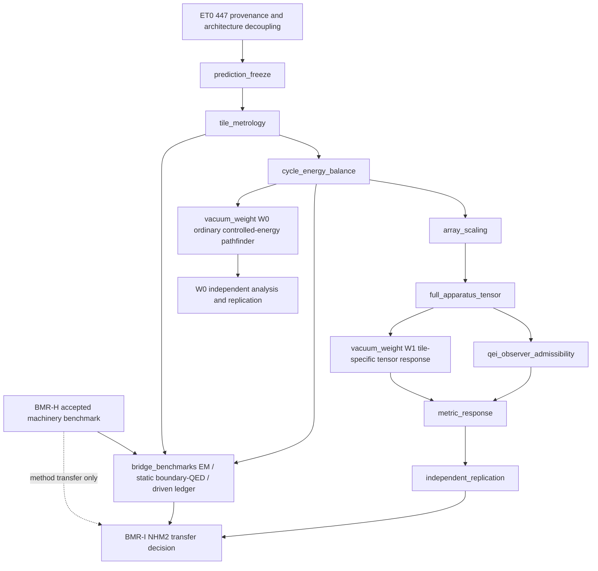

Program gate: G2H-E-S5-A4/P8P remains the sole active program gate; this packet is a nonperturbing parallel apparatus-side planning and contract lane
Workstream: NHM2 source-to-experiment closure
Capability or component: versioned apparatus source tensor and state registry, layer-scaling architecture, bridge benchmarks, W0/W1 vacuum-weight predictions, cancellation-safe metric-response predictions, observer/QEI closure, and independent experimental replay
Current maturity: Stage 2 diagnostic/preexecution; experiment-facing contracts exist, the historical 447-layer scalar case is diagnostic only, and authenticated apparatus evidence is incomplete
Target maturity: experiment-proposal-ready source-to-observable prediction and falsifier packet with no physical-viability or propulsion authority
Required frozen inputs: canonical spherical-boson-star v2 work program; active G2H-E-S5 packet; BMR-I transfer boundary; WARP_AGENTS.md; experiment-facing roadmap and closure contracts; immutable v1 447-layer evidence; exact profile and state identities; separately frozen apparatus A/B states
Required evidence: same-chart complete apparatus delta T_munu; profile/state lineage; local conservation; finite-temperature/material and mechanical closure; state, renormalization, noise and QEI receipts; signed proper-volume source integrals and cancellation diagnostics; authenticated source-to-geometry solve; detector-linked forward models; uncertainty propagation; preregistered nulls; source/runtime-disjoint replay
Stop/fail criteria: metric echo; cross-profile or cross-state evidence reuse; quality-factor multiplication presented as a physical state model; use of a whitepaper fallback or target-calibrated mass as proposal authority; missing apparatus terms; nonconservation; unresolved cancellation/degeneracy; no overlap among tensor, material, geometric and mechanical intervals; uncontrolled backgrounds; reused v1 evidence represented as a v2 result; source or detector predictions that cannot be independently replayed
Explicit non-goals: selected mini-boson-star evaluation; retuning any frozen candidate; treating the star as Casimir-source evidence; choosing a favorable layer count; executing an experiment; claiming curvature from one probe; promoting G3, lamp, physical, propulsion or transport authority
Downstream gate unlocked: apparatus-side BMR-I input after BMR-H accepts the benchmark and this packet's independent evidence closes; this packet alone unlocks neither BMR-I nor G3

# NHM2 source-to-experiment closure parallel work packet v1

Status date: September 1, 2026.

Status: **PARALLEL PLANNING AND VERSIONED CONTRACT WORK ELIGIBLE; APPARATUS
EVIDENCE AND PHYSICAL AUTHORITY ABSENT**.

Change classification: this packet changes planning/documentation only. Future
implementation packets may change receipt semantics or diagnostic calculations
only after they name the exact contract, tests, verification scope and authority
locks they preserve. This packet grants no runtime or experimental authority.

## Authority and relationship to the active solve

The canonical
[`NHM2 spherical-boson-star v2 work program`](./nhm2-spherical-boson-star-v2-work-program.md)
remains the sole dependency/status roadmap. Its G2H-E-S5-A4/P8P gate remains the
only active program gate. The subordinate
[`S5 staged delivery plan`](./nhm2-spherical-boson-star-v2-g2h-e-s5-staged-delivery-plan.md)
continues through S5-A--S5-E and BMR-F--BMR-H before a BMR-I transfer decision.

This packet is permitted in parallel because it does not use, evaluate or
modify the selected mini-boson-star member, its equations, proof definitions,
grids, thresholds, candidate roots, execution ledgers or authority. It prepares
the apparatus-side inputs that BMR-I will eventually require. Work here may not
be represented as progress through P8P, S5, BMR-F, BMR-G, BMR-H or G3.

The boson-star benchmark may validate reusable source-to-geometry, constraint,
Hadamard-state, noise, observer and replay machinery. It cannot transfer the
star's matter model, stress tensor, regularity, positivity, stability or success
to NHM2. A Casimir apparatus must independently close every source, material,
observer and experimental gate below.

The complete bridge-validation ladder is therefore:

1. the mini-boson star for a self-consistent matter-to-geometry solve;
2. a source/runtime-disjoint Einstein-Maxwell benchmark for classical
   electromagnetic stress-to-geometry conventions and conservation;
3. a static, finite-temperature, real-material boundary-QED Casimir benchmark
   in weak gravity for renormalized boundary stress and apparatus bookkeeping;
4. a driven-cavity energy-ledger benchmark for switching, loss, heat,
   radiation and cycle averaging; and only then
5. the independently frozen NHM2 apparatus source-to-geometry comparison.

Each rung validates only the machinery it exercises. No successful rung
transfers the physical identity, sign, magnitude, state or viability of its
source to a later rung.

## Existing source-of-truth surfaces

This packet schedules and connects existing contracts; it does not silently
replace them.

| Question                                                | Authority                                                                                                                                                                                          |
| ------------------------------------------------------- | -------------------------------------------------------------------------------------------------------------------------------------------------------------------------------------------------- |
| What stages connect theory to experiments?              | [`nhm2-experiment-facing-theory-roadmap.v1.ts`](../../shared/contracts/nhm2-experiment-facing-theory-roadmap.v1.ts)                                                                                |
| What gates define experiment-ready theory closure?      | [`nhm2-experiment-ready-theory-closure.v1.ts`](../../shared/contracts/nhm2-experiment-ready-theory-closure.v1.ts)                                                                                  |
| What values are currently targets rather than receipts? | [`nhm2-experiment-parameter-targets.v1.ts`](../../shared/contracts/nhm2-experiment-parameter-targets.v1.ts)                                                                                        |
| What research questions and precedents remain open?     | [`nhm2-experiment-research-gap-ledger.v1.ts`](../../shared/contracts/nhm2-experiment-research-gap-ledger.v1.ts)                                                                                    |
| What authority do mass calculation modes carry?         | [`mass-semantics.md`](../mass-semantics.md)                                                                                                                                                        |
| What cross-system claim boundaries apply?               | [`nhm2-casimir-cross-system-validation-goal.md`](./nhm2-casimir-cross-system-validation-goal.md)                                                                                                   |
| How was the historical scalar layer sweep produced?     | [`build-wall-source-layering-sweep.ts`](../../tools/nhm2/build-wall-source-layering-sweep.ts) and [`nhm2-wall-source-layering-sweep.spec.ts`](../../tests/nhm2-wall-source-layering-sweep.spec.ts) |

If prose in this packet conflicts with one of those versioned contracts, the
contract wins until a separately reviewed versioned successor changes it.

## Supplemental-review disposition

A supplemental model review was compared with the current workspace rather
than accepted as a current-status source. Its useful additions are incorporated
here as the three-axis staleness audit, explicit source-state registry,
`Q * duty` demotion, bridge-validation ladder, W0/W1 claim split,
cancellation-safe metric-demand receipt, detector-linked science tolerances and
M0--M3 joint-observable hierarchy.

The following recommendations were already present and remain in force:
finite-temperature/material modeling, a coupled mechanical ledger, complete
apparatus `delta T_munu`, conservation, QEI/noise/dynamics, physically distinct
metric probes, v1 preservation with a versioned v2 successor and independent
replay.

The following were not imported as established facts: status statements tied
to an older repository revision; claims that an expected ledger or manifest is
absent without a current artifact inventory; numerical detector sensitivities
not bound to a cited calibration receipt; linear extrapolations to a new layer
or stack count; and historical analogies. Existing prohibitions on mutable
`latest` aliases remain contract requirements and should be regression-tested,
not reported as a newly discovered absence.

## Governing scientific separation

Every apparatus study must preserve two independent paths:

```text
metric-first path
  proposed geometry
    -> required same-chart T_munu

source-first path
  independently frozen apparatus state and controls
    -> realized same-chart T_munu
    -> Einstein evolution / constraint solve
    -> detector observables

comparison
  required T_munu versus realized T_munu
  and predicted observables versus measured observables
```

No metric parameter, required wall profile, curvature target or detector target
may be used to tune the source-side apparatus model that is later presented as
independent agreement. A shared target, shared fitted residual or hidden
fallback is a metric echo and stops promotion.

## Dependency map



The arrows are evidence dependencies, not calendar estimates. Tile metrology,
contract/schema work and preregistration may proceed while the boson-star lane
continues, but no apparatus result can inherit star authority.

## Stage ledger

| Stage                                              | State                                                                                                       | Theoretical question                                                                                                                                  | Required exit evidence                                                                                                                                                                                          |
| -------------------------------------------------- | ----------------------------------------------------------------------------------------------------------- | ----------------------------------------------------------------------------------------------------------------------------------------------------- | --------------------------------------------------------------------------------------------------------------------------------------------------------------------------------------------------------------- |
| ET0 — 447 provenance and architecture decoupling   | **ET0-A verified; ET0-B versioned-consumer migration is the next eligible parallel work; ET0 remains open** | Can the historical scalar-equivalence result be preserved without making it the identity of every future apparatus?                                   | immutable v1 preservation; complete literal/field/receipt inventory; reviewed v2 schema and migration tests; architecture remains null without authenticated inputs                                             |
| `prediction_freeze`                                | pending ET0                                                                                                 | What exact A/B apparatus states, hypotheses, observables, nuisance models and falsifiers will be tested?                                              | frozen A/B state contract, sign and phase convention, declared parameter ranges, held-out nulls and no-retune rule                                                                                              |
| `tile_metrology`                                   | pending prediction freeze                                                                                   | Does one physical cavity follow the finite-temperature, finite-geometry material model?                                                               | force-gap/material/loss/roughness/patch/thermal/mechanical receipts with calibrated uncertainty                                                                                                                 |
| `cycle_energy_balance`                             | pending tile metrology                                                                                      | What is the signed total controlled energy change per A/B cycle?                                                                                      | closed energy ledger including drive, heat, strain, supports, radiation and recovery; unexplained energy bounded                                                                                                |
| `array_scaling`                                    | pending cycle balance                                                                                       | How do source strength, coupling, active area, stress and uncertainty scale with N?                                                                   | preregistered small-N ladder, measured scaling maps and interval result; no assumed ideal linear multiplication                                                                                                 |
| `full_apparatus_tensor`                            | pending array scaling                                                                                       | What complete conserved delta T_munu does the realized apparatus produce in one chart?                                                                | all ten components, every apparatus term, raw regional arrays, conservation, anti-echo provenance and uncertainty                                                                                               |
| `vacuum_weight` / W0 ordinary-energy pathfinder    | pending prediction freeze and cycle energy balance                                                          | Does a closed, controlled total-energy difference show the ordinary weak-gravity response with the predicted sign, phase and scale?                   | complete boundary-defined A/B energy ledger, detector forward model, calibrated modulation transfer, active/dummy and reversal nulls, blind analysis, science-tolerance budget and signed result or upper bound |
| `vacuum_weight` / W1 tile-specific tensor response | pending full apparatus tensor                                                                               | Does the realized Casimir apparatus tensor produce its registered weak-field response after all supports, drives and backgrounds are included?        | authenticated full-tensor input, W1 weak-field solve, calibrated detector model, systematic rejection, independent replay and signed result or upper bound                                                      |
| `qei_observer_admissibility`                       | pending full tensor                                                                                         | Do the actual state, switching history and worldlines satisfy state, fluctuation, QEI, stability and causality constraints?                           | Hadamard/renormalization/Ward/noise receipts, continuous observer families, worldline QEI coverage and dynamic backreaction result                                                                              |
| `metric_response`                                  | pending W1 and observer/QEI closure                                                                         | Do physically different probes agree with one source-generated spacetime model?                                                                       | source-side geometry solve plus compatible optical, clock/atom and free-mass predictions with common parameters, detector-linked tolerances and nuisance rejection                                              |
| `independent_replication`                          | pending metric response                                                                                     | Can a source/runtime-disjoint implementation and held-out analysis reproduce the source, geometry and detector conclusions?                           | independent numerical/formal replay, pair agreement or explicit disagreement, frozen falsifier verdict and no-retune chronology                                                                                 |
| `bridge_benchmarks`                                | specifications eligible in parallel; acceptance pending BMR-H, tile metrology and cycle energy balance      | Do the reusable solvers preserve conventions, conservation and energy accounting across classical EM, static boundary-QED and driven-cavity controls? | source/runtime-disjoint benchmark fixtures, analytic/reference comparisons, conservation and convention receipts, disagreement localization and explicit non-transfer claim locks                               |

No row is a new active program gate. ET0 is the first eligible parallel task;
later rows remain blocked by their named apparatus-side evidence.

W0 and W1 are claim-separated sublanes of the existing `vacuum_weight`
contract stage, not newly invented program gates. W0 may prepare theory,
instrument requirements and preregistration after the total A/B cycle-energy
ledger closes; it does not require or imply an NHM2 tensor match. W1 remains
blocked on the full conserved apparatus tensor and is the weight lane relevant
to later source-generated metric claims. Neither row authorizes experiment
execution.

## ET0 immediate agent queue: retire 447 as ambient authority

The bounded ET0-A implementation is specified by the
[`ET0-A v2 architecture contract and authority-inventory work packet`](./nhm2-source-to-experiment-et0-v2-architecture-contract-work-packet.md).
It adds the deterministic inventory producer, fail-closed v2 contract and
manufactured adversarial fixtures without modifying v1 evidence or any P8P
surface. ET0-A verification passed, making only ET0-B versioned-consumer
migration eligible; ET0-A does not close ET0 or unblock `prediction_freeze`.

### Preserved v1 meaning

The current v1 arithmetic compares a required wall scalar magnitude near
`1.6995e9 J/m^3` with an ideal one-row scalar magnitude near
`3.808962e6 J/m^3`. Their ratio is about `446.1845`, whose ceiling is 447.
That makes 447 a valid historical **fixed-control-volume scalar-equivalence
diagnostic under ideal assumptions**.

It is not an authenticated physical stack count. Current tests correctly show
that the 447 fixed-volume row can pass the scalar comparison while
`physicalPass` remains false, and that the expanded-volume interpretation does
not supply the same amplification. The sweep may also obtain the required wall
number from a whitepaper fallback when an authenticated regional source receipt
is absent. Such fallback output must remain diagnostic and cannot select a v2
architecture.

### Problem to remove

The literal 447 currently appears as several distinct concepts:

1. scalar-equivalent layer count;
2. frozen candidate/architecture identity;
3. geometric stack layer count and thickness;
4. mechanical load multiplier;
5. material coupon and fatigue campaign identity;
6. full-apparatus source-retention target; and
7. minimum regional tensor sample count.

Those concepts must not share authority merely because one historical ratio
rounded to 447. In particular, measurement sample sufficiency must be derived
from convergence and uncertainty, not set equal to the architecture layer
count.

### Three-axis staleness audit

ET0 must resolve three independent lineage failures rather than treating
"stale 447" as one scalar defect:

1. **Profile staleness.** The historical layering sweep defaults to the
   `stage1_centerline_alpha_0p995_v1` profile and a `1.6995e9 J/m^3` required
   magnitude, while experiment-facing target and mechanical surfaces use an
   alpha-`0.7000` profile and still carry 447. A layer result is inadmissible
   unless the metric profile ID, content hash, chart, normalization, atlas,
   volume convention and source-profile identity are exact and mutually
   coherent. Cross-profile evidence does not become valid because the scalar
   values are numerically close.
2. **State staleness.** Current diagnostic surfaces do not all represent the
   same physical state: the tile-source fallback uses a gap-energy density
   multiplied by cavity quality factor and effective duty, the mechanical
   receipt uses static ideal pressure multiplied by 447, and the vacuum-weight
   target uses an unamplified static tile-energy quantity. These may remain
   labeled diagnostics, but they cannot be combined into one physical
   candidate or proposal prediction.
3. **Geometry/mechanics staleness.** Reusing 447 as a literal changes stack
   thickness and load without establishing field retention or mechanical
   admissibility. Under the current default diagnostic assumptions, the
   mechanical minimum support fraction and the source-retention maximum do not
   overlap. That is a failed default diagnostic, not a universal no-go theorem;
   a future v2 architecture must derive and authenticate compatible intervals.

Each v2 receipt must bind all three axes. A match on only profile, state or
geometry is insufficient and must fail closed as stale or incomparable.

### Required versioned v2 distinction

A future v2 scaling candidate must expose separate typed fields or equivalent
structures for:

- `scalarEquivalentLayerInterval`;
- `geometricLayerCount`;
- `measuredEffectiveLayerInterval`;
- `tensorClosureLayerInterval`;
- `mechanicallyAdmissibleLayerInterval`;
- `sourceRetentionInterval`;
- `regionalTensorSampleCountMin`; and
- `selectedArchitectureId`, which is `null` until every required interval and
  receipt is authenticated and mutually compatible.

The v2 builder must consume content-addressed references for the required
metric-side tensor and the independently produced source-side tensor. It must
also bind the volume convention, material response, packing/orientation,
coupling, active-area retention, support/control energy and uncertainty policy.
The two tensor lineages must remain distinguishable and an echo check must fail
closed.

### Migration boundary

1. Preserve every v1 schema, receipt, test, artifact ID and 447-specific result
   as immutable historical diagnostic evidence.
2. Inventory every literal, field name, candidate ID, receipt ID, prose claim,
   test fixture and UI projection that treats 447 as ambient authority.
3. Add v2 contracts and builders rather than rewriting v1 evidence in place.
4. Move consumers to a versioned `architectureRef` and typed counts; do not
   replace 447 with another global integer.
5. Return `blocked_missing_receipt`, `no_compatible_interval` or an equivalent
   fail-closed status when no architecture can be selected.
6. Keep fallback-derived values visibly diagnostic and structurally incapable
   of producing `proposal_ready`, `admissible`, `physicalPass` or equivalent.
7. Derive regional sampling requirements from convergence/error policy and
   keep them independent of physical layer count.

### Minimum ET0 regression matrix

- the v1 447 scalar fixture remains byte/semantics compatible;
- a whitepaper fallback can never select a v2 architecture;
- fixed-control-volume and expanded-volume interpretations cannot be mixed;
- changing material/coupling intervals changes the scalar/effective interval
  without mutating historical evidence;
- metric-side and source-side identities must be distinct and an echo fixture
  fails;
- no overlap between tensor, mechanical and retention intervals returns no
  selected architecture;
- sample-count adequacy varies independently of layer count; and
- downstream material, force, fatigue, tensor and campaign consumers use an
  explicit versioned architecture reference rather than an ambient literal;
- profile, state and geometry/mechanics lineages are each exact and coherent;
  a fixture with any one stale axis fails independently; and
- legacy `TARGET_CALIBRATED` mass output remains reproducible but cannot
  authorize a v2 source, architecture, physical or proposal claim.

ET0 closure does not select a new layer count. It only makes a future selection
scientifically representable and prevents 447 from being silently reused as a
physical result.

## Apparatus source-theory duties

### A/B state and prediction freeze

Freeze two physically realizable apparatus states before looking at a gravity
channel. The contract must specify geometry, gap distribution, material state,
temperature, drive waveform, charge and patch state, support conditions,
mechanical preload, radiation environment, timing, orientation and every
controlled difference. It must also define competing thermal, mechanical,
electromagnetic, refractive, polarization and control-system explanations.

The primary source object is

```text
delta T_munu(x,t) = T_munu[B](x,t) - T_munu[A](x,t)
```

in one declared chart, basis, unit system and sign convention. The associated
energy budget is the total controlled apparatus difference, not the ideal
Casimir interaction term in isolation.

The source contract must use an explicit state registry. At minimum it must
distinguish:

- `static_unmodulated`;
- `instantaneous_driven` at a declared phase and time;
- `cycle_averaged_driven` over a declared window and weighting; and
- `differential_A_minus_B` constructed from two separately authenticated
  states.

Every state entry must bind the Hamiltonian or effective action, field and
material boundary conditions, drive waveform, phase reference, averaging
window, temperature, loss channels, renormalization prescription and profile
identity. A quality factor is a response/loss parameter; it must emerge through
the driven-state or transfer model. Multiplying a static negative energy or
stress by `Q * duty` is not a physical state derivation and must remain
diagnostic-only until replaced by a conservation-compatible driven calculation.

### Finite material and quantum source model

Required work includes:

- finite-temperature Lifshitz response using measured dielectric data;
- finite geometry and Maxwell stress on the actual CAD/mesh domain;
- roughness, conductivity, nonlocal response and patch potentials;
- switching and modulation history;
- locally covariant renormalized mean stress in one declared state;
- Hadamard and Ward/conservation evidence;
- connected stress-noise and fluctuation/backreaction bounds; and
- material, thermal, support, drive and control stress returned to the same
  apparatus tensor.

The quantum-source implementation must therefore produce separate static,
instantaneous, cycle-averaged and A/B-differential receipts. It must not allow
one state class to satisfy a gate written for another state class, even when
both share a cavity geometry or profile ID.

An ideal pressure match, a negative scalar density or a mean stress alone does
not close this duty.

### Mechanics, conservation and scaling

The apparatus model must return nonlinear mechanical strain, support loads,
pull-in/stiction margin, fatigue/creep/delamination, thermal cycling, actuator
authority and their energy-momentum contributions to the source tensor. The
small-N array campaign must measure, rather than assume,

```text
S_N = delta E_N / (N * delta E_1).
```

The same campaign must map active-area retention, interlayer coupling,
per-layer variation, source-tensor retention and uncertainty. A selected layer
architecture requires overlap among source, geometry, material and mechanical
intervals; a scalar crossing alone is insufficient.

The field/material and mechanics solvers must also close a coupled fixed point:
electromagnetic or quantum stress deforms the cavity, the deformed geometry
changes the field state, and support/actuator reactions return to the apparatus
tensor. One-way post-processing is diagnostic unless a bounded coupling error
is demonstrated.

## Vacuum-weight theoretical packet

The vacuum-weight experiment is a conservative gravity test, not a warp test.
For a weak terrestrial field, the preregistered baseline is the signed
differential response

```text
delta F_z = g * delta E_total / c^2
```

under the packet's declared vertical/sign convention. `delta E_total` must be
the independently closed A/B energy difference of the complete apparatus,
including material, support, strain, thermal, electromagnetic, drive and
radiative terms. The bare ideal Casimir interaction energy cannot substitute
for that ledger.

The packet is split by claim:

- **W0 — ordinary controlled-energy weight pathfinder.** This asks whether a
  fully balanced, boundary-defined A/B total-energy difference participates in
  ordinary weak gravity as expected. Theory, sensitivity design and
  preregistration may proceed after `prediction_freeze` and
  `cycle_energy_balance`; no NHM2 tensor, negative-energy dominance or warp
  interpretation is part of the claim.
- **W1 — tile-specific weak-field response.** This uses the authenticated
  complete Casimir-apparatus `delta T_munu`, including stresses, momentum,
  supports, drive and controls, to predict a source-specific response. It is
  blocked on `full_apparatus_tensor` and is the minimum weight evidence that can
  inform the later multi-probe metric lane.

W0 can validate instrumentation, modulation, balance-boundary accounting and
ordinary mass-energy coupling without being promoted as a Casimir or NHM2
source result. W1 cannot inherit a W0 result in place of its tensor-specific
prediction.

The theory packet must freeze:

- signal sign, phase, modulation frequency and transfer function;
- expected scaling with total controlled energy and apparatus count;
- orientation behavior relative to gravity and apparatus-fixed backgrounds;
- active-versus-dummy, phase-reversal, orientation-reversal and matched
  thermal/electromagnetic/mechanical nulls;
- seismic, tilt, buoyancy, radiometric, magnetic, electrostatic, thermal,
  cable/control and readout systematics;
- blind injected-signal and held-out analysis procedures; and
- the sensitivity at which a null result becomes a bound on the registered
  model rather than merely an underpowered measurement.

For both W0 and W1, feasibility is detector-linked: the predicted signal and
its uncertainty must be propagated through the measured transfer function and
compared with calibrated systematic and noise floors. A generic numerical
residual tolerance or a nominal force sensitivity is not a science tolerance.
The packet must state the minimum detectable registered effect, required
integration time assumptions, false-positive/false-negative rule and the
parameter region a null result would actually exclude.

A passing result would support the registered statement that the controlled
total-energy difference gravitates with the observed sign and magnitude. It
would not establish the NHM2 tensor match, invariant curvature, a warp bubble,
propulsion or transport. A null result must preserve its achieved sensitivity
and bound rather than be reinterpreted through a new post-result energy budget.

Primary theoretical context includes
[Milton et al., _Gravitational and Inertial Mass of Casimir Energy_](https://arxiv.org/abs/0710.3841)
and
[Bimonte et al., _Relativistic mechanics of Casimir apparatuses in a weak gravitational field_](https://arxiv.org/abs/hep-th/0703062).
The 2025
[Archimedes status report](https://hdl.handle.net/10281/542261)
is an experimental precedent for modulated vacuum-weight instrumentation; it
is context, not an NHM2 receipt and not a reported NHM2 signal.

## Cancellation-safe metric-demand accounting

The current alpha-`0.7000` reduced-order metric-required regional artifact uses
a `12 x 12 x 12` grid and reports zero global component means. That result is
diagnostic: an average can vanish because the pointwise field is zero, because
positive and negative regions cancel, or because the discretization or
symmetry projection is degenerate. It must not be used as evidence for zero
pointwise demand or as a denominator for a layer claim without resolving those
possibilities.

For both the metric-required tensor and the independently realized source
tensor, a successor receipt must preserve the raw regional arrays and emit:

- pointwise minima, maxima and finite-value counts for every independent
  component;
- `L1`, `L2` and `Linf` norms with declared weighting;
- signed proper-volume integrals `E_minus`, `E_plus` and `E_net` for `T00`,
  without taking an absolute value before integration;
- proper-volume integrals and norms for momentum density, principal/spatial
  stresses and shear, with the declared observer, slice, lapse, volume element,
  chart and basis;
- cancellation ratios, symmetry/parity checks and numerical-floor tests; and
- mesh/domain/quadrature convergence plus an independent replay of the
  nondegeneracy decision.

No scalar layer ratio may divide by a mean-zero, cancellation-dominated or
numerically degenerate metric quantity. The receipt must return a typed
`blocked_degenerate_metric_demand` or equivalent until a converged,
observer-declared comparison quantity exists.

## Source-generated metric and detector duties

Only after the source-side tensor is authenticated may an agent solve the
Einstein constraints/evolution and compute detector observables. Weak-field
`h00` arithmetic is a scale calculator, not a metric-response receipt.

The metric-response packet must provide:

1. the source tensor and source-to-geometry solve in the same chart and units;
2. constraint and conservation residuals plus boundary conditions;
3. curvature or other coordinate-independent diagnostics;
4. optical phase/polarization, clock or atom-interferometer, and mechanically
   free test-mass forward models;
5. common spacetime parameters that all admitted probes must recover;
6. apparatus-specific nuisance models and spatial/temporal falloff; and
7. a joint held-out decision that rejects a gravitational interpretation while
   ordinary thermal, refractive, electromagnetic, strain or pickup explanations
   remain viable at the claimed power.

The registered observable is a joint vector, not a collection of separately
optimized anomalies. It should contain the admitted weight, optical,
clock/atom, free-mass and environmental-control channels with their covariance,
transfer functions and common source parameters. The preregistered comparison
must preserve this model hierarchy:

- **M0:** instrument and ordinary environmental/systematic explanations;
- **M1:** ordinary controlled-energy weak-gravity response (the W0 claim);
- **M2:** source-specific weak-field response generated from the authenticated
  apparatus tensor (the W1/multi-probe claim); and
- **M3:** independently realized-versus-required NHM2 tensor and geometry match.

M3 is not eligible merely because M1 or M2 fits. Each promotion requires its
own evidence, falsifiers and science-tolerance threshold, and the joint result
must preserve both disagreement and null outcomes.

One optical phase residual cannot establish curvature. Physically different
probes must agree with one source-generated spacetime model within frozen
uncertainties.

## Observer, QEI and dynamic duties

The actual apparatus tensor, state and switching history must be tested against
continuous timelike/null observer families and applicable worldline quantum
inequalities. A finite hand-picked observer list is diagnostic only. The same
packet must cover noise-driven backreaction, coupled dynamics, stability,
horizon/blueshift diagnostics where applicable, causal controllability and a
frozen parameter neighborhood. These duties use the apparatus source; a
boson-star QEI or stability receipt cannot satisfy them.

## Evidence identity and artifact materialization

Every promotion-sensitive run must materialize its own content-addressed
artifacts rather than depend on an in-memory object, an ambient default or a
mutable pointer. The run manifest must bind the exact metric profile, source
profile, state registry entries, A/B definitions, architecture, material data,
CAD/mesh, solver version, commit/worktree provenance, configuration, random
seeds where applicable and hashes of every consumed and produced receipt.

Any research-gap ledger, candidate manifest, metric-demand integral,
cycle-energy ledger, detector prediction or decision receipt cited by a claim
must exist in that run's immutable output set and be hash-reachable from its
manifest. Mutable `latest` paths and cross-run scavenging are forbidden for
promotion evidence even if a convenience alias exists for browsing.

Mass modes must preserve their documented authority. `MODEL_DERIVED` and
`MEASURED_FORCE_INFERRED` results still require complete provenance and
uncertainty; legacy `TARGET_CALIBRATED` output may reproduce a historical
target but cannot source-authorize a tensor, candidate, architecture, physical
or proposal-ready claim.

## Independent replication and BMR-I handoff

The final apparatus packet requires a source/runtime-disjoint implementation
that reconstructs the source tensor, conservation, geometry and detector
predictions without consuming primary numerical output. Pair disagreement is
preserved and localized; it is never averaged away.

BMR-I becomes eligible only when both conditions hold:

1. BMR-H has accepted the mini-boson-star benchmark as a machinery control; and
2. this apparatus program has the exact source, material, state, observer,
   detector and independent-replay inputs required by a separately frozen
   NHM2 transfer packet.

The transfer may reuse validated methods and ABIs. It may not reuse the star's
matter evidence or treat success in the control system as evidence that the
Casimir apparatus produces the required source.

## Agent operating rule

For every implementation turn spawned from this packet:

1. restate the required work-packet header and identify the exact stage row;
2. read the canonical work program, active packet, this packet and
   `WARP_AGENTS.md`;
3. inspect the worktree and preserve all v1 evidence and unrelated changes;
4. freeze inputs, schema, failure precedence and tests before computing a new
   result;
5. keep metric-side and source-side identities independently traceable;
6. implement the smallest versioned contract or diagnostic that closes the
   earliest missing dependency;
7. materialize run-specific, hash-bound artifacts and reject mutable aliases,
   stale profile/state/geometry lineages and target-calibrated authority;
8. run the math/WARP/Casimir gate whenever the patch changes the applicable
   physics, proof-maturity, adapter, certificate or claim surfaces;
9. report the first failed hard gate and do not promote around it; and
10. update this packet and the canonical parallel-lane summary only when named
    exit evidence exists.

No agent may use this packet as authority to execute a selected scientific
lane, create cloud resources, operate laboratory equipment, select a physical
architecture, or promote physical viability.
