# NHM2 Spherical Boson-Star v2 Work Program

Status: canonical program-control document.

Active program gate: **G2H-E-S5 — inert primary execution-preflight decision**

Status date: **August 27, 2026**

This document preserves the complete scientific objective while identifying the
single gate that repository agents are permitted to treat as the current
deadline. It answers:

> What are we ultimately building, what are we doing now, what evidence closes
> the current gate, and what work becomes eligible afterward?

The August 28 decision packet now records `BLOCKED` with source-disjoint,
exactly matching frozen-core numerical failure evidence and is preserved at
[`nhm2-spherical-boson-star-v2-august-28-numerical-decision-record.md`](./nhm2-spherical-boson-star-v2-august-28-numerical-decision-record.md).
The completed smooth-family selection is
[`nhm2-spherical-boson-star-v2-g2h-e-s3-r2-selection-result.md`](./nhm2-spherical-boson-star-v2-g2h-e-s3-r2-selection-result.md),
and the umbrella implementation/preexecution packet is
[`nhm2-spherical-boson-star-v2-g2h-e-s4-mini-boson-star-proof-implementation-preexecution.md`](./nhm2-spherical-boson-star-v2-g2h-e-s4-mini-boson-star-proof-implementation-preexecution.md).
The active primary execution-preflight packet is
[`nhm2-spherical-boson-star-v2-g2h-e-s5-primary-execution-preflight.md`](./nhm2-spherical-boson-star-v2-g2h-e-s5-primary-execution-preflight.md).
Its subordinate staged delivery checklist is
[`nhm2-spherical-boson-star-v2-g2h-e-s5-staged-delivery-plan.md`](./nhm2-spherical-boson-star-v2-g2h-e-s5-staged-delivery-plan.md);
the checklist does not replace this canonical roadmap and its post-S5 rows are
downstream forecasts only.
The current bounded A4 corrective handoff is the
[`H2 performance-successor packet`](./nhm2-spherical-boson-star-v2-g2h-e-s5-a4-h2-performance-successor-handoff.md).
Both serial H2 executions are now stopped with available partial evidence
preserved. H2-P3 exact equivalence passes at 1/2/4/8/16 threads, including
deterministic repeated 16-thread replay. The
[`H2-P4 result`](./nhm2-spherical-boson-star-v2-g2h-e-s5-a4-h2-p4-cloud-scaling-result.md)
records a 40/40 independent audit for the exact exponent-2 workload. The
[`H2-P5 decision`](./nhm2-spherical-boson-star-v2-g2h-e-s5-a4-h2-p5-runtime-turnaround-decision.md)
passes 19/19 and proves that workload exposes at most four outer worker tasks.
The [H2-P5A packet](./nhm2-spherical-boson-star-v2-g2h-e-s5-a4-h2-p5a-representative-width-calibration-packet.md)
freezes an exact `P=1024` candidate-only surface, five-run sequence and 24-hour
decision boundary under two independent 32/32 inert audits. After the first VM
request was rejected before resource creation, the additive
[storage correction](./nhm2-spherical-boson-star-v2-g2h-e-s5-a4-h2-p5a-storage-compatibility-correction.md)
changed only `pd-balanced` to `hyperdisk-balanced` and passed 26/26. The one
authorized corrected VM then stopped before build because the exact 36-entry
upload omitted the required pinned Dockerfile. The
[immutable result](./nhm2-spherical-boson-star-v2-g2h-e-s5-a4-h2-p5a-execution-blocked-result.md)
passes a 25/25 blocker audit: zero representative runs occurred, all authority
remains false, and the VM is `TERMINATED`. The separately versioned
[H2-P5A-R1 upload-inventory repair](./nhm2-spherical-boson-star-v2-g2h-e-s5-a4-h2-p5a-r1-upload-inventory-repair.md)
now preserves all 36 predecessor members byte-for-byte and adds only the frozen
Dockerfile. Producer preflight passes 15/15; after preserving a 26/28 audit-
predicate failure, the corrected independent audit passes 28/28 and reproduces
binary `aa37562f...13b7` from an offline extracted build. Its separately
authorized [cloud execution](./nhm2-spherical-boson-star-v2-g2h-e-s5-a4-h2-p5a-r1-cloud-execution-result.md)
is now immutable `BLOCKED_PREEXECUTION_BUILD_BINDING`: the clean cloud daemon
loaded both archived tags with empty `RepoDigests`, so the frozen
`name@repository-digest` `FROM` stopped before compilation. Independent audit
passes 22/22; zero calibrations ran, the R1 and predecessor VMs are
`TERMINATED`, and the R1 disk/evidence remain preserved. A versioned
candidate-neutral [H2-P5A-R2 clean-daemon binding repair](./nhm2-spherical-boson-star-v2-g2h-e-s5-a4-h2-p5a-r2-clean-daemon-binding-repair.md)
now passes producer preflight 11/11 and independent audit 28/28. It preserves
all 37 R1 members, adds only a local-tag/no-pull build definition and guard,
reproduces the cloud config identities in an empty classic daemon, and
reproduces binary `aa37562f...13b7`. Zero calibrations or cloud actions ran.
The separate exact R2 [representative-width cloud proposal](./nhm2-spherical-boson-star-v2-g2h-e-s5-a4-h2-p5a-r2-cloud-proposal.md)
was executed once under exact authorization. Its immutable
[result](./nhm2-spherical-boson-star-v2-g2h-e-s5-a4-h2-p5a-r2-cloud-execution-result.md)
passes independent audit 50/50: all five `P=1024` runs completed with exact
semantic agreement, the slower 16-thread time was 157,550 ms, and the frozen
two-selector projection is 22.406940158 hours, below 24 hours. The VM is
`TERMINATED`, its disk/evidence remain preserved, no full selector or frozen
member ran, and every authority remains false. The next eligible step is the
candidate-neutral H2 parent implementation closure and its independent audit.
The subsequent [H2-P6 parent runtime binding](./nhm2-spherical-boson-star-v2-g2h-e-s5-a4-h2-p6-parent-runtime-binding-result.md)
now passes a bounded 11/11 manufactured fixture and 33/33 independent audit.
H2 and P2 are fixed to the exact-equivalent 16-thread selector without changing
the dyadic schedule or reduction order. No long parent selector ran. The next
eligible step is a separately frozen candidate-neutral H2 parent execution
proposal; no VM or execution authority is implied.
That [H2-P7 proposal](./nhm2-spherical-boson-star-v2-g2h-e-s5-a4-h2-p7-parent-cloud-proposal.md)
is now frozen at `3f15f387...fdc3`. Its 44-entry offline archive passes producer
preflight 12/12 and independent proposal audit 27/27; exact binary
`e6dfc340...8f56` is bound. Under separate exact authorization, the
[H2-P7 launch](./nhm2-spherical-boson-star-v2-g2h-e-s5-a4-h2-p7-parent-cloud-launch.md)
created the one exact C4 VM, reproduced the archive and binary identities, and
started exactly one candidate-neutral parent process at `2026-08-28T00:05:17Z`.
The process is active under the 100,800-second timeout and scheduled VM
shutdown; no result or independent result audit exists yet. Its separately
frozen [pre-result audit definition](./nhm2-spherical-boson-star-v2-g2h-e-s5-a4-h2-p7-result-audit-definition.md)
passes synthetic fixtures 4/4 and an independent definition audit 17/17. It
cannot inspect or alter the active process and does not imply a result verdict.
Its active S5-A
[`formal-germ subtraction definition review`](./nhm2-spherical-boson-star-v2-g2h-e-s5-a-formal-germ-subtraction-definition-review.md)
records an unbound truncation/formal-tail issue and selects nothing.
The expanded Borel pre-acknowledgement review repaired 23 total-definition bindings;
A3 subsequently bound the repaired exact bytes by independent
acknowledgement, while A4 remains the sole active implementation row.
The active A3 decision surface is the
[`replacement Borel-definition acknowledgement request`](./nhm2-spherical-boson-star-v2-g2h-e-s5-a-borel-definition-replacement-acknowledgement-request.md);
the earlier request remains withdrawn and cannot satisfy it.
Its completed fail-closed quantum-definition repair is
[`nhm2-spherical-boson-star-v2-g2h-e-s4-r2-quantum-builder-definition-repair.md`](./nhm2-spherical-boson-star-v2-g2h-e-s4-r2-quantum-builder-definition-repair.md).
The completed first-failure packet is
[`nhm2-spherical-boson-star-v2-initializer-production-runtime-repair.md`](./nhm2-spherical-boson-star-v2-initializer-production-runtime-repair.md).
The completed numerical-policy review is
[`nhm2-spherical-boson-star-v2-frozen-core-numerical-policy-review.md`](./nhm2-spherical-boson-star-v2-frozen-core-numerical-policy-review.md).
The completed v2 attempt packet is
[`nhm2-spherical-boson-star-v2-equilibrated-mpfr-core-successor-attempt.md`](./nhm2-spherical-boson-star-v2-equilibrated-mpfr-core-successor-attempt.md).
The completed v3 correction proposal is
[`nhm2-spherical-boson-star-v2-core-successor-v3-proposal.md`](./nhm2-spherical-boson-star-v2-core-successor-v3-proposal.md).
Its one-shot result is receipt
`abcb60bb1a613d193196b4b3b6196dc75f465310fdd716bdfcd3ddefaf5ce359`.
The completed G2 packet is
[`nhm2-spherical-boson-star-v2-classical-branch-proof-terminal-state-packet.md`](./nhm2-spherical-boson-star-v2-classical-branch-proof-terminal-state-packet.md),
and its terminal decision is preserved at
[`nhm2-spherical-boson-star-v2-g2-classical-branch-decision-record.md`](./nhm2-spherical-boson-star-v2-g2-classical-branch-decision-record.md).
The completed G2-R1 diagnosis is
[`nhm2-spherical-boson-star-v2-g2-r1-exact-hermite-diagnosis-record.md`](./nhm2-spherical-boson-star-v2-g2-r1-exact-hermite-diagnosis-record.md).
The completed G2B-A hard-stop record is
[`nhm2-spherical-boson-star-v2-g2b-a-calibration-failure-record.md`](./nhm2-spherical-boson-star-v2-g2b-a-calibration-failure-record.md).
The completed G2B-M1 result is
[`nhm2-spherical-boson-star-v2-g2b-m1-result-record.md`](./nhm2-spherical-boson-star-v2-g2b-m1-result-record.md).
The completed R1 diagnosis is
[`nhm2-spherical-boson-star-v2-g2b-m1-r1-diagnosis-record.md`](./nhm2-spherical-boson-star-v2-g2b-m1-r1-diagnosis-record.md).
The completed R2 result is
[`nhm2-spherical-boson-star-v2-g2b-m1-r2-result-record.md`](./nhm2-spherical-boson-star-v2-g2b-m1-r2-result-record.md).
The completed R3 result is
[`nhm2-spherical-boson-star-v2-g2b-m1-r3-result-record.md`](./nhm2-spherical-boson-star-v2-g2b-m1-r3-result-record.md).
The completed M2 result is
[`nhm2-spherical-boson-star-v2-g2b-m2-result-record.md`](./nhm2-spherical-boson-star-v2-g2b-m2-result-record.md).
The completed M2-R1 review is
[`nhm2-spherical-boson-star-v2-g2b-m2-r1-review-result.md`](./nhm2-spherical-boson-star-v2-g2b-m2-r1-review-result.md).
The completed M3 result is
[`nhm2-spherical-boson-star-v2-g2b-m3-result-record.md`](./nhm2-spherical-boson-star-v2-g2b-m3-result-record.md).
The completed M4 result is
[`nhm2-spherical-boson-star-v2-g2b-m4-result-record.md`](./nhm2-spherical-boson-star-v2-g2b-m4-result-record.md).
The completed M5 numerical result is
[`nhm2-spherical-boson-star-v2-g2b-m5-result-record.md`](./nhm2-spherical-boson-star-v2-g2b-m5-result-record.md).
The completed M5-R1 independent admission result is
[`nhm2-spherical-boson-star-v2-g2b-m5-r1-result-record.md`](./nhm2-spherical-boson-star-v2-g2b-m5-r1-result-record.md).
The completed B4 integrated-attempt result is
[`nhm2-spherical-boson-star-v2-g2b-b4-result-record.md`](./nhm2-spherical-boson-star-v2-g2b-b4-result-record.md).
The completed B4-R1 scalar-ABI reconciliation is
[`nhm2-spherical-boson-star-v2-g2b-b4-r1-result-record.md`](./nhm2-spherical-boson-star-v2-g2b-b4-r1-result-record.md).
The completed B4-R2 corrected-initializer attempt is
[`nhm2-spherical-boson-star-v2-g2b-b4-r2-result-record.md`](./nhm2-spherical-boson-star-v2-g2b-b4-r2-result-record.md).
The completed B4-R3 predictor/path reconciliation is
[`nhm2-spherical-boson-star-v2-g2b-b4-r3-result-record.md`](./nhm2-spherical-boson-star-v2-g2b-b4-r3-result-record.md).
The completed B4-R4 four-grid attempt is
[`nhm2-spherical-boson-star-v2-g2b-b4-r4-result-record.md`](./nhm2-spherical-boson-star-v2-g2b-b4-r4-result-record.md).
The completed B4-R5 terminal-Newton diagnosis is
[`nhm2-spherical-boson-star-v2-g2b-b4-r5-result-record.md`](./nhm2-spherical-boson-star-v2-g2b-b4-r5-result-record.md).
The completed B4-R6 mechanism-separation benchmark is
[`nhm2-spherical-boson-star-v2-g2b-b4-r6-result-record.md`](./nhm2-spherical-boson-star-v2-g2b-b4-r6-result-record.md).
The completed B4-R7 causal-interaction review is
[`nhm2-spherical-boson-star-v2-g2b-b4-r7-result-record.md`](./nhm2-spherical-boson-star-v2-g2b-b4-r7-result-record.md).
The completed B4-R8 continuum constraint definition is
[`nhm2-spherical-boson-star-v2-g2b-b4-r8-result-record.md`](./nhm2-spherical-boson-star-v2-g2b-b4-r8-result-record.md).
The completed B4-R9 numerical formulation proposal is
[`nhm2-spherical-boson-star-v2-g2b-b4-r9-result-record.md`](./nhm2-spherical-boson-star-v2-g2b-b4-r9-result-record.md).
The completed B4-R10 implementation/preexecution closure is
[`nhm2-spherical-boson-star-v2-g2b-b4-r10-result-record.md`](./nhm2-spherical-boson-star-v2-g2b-b4-r10-result-record.md).
The current B4-R10 one-shot authorization decision is
[`nhm2-spherical-boson-star-v2-g2b-b4-r10-authorization-decision.md`](./nhm2-spherical-boson-star-v2-g2b-b4-r10-authorization-decision.md).
The immutable B4-R10 execution result is
[`nhm2-spherical-boson-star-v2-g2b-b4-r10-execution-result.md`](./nhm2-spherical-boson-star-v2-g2b-b4-r10-execution-result.md).
The blocked B4-R11 diagnostic result is
[`nhm2-spherical-boson-star-v2-g2b-b4-r11-result-record.md`](./nhm2-spherical-boson-star-v2-g2b-b4-r11-result-record.md).
The terminal B4-R11-R1 branch-closure result is
[`nhm2-spherical-boson-star-v2-g2b-b4-r11-r1-result-record.md`](./nhm2-spherical-boson-star-v2-g2b-b4-r11-r1-result-record.md).
The completed G2B packet remains
[`nhm2-spherical-boson-star-v2-g2b-replacement-classical-proof-attempt.md`](./nhm2-spherical-boson-star-v2-g2b-replacement-classical-proof-attempt.md).
The completed G2C selection is
[`nhm2-spherical-boson-star-v2-g2c-selection-result.md`](./nhm2-spherical-boson-star-v2-g2c-selection-result.md).
Its closure audit is
[`nhm2-spherical-boson-star-v2-g2c-closure-audit.md`](./nhm2-spherical-boson-star-v2-g2c-closure-audit.md).
The completed G2D-R1 diagnosis is
[`nhm2-spherical-boson-star-v2-g2d-r1-static-failure-diagnosis.md`](./nhm2-spherical-boson-star-v2-g2d-r1-static-failure-diagnosis.md).
The completed G2E result is
[`nhm2-spherical-boson-star-v2-g2e-result.md`](./nhm2-spherical-boson-star-v2-g2e-result.md).
The completed G2F selection result is
[`nhm2-spherical-boson-star-v2-g2f-selection-result.md`](./nhm2-spherical-boson-star-v2-g2f-selection-result.md).
Its closure audit is
[`nhm2-spherical-boson-star-v2-g2f-closure-audit.md`](./nhm2-spherical-boson-star-v2-g2f-closure-audit.md).
The completed G2G definition result is
[`nhm2-spherical-boson-star-v2-g2g-result.md`](./nhm2-spherical-boson-star-v2-g2g-result.md).
The completed parent G2H packet is
[`nhm2-spherical-boson-star-v2-g2h-proof-implementation-preexecution.md`](./nhm2-spherical-boson-star-v2-g2h-proof-implementation-preexecution.md).
Its immutable v1 fixture failure is
[`nhm2-spherical-boson-star-v2-g2h-fixture-v1-failure.md`](./nhm2-spherical-boson-star-v2-g2h-fixture-v1-failure.md).
The completed R1/R2 fixture-repair result is
[`nhm2-spherical-boson-star-v2-g2h-r2-result.md`](./nhm2-spherical-boson-star-v2-g2h-r2-result.md).
The independently audited G2H closure result is
[`nhm2-spherical-boson-star-v2-g2h-result.md`](./nhm2-spherical-boson-star-v2-g2h-result.md).
The exhausted G2H-E authorization proposal is
[`nhm2-spherical-boson-star-v2-g2h-e-execution-proposal.md`](./nhm2-spherical-boson-star-v2-g2h-e-execution-proposal.md).
The sole active disposition packet and immutable partial result is
[`nhm2-spherical-boson-star-v2-g2h-e-primary-result.md`](./nhm2-spherical-boson-star-v2-g2h-e-primary-result.md).
The completed candidate-neutral identity repair is
[`nhm2-spherical-boson-star-v2-g2h-e-r1-result.md`](./nhm2-spherical-boson-star-v2-g2h-e-r1-result.md).
Its inert versioned successor proposal is
[`nhm2-spherical-boson-star-v2-g2h-e-r1-successor-proposal.v1.json`](./nhm2-spherical-boson-star-v2-g2h-e-r1-successor-proposal.v1.json).
The active exact authorization decision packet is
[`nhm2-spherical-boson-star-v2-g2h-e-s-authorization-decision.md`](./nhm2-spherical-boson-star-v2-g2h-e-s-authorization-decision.md).
The immutable primary-v2 partial result is
[`nhm2-spherical-boson-star-v2-g2h-e-s-primary-result.md`](./nhm2-spherical-boson-star-v2-g2h-e-s-primary-result.md).
The completed schema-alignment/preexecution result is
[`nhm2-spherical-boson-star-v2-g2h-e-s-r1-result.md`](./nhm2-spherical-boson-star-v2-g2h-e-s-r1-result.md).
Its current-head verification receipt is
[`nhm2-spherical-boson-star-v2-g2h-e-s-r1-verification-receipt.v1.json`](./nhm2-spherical-boson-star-v2-g2h-e-s-r1-verification-receipt.v1.json).
The exhausted exact authorization decision is
[`nhm2-spherical-boson-star-v2-g2h-e-s3-authorization-decision.md`](./nhm2-spherical-boson-star-v2-g2h-e-s3-authorization-decision.md).
Its immutable primary result is
[`nhm2-spherical-boson-star-v2-g2h-e-s3-primary-result.md`](./nhm2-spherical-boson-star-v2-g2h-e-s3-primary-result.md).
Its current-head integrity receipt is
[`nhm2-spherical-boson-star-v2-g2h-e-s3-primary-verification-receipt.v1.json`](./nhm2-spherical-boson-star-v2-g2h-e-s3-primary-verification-receipt.v1.json).
The completed surface-regularity disposition is
[`nhm2-spherical-boson-star-v2-g2h-e-s3-r1-regularity-disposition.md`](./nhm2-spherical-boson-star-v2-g2h-e-s3-r1-regularity-disposition.md).

## Permanent program objective

Build one fully authenticated semiclassical v2 candidate workflow:

```text
frozen candidate
  -> mathematical proofs
  -> accepted joint geometry/state
  -> SI + metric inputs
  -> two source/runtime-disjoint 68-file lanes
  -> replay and pair agreement
  -> diagnostic Theory Graph lamp
```

Each lane has exactly 68 files and 6,693,376 bytes under the frozen output ABI.
Physical viability, propulsion, transport, launch, and empirical authority remain
locked false unless a later, separately authorized program changes their exact
contracts and supplies the required evidence. Completion of this program does
not itself establish any of those claims.

## Source-of-truth map

| Question                                                             | Sole authority                                                      |
| -------------------------------------------------------------------- | ------------------------------------------------------------------- |
| What is the permanent program objective and dependency order?        | this document                                                       |
| What is the active deadline, decision rule, and daily work boundary? | the linked August 28 sprint document                                |
| What mathematical and claim constraints govern warp/GR work?         | [`WARP_AGENTS.md`](../../WARP_AGENTS.md)                            |
| What is the current repository-wide math maturity summary?           | [`MATH_STATUS.md`](../../MATH_STATUS.md) and generated math reports |
| What are the exact scientific definitions and numerical thresholds?  | the versioned contracts and source artifacts named by each gate     |
| What happened in one audit or run?                                   | that immutable audit, receipt, and its exact byte bindings          |
| What must a repository agent declare before working on this program? | [`AGENTS.md`](../../AGENTS.md)                                      |

Dated overviews and audits are evidence snapshots, not current roadmaps. A green
certificate for an earlier tree does not certify the current tree. A sealed
definition is not an executed proof, and a receipt is an observation rather than
authority to promote a claim.

## Current position

The program remains **Stage 2: diagnostic/preexecution**.

| Layer                        | Current state                                                                                                                                                                                                                                                                       |
| ---------------------------- | ----------------------------------------------------------------------------------------------------------------------------------------------------------------------------------------------------------------------------------------------------------------------------------- |
| Preexecution evidence        | A -> S -> SR -> P -> PR -> E -> ER contracts are bounded, sealed, chronology-checked, and independently audited.                                                                                                                                                                    |
| Candidate definition         | The closed G2B candidate remains immutable evidence. G2D froze exactly one dimensionless constant-density member at `chi=1/4`, its analytic duties and replay-only N=64/96/128/256 grids. Its sole execution terminated at the primary evaluator with exit code 1 before any duty receipt; admitted candidates remain 0. |
| Output ABI                   | Exactly 68 roles and 6,693,376 bytes per lane are frozen.                                                                                                                                                                                                                           |
| SI normalization             | SI-v2 definition, hardened MPFR lease, and primary adapter exist; an independent C implementation exists statically, but authenticated Linux execution is absent.                                                                                                                   |
| Classical branch diagnostics | The frozen G2B branch is closed without a terminal candidate. G2D preexecution passed, then its exact one-shot command persisted a terminal `FAIL` with `primary_evaluator_failed:1`. Result audit passes 5/5. Static diagnosis passes 8/8: both analytic residual systems reduce identically to zero, while the primary's `Decimal.sqrt()` floor/ceiling calls collapse to one half-even value and violate upper enclosure. The run's exact exception remains unobserved because stderr was not persisted. |
| Boundary mathematics         | The origin/tail recurrence kernel exists as an authority-neutral diagnostic; authenticated proof receipts remain absent.                                                                                                                                                            |
| Vacuum continuation          | The ABI record/input hashing and Unicode-totality defects are repaired, sealed, and independently audited; no verifier or proof execution exists.                                                                                                                                   |
| Numerical decision           | G2D remains an immutable execution `FAIL`, not a falsification of its analytic geometry. G2F/G2G froze Tolman-VII `mu=1`, `C=1/5` under `30de966d...343d`. After two preserved pre-math partials and bounded repairs, primary-v3 reached mathematics once: preflight passed, then the surface gate found `B''_in=-350/27` and `B''_out=100/27`. The authenticated result is `FAIL_GLOBAL_STATIC_STATE_SURFACE_GERMS_DISJOINT_ORDER_2`; candidate evaluations are 1, all 18 later duties are ineligible, the proposal is exhausted and Rust remains unauthorized. R1 independently upholds that failure for the standard semiclassical route: the surface produces an unregistered `Box R` delta, the cited Hadamard/RSET/noise route assumes a globally `C∞` background, and analyticity is narrowed to a sufficient special proof method rather than a requirement. |
| Geometry/state               | The accepted-geometry/state handoff is definition-only; every solver, state, witness, and acceptance binding is null.                                                                                                                                                               |
| Scientific output            | Only `smearing_weights` is materializable, in memory, for 1 of 68 roles.                                                                                                                                                                                                            |
| Runtime lanes                | Complete primary lanes: 0; complete independent lanes: 0; pair agreements: 0.                                                                                                                                                                                                       |
| Authority                    | Execution, readiness, diagnostic lamp, physical viability, propulsion, and transport remain false/null.                                                                                                                                                                             |

## Dependency order

```mermaid
flowchart TD
    G0["G0 Definitions and safety boundaries"] --> G1["G1 Aug 28 numerical decision: BLOCKED"]
    G1 --> G1R1["G1-R1 Initializer production runtime repair"]
    G1R1 --> G1R1F["G1-R1F Frozen-core first-failure authentication"]
    G1R1F --> G1R2["G1-R2 Frozen-core numerical-policy review"]
    G1R2 -. "only after explicit versioned authorization" .-> G1A["G1A v2 N64 successor: immutable FAIL"]
    G1A --> G1AR1["G1A-R1 Corrected v3 N64 result: authenticated GO"]
    G1AR1 --> G2["G2 frozen proof-center attempt: exact FAIL"]
    G2 --> G2R1["G2-R1 center vs projection: center fails"]
    G2R1 --> G2BA["G2B-A binary64 calibration: hard stop"]
    G2BA --> G2BM1["G2B-M1 MPFR256 solve: midpoint-screen FAIL"]
    G2BM1 --> G2BM1R1["G2B-M1-R1 screen diagnosis: REPAIR"]
    G2BM1R1 --> G2BM1R2["G2B-M1-R2 center/128 modes narrowly FAIL"]
    G2BM1R2 --> G2BM1R3["G2B-M1-R3 quintic/mode diagnosis: FAIL"]
    G2BM1R3 --> G2BM2["G2B-M2 MPFR-native representation: refinement FAIL"]
    G2BM2 --> G2BM2R1["G2B-M2-R1 consistency review: local ladder"]
    G2BM2R1 --> G2BM3["G2B-M3 center-only ladder: 256 selected"]
    G2BM3 --> G2BM4["G2B-M4 projection: tail API BLOCKED"]
    G2BM4 --> G2BM5["G2B-M5 sole tail exponent API repair"]
    G2BM5 --> G2BM5R1["G2B-M5-R1 independent projection admission"]
    G2BM5R1 -. "only after exact pass" .-> G2BB4["G2B-B4 integrated attempt: scalar ABI FAIL"]
    G2BB4 --> G2BB4R1["G2B-B4-R1 scalar ABI: audited PASS"]
    G2BB4R1 --> G2BB4R2["G2B-B4-R2 initializer lift: FAIL"]
    G2BB4R2 --> G2BB4R3["G2B-B4-R3 predictor/path: audited PASS"]
    G2BB4R3 --> G2BB4R4["G2B-B4-R4 N64 stage-0 numerical FAIL"]
    G2BB4R4 --> G2BB4R5["G2B-B4-R5 terminal diagnosis: no unique successor"]
    G2BB4R5 --> G2BB4R6["G2B-B4-R6 mechanism separation: multiple mechanisms"]
    G2BB4R6 --> G2BB4R7["G2B-B4-R7 causal review: unresolved stop"]
    G2BB4R7 --> G2BB4R8["G2B-B4-R8 continuum constraint definition: PASS"]
    G2BB4R8 --> G2BB4R9["G2B-B4-R9 formulation proposal: PASS"]
    G2BB4R9 --> G2BB4R10["G2B-B4-R10 implementation/preexecution: PASS"]
    G2BB4R10 --> G2BB4R10E["G2B-B4-R10 one-shot: N64 stage-0 FAIL"]
    G2BB4R10E --> G2BB4R11["G2B-B4-R11 harness: BLOCKED"]
    G2BB4R11 --> G2BB4R11R1["G2B-B4-R11-R1 diagnosis: close frozen branch"]
    G2BB4R11R1 --> G2B["G2B frozen branch: closed without candidate"]
    G2B --> G2C["G2C replacement-candidate research and preregistration"]
    G2C --> G2D["G2D fresh replacement-candidate proof attempt"]
    G2D --> G2E["G2E interval/provenance repair"]
    G2E --> G2F["G2F fresh candidate selection: Tolman VII"]
    G2F --> G2G["G2G Tolman-VII candidate preregistration"]
    G2G --> G2H["G2H proof implementation/preexecution"]
    G2H -. "separate one-shot authorization" .-> G2HE["G2H-E primary: immutable pre-math partial"]
    G2HE --> G2HER1["G2H-E-R1 self-identity repair: PASS"]
    G2HER1 --> G2HESA["G2H-E-S successor authorization decision"]
    G2HESA -. "exact separate user authorization" .-> G2HES["primary-v2: immutable pre-math partial"]
    G2HES --> G2HESR1["G2H-E-S-R1 schema-skew disposition"]
    G2HESR1 -. "new versioned proposal and authorization required" .-> G2HESS["primary-v3: surface-germ FAIL"]
    G2HESS --> G2HESSR1["G2H-E-S3-R1 regularity disposition: PASS"]
    G2HESSR1 --> G2HESSR2["G2H-E-S3-R2 mini-boson selection: PASS"]
    G2HESSR2 --> G2HES4R1["G2H-E-S4-R1 exact-definition review: PASS"]
    G2HES4R1 --> G2HES4["G2H-E-S4 implementation/preexecution: PASS"]
    G2HES4 --> G2HES5["G2H-E-S5 inert primary execution-preflight decision: active"]
    G2HES5 -. "only after audited preflight and separate authorization" .-> G2HNEW["future mini-boson candidate proof and replay"]
    G2HNEW -. "only after a supported new candidate passes both lanes" .-> G3["G3 Accepted joint geometry and quantum state"]
    G3 --> G4["G4 SI-v2 and metric-input successor closure"]
    G4 --> G5["G5 Two complete disjoint 68-file lanes"]
    G5 --> G6["G6 Replay, agreement, diagnostic lamp"]
    G6 --> G7["G7 Current-head verification and evidence package"]
```



The order is causal. Work may clarify a blocked gate, but it must not create a
runtime instance, promote readiness, or claim acceptance before its predecessors
close.

## Program gates

| Gate                                                 | State                                  | Closure evidence                                                                                                                                                                                                                                                                                                                                                                        | Downstream gate unlocked      |
| ---------------------------------------------------- | -------------------------------------- | --------------------------------------------------------------------------------------------------------------------------------------------------------------------------------------------------------------------------------------------------------------------------------------------------------------------------------------------------------------------------------------- | ----------------------------- |
| G0 — Definitions and safety boundaries               | closed for the active sprint           | Frozen branch policy, candidate definition, output ABI, SI-v2, preexecution chain, and false/null authority locks                                                                                                                                                                                                                                                                       | G1                            |
| G1 — August 28 numerical decision                    | closed: `BLOCKED`                      | Exact decision record identifies `supplemental_join_barrier_payload_unbound` and the upstream fixed-arena/shared-instance production blockers                                                                                                                                                                                                                                           | G1-R1                         |
| G1-R1 — Initializer production runtime repair        | terminated at frozen core failure      | Fixed arenas, native lifecycle, spectral graph, analytic initializer, and exact core graph exist; the core terminates before projection, so an exact six-payload initializer cannot be produced under the frozen policy                                                                                                                                                                 | G1-R1F                        |
| G1-R1F — Frozen-core first-failure authentication    | closed: authenticated `FAIL/BLOCKED`   | One bounded content-addressed receipt binds both source-disjoint observations, exact state/residual/failure chronology, runtime/toolchain/executable identities, cleanup, no-retune, shared-runtime-lineage blocker, and all false authority locks; a server-owned exact-byte observer mints only an opaque identity capability; math 318, WARP 179/179, and Casimir run 2422 are green | G1-R2                         |
| G1-R2 — Frozen-core numerical-policy review          | closed: `VERSIONED_PROPOSAL`           | The equilibrated-MPFR successor proposal preserves the frozen failure and preregisters every changed numerical rule, exact comparison encoding, and falsifier                                                                                                                                                                                                                           | G1A                           |
| G1A — Fresh versioned N64 successor attempt          | closed: immutable `FAIL`               | One additive primary/source-disjoint MPFR256-equilibrated attempt produced receipt `73029d86...`; replay passed unchanged numerical gates, primary failed, and exact pair agreement was absent. The post-result audit identifies a factored-RHS pivot-order implementation defect without changing the result.                                                                          | G1A-R1                        |
| G1A-R1 — Bounded v3 implementation correction review | closed: authenticated `GO`             | Receipt `abcb60bb...` independently rehashes, binds the sole pivot-order correction, seven full corrected-primary steps, immutable replay-v2, exact 129-word projected comparison equality, no retry/retune, shared-runtime blocker, all false authority locks, focused 42/42, math 318, WARP 179/179, and Casimir PASS/GREEN with integrity true                                       | G2                            |
| G2 — Frozen classical proof-center attempt           | closed: authenticated `FAIL`           | Immutable global center, deterministic projection, independent admission, and exact rational counterexample receipt `bde9c4eb...`; duty ordinal 1 fails at `x=1/128` with an exact normalized Schrödinger residual about 120.625 times the frozen rail; later duties did not run and all authority remained false                                                                       | G2-R1                         |
| G2-R1 — Global-center/core-representation diagnosis  | closed: upstream center fails          | Exact receipt `86633508...` proves the original cubic-Hermite center fails by about 860.026 times the rail while the frozen projection fails by about 120.625 times; independent exact cubic reconstruction and receipt rehash match; no codec-only repair is authorized                                                                                                                | G2B-A                         |
| G2B-A — Global-center accuracy calibration           | closed: ordinal-0 hard stop            | The sole command reached fixed ordinal 0 once and failed `global_root_screen_failed:solver_status`; later ordinals did not run, no receipt/configuration was produced, output remains absent, and no retry or retune occurred. The frozen rule selects the MPFR/spectral successor class                                                                                                | G2B-M1                        |
| G2B-M1 — MPFR256 global-center implementation review | closed: midpoint-screen `FAIL`         | Both fixed refinements independently converged to matching residuals near `1e-76` and passed cross-refinement; receipt `e2b10801...` then failed the global binary64 midpoint screen. No retry occurred and state was not promoted                                                                                                                                                      | G2B-M1-R1                     |
| G2B-M1-R1 — Midpoint-screen consistency review       | closed: `REPAIR`                       | Receipt `2b93eaac...` proves the unchanged binary64 midpoint evaluator rejects the exact linear polynomial above `1e-10` without reading candidate state or running a solver; all authority remains false                                                                                                                                                                               | G2B-M1-R2                     |
| G2B-M1-R2 — Sole midpoint-screen deletion rerun      | closed: representation `FAIL`          | Receipt `7ce7b119...` preserves matching near `3.54e-76`, cross-refinement near `5.91e-16`, and Richardson near `3.94e-17`; exact cubic center and 128-mode residuals remain only 3.84 and 4.43 times the unchanged rail                                                                                                                                                                | G2B-M1-R3                     |
| G2B-M1-R3 — ODE-jet/mode-count diagnosis             | closed: representation `FAIL`          | Receipt `85638ae9...` proves the exact quintic center fails at about 6.15 times the rail; 128 modes fail at about 4.40 times while 256/512 binary64 modes worsen; all reconstruction screens pass, no solve or retune occurred, and every authority lock remains false                                                                                                                   | G2B-M2                        |
| G2B-M2 — MPFR-native proof representation            | closed: refinement `FAIL`              | Receipt `bd0dcd77...` independently rehashes; both nonlinear refinements converge near `1e-76`, then the fixed 16/32 local jets fail `2^-60` agreement before projection; no retry or retune, all authority false. The receipt preserves the typed stage but not the failed magnitude, so it cannot justify threshold selection.                                                     | G2B-M2-R1                    |
| G2B-M2-R1 — Refinement/evidence consistency review   | closed: M3 selected                    | Read-only topology proves the center lies in segment 0 before boundary resets; twice-differentiated `2^-60` agreement needs endpoint-state scale near `3.11e-26`, which M2 did not analytically guarantee. The review forbids threshold relaxation and selects a fixed center-only `[32,64,128,256]` ladder with complete pre-classification evidence.                                 | G2B-M3                       |
| G2B-M3 — Fixed local-center refinement ladder        | closed: center selected at 256         | Receipt `198f65de...` independently rehashes; all four jets/residuals and three comparisons are present; exact residual at 256 is about `1.18e-19`; 128/256 disagreement is about 0.110 times `2^-60`; lower pairs fail; fixed lowest eligible selection chooses 256; no projection, retry, retune, or authority promotion.                                                               | G2B-M4                       |
| G2B-M4 — Selected-center MPFR-native projection      | closed: implementation `BLOCKED`       | Receipt `4bdccd08...` independently rehashes and contains byte-exact M3 center replay, then stops before every mode with `AttributeError`: the tail calls nonexistent `gmpy2.pow`; no coefficient or numerical mode evidence exists, no retry/retune occurred, all authority false.                                                                                                   | G2B-M5                       |
| G2B-M5 — Sole tail exponent API repair               | closed: immutable numerical `PASS`     | Receipt `646e41b4...` independently rehashes; sole repair changes nonexistent `gmpy2.pow(a,b)` to MPFR `a ** b`; all fixed 128/256/512 projections pass and lowest-eligible 128 is selected with residual about `7.83e-14`; exact `nu` was not persisted, so independent numerical admission is delegated to M5-R1.                                                                    | G2B-M5-R1                    |
| G2B-M5-R1 — Exact projection evidence completion     | closed: independently admitted `PASS`  | Receipt `c37c0a32...` externally rehashes; frozen 4/8 solves bind exact `nu`; all six coefficient wires rehash; a separate exact-rational evaluator reproduces every 128/256/512 residual fraction exactly; all modes pass and lowest-eligible 128 is independently selected; no projection rerun, retune, or authority promotion.                                                     | G2B                           |
| G2B-B4 — Integrated four-grid attempt                 | closed: authenticated prerequisite `FAIL` | Sole Linux invocation receipt `b5c47be2...` binds policy, runtime, sources and initializer, then stops before grid generation: `N0` recomputation is one ULP above the payload and the payload's `sigma=M/kappa-1` conflicts with evaluator-required `sigma=C/kappa-1`; zero solves/pairs/retries/retunes and every authority lock false.                                                | G2B versioned scalar-ABI reconciliation |
| G2B-B4-R1 — Scalar-ABI reconciliation                | closed: independently audited `PASS`   | Receipt `15c73b1e...` restores the already frozen Coulomb/mass role of `C`, independently reproduces the nine successor words at MPFR512, persists exactly one corrected scalar payload plus five byte-identical payloads, preserves the immutable zero-level B4 failure, authorizes no solve, and leaves all authority false; math 318, WARP 179/179, and Casimir run 2436 are green.          | G2B fresh-output four-grid successor |
| G2B-B4-R2 — Corrected-initializer four-grid successor | closed: initializer `FAIL`             | Receipt `cafa0a8d...` binds the sole Linux invocation and stops during N=64 state materialization before any solver call: the lift yields origin `2^-10`, exactly 64 times the frozen first-stage `2^-16`; zero level receipts/stages/pairs/retries/retunes, all authority false. Audit exposes legacy paths paired with successor hashes; math 318, WARP 179/179, Casimir 2437 green. | G2B amplitude/lift and path diagnosis |
| G2B-B4-R3 — Predictor/path reconciliation            | closed: independently audited `PASS`   | Receipt `c067e210...` proves the frozen λ=`2^-5` initializer is an unchanged caller predictor at origin `2^-10` for a separately supplied `2^-16` Newton target; no payload rescaling is allowed. All six actual-root paths independently rehash, no grid/solver ran, B4-R2 remains immutable and all authority is false; math 318, WARP 179/179, Casimir 2438 green.                     | G2B fresh-output four-grid successor |
| G2B-B4-R4 — Audited-predictor four-grid successor     | closed: numerical `FAIL`                | Receipt `36111676...` binds the sole offline Linux invocation and exact six-file chronology. N=64 stage 0 accepts 29 Newton updates, then Armijo exponents 0..24 exhaust with residual `3.90e-9`, scaled step `1.98e-12`, unused constraint `1.59e-4` and nonmonotone `varphi`; no later grid/pair/retry/retune, all authority false. Host/Linux audit 6/6; math 318, WARP 179/179, Casimir constraint-pack 2438 green. | G2B terminal-Newton diagnosis |
| G2B-B4-R5 — Terminal-Newton diagnosis                 | closed: audited diagnostic `PASS`       | Receipt `0cfb5914...` independently replays the endpoint, direction, factor diagnostics and all 25 trials. Every frozen step crosses `w>=1`; none reaches merit evaluation. U-diagonal spread is `1.34e13`, direction is strict descent, and 32 nodal monotonicity defects remain. Decision: `NO_UNIQUE_SUCCESSOR_JUSTIFIED`; no trial accepted/persisted, all authority false; math 318, WARP 179/179, Casimir 2439 green. | G2B mechanism-separation benchmark |
| G2B-B4-R6 — Mechanism-separation benchmark            | closed: audited diagnostic `PASS`       | Receipt `0430266c...` and producer-independent 6/6 host/Linux replay establish false coordinate and precision triggers but true scaling and first-node discretization triggers. Equilibration reduces direct-`w` U spread from `1.34e13` to `52.77`; the first unused-constraint node is `1908.18` times the median. Decision: `MULTIPLE_MECHANISMS_SEPARATED_NO_UNIQUE_SUCCESSOR`; no solve/update/retry/retune, all authority false; math 318, WARP 179/179, Casimir 2440 green. | G2B bounded scientific review |
| G2B-B4-R7 — Causal-interaction review                 | closed: audited scientific-review `PASS` | Receipt `c7547fb3...` and producer-independent 6/6 host/Linux replay establish a scaling main effect across all controlled cells, false unique first-block leverage, raw/local-term localization near `1908`, and bit-identical raw/equilibrated sensitivity ratios near `0.0148`. Decision: `CAUSAL_INTERACTION_UNRESOLVED_STOP`; no proposal, solve, update, retry or retune, all authority false; math 318, WARP 179/179, Casimir 2441 green. | G2B theoretical definition required |
| G2B-B4-R8 — Continuum constraint definition           | closed: theoretical-definition `PASS`  | Exact Bianchi/Klein–Gordon expansion fixes `q=x^2 exp(F0+2F1) Ex_x`, its propagation defect, regular endpoint limits and dimensionless sup/L2 Clenshaw–Curtis contract. Two symbolic routes, exact regular analytic fields and quadrature checks pass 5/5 without candidate evaluation. Math 318, WARP 179/179 and Casimir run 2443 are green. One unchanged-equation, fixed-equilibration, charge-monitored proposal may be prepared; no execution or authority promotion. | G2B versioned formulation proposal |
| G2B-B4-R9 — Numerical formulation proposal             | closed: independently tested proposal `PASS` | Sole proposal preserves equations, direct `w`, raw Armijo, grids and thresholds; adds exact power-of-two correction equilibration plus MPFR512 shifted-Chebyshev `q`/`delta` monitors with threshold-free four-grid contraction. Six host/Linux tests pass, 27 dependencies rehash, future root absent; math 318, WARP 179/179 and Casimir run 2444 are green; all authority false. | G2B implementation/preexecution packet |
| G2B-B4-R10 — Implementation/preexecution closure       | closed: independently audited `PASS`; no execution | Guarded executor, power-of-two correction wrapper, MPFR512 stage monitor, scale-free constraint gate, ordered exclusive receipts, fixed token/command and absent future root are byte-bound. Host/Linux audit 11/11, preserved numerics 62/62, math 318, WARP 179/179 and Casimir run 2446 are green; all authority false. | G2B separate one-shot authorization decision |
| G2B-B4-R10-E — Sole equilibrated four-grid execution   | closed: immutable numerical `FAIL` | Exact authorized offline command stops at N=64 stage 0 after 29 accepted updates with `armijo_schedule_exhausted_without_retry`; 11-file prefix and terminal self-hash `e8d0268f...` are immutable. Host/Linux independent audit 6/6 reproduces all constraint profiles/norms; math 318, WARP 179/179 and Casimir run 2448 are green. No later level, cross-grid gate, retry, retune or authority promotion. | G2B bounded terminal diagnosis |
| G2B-B4-R11 — First terminal-equivalence harness       | closed: implementation `BLOCKED` | Host/Linux no-candidate tests pass 5/5, but the sole invocation stops before evaluation because the grid and evaluator loaded identical class sources under distinct Python module identities. The R11 root remains absent; zero corrections/trials/results and no retry. | G2B-B4-R11-R1 |
| G2B-B4-R11-R1 — Canonical-identity terminal diagnosis | closed: independently audited `PASS` | Receipt `3724e8eb...` exactly reproduces R10 correction trace 29 and all 25 finite `w>=1` domain rejections without Newton, continuation, trial residual, merit or update. R4/R10 alpha chronology is identical; the sole R8/R9 intervention is falsified and no unique proposal remains. Host/Linux audit 6/6, math 318, WARP 179/179 and Casimir run 2449 green; every authority lock false. | G2C |
| G2B — Replacement classical proof attempt            | closed: no supported terminal candidate | The authenticated branch fails before completing N=64 stage 0, later grids and proofs are ineligible, and the terminal diagnosis returns `CLOSE_FROZEN_BRANCH_NO_SUPPORTED_SUCCESSOR`. No retry or same-branch retune is permitted. | G2C |
| G2C — Replacement-candidate research and preregistration | closed: one family selected; no execution | Frozen primary-source scoring selects `SUB_BUCHDAHL_CONSTANT_DENSITY_FLUID_STAR_SCALAR_QFT_CONTROL` as the unique `(2,2,2,2,2,2,2)` maximum. Independent replay passes 1/1; math 318, WARP 179/179, and Casimir run 2450 are green with certificate integrity true. The packet preserves alternatives, negative evidence, exact queries and incomplete-exterior/noise caveats. No candidate parameter, solve, admission or authority promotion occurred. | G2D |
| G2D — Fresh replacement-candidate proof attempt      | closed: immutable execution `FAIL` | The exact authorized command ran once. Preexecution persisted `PASS`, then the primary evaluator returned code 1 and the terminal receipt recorded `primary_evaluator_failed:1`; no duty or independent lane ran. The two-file prefix is immutable, candidate admission/proof remain false, and no retry, retune, deletion or alternate root is eligible. | G2D-R1 |
| G2D-R1 — Terminal primary-evaluator failure review  | closed: unique static hard defect; runtime exception unobserved | Eight source-only tests prove exact interior/exterior residual identities and source parity, exclude the strongest pre-evaluation causes, and demonstrate that CPython `Decimal.sqrt()` ignores the requested floor/ceiling modes. The alleged interval for `sqrt(3/4)` collapses and its upper endpoint lies below the exact root. Decision: `CLOSE_G2D_NO_PROOF_PRIMARY_DIRECTED_SQRT_CONTRACT_INVALID`; no retry or authority promotion. | G2E |
| G2E — Candidate-neutral interval/provenance repair  | closed: independently audited infrastructure `PASS` | Nine generic primary roles and ten offline MPFR endpoint checks satisfy exact outward/tightness postconditions. Synthetic exit-7 receipts persist full-stream digests/counts, bounded prefixes, truncation and exclusive chronology. Focused/closure audits pass 11/11; G2D receipts remain byte-identical and all authority false. | G2F |
| G2F — Fresh classical-control candidate selection  | closed: independently audited selection `PASS`; no execution | Protocol SHA-256 `785d9843...d18272` freezes five identities, hard minima, rank and no-selection rules before search. Primary-source scoring selects `TOLMAN_VII_ISOTROPIC_FLUID_SCALAR_QFT_CONTROL` at exact `mu=1`, `beta=1/5` as the unique rank `(1,15,1,2,2,2,2,2,2)` maximum. Primary 10/10 and independent replay 9/9 pass; math 318, WARP 179/179 and Casimir run 2459 are green with certificate integrity true. Zero candidate evaluations and all authority false. | G2G |
| G2G — Tolman-VII candidate preregistration | closed: independently audited definition `PASS`; no execution | Contract SHA-256 `30de966d...343d` freezes the exact interior/exterior solution, endpoints, 12 classical and 6 quantum duties, scalar ground-state/RSET/noise definitions, two disjoint future implementations, fixed arithmetic/partitions, complete primary arithmetic lineage and constructible build-before-executable-digest chronology. Exact audits pass 24/24 and 19/19; math 318, WARP 179/179 and Casimir run 2460 were green before the feasibility corrections and must be refreshed at G2H closure. Zero candidate evaluations and all authority false. | G2H |
| G2H — Tolman-VII proof implementation/preexecution | closed: independently audited implementation `PASS`; no candidate execution | R1 preserves the immutable v1 fixture failure. R2's FLINT API repair and v3 fixtures are byte-bound; both source/runtime-disjoint lanes pass 7/7 synthetic checks and receipt replay passes 13/13. Final C17 and pure-Rust images/executables are bound by manifest `37738d32...362a`; implementation/runtime/guard audit passes 26/26. Inert G2H-E proposal `bab85c21...b46e` passes 14/14. Verification receipt `b71d32ca...aef42` binds math 318, WARP 179/179 and Casimir run 2461 `PASS` with certificate integrity true. At G2H closure, candidate evaluations were zero, both candidate roots and both authorization records were absent, and all authority was false. | G2H-E explicit authorization decision |
| G2H-R1/R2 — Exact-layer fixture repair | closed: independently audited fixture `PASS`; no candidate execution | V2 stops at compile time on a FLINT 2.9 API mismatch and remains immutable. V3 checks canonical `fmpq` numerator/denominator identity and Arb positivity/containment. Binding `8f968fad...31dc2`; manifest self-hash `979cad4d...7c13`; all authority false. | G2H |
| G2H-E — Tolman-VII proof execution | closed: immutable pre-math partial execution; no candidate evaluation | The exact authorized primary checkpoint ran once. Invocation `06406232...b5c8`, result `44ab716d...3b0f` and retained container `ed7ed5fd...0270c` bind exit 66 before root creation. Audit 16/16 proves `primary_hash_file("/proc/self/exe")` is the first condition and its `O_NOFOLLOW` open returns Linux `ELOOP`; short-circuiting prevents contract, sources, authorization values, surface gate and every duty from being read. Result `89084492...0df36`; verification receipt `65aa480a...f508d` binds math 318, WARP 179/179 and Casimir run 2462 green. No retry, no primary manifest, no independent authority and no star decision. | G2H-E-R1 candidate-neutral self-identity disposition |
| G2H-E-R1 — Primary pre-math self-identity failure disposition | closed: independently audited infrastructure `PASS`; no candidate execution | Dedicated fixed-path helper follows only `/proc/self/exe`, requires a regular opened descriptor and hashes that descriptor; generic paths retain `O_NOFOLLOW`. Actual Linux fixtures reproduce v1 `ELOOP`, establish internal/external executable-hash agreement, reject arbitrary symlinks and detect mutation. Audit 21/21 preserves the old proposal/auth/ledger/container and proves all candidate/future roots absent. Proposal `65093d00...cfdd`; math 318, WARP 179/179 and Casimir run 2464 are green. | G2H-E-S separate authorization decision |
| G2H-E-S — Versioned primary successor authorization/execution | closed: immutable pre-math partial; no candidate evaluation | The exact authorized checkpoint persisted invocation `2b6e57dc...cdd2`, result `0d398769...79c9`, empty stdout and exact 60-byte stderr, then retained container `6ffbd649...a9644b` exited 66 before root creation. Actual-runtime C fixture proves the binary admits authorization schema v1 and rejects the checkpoint's/persisted v2 schema. Partial audit 16/16 and closure 10/10; result `36509fd0...08ec4`; math 318, WARP 179/179 and Casimir run 2468 are green. Proposal exhausted, no retry, no star decision and Rust remains unauthorized. | G2H-E-S-R1 candidate-neutral schema disposition |
| G2H-E-S-R1 — Primary-v2 authorization-schema version-skew disposition | closed: independently audited preexecution `PASS`; no candidate execution | Primary-v3 changes only the schema expectation, fresh v3 identities and exhausted-root guards. Actual Linux C fixtures pass 10/10, combined audit 31/31, both exhausted evidence sets remain immutable and every candidate root is absent. Proposal `af0a0394...67384`; math 318, WARP 179/179 and Casimir run 2469 are green; all authority false. | G2H-E-S3 exact authorization decision |
| G2H-E-S3 — Primary-v3 exact authorization/execution | closed: immutable mathematical `FAIL` | The sole run passed preflight and evaluated the candidate once. Exact surface germs for `B` first separate at order 2: interior `-350/27`, exterior `100/27`. The 21-file root terminates in manifest `b4eec02b...edd98`; audit 77/77, math 318, WARP 179/179 and Casimir run 2470 are green. All 18 later duties are ineligible, proposal exhausted, Rust untouched and all authority false. | G2H-E-S3-R1 bounded theoretical disposition |
| G2H-E-S3-R1 — Surface-regularity first-failure theoretical disposition | closed: independently audited theoretical `PASS` | Disposition `e86dcd10...ec0a` and audit 27/27 preserve the exact order-2 failure and ordinary junction pass, independently replay the `Box R` surface-delta coefficient `18/5` and minimal-coupling `v1` coefficient `3/100`, require the standard globally `C∞` route for the frozen Hadamard/RSET/noise duties, and narrow analytic germ equality to a sufficient special method. Math 318, WARP 179/179 and Casimir run 2471 are green with certificate integrity true. No sharp finite-regularity alternative is invented; all authority remains false. | G2H-E-S3-R2 |
| G2H-E-S3-R2 — Smooth replacement-family research and preregistration | closed: independently replayed selection `PASS`; no candidate execution | Protocol `f2fec60d...a6cb2` freezes six families, hard minima, rank and no-selection rules before scoring. Primary-source matrix `7f7b7ac8...10d03` selects the ordinary nodeless quadratic mini-boson star at source coordinate `shat(0)=1.2`, ingressed as `6/5`, as the unique rank `(1,1,19,2,2,2,2,2,2,2,2,2)` maximum. Contract `041c406c...ed12a` freezes the global surface-free EKG problem, 15 classical and six quantum duties, arithmetic, grids, continuation, two future disjoint runtimes and absent-root rules. Selection/replay and closure audit pass 33/33; R1 remains 27/27; math 318, WARP 179/179 and Casimir run 2472 are green with certificate integrity true. New evaluations are zero; no implementation, execution, admission or scientific/physical authority. | G2H-E-S4 |
| G2H-E-S4 — Mini-boson-star proof implementation and preexecution closure | closed: independently audited implementation/preexecution `PASS`; no candidate execution or proof | R1 seal `728d8c9a...025ca` and quantum builder `29893736...62fc` remain unchanged. Both disjoint lanes complete 4/4 common and 13/13 scientific fixture roles; final audit passes 23/23. Closure receipt `539a4ac5...a191`, current-head receipt `b5ab2249...c816`, math 318, WARP 179/179, and Casimir `PASS/GREEN` with certificate `6e84f965...4e45` and integrity true close S4. Both candidate roots remain absent; evaluations, samples, authorization, proof and every authority remain zero/false. | G2H-E-S5 inert primary execution-preflight decision |
| G2H-E-S5 — Inert primary execution-preflight decision | active: ABI and outer guard PASS; scientific handlers 0/19 | Checkpoint ABI `6fbf6cdb...911ca`, outer guard, scheduler, record, ingress and existing candidate-neutral foundations remain green. A2 is complete-unsealed and A3 has exact-byte independent acknowledgement. A4 remains active. The generic C08-010 kernel passes 23/23 fixtures plus an 87/87 audit. C08-011a passes 26/26 plus 81/81; C08-011b passes 23/23 plus 92/92. Partial C08-011c1 verifies prefix/onset/history under 25/25 plus 86/86; C08-011c2 arbitrary-left panels pass 17/17 plus 57/57; C08-011c3 origin models pass 13/13 plus 48/48; and C08-011c4 owns stable scalar ledgers, commits four-state panels atomically and persists the first finite failure under 17/17 fixtures plus a 51/51 recursive audit. Exact internal `kappa`, `mu`, `beta+1` analytic 13-jets now pass 10/10 fixtures plus a 37/37 audit; the exact analytic degree-one model product passes 9/9 plus a 38/38 audit; paired `P/Pprime` persistence passes 14/14 fixtures plus a 52/52 recursive audit; per-panel analytic `F/E1/E2` models pass 11/11 plus a 43/43 audit and their persistent ledgers pass 13/13 plus a 45/45 recursive audit. Exact per-panel `Fprime/E1prime/E2prime` models pass 11/11 plus a 36/36 recursive audit and their persistent ledgers pass 15/15 plus a 45/45 recursive audit. H2 remains under candidate-neutral implementation closure. H2-P1 profiling and H2-P2 prepared-moment reuse pass. H2-P3 exact equivalence closes PASS at 1/2/4/8/16 threads, including deterministic repeated 16-thread semantics, two 31/31 fixtures and a 40/40 independent audit. H2-P4 measures seven-subpanel candidate times of 7.612 seconds at one thread, 4.442 at two, 3.376 at four, 3.381 at eight and 3.371/3.354 at sixteen. H2-P5 audit 19/19 proves the largest exponent-2 candidate exposes only four outer worker tasks. H2-P5A froze the representative single-call surface but its corrected C4 attempt stopped before build because archive `5a4f6f98...c321d` omitted the Dockerfile; its 25/25 blocker audit passes and the VM is `TERMINATED`. H2-P5A-R1 preserved those 36 members byte-for-byte, added only Dockerfile `bf45b37b...de9c`, and froze archive `a8b66052...6422` plus proposal `73fd408f...36d1`. Producer preflight passes 15/15; the preserved first audit is 26/28 and the corrected extracted-context audit passes 28/28 while reproducing binary `aa37562f...13b7`. The separately authorized R1 cloud run is immutably `BLOCKED_PREEXECUTION_BUILD_BINDING`: cloud and VM archive checks passed, both archived base tags loaded with empty `RepoDigests`, and the frozen `name@repository-digest` `FROM` stopped before compilation. Result audit passes 22/22; zero representative calibrations ran; R1 and predecessor VMs are `TERMINATED`; the R1 disk and evidence bundle `e9b0dcce...75f4d` remain preserved. H2-P5A-R2 now closes that build blocker: its 39-entry archive preserves all R1 bytes, producer preflight passes 11/11, an empty classic daemon restores exact config IDs `540d7039...c304c` and `17043e9f...2057e`, the local-tag/no-pull/no-network build reproduces binary `aa37562f...13b7`, and independent audit passes 28/28. Its exactly authorized cloud execution completed 5/5 `P=1024` runs with semantic agreement; the slower 16-thread time is 157,550 ms and the frozen two-selector projection is 22.406940158 hours, below 24 hours. Result audit passes 50/50, capture `01fa09a9...4336` is preserved, and the VM is `TERMINATED` with its disk `READY`. H2-P6 then binds H2/P2 to the exact-equivalent 16-thread selector; its bounded manufactured fixture passes 11/11 and independent audit 33/33 without a long parent selector. H2-P7 proposal `3f15f387...fdc3` passed producer 12/12 and independent 27/27 audits; under separate exact authorization, one C4 VM reproduced archive `9c2a6af7...f1f5`, cleanly built exact binary `e6dfc340...8f56`, and started exactly one candidate-neutral parent process at `2026-08-28T00:05:17Z`. It is active under the 100,800-second timeout and automatic stop; result and independent audit remain pending. Both serial runs remain stopped with partial evidence preserved. A separately named P2 adapter passes an 11/11 exact manufactured fixture but remains provisional pending final H2 parent result and independent audit. Remaining derivative-convolution origin/target-panel ledgers are absent, so the history callback remains unbound and C08-011c incomplete. C08-011d through C08-015, C08-021 and the handler remain absent. No selected-member panel, instantiated growth witness or candidate summability proof exists. Candidate roots, authorization token, candidate ledgers, selected-member sampling/execution, G3 and every authority remain absent/false. | await the immutable H2-P7 termination evidence and independent result audit; do not start a second process, retry, retune or evaluate the frozen member |
| G2H-E-S4-R2 — Quantum-builder definition repair | closed: additive total definition seal `PASS`; no quantum source or scientific execution | Gap inventory `3da161ec...b4c52` remains the immutable reproduced defect. Successor `29893736...62fc` fixes panel endpoints, node/weight construction, radial corrections, atom-safe weighted Richardson/Poisson remainders, explicit D=4 Hadamard transport, state-dependent W_DF subtraction, noise projection/factors, error allocation, wire-v1 payloads and every finite inner budget without changing an inherited selector. Exact audit passes 49/49, independent Node replay 29/29 and receipt audit 13/13 under closure `9928c20b...5bf1`. Candidate ingress and roots remain absent; all authority remains false. | G2H-E-S4 fixture-only quantum producer implementation |
| G2H-E-S4-R1 — Mini-boson-star proof-definition completeness review | closed: exact additive definition seal `PASS` | R2 remains byte-identical. Classical definitions cover wire/record, seed, corrected grids, endpoint/tails, inverse/radii, 1,024-cell continuation, common-unit masses and the exact ell=0 Friedrichs stability certificate. Quantum definitions cover optical-metric global hyperbolicity, positive `K`, complete threshold-aware spectral measure, one static ground `G_plus`, Hadamard RSET, 64x4 mean and 256x256 Fock-Gram noise products. Two finite producer-specific builder algorithms fix every selector and exhaustion rule. Combined closure passes 42/42, cross-language replay 100/100, math 318, WARP 179/179 and Casimir run 2473 `PASS/GREEN`, integrity true. Zero scientific ingress; both roots absent; all authority false. | G2H-E-S4 fixture-only implementation |
| G3 — Accepted joint geometry and quantum state       | blocked by a versioned authenticated primary proof and independent replay | A converged joint fixed-point witness binding the same geometry, Hadamard state, renormalization/effective-action definitions, spectral evidence, and authenticated bytes                                                                                                                                                                                                               | G4                            |
| G4 — SI-v2 and metric-input successor closure        | blocked by G3                          | Two genuinely disjoint SI executions and agreement; accepted four-radius derivative enclosures; metric-demand-v2 and required successor bindings                                                                                                                                                                                                                                        | G5                            |
| G5 — Two complete disjoint 68-file lanes             | blocked by G4                          | Four mean/noise files and 63 constraint files per lane, complete manifests, exclusive output-root chronology, and two source/runtime-disjoint executions                                                                                                                                                                                                                                | G6                            |
| G6 — Replay, agreement, diagnostic lamp              | blocked by G5                          | Server reread/replay of both lanes, exact pair agreement, all diagnostic gates, and no-retune evidence                                                                                                                                                                                                                                                                                  | G7                            |
| G7 — Current-head verification and evidence package  | blocked by G6                          | Required math validation, Casimir adapter PASS, certificate integrity when policy requires it, and a current-head evidence packet                                                                                                                                                                                                                                                       | Program diagnostic completion |

## Active-gate rule

Exactly one gate is active. G2H-E-S4, S4-R1, and S4-R2 are closed. S4 preserves
all exhausted Tolman-VII evidence, the frozen R2 mini-boson-star definition,
common 4/4 plus scientific 13/13 fixture roles per disjoint lane, final closure
receipt `539a4ac5...a191`, and current-head verification receipt
`b5ab2249...c816`. The active G2H-E-S5 gate is implementation/preexecution only.
It may define and candidate-neutrally fixture-audit a separately versioned
candidate-capable primary preflight packet, but
it may not evaluate the selected member, consume a positive parameter sample,
create either future root, issue an authorization token, execute either
scientific lane, change an equation/member/grid/integer/threshold/chronology,
begin G3, or promote any authority. Any semantic gap returns fail-closed to a
versioned additive definition review while R2 remains unchanged.

The following do not close G2D:

- rerunning the closed binary64 calibration, M1 MPFR solve, R2, R3, or M2;
- writing a high-precision solver before its formulation, discretization,
  nonlinear chronology, convergence tests, runtime, and failure receipt are
  frozen;
- selecting between shooting and spectral formulations after observing
  candidate results;
- rerunning, altering, or retuning the failed lambda-zero center;
- rerunning M5's full state materialization or fixed projection ladder;
- selecting another point, residual rail, configuration, fourth ladder member,
  core mode count, or interpolation after observing a calibration result;
- calling source-disjoint implementations an independent replay when they share
  the same MPFR/GMP runtime lineage;
- treating the calculation-only cross-grid or boundary kernels as authenticated
  proof receipts;
- beginning vacuum continuation, no-fold/positivity, boundary-remainder, or
  branch execution before a versioned replacement center passes the failed
  core duty;
- sealing null fields or restoring hashes without resolving the audited defect;
- generating all 68 outputs, attempting a joint semiclassical solve, or changing
  a Theory Graph lamp;
- changing frozen thresholds, grids, initializers, or failure rules after seeing
  a result;
- substituting a historical certificate or overview for current-tree evidence;
- retrying, retuning, extending, or reinterpreting the closed B4-R10 branch;
- rerunning, restarting, deleting, retuning or redirecting the exhausted G2H-E
  primary invocation, or treating exit 66 as a Tolman-VII mathematical result.

## Agent work-packet contract

Every development packet in this program must begin with:

```text
Program gate:
Workstream:
Capability or component:
Current maturity:
Target maturity:
Required frozen inputs:
Required evidence:
Stop/fail criteria:
Explicit non-goals:
Downstream gate unlocked:
```

An agent must also state whether its work changes mathematical semantics,
runtime authority, receipt semantics, or only planning/documentation. Work that
changes warp/GR mathematics, proof maturity, adapter contracts, certificates, or
claim status must follow `WARP_AGENTS.md` and the applicable Casimir verification
gate.

## No-retune and evidence rules

1. Freeze inputs, algorithms, tolerances, hashes, and failure precedence before
   observing a candidate result.
2. First failure is evidence. Do not switch grids, initializer, tolerances, or
   branches within the same candidate identity.
3. Distinguish `FAIL` from `BLOCKED`: a scientific/numerical gate that ran and
   failed is `FAIL`; missing infrastructure or an under-specified definition that
   prevents a valid run is `BLOCKED`.
4. Store raw outputs and exact provenance before summarizing them.
5. Independent replay must not share the primary executable/runtime lineage.
6. A diagnostic pass may change only the exact diagnostic readiness authorized
   by its contract. Physical, propulsion, and transport locks remain false.
7. Any change to this dependency order or the active decision rule requires a
   reviewed versioned update to this document and the active sprint packet.

## After the August 28 decision

G1 is replaced as the active gate only after its decision packet is committed and
auditable:

- `GO` activates the smallest G2 proof-and-terminal-state packet justified by
  the result.
- `FAIL` activates a bounded scientific review; it does not authorize retuning
  the same candidate after the fact.
- `BLOCKED` activates only the named infrastructure or definition repair needed
  to make the decision executable.

The permanent program objective remains unchanged in all three cases unless the
user explicitly revises it.
