# NHM2 Spherical Boson-Star v2 Work Program

Status: canonical program-control document.

Active program gate: **G2B — replacement classical proof attempt**

Status date: **August 22, 2026**

This document preserves the complete scientific objective while identifying the
single gate that repository agents are permitted to treat as the current
deadline. It answers:

> What are we ultimately building, what are we doing now, what evidence closes
> the current gate, and what work becomes eligible afterward?

The August 28 decision packet now records `BLOCKED` with source-disjoint,
exactly matching frozen-core numerical failure evidence and is preserved at
[`nhm2-spherical-boson-star-v2-august-28-numerical-decision-record.md`](./nhm2-spherical-boson-star-v2-august-28-numerical-decision-record.md).
The completed first-failure packet is
[`nhm2-spherical-boson-star-v2-initializer-production-runtime-repair.md`](./nhm2-spherical-boson-star-v2-initializer-production-runtime-repair.md).
The completed numerical-policy review is
[`nhm2-spherical-boson-star-v2-frozen-core-numerical-policy-review.md`](./nhm2-spherical-boson-star-v2-frozen-core-numerical-policy-review.md).
The completed v2 attempt packet is
[`nhm2-spherical-boson-star-v2-equilibrated-mpfr-core-successor-attempt.md`](./nhm2-spherical-boson-star-v2-equilibrated-mpfr-core-successor-attempt.md).
The completed v3 correction proposal is
[`nhm2-spherical-boson-star-v2-core-successor-v3-proposal.md`](./nhm2-spherical-boson-star-v2-core-successor-v3-proposal.md).
Its one-shot result is receipt
`abcb60bb1a613d193196b4b3b6196dc75f465310fdd716bdfcd3ddefaf5ce359`.
The completed G2 packet is
[`nhm2-spherical-boson-star-v2-classical-branch-proof-terminal-state-packet.md`](./nhm2-spherical-boson-star-v2-classical-branch-proof-terminal-state-packet.md),
and its terminal decision is preserved at
[`nhm2-spherical-boson-star-v2-g2-classical-branch-decision-record.md`](./nhm2-spherical-boson-star-v2-g2-classical-branch-decision-record.md).
The completed G2-R1 diagnosis is
[`nhm2-spherical-boson-star-v2-g2-r1-exact-hermite-diagnosis-record.md`](./nhm2-spherical-boson-star-v2-g2-r1-exact-hermite-diagnosis-record.md).
The completed G2B-A hard-stop record is
[`nhm2-spherical-boson-star-v2-g2b-a-calibration-failure-record.md`](./nhm2-spherical-boson-star-v2-g2b-a-calibration-failure-record.md).
The completed G2B-M1 result is
[`nhm2-spherical-boson-star-v2-g2b-m1-result-record.md`](./nhm2-spherical-boson-star-v2-g2b-m1-result-record.md).
The completed R1 diagnosis is
[`nhm2-spherical-boson-star-v2-g2b-m1-r1-diagnosis-record.md`](./nhm2-spherical-boson-star-v2-g2b-m1-r1-diagnosis-record.md).
The completed R2 result is
[`nhm2-spherical-boson-star-v2-g2b-m1-r2-result-record.md`](./nhm2-spherical-boson-star-v2-g2b-m1-r2-result-record.md).
The completed R3 result is
[`nhm2-spherical-boson-star-v2-g2b-m1-r3-result-record.md`](./nhm2-spherical-boson-star-v2-g2b-m1-r3-result-record.md).
The completed M2 result is
[`nhm2-spherical-boson-star-v2-g2b-m2-result-record.md`](./nhm2-spherical-boson-star-v2-g2b-m2-result-record.md).
The completed M2-R1 review is
[`nhm2-spherical-boson-star-v2-g2b-m2-r1-review-result.md`](./nhm2-spherical-boson-star-v2-g2b-m2-r1-review-result.md).
The completed M3 result is
[`nhm2-spherical-boson-star-v2-g2b-m3-result-record.md`](./nhm2-spherical-boson-star-v2-g2b-m3-result-record.md).
The completed M4 result is
[`nhm2-spherical-boson-star-v2-g2b-m4-result-record.md`](./nhm2-spherical-boson-star-v2-g2b-m4-result-record.md).
The completed M5 numerical result is
[`nhm2-spherical-boson-star-v2-g2b-m5-result-record.md`](./nhm2-spherical-boson-star-v2-g2b-m5-result-record.md).
The completed M5-R1 independent admission result is
[`nhm2-spherical-boson-star-v2-g2b-m5-r1-result-record.md`](./nhm2-spherical-boson-star-v2-g2b-m5-r1-result-record.md).
The sole active packet is now
[`nhm2-spherical-boson-star-v2-g2b-replacement-classical-proof-attempt.md`](./nhm2-spherical-boson-star-v2-g2b-replacement-classical-proof-attempt.md).

## Permanent program objective

Build one fully authenticated semiclassical v2 candidate workflow:

```text
frozen candidate
  -> mathematical proofs
  -> accepted joint geometry/state
  -> SI + metric inputs
  -> two source/runtime-disjoint 68-file lanes
  -> replay and pair agreement
  -> diagnostic Theory Graph lamp
```

Each lane has exactly 68 files and 6,693,376 bytes under the frozen output ABI.
Physical viability, propulsion, transport, launch, and empirical authority remain
locked false unless a later, separately authorized program changes their exact
contracts and supplies the required evidence. Completion of this program does
not itself establish any of those claims.

## Source-of-truth map

| Question                                                             | Sole authority                                                      |
| -------------------------------------------------------------------- | ------------------------------------------------------------------- |
| What is the permanent program objective and dependency order?        | this document                                                       |
| What is the active deadline, decision rule, and daily work boundary? | the linked August 28 sprint document                                |
| What mathematical and claim constraints govern warp/GR work?         | [`WARP_AGENTS.md`](../../WARP_AGENTS.md)                            |
| What is the current repository-wide math maturity summary?           | [`MATH_STATUS.md`](../../MATH_STATUS.md) and generated math reports |
| What are the exact scientific definitions and numerical thresholds?  | the versioned contracts and source artifacts named by each gate     |
| What happened in one audit or run?                                   | that immutable audit, receipt, and its exact byte bindings          |
| What must a repository agent declare before working on this program? | [`AGENTS.md`](../../AGENTS.md)                                      |

Dated overviews and audits are evidence snapshots, not current roadmaps. A green
certificate for an earlier tree does not certify the current tree. A sealed
definition is not an executed proof, and a receipt is an observation rather than
authority to promote a claim.

## Current position

The program remains **Stage 2: diagnostic/preexecution**.

| Layer                        | Current state                                                                                                                                                                                                                                                                       |
| ---------------------------- | ----------------------------------------------------------------------------------------------------------------------------------------------------------------------------------------------------------------------------------------------------------------------------------- |
| Preexecution evidence        | A -> S -> SR -> P -> PR -> E -> ER contracts are bounded, sealed, chronology-checked, and independently audited.                                                                                                                                                                    |
| Candidate definition         | One candidate identity and the N=64/96/128/256 branch policy are frozen; admitted candidates: 0.                                                                                                                                                                                    |
| Output ABI                   | Exactly 68 roles and 6,693,376 bytes per lane are frozen.                                                                                                                                                                                                                           |
| SI normalization             | SI-v2 definition, hardened MPFR lease, and primary adapter exist; an independent C implementation exists statically, but authenticated Linux execution is absent.                                                                                                                   |
| Classical branch diagnostics | The replacement M3/M5 representation has an independently admitted core-duty PASS: center residual about `1.18e-19`; fixed 128-mode projected residual about `7.83e-14` under the unchanged `2.5e-11` margin. Remaining branch/proof duties are active and unexecuted. |
| Boundary mathematics         | The origin/tail recurrence kernel exists as an authority-neutral diagnostic; authenticated proof receipts remain absent.                                                                                                                                                            |
| Vacuum continuation          | The ABI record/input hashing and Unicode-totality defects are repaired, sealed, and independently audited; no verifier or proof execution exists.                                                                                                                                   |
| Numerical decision           | Authenticated frozen-core `GO`: corrected primary-v3 and immutable replay-v2 each converged in seven full steps and have exactly equal preregistered 129-word projected comparison wires; shared runtime lineage remains explicitly blocked from runtime-disjoint replay authority. |
| Geometry/state               | The accepted-geometry/state handoff is definition-only; every solver, state, witness, and acceptance binding is null.                                                                                                                                                               |
| Scientific output            | Only `smearing_weights` is materializable, in memory, for 1 of 68 roles.                                                                                                                                                                                                            |
| Runtime lanes                | Complete primary lanes: 0; complete independent lanes: 0; pair agreements: 0.                                                                                                                                                                                                       |
| Authority                    | Execution, readiness, diagnostic lamp, physical viability, propulsion, and transport remain false/null.                                                                                                                                                                             |

## Dependency order

```mermaid
flowchart TD
    G0["G0 Definitions and safety boundaries"] --> G1["G1 Aug 28 numerical decision: BLOCKED"]
    G1 --> G1R1["G1-R1 Initializer production runtime repair"]
    G1R1 --> G1R1F["G1-R1F Frozen-core first-failure authentication"]
    G1R1F --> G1R2["G1-R2 Frozen-core numerical-policy review"]
    G1R2 -. "only after explicit versioned authorization" .-> G1A["G1A v2 N64 successor: immutable FAIL"]
    G1A --> G1AR1["G1A-R1 Corrected v3 N64 result: authenticated GO"]
    G1AR1 --> G2["G2 frozen proof-center attempt: exact FAIL"]
    G2 --> G2R1["G2-R1 center vs projection: center fails"]
    G2R1 --> G2BA["G2B-A binary64 calibration: hard stop"]
    G2BA --> G2BM1["G2B-M1 MPFR256 solve: midpoint-screen FAIL"]
    G2BM1 --> G2BM1R1["G2B-M1-R1 screen diagnosis: REPAIR"]
    G2BM1R1 --> G2BM1R2["G2B-M1-R2 center/128 modes narrowly FAIL"]
    G2BM1R2 --> G2BM1R3["G2B-M1-R3 quintic/mode diagnosis: FAIL"]
    G2BM1R3 --> G2BM2["G2B-M2 MPFR-native representation: refinement FAIL"]
    G2BM2 --> G2BM2R1["G2B-M2-R1 consistency review: local ladder"]
    G2BM2R1 --> G2BM3["G2B-M3 center-only ladder: 256 selected"]
    G2BM3 --> G2BM4["G2B-M4 projection: tail API BLOCKED"]
    G2BM4 --> G2BM5["G2B-M5 sole tail exponent API repair"]
    G2BM5 --> G2BM5R1["G2B-M5-R1 independent projection admission"]
    G2BM5R1 -. "only after exact pass" .-> G2B["G2B replacement classical proof attempt"]
    G2B --> G3["G3 Accepted joint geometry and quantum state"]
    G3 --> G4["G4 SI-v2 and metric-input successor closure"]
    G4 --> G5["G5 Two complete disjoint 68-file lanes"]
    G5 --> G6["G6 Replay, agreement, diagnostic lamp"]
    G6 --> G7["G7 Current-head verification and evidence package"]
```



The order is causal. Work may clarify a blocked gate, but it must not create a
runtime instance, promote readiness, or claim acceptance before its predecessors
close.

## Program gates

| Gate                                                 | State                                  | Closure evidence                                                                                                                                                                                                                                                                                                                                                                        | Downstream gate unlocked      |
| ---------------------------------------------------- | -------------------------------------- | --------------------------------------------------------------------------------------------------------------------------------------------------------------------------------------------------------------------------------------------------------------------------------------------------------------------------------------------------------------------------------------- | ----------------------------- |
| G0 — Definitions and safety boundaries               | closed for the active sprint           | Frozen branch policy, candidate definition, output ABI, SI-v2, preexecution chain, and false/null authority locks                                                                                                                                                                                                                                                                       | G1                            |
| G1 — August 28 numerical decision                    | closed: `BLOCKED`                      | Exact decision record identifies `supplemental_join_barrier_payload_unbound` and the upstream fixed-arena/shared-instance production blockers                                                                                                                                                                                                                                           | G1-R1                         |
| G1-R1 — Initializer production runtime repair        | terminated at frozen core failure      | Fixed arenas, native lifecycle, spectral graph, analytic initializer, and exact core graph exist; the core terminates before projection, so an exact six-payload initializer cannot be produced under the frozen policy                                                                                                                                                                 | G1-R1F                        |
| G1-R1F — Frozen-core first-failure authentication    | closed: authenticated `FAIL/BLOCKED`   | One bounded content-addressed receipt binds both source-disjoint observations, exact state/residual/failure chronology, runtime/toolchain/executable identities, cleanup, no-retune, shared-runtime-lineage blocker, and all false authority locks; a server-owned exact-byte observer mints only an opaque identity capability; math 318, WARP 179/179, and Casimir run 2422 are green | G1-R2                         |
| G1-R2 — Frozen-core numerical-policy review          | closed: `VERSIONED_PROPOSAL`           | The equilibrated-MPFR successor proposal preserves the frozen failure and preregisters every changed numerical rule, exact comparison encoding, and falsifier                                                                                                                                                                                                                           | G1A                           |
| G1A — Fresh versioned N64 successor attempt          | closed: immutable `FAIL`               | One additive primary/source-disjoint MPFR256-equilibrated attempt produced receipt `73029d86...`; replay passed unchanged numerical gates, primary failed, and exact pair agreement was absent. The post-result audit identifies a factored-RHS pivot-order implementation defect without changing the result.                                                                          | G1A-R1                        |
| G1A-R1 — Bounded v3 implementation correction review | closed: authenticated `GO`             | Receipt `abcb60bb...` independently rehashes, binds the sole pivot-order correction, seven full corrected-primary steps, immutable replay-v2, exact 129-word projected comparison equality, no retry/retune, shared-runtime blocker, all false authority locks, focused 42/42, math 318, WARP 179/179, and Casimir PASS/GREEN with integrity true                                       | G2                            |
| G2 — Frozen classical proof-center attempt           | closed: authenticated `FAIL`           | Immutable global center, deterministic projection, independent admission, and exact rational counterexample receipt `bde9c4eb...`; duty ordinal 1 fails at `x=1/128` with an exact normalized Schrödinger residual about 120.625 times the frozen rail; later duties did not run and all authority remained false                                                                       | G2-R1                         |
| G2-R1 — Global-center/core-representation diagnosis  | closed: upstream center fails          | Exact receipt `86633508...` proves the original cubic-Hermite center fails by about 860.026 times the rail while the frozen projection fails by about 120.625 times; independent exact cubic reconstruction and receipt rehash match; no codec-only repair is authorized                                                                                                                | G2B-A                         |
| G2B-A — Global-center accuracy calibration           | closed: ordinal-0 hard stop            | The sole command reached fixed ordinal 0 once and failed `global_root_screen_failed:solver_status`; later ordinals did not run, no receipt/configuration was produced, output remains absent, and no retry or retune occurred. The frozen rule selects the MPFR/spectral successor class                                                                                                | G2B-M1                        |
| G2B-M1 — MPFR256 global-center implementation review | closed: midpoint-screen `FAIL`         | Both fixed refinements independently converged to matching residuals near `1e-76` and passed cross-refinement; receipt `e2b10801...` then failed the global binary64 midpoint screen. No retry occurred and state was not promoted                                                                                                                                                      | G2B-M1-R1                     |
| G2B-M1-R1 — Midpoint-screen consistency review       | closed: `REPAIR`                       | Receipt `2b93eaac...` proves the unchanged binary64 midpoint evaluator rejects the exact linear polynomial above `1e-10` without reading candidate state or running a solver; all authority remains false                                                                                                                                                                               | G2B-M1-R2                     |
| G2B-M1-R2 — Sole midpoint-screen deletion rerun      | closed: representation `FAIL`          | Receipt `7ce7b119...` preserves matching near `3.54e-76`, cross-refinement near `5.91e-16`, and Richardson near `3.94e-17`; exact cubic center and 128-mode residuals remain only 3.84 and 4.43 times the unchanged rail                                                                                                                                                                | G2B-M1-R3                     |
| G2B-M1-R3 — ODE-jet/mode-count diagnosis             | closed: representation `FAIL`          | Receipt `85638ae9...` proves the exact quintic center fails at about 6.15 times the rail; 128 modes fail at about 4.40 times while 256/512 binary64 modes worsen; all reconstruction screens pass, no solve or retune occurred, and every authority lock remains false                                                                                                                   | G2B-M2                        |
| G2B-M2 — MPFR-native proof representation            | closed: refinement `FAIL`              | Receipt `bd0dcd77...` independently rehashes; both nonlinear refinements converge near `1e-76`, then the fixed 16/32 local jets fail `2^-60` agreement before projection; no retry or retune, all authority false. The receipt preserves the typed stage but not the failed magnitude, so it cannot justify threshold selection.                                                     | G2B-M2-R1                    |
| G2B-M2-R1 — Refinement/evidence consistency review   | closed: M3 selected                    | Read-only topology proves the center lies in segment 0 before boundary resets; twice-differentiated `2^-60` agreement needs endpoint-state scale near `3.11e-26`, which M2 did not analytically guarantee. The review forbids threshold relaxation and selects a fixed center-only `[32,64,128,256]` ladder with complete pre-classification evidence.                                 | G2B-M3                       |
| G2B-M3 — Fixed local-center refinement ladder        | closed: center selected at 256         | Receipt `198f65de...` independently rehashes; all four jets/residuals and three comparisons are present; exact residual at 256 is about `1.18e-19`; 128/256 disagreement is about 0.110 times `2^-60`; lower pairs fail; fixed lowest eligible selection chooses 256; no projection, retry, retune, or authority promotion.                                                               | G2B-M4                       |
| G2B-M4 — Selected-center MPFR-native projection      | closed: implementation `BLOCKED`       | Receipt `4bdccd08...` independently rehashes and contains byte-exact M3 center replay, then stops before every mode with `AttributeError`: the tail calls nonexistent `gmpy2.pow`; no coefficient or numerical mode evidence exists, no retry/retune occurred, all authority false.                                                                                                   | G2B-M5                       |
| G2B-M5 — Sole tail exponent API repair               | closed: immutable numerical `PASS`     | Receipt `646e41b4...` independently rehashes; sole repair changes nonexistent `gmpy2.pow(a,b)` to MPFR `a ** b`; all fixed 128/256/512 projections pass and lowest-eligible 128 is selected with residual about `7.83e-14`; exact `nu` was not persisted, so independent numerical admission is delegated to M5-R1.                                                                    | G2B-M5-R1                    |
| G2B-M5-R1 — Exact projection evidence completion     | closed: independently admitted `PASS`  | Receipt `c37c0a32...` externally rehashes; frozen 4/8 solves bind exact `nu`; all six coefficient wires rehash; a separate exact-rational evaluator reproduces every 128/256/512 residual fraction exactly; all modes pass and lowest-eligible 128 is independently selected; no projection rerun, retune, or authority promotion.                                                     | G2B                           |
| G2B — Replacement classical proof attempt            | active                                 | Execute the ordered authenticated proof duties: four-grid solves, cross-grid convergence, vacuum connection, no-fold/positivity, boundary remainders, residual replay, and terminal N=256 receipt. The independently admitted M5-R1 core result is the immutable entry representation; first failure remains terminal.                                                               | G3                            |
| G3 — Accepted joint geometry and quantum state       | blocked by G2                          | A converged joint fixed-point witness binding the same geometry, Hadamard state, renormalization/effective-action definitions, spectral evidence, and authenticated bytes                                                                                                                                                                                                               | G4                            |
| G4 — SI-v2 and metric-input successor closure        | blocked by G3                          | Two genuinely disjoint SI executions and agreement; accepted four-radius derivative enclosures; metric-demand-v2 and required successor bindings                                                                                                                                                                                                                                        | G5                            |
| G5 — Two complete disjoint 68-file lanes             | blocked by G4                          | Four mean/noise files and 63 constraint files per lane, complete manifests, exclusive output-root chronology, and two source/runtime-disjoint executions                                                                                                                                                                                                                                | G6                            |
| G6 — Replay, agreement, diagnostic lamp              | blocked by G5                          | Server reread/replay of both lanes, exact pair agreement, all diagnostic gates, and no-retune evidence                                                                                                                                                                                                                                                                                  | G7                            |
| G7 — Current-head verification and evidence package  | blocked by G6                          | Required math validation, Casimir adapter PASS, certificate integrity when policy requires it, and a current-head evidence packet                                                                                                                                                                                                                                                       | Program diagnostic completion |

## Active-gate rule

Exactly one gate is active. Until G2B closes, work must contribute directly
to the ordered replacement classical proof attempt or be explicitly
marked as an independent parallel lane that cannot perturb its frozen inputs.

The following do not close G2B:

- rerunning the closed binary64 calibration, M1 MPFR solve, R2, R3, or M2;
- writing a high-precision solver before its formulation, discretization,
  nonlinear chronology, convergence tests, runtime, and failure receipt are
  frozen;
- selecting between shooting and spectral formulations after observing
  candidate results;
- rerunning, altering, or retuning the failed lambda-zero center;
- rerunning M5's full state materialization or fixed projection ladder;
- selecting another point, residual rail, configuration, fourth ladder member,
  core mode count, or interpolation after observing a calibration result;
- calling source-disjoint implementations an independent replay when they share
  the same MPFR/GMP runtime lineage;
- treating the calculation-only cross-grid or boundary kernels as authenticated
  proof receipts;
- beginning vacuum continuation, no-fold/positivity, boundary-remainder, or
  branch execution before a versioned replacement center passes the failed
  core duty;
- sealing null fields or restoring hashes without resolving the audited defect;
- generating all 68 outputs, attempting a joint semiclassical solve, or changing
  a Theory Graph lamp;
- changing frozen thresholds, grids, initializers, or failure rules after seeing
  a result;
- substituting a historical certificate or overview for current-tree evidence.

## Agent work-packet contract

Every development packet in this program must begin with:

```text
Program gate:
Workstream:
Capability or component:
Current maturity:
Target maturity:
Required frozen inputs:
Required evidence:
Stop/fail criteria:
Explicit non-goals:
Downstream gate unlocked:
```

An agent must also state whether its work changes mathematical semantics,
runtime authority, receipt semantics, or only planning/documentation. Work that
changes warp/GR mathematics, proof maturity, adapter contracts, certificates, or
claim status must follow `WARP_AGENTS.md` and the applicable Casimir verification
gate.

## No-retune and evidence rules

1. Freeze inputs, algorithms, tolerances, hashes, and failure precedence before
   observing a candidate result.
2. First failure is evidence. Do not switch grids, initializer, tolerances, or
   branches within the same candidate identity.
3. Distinguish `FAIL` from `BLOCKED`: a scientific/numerical gate that ran and
   failed is `FAIL`; missing infrastructure or an under-specified definition that
   prevents a valid run is `BLOCKED`.
4. Store raw outputs and exact provenance before summarizing them.
5. Independent replay must not share the primary executable/runtime lineage.
6. A diagnostic pass may change only the exact diagnostic readiness authorized
   by its contract. Physical, propulsion, and transport locks remain false.
7. Any change to this dependency order or the active decision rule requires a
   reviewed versioned update to this document and the active sprint packet.

## After the August 28 decision

G1 is replaced as the active gate only after its decision packet is committed and
auditable:

- `GO` activates the smallest G2 proof-and-terminal-state packet justified by
  the result.
- `FAIL` activates a bounded scientific review; it does not authorize retuning
  the same candidate after the fact.
- `BLOCKED` activates only the named infrastructure or definition repair needed
  to make the decision executable.

The permanent program objective remains unchanged in all three cases unless the
user explicitly revises it.
