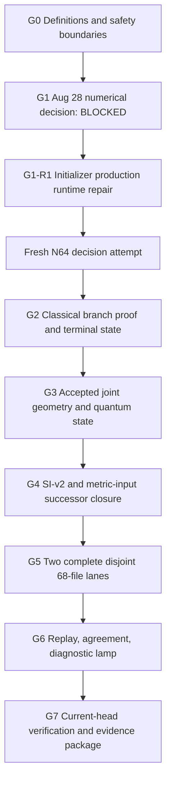

# NHM2 Spherical Boson-Star v2 Work Program

Status: canonical program-control document.

Active program gate: **G1-R1 — initializer production runtime repair**

Status date: **August 21, 2026**

This document preserves the complete scientific objective while identifying the
single gate that repository agents are permitted to treat as the current
deadline. It answers:

> What are we ultimately building, what are we doing now, what evidence closes
> the current gate, and what work becomes eligible afterward?

The August 28 decision packet closed `BLOCKED` and is preserved at
[`nhm2-spherical-boson-star-v2-august-28-numerical-decision-record.md`](./nhm2-spherical-boson-star-v2-august-28-numerical-decision-record.md).
The sole active packet is now
[`nhm2-spherical-boson-star-v2-initializer-production-runtime-repair.md`](./nhm2-spherical-boson-star-v2-initializer-production-runtime-repair.md).

## Permanent program objective

Build one fully authenticated semiclassical v2 candidate workflow:

```text
frozen candidate
  -> mathematical proofs
  -> accepted joint geometry/state
  -> SI + metric inputs
  -> two source/runtime-disjoint 68-file lanes
  -> replay and pair agreement
  -> diagnostic Theory Graph lamp
```

Each lane has exactly 68 files and 6,693,376 bytes under the frozen output ABI.
Physical viability, propulsion, transport, launch, and empirical authority remain
locked false unless a later, separately authorized program changes their exact
contracts and supplies the required evidence. Completion of this program does
not itself establish any of those claims.

## Source-of-truth map

| Question                                                             | Sole authority                                                      |
| -------------------------------------------------------------------- | ------------------------------------------------------------------- |
| What is the permanent program objective and dependency order?        | this document                                                       |
| What is the active deadline, decision rule, and daily work boundary? | the linked August 28 sprint document                                |
| What mathematical and claim constraints govern warp/GR work?         | [`WARP_AGENTS.md`](../../WARP_AGENTS.md)                            |
| What is the current repository-wide math maturity summary?           | [`MATH_STATUS.md`](../../MATH_STATUS.md) and generated math reports |
| What are the exact scientific definitions and numerical thresholds?  | the versioned contracts and source artifacts named by each gate     |
| What happened in one audit or run?                                   | that immutable audit, receipt, and its exact byte bindings          |
| What must a repository agent declare before working on this program? | [`AGENTS.md`](../../AGENTS.md)                                      |

Dated overviews and audits are evidence snapshots, not current roadmaps. A green
certificate for an earlier tree does not certify the current tree. A sealed
definition is not an executed proof, and a receipt is an observation rather than
authority to promote a claim.

## Current position

The program remains **Stage 2: diagnostic/preexecution**.

| Layer                        | Current state                                                                                                                                                     |
| ---------------------------- | ----------------------------------------------------------------------------------------------------------------------------------------------------------------- |
| Preexecution evidence        | A -> S -> SR -> P -> PR -> E -> ER contracts are bounded, sealed, chronology-checked, and independently audited.                                                  |
| Candidate definition         | One candidate identity and the N=64/96/128/256 branch policy are frozen; admitted candidates: 0.                                                                  |
| Output ABI                   | Exactly 68 roles and 6,693,376 bytes per lane are frozen.                                                                                                         |
| SI normalization             | SI-v2 definition, hardened MPFR lease, and primary adapter exist; an independent C implementation exists statically, but authenticated Linux execution is absent. |
| Classical branch diagnostics | The cross-grid evaluator exists and has passed its focused and independent audits.                                                                                |
| Boundary mathematics         | The origin/tail recurrence kernel exists as an authority-neutral diagnostic; authenticated proof receipts remain absent.                                          |
| Vacuum continuation          | The ABI record/input hashing and Unicode-totality defects are repaired, sealed, and independently audited; no verifier or proof execution exists.                 |
| Numerical decision           | `BLOCKED`: no authenticated six-payload initializer instance exists; no candidate numeric operation ran.                                                          |
| Geometry/state               | The accepted-geometry/state handoff is definition-only; every solver, state, witness, and acceptance binding is null.                                             |
| Scientific output            | Only `smearing_weights` is materializable, in memory, for 1 of 68 roles.                                                                                          |
| Runtime lanes                | Complete primary lanes: 0; complete independent lanes: 0; pair agreements: 0.                                                                                     |
| Authority                    | Execution, readiness, diagnostic lamp, physical viability, propulsion, and transport remain false/null.                                                           |

## Dependency order



The order is causal. Work may clarify a blocked gate, but it must not create a
runtime instance, promote readiness, or claim acceptance before its predecessors
close.

## Program gates

| Gate                                                | State                        | Closure evidence                                                                                                                                                          | Downstream gate unlocked      |
| --------------------------------------------------- | ---------------------------- | ------------------------------------------------------------------------------------------------------------------------------------------------------------------------- | ----------------------------- |
| G0 — Definitions and safety boundaries              | closed for the active sprint | Frozen branch policy, candidate definition, output ABI, SI-v2, preexecution chain, and false/null authority locks                                                         | G1                            |
| G1 — August 28 numerical decision                   | closed: `BLOCKED`            | Exact decision record identifies `supplemental_join_barrier_payload_unbound` and the upstream fixed-arena/shared-instance production blockers                             | G1-R1                         |
| G1-R1 — Initializer production runtime repair       | active                       | Authenticated fixed arenas, shared private module lifecycle, runtime/preseal closure, and one exact six-payload initializer instance                                      | Fresh G1 numerical attempt    |
| G2 — Classical branch proof and terminal state      | blocked by fresh G1 attempt  | Authenticated four-grid full solves, cross-grid convergence, vacuum connection, no-fold/positivity, boundary remainder, residual replay, and terminal N=256 state receipt | G3                            |
| G3 — Accepted joint geometry and quantum state      | blocked by G2                | A converged joint fixed-point witness binding the same geometry, Hadamard state, renormalization/effective-action definitions, spectral evidence, and authenticated bytes | G4                            |
| G4 — SI-v2 and metric-input successor closure       | blocked by G3                | Two genuinely disjoint SI executions and agreement; accepted four-radius derivative enclosures; metric-demand-v2 and required successor bindings                          | G5                            |
| G5 — Two complete disjoint 68-file lanes            | blocked by G4                | Four mean/noise files and 63 constraint files per lane, complete manifests, exclusive output-root chronology, and two source/runtime-disjoint executions                  | G6                            |
| G6 — Replay, agreement, diagnostic lamp             | blocked by G5                | Server reread/replay of both lanes, exact pair agreement, all diagnostic gates, and no-retune evidence                                                                    | G7                            |
| G7 — Current-head verification and evidence package | blocked by G6                | Required math validation, Casimir adapter PASS, certificate integrity when policy requires it, and a current-head evidence packet                                         | Program diagnostic completion |

## Active-gate rule

Exactly one gate is active. Until G1-R1 closes, implementation work must
contribute directly to the initializer production runtime repair or be
explicitly marked as an independent parallel lane that cannot perturb its
frozen inputs.

The following do not close G1-R1:

- adding another definition-only schema without removing a named blocker;
- sealing null fields or restoring hashes without resolving the audited defect;
- generating all 68 outputs, attempting a joint semiclassical solve, or changing
  a Theory Graph lamp;
- changing frozen thresholds, grids, initializers, or failure rules after seeing
  a result;
- substituting a historical certificate or overview for current-tree evidence.

## Agent work-packet contract

Every development packet in this program must begin with:

```text
Program gate:
Workstream:
Capability or component:
Current maturity:
Target maturity:
Required frozen inputs:
Required evidence:
Stop/fail criteria:
Explicit non-goals:
Downstream gate unlocked:
```

An agent must also state whether its work changes mathematical semantics,
runtime authority, receipt semantics, or only planning/documentation. Work that
changes warp/GR mathematics, proof maturity, adapter contracts, certificates, or
claim status must follow `WARP_AGENTS.md` and the applicable Casimir verification
gate.

## No-retune and evidence rules

1. Freeze inputs, algorithms, tolerances, hashes, and failure precedence before
   observing a candidate result.
2. First failure is evidence. Do not switch grids, initializer, tolerances, or
   branches within the same candidate identity.
3. Distinguish `FAIL` from `BLOCKED`: a scientific/numerical gate that ran and
   failed is `FAIL`; missing infrastructure or an under-specified definition that
   prevents a valid run is `BLOCKED`.
4. Store raw outputs and exact provenance before summarizing them.
5. Independent replay must not share the primary executable/runtime lineage.
6. A diagnostic pass may change only the exact diagnostic readiness authorized
   by its contract. Physical, propulsion, and transport locks remain false.
7. Any change to this dependency order or the active decision rule requires a
   reviewed versioned update to this document and the active sprint packet.

## After the August 28 decision

G1 is replaced as the active gate only after its decision packet is committed and
auditable:

- `GO` activates the smallest G2 proof-and-terminal-state packet justified by
  the result.
- `FAIL` activates a bounded scientific review; it does not authorize retuning
  the same candidate after the fact.
- `BLOCKED` activates only the named infrastructure or definition repair needed
  to make the decision executable.

The permanent program objective remains unchanged in all three cases unless the
user explicitly revises it.
